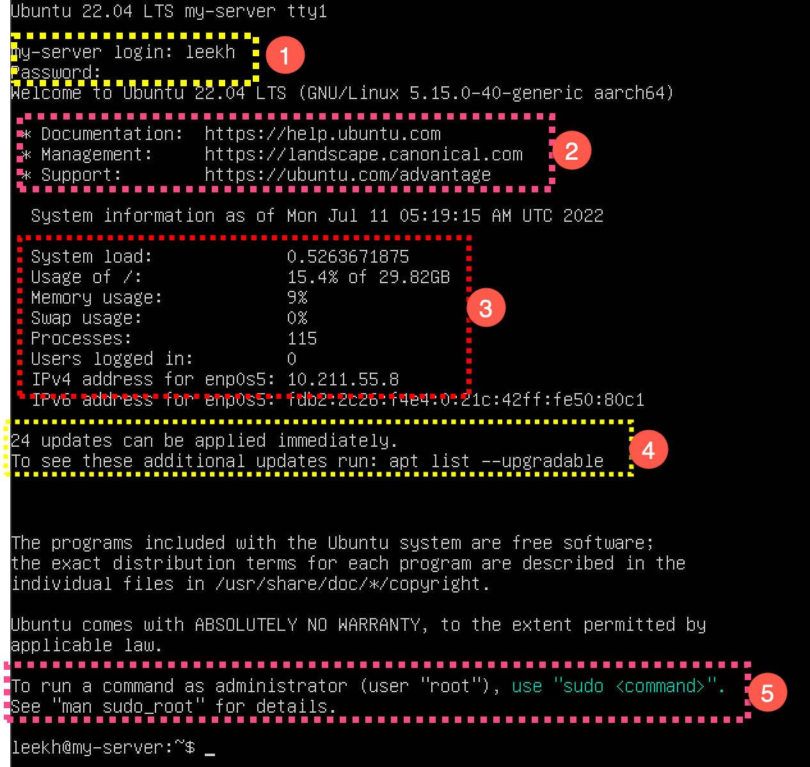
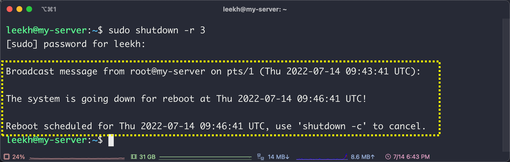
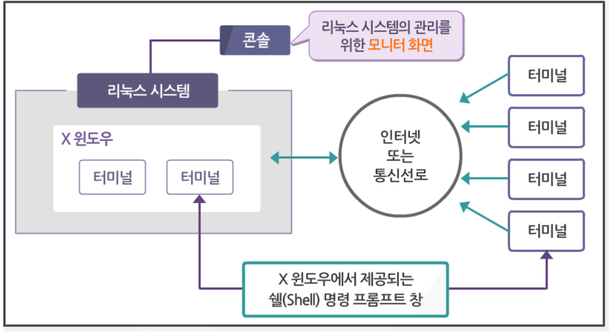
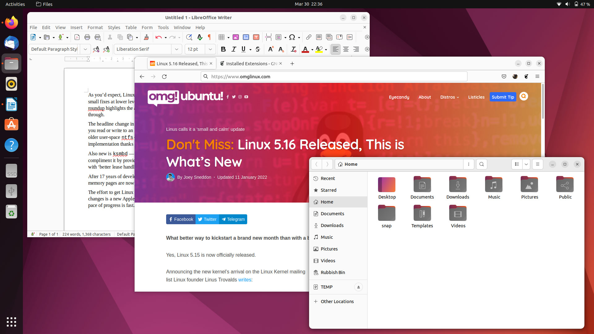
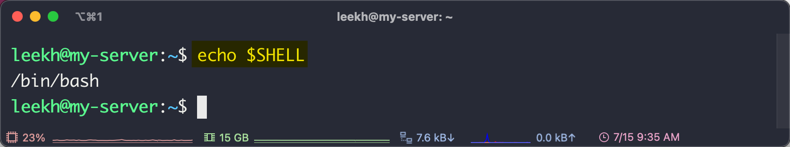
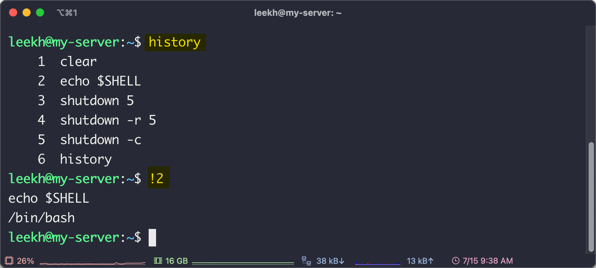

# Ubuntu 리눅스 시스템의 시작과 종료

## #01. 시스템 시작

### 1. 부팅(Bootstrap)

- 컴퓨터의 전원을 누른 직후부터 운영체제가 메모리에서 동작하기 시작할 때 까지의 과정.

### 2. 로그인(Login)

- 사용자가 컴퓨터 시스템이나 통신망에 대한 접근 허가 증명을 얻기 위해 위해 자신의 사용자명과 패스워드를 입력하고 컴퓨터 시스템에 접근하는 작업
- 리눅스는 여러 사용자가 동시에 사용할 수 있기 때문에 로그인 과정을 거처야만 시스템을 사용할 수 있음
- Logon, Sign-in, Sign-on 등도 같은 의미로 사용됨

#### 1) 로그인 구분

| 구분       | 설명                                                               |
| ---------- | ------------------------------------------------------------------ |
| 로컬로그인 | 시스템이 운영중인 컴퓨터를 물리적으로 직접 조작하여 로그인 한 상태 |
| 원격로그인 | 시스템에 원격으로 접속하여 로그인한 상태 (SSH등을 사용)            |

> 수업 환경에서는 가상머신상에서 직접 로그인하는 것이 로컬로그인에 해당한다.

#### 2) 시스템에 로그인 하기

- 가상머신을 부팅하고 로컬로그인을 수행하면 로그인을 수행하면 시스템의 상태에 대한 간략한 정보가 표시됨 (아래 이미지에 표시된 1~5번 참조)




| 번호 | 설명                                                                                          |
| ---: | :-------------------------------------------------------------------------------------------- |
|    1 | 아이디와 비밀번호 입력                                                                        |
|    2 | 우분투 메뉴얼, 기술지원 등을 확인할 수 있는 URL                                               |
|    3 | 스토리지 및 메모리 사용량, 실행중인 프로세스 수, 로그인 중인 사용자 수, 아이피 주소 등의 정보 |
|    4 | 업데이트 가능한 패키지 수                                                                     |
|    5 | 관리자로서 명령어(command)를 사용하기 위해서는 `sudo` 명령을 사용하라는 안내문                |

> sudo 명령은 별도의 단원에서 설명합니다.

#### 3) 리눅스 시스템에 원격으로 로그인하기

- 리눅스에 원격으로 로그인하기 위해서는 리눅스 상에서 SSH 서비스가 설치되어 있어야 함
- 운영체제 설치 과정에서 SSH도 함께 설치됨

명령 프롬프트(윈도우)나 터미널(맥)을 실행하고 아래의 명령어 입력

```shell
ssh 아이디@리눅스아이피
```

> 이후 실습은 로컬, 원격 로그인을 구분하지 않습니다.

### 3. 사용자 계정

#### 1) 일반사용자

- 리눅스 설치 과정에서 생성한 사용자 아이디
- 필요에 따라 추가적으로 생성 가능
- 회사의 업무 시스템이 네트워크 기반일 경우 직원 1명당 하나의 계정을 갖게 됨
- 단순히 웹 서비스의 운영만을 목적으로 할 경우 하나의 서비스를 리눅스 사용자 한 명으로 보고 하나의 서버 안에서 여러 개의 서비스를 운영함

#### 2) 슈퍼유저

- 리눅스에 내장되어 있는 관리자 계정으로 아이디가 root로 고정되어 있음
- root를 이용하여 로그인을 하면 리눅스 시스템의 설정 등 모든 작업을 수행할 수 있기 때문에 대부분의 시스템에서는 로컬 로그인만 허용하고 SSH 등의 원격 로그인은 허용하지 않도록 설정함


## #02. 시스템 종료

### 1. 로그아웃(Logout)

- 사용 중인 네트워크에서 업무를 끝내고 호스트 컴퓨터와의 연결을 단절하고 나오는 작업

#### 로그아웃 명령어

- `logout` , `exit` , `Ctrl+d`

### 2. 셧다운

- 시스템을 종료하는 것.
- 슈퍼유저인 root 사용자의 고유 권한으로 셧다운 명령은 root 사용자만 사용할 수 있음

#### 1) 셧다운 관련 명령어

- 일반 사용자는 셧다운 명령을 사용할 수 없고 오직 root만 가능함.
- 명령어 앞에 `sudo` 명령을 추가하면 일반 사용자가 root의 권한을 빌려서 해당 명령을 수행함

| 명령              | 설명                                                  |
| ----------------- | ----------------------------------------------------- |
| `shutdown`        | `1`분 후 시스템을 종료하도록 예약                     |
| `shutdown 3`      | `3`분 후 시스템을 종료하도록 예약(숫자는 변경 가능함) |
| `shutdown -c`     | 시스템 종료 예약을 취소함                             |
| `shutdown -r`     | 시스템을 `1`분 후 재부팅하도록 예약                   |
| `shutdown -r 3`   | 시스템을 `3`분 후 재부팅하도록 예약                   |
| `shutdown now`    | 지금 즉시 종료                                        |
| `shutdown -r now` | 지금 즉시 재부팅                                      |

> 재부팅을 위해서는 `reboot` 명령을 사용할 수 도 있다.

#### 3) 다른 사용자가 접속해 있는 경우

- 셧다운 명령을 내리면 현재 접속중인 사용자들에게 시스템이 몇분 내로 종료될 것이라는 메시지가 전송됨



## #03. 리눅스 사용 환경

### 1. 콘솔

- 리눅스 시스템 본체에 연결되어 있는 모니터



### 2. 터미널 (Command Line Interface)

- 리눅스의 명령어를 사용할 수 있는 명령 프롬프트 창

### 3. X-Window (Graphic User Interface)

- 리눅스에서의 바탕화면.
- 디스플레이 장치에 창을 표시하며 마우스와 키보드 등의 입력 장치의 상호작용 등을 관리해 GUI 환경을 구현한다.
- 리눅스에서는 X-Window도 하나의 응용 프로그램이기 때문에 다양한 버전의 X-window를 사용자가 원하는 형태로 설치할 수 있음
- Gnome, Kde 등
- 대부분 개인 사용자를 위한 데스크탑용 운영체제에서 사용하고 서버용 운영체제에서는 잘 사용하지 않음.



### 4. 쉘(Shell)

- 사용자로부터 명령을 입력받아 실행시켜주는 명령어 해석기
- 터미널에 의해서 실행된다.
- 종류에는 bash, ksh, csh, sh이 있다.
- 대부분의 리눅스는 bash shell을 기본으로 제공한다.
- 최근에는 여러가지 편의기능이 탑제된 zsh shell을 많이 사용하는 추세이다.

#### 자신이 사용중인 SHELL 확인하기



#### 명령어 자동완성 기능

- 파일, 폴더명을 입력할 때 일부만 입력한 상태에서 `Tab`키를 누른다.

#### 이전 명령어 탐색 기능

- 방향키 위,아래를 사용하여 이전에 입력했던 명령어들을 재입력할 수 있다.

#### history 기능

- `history` 명령을 사용하면 최근에 사용한 명령어 목록과 일련번호가 표시된다. 이 상태에서 `!일련번호`를 사용하여 이전 명령어를 재사용할 수 있다.


