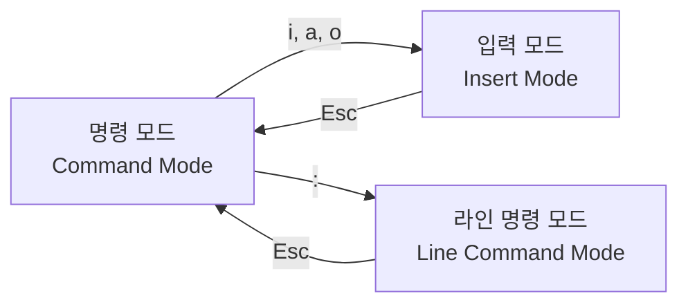

# Ubuntu VI 에디터 기본 사용방법 가이드

## 개요: 왜 VI를 배워야 할까?

GUI가 없는 리눅스 서버 환경에서 설정 파일을 편집하거나 코드를 수정할 때 가장 확실한 방법은 VI 에디터를 사용하는 것입니다. 거의 모든 리눅스 시스템에 기본으로 설치되어 있어 언제 어디서나 사용할 수 있는 필수 도구입니다.

### VI의 장점

- **범용성**: 모든 Unix/Linux 시스템에 기본 설치
- **효율성**: 마우스 없이 키보드만으로 모든 작업 가능
- **강력함**: 정규표현식, 매크로, 플러그인 지원
- **가벼움**: 메모리 사용량이 적고 빠른 실행
- **원격 작업**: SSH 연결에서도 완벽하게 동작

## #01. VI 에디터 시작하기

### 1. VI 실행 방법

```bash
# 새 파일 생성 또는 기존 파일 열기
$ vi filename.txt

# 읽기 전용으로 열기
$ view filename.txt
$ vi -R filename.txt

# 특정 줄 번호로 열기
$ vi +10 filename.txt      # 10번째 줄로 이동
$ vi +/pattern filename.txt # 'pattern' 검색 결과로 이동

# 복구 모드로 열기 (비정상 종료된 파일)
$ vi -r filename.txt
```

## #02. VI의 모드 시스템 이해

VI의 가장 중요한 개념은 **모드**입니다. 각 모드마다 동작 방식이 완전히 다릅니다.

### 1. 세 가지 기본 모드



#### 1) 명령 모드 (Command Mode) - 기본 모드

- VI 시작 시 기본 모드
- 커서 이동, 텍스트 삭제, 복사 등의 명령 실행
- 키 입력이 모두 명령어로 해석됨

#### 2) 입력 모드 (Insert Mode) - 편집 모드

- 실제 텍스트 입력이 가능한 모드
- 일반 텍스트 에디터처럼 동작
- 화면 하단에 `-- INSERT --` 표시

#### 3) 라인 명령 모드 (Line Command Mode) - EX 모드

- 파일 저장, 종료, 검색/치환 등의 명령 실행
- 화면 하단에 `:` 프롬프트 표시
- 명령어 입력 후 Enter로 실행 → 명령모드로 돌아감
- 명령어를 실행하지 않고 명령모드로 돌아가려고 할 때는 `Esc`

### 2. 모드 전환 실습

```bash
# VI로 새 파일 열기
$ vi practice.txt

# 현재 상태: 명령 모드
# 화면 하단을 확인해보세요
```

#### 모드 전환 키

| 현재 모드 | 목표 모드 | 키 | 설명 |
|-----------|-----------|----|----- |
| 명령 모드 | 입력 모드 | `i` | 커서 위치에서 입력 시작 |
| 명령 모드 | 입력 모드 | `a` | 커서 다음 위치에서 입력 |
| 명령 모드 | 입력 모드 | `o` | 새 줄 추가 후 입력 |
| 입력 모드 | 명령 모드 | `ESC` | 명령 모드로 돌아가기 |
| 명령 모드 | 라인 명령 모드 | `:` | 화면 하단에 : 프롬프트 |
| 라인 명령 모드 | 명령 모드 | `ESC` | 명령 모드로 돌아가기 |

## #03. 기본 텍스트 편집

### 1. 실습: 첫 번째 텍스트 편집

```bash
# 1. vi로 새 파일 열기
$ vi first_practice.txt

# 2. 입력 모드로 진입 (i 키 누르기)
# 화면 하단에 -- INSERT -- 가 표시됨

# 3. 다음 텍스트 입력
Hello Ubuntu!
This is my first VI editing practice.
Learning VI editor is essential for Linux.

# 4. ESC 키를 눌러 명령 모드로 돌아가기
# 5. 파일 저장하고 종료: :wq 입력 후 Enter
```

### 3. 기본 저장 및 종료 명령어

#### 라인 명령 모드에서 실행

| 명령어 | 설명 | 사용 시점 |
|--------|------|-----------|
| `:w` | 파일 저장 | 작업 중간에 저장 |
| `:q` | VI 종료 | 수정 없이 종료 (파일에 수정된 내용이 없는 경우만 가능) |
| `:wq` | 저장 후 종료 | 작업 완료 후 저장하며 종료 |
| `:q!` | 저장하지 않고 강제 종료 | 수정 내용을 버리고 종료 |
| `:w filename` | 다른 이름으로 저장 | 백업 생성 |
| `:wq!` | 강제 저장 후 종료 | 읽기 전용 파일 수정 시(해당 파일에 `w`권한이 있는 경우만 가능) |

## #04. 커서 이동 마스터하기

효율적인 VI 사용을 위해서는 커서 이동을 마스터해야 합니다.

### 1. 기본 커서 이동

#### 방향키 대신 사용하는 기본 키 (방향키도 가능)

```
     k (위)
     ↑
h (왼쪽) ← → l (오른쪽)
     ↓
     j (아래)
```

| 키 | 방향 | 기억법 |
|----|----- |--------|
| `h` | 왼쪽 | **H**ome (시작점) |
| `j` | 아래 | **J**ump down |
| `k` | 위 | **K**ick up |
| `l` | 오른쪽 | **L**ast (끝점) |

### 2. 단어 단위 이동

```bash
# 실습용 텍스트 파일 생성
$ vi word_practice.txt

# 다음 텍스트를 입력하세요
The quick brown fox jumps over the lazy dog.
Ubuntu Linux is a powerful operating system.
Learning VI editor commands step by step.
```

#### 단어 이동 명령어

| 키 | 설명 | 예시 |
|----|------|------|
| `w` | 다음 단어의 시작으로 | `The` → `quick` |
| `b` | 이전 단어의 시작으로 | `quick` → `The` |

### 3. 줄 단위 이동

| 키 | 설명 | 활용 |
|----|------|------|
| `0` | 줄의 맨 앞으로 (`Home`키와 동일) | 들여쓰기 앞으로 |
| `^` | 줄의 첫 번째 문자로 | 공백 다음 첫 문자 |
| `$` | 줄의 맨 끝으로 (`End`키와 동일) | 줄 끝에 문자 추가 시 |
| `G` | 파일의 마지막 줄로 | 파일 끝으로 점프 |
| `gg` | 파일의 첫 번째 줄로 | 파일 시작으로 점프 |
| `10G` | 10번째 줄로 | 특정 줄 번호로 이동 |

## #05. 텍스트 삭제와 수정

### 1. 문자 및 단어 삭제

```bash
# 삭제 실습용 파일 생성
$ vi delete_practice.txt

# 다음 텍스트 입력
This is a sample text for deletion practice.
We will learn various deletion commands.
Some words have typos that need to be fixed.
```

#### 기본 삭제 명령어

| 키 | 설명 | 예시 |
|----|------|------|
| `x` | 커서 위치의 문자 삭제 (`Delete`키와 동일) | `Hello` → `Hell` |
| `X` | 커서 앞의 문자 삭제 (`Backspace`키와 동일) | `Hello` → `ello` |
| `dw` | 커서부터 단어 끝까지 삭제 | `Hello world` → `world` |
| `db` | 커서부터 단어 시작까지 삭제 | `Hello world` → `world` |
| `dd` | 현재 줄 전체 삭제 | 전체 줄 제거 |
| `d0` | 커서부터 줄 시작까지 삭제 | 줄 앞부분 정리 |
| `d$` | 커서부터 줄 끝까지 삭제 | 줄 뒷부분 정리 |
| `dG` | 커서부터 파일 끝까지 삭제 | 파일 뒷부분 모두 삭제 |
| `dgg` | 커서부터 파일 시작까지 삭제 | 파일 앞부분 모두 삭제 |


### 3. 변경 명령어 (Change)

변경 명령어는 삭제 후 자동으로 입력 모드로 전환됩니다.

| 키 | 설명 | 동작 |
|----|------|------|
| `cw` | 단어 변경 | 단어 삭제 후 입력 모드 |
| `cc` | 줄 변경 | 줄 삭제 후 입력 모드 |
| `c$` | 줄 끝까지 변경 | 커서부터 줄 끝 삭제 후 입력 |
| `c0` | 줄 시작까지 변경 | 커서부터 줄 시작 삭제 후 입력 |

### 4. 실습: 오타 수정하기

```bash
$ vi typo_practice.txt

# 다음 텍스트를 입력하세요 (의도적으로 오타 포함)
Ubunntu Linuxx is a ggreat operating systemm.
Learningg VI ediitor is verry important.
Practicce makes perrfect!

# 오타 수정 실습:
# 1. 'Ubunntu' → 'Ubuntu': n 위에서 x로 n 삭제
# 2. 'Linuxx' → 'Linux': 마지막 x에서 x로 삭제
# 3. 'ggreat' → 'great': 첫 번째 g에서 x로 삭제
# 4. 'systemm' → 'system': 마지막 m에서 x로 삭제
```

## #06. 복사, 붙여넣기, 실행 취소

### 1. 복사 (Yank) 명령어

VI에서 복사는 "yank"라고 부릅니다.

```bash
# 복사 실습용 파일 생성
$ vi copy_practice.txt

# 다음 텍스트 입력
Line 1: This line will be copied
Line 2: Another line for practice
Line 3: More text for copying
Line 4: Final line of text
```

#### 기본 복사 명령어

| 키 | 설명 | 사용 예시 |
|----|------|-----------|
| `yy` | 현재 줄 복사 | 전체 줄 복사 |
| `yw` | 현재 단어 복사 | 단어 복사 |
| `y$` | 커서부터 줄 끝까지 복사 | 줄 일부 복사 |
| `y0` | 커서부터 줄 시작까지 복사 | 줄 앞부분 복사 |
| `yG` | 커서부터 파일 끝까지 복사 | 파일 뒷부분 모두 복사 |

#### 숫자와 조합

```bash
3yy     # 3줄 복사
5yw     # 5개 단어 복사
```

### 2. 붙여넣기 (Put) 명령어

| 키 | 설명 | 위치 |
|----|------|------|
| `p` | 커서 다음 위치에 붙여넣기 | 커서 뒤/아래 |
| `P` | 커서 이전 위치에 붙여넣기 | 커서 앞/위 |

### 3. 잘라내기 (Cut)

삭제 명령어들이 실제로는 잘라내기 역할도 합니다.

```bash
dd      # 줄 잘라내기 (삭제하면서 복사)
dw      # 단어 잘라내기
d$      # 커서부터 줄 끝까지 잘라내기
```

### 4. 실행 취소 (Undo/Redo)

| 키 | 설명 | 활용 |
|----|------|------|
| `u` | 마지막 동작 실행 취소 | 실수 복구 |
| `U` | 현재 줄의 모든 변경 취소 | 줄 전체 복구 |
| `Ctrl + r` | 실행 취소한 것을 다시 실행 | 취소 복구 |

### 5. 복사/붙여넣기 실습

```bash
# 1. copy_practice.txt에서 다음 작업 수행
# 2. 첫 번째 줄(Line 1)에 커서를 위치
# 3. yy로 줄 복사
# 4. 마지막 줄로 이동 (G)
# 5. p로 붙여넣기
# 6. 결과 확인

# 단어 복사 실습
# 1. "practice" 단어에 커서 위치
# 2. yw로 단어 복사
# 3. 다른 위치로 이동
# 4. p로 붙여넣기
```

## #07. 검색과 치환

### 1. 실습 파일 작성

```bash
# 검색 실습용 파일 생성
$ vi search_practice.txt

# 다음 텍스트 입력
The quick brown fox jumps over the lazy dog.
This text contains the word "the" multiple times.
We will search for various patterns in this text.
The word "pattern" appears here: pattern.
```

### 2. 검색 실습

라인 명령모드에서 실행한다.

| 명령어 | 설명 | 방향 |
|--------|------|------|
| `?검색어` | 위쪽으로 검색 | 뒤→앞 |
| `/검색어` | 아래쪽으로 검색 | 앞→뒤 |
| `n` | 다음 검색 결과로 이동 | 검색 방향 |
| `N` | 이전 검색 결과로 이동 | 검색 반대 방향 |


```bash
# 1. /the 입력 후 Enter - "the" 검색
# 2. n 키로 다음 "the"로 이동
# 3. N 키로 이전 "the"로 이동
# 4. /pattern 입력 후 Enter - "pattern" 검색
```
