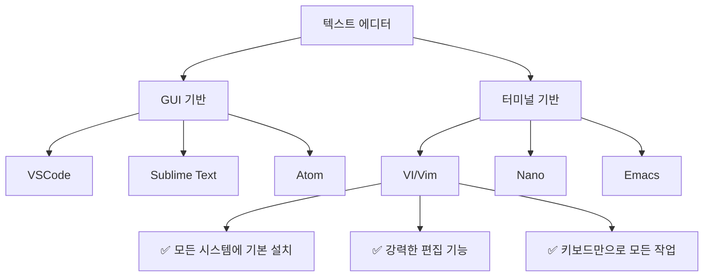
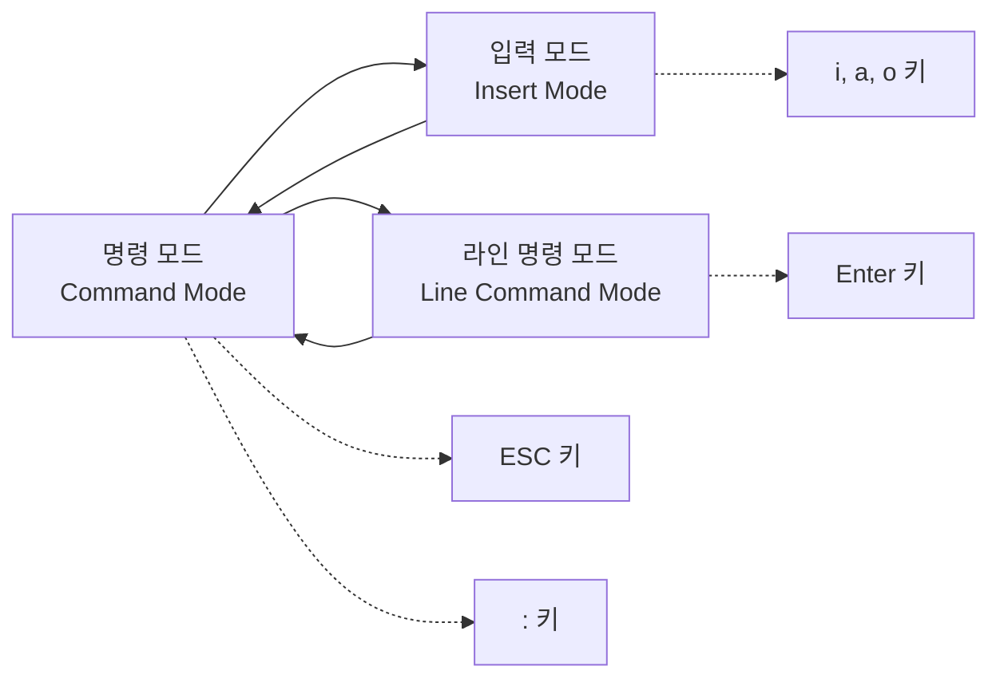

## 개요: 왜 VI를 배워야 할까?

GUI가 없는 리눅스 서버 환경에서 설정 파일을 편집하거나 코드를 수정할 때 가장 확실한 방법은 VI 에디터를 사용하는 것입니다. 거의 모든 리눅스 시스템에 기본으로 설치되어 있어 언제 어디서나 사용할 수 있는 필수 도구입니다.

### VI vs 다른 에디터


```mermaid
graph TD
    A[텍스트 에디터] --> B[GUI 기반]
    A --> C[터미널 기반]

    B --> B1[VSCode]
    B --> B2[Sublime Text]
    B --> B3[Atom]

    C --> C1[VI/Vim]
    C --> C2[Nano]
    C --> C3[Emacs]

    C1 --> D[✅ 모든 시스템에 기본 설치]
    C1 --> E[✅ 강력한 편집 기능]
    C1 --> F[✅ 키보드만으로 모든 작업]
```

### VI의 장점

- **유비쿼터스**: 모든 Unix/Linux 시스템에 기본 설치
- **효율성**: 마우스 없이 키보드만으로 모든 작업 가능
- **강력함**: 정규표현식, 매크로, 플러그인 지원
- **가벼움**: 메모리 사용량이 적고 빠른 실행
- **원격 작업**: SSH 연결에서도 완벽하게 동작

## #01. VI 에디터 시작하기

### 1. VI 종류 및 설치

```bash
# 기본 VI 확인
$ which vi
/usr/bin/vi

# Vim (Vi IMproved) 설치 확인
$ which vim
/usr/bin/vim

# Vim이 없다면 설치
$ sudo apt update
$ sudo apt install vim

# 버전 확인
$ vim --version
VIM - Vi IMproved 8.2
```

### 2. VI 실행 방법

```bash
# 새 파일 생성 또는 기존 파일 열기
$ vi filename.txt
$ vim filename.txt

# 읽기 전용으로 열기
$ view filename.txt
$ vi -R filename.txt

# 특정 줄 번호로 열기
$ vi +10 filename.txt      # 10번째 줄로 이동
$ vi +/pattern filename.txt # 'pattern' 검색 결과로 이동

# 여러 파일 동시에 열기
$ vi file1.txt file2.txt file3.txt

# 복구 모드로 열기 (비정상 종료된 파일)
$ vi -r filename.txt
```

## #02. VI의 모드 시스템 이해

VI의 가장 중요한 개념은 **모드**입니다. 각 모드마다 동작 방식이 완전히 다릅니다.

### 1. 세 가지 기본 모드


```mermaid
graph LR
    A[명령 모드<br>Command Mode] --> B[입력 모드<br>Insert Mode]
    B --> A
    A --> C[라인 명령 모드<br>Line Command Mode]
    C --> A

    B -.-> D[i, a, o 키]
    A -.-> E[ESC 키]
    A -.-> F[: 키]
    C -.-> G[Enter 키]
```

#### 1) 명령 모드 (Command Mode) - 기본 모드

- VI 시작 시 기본 모드
- 커서 이동, 텍스트 삭제, 복사 등의 명령 실행
- 키 입력이 모두 명령어로 해석됨

#### 2) 입력 모드 (Insert Mode) - 편집 모드

- 실제 텍스트 입력이 가능한 모드
- 일반 텍스트 에디터처럼 동작
- 화면 하단에 `-- INSERT --` 표시

#### 3) 라인 명령 모드 (Line Command Mode) - EX 모드

- 파일 저장, 종료, 검색/치환 등의 명령 실행
- 화면 하단에 `:` 프롬프트 표시
- 명령어 입력 후 Enter로 실행

### 2. 모드 전환 실습

```bash
# VI로 새 파일 열기
$ vi practice.txt

# 현재 상태: 명령 모드
# 화면 하단을 확인해보세요
```

#### 모드 전환 키

| 현재 모드 | 목표 모드 | 키 | 설명 |
|-----------|-----------|----|----- |
| 명령 모드 | 입력 모드 | `i` | 커서 위치에서 입력 시작 |
| 명령 모드 | 입력 모드 | `a` | 커서 다음 위치에서 입력 |
| 명령 모드 | 입력 모드 | `o` | 새 줄 추가 후 입력 |
| 입력 모드 | 명령 모드 | `ESC` | 명령 모드로 돌아가기 |
| 명령 모드 | 라인 명령 모드 | `:` | 화면 하단에 : 프롬프트 |
| 라인 명령 모드 | 명령 모드 | `ESC` 또는 명령 실행 | 명령 모드로 돌아가기 |

## #03. 기본 텍스트 편집

### 1. 입력 모드 진입 명령어

```bash
# 실습용 파일 생성
$ vi hello.txt
```

#### 다양한 입력 모드 진입 방법

| 키 | 설명 | 예시 상황 |
|----|------|-----------|
| `i` | 커서 현재 위치에서 입력 | 단어 중간에 문자 삽입 |
| `I` | 줄의 맨 앞에서 입력 | 줄 시작에 주석 추가 |
| `a` | 커서 다음 위치에서 입력 | 단어 끝에 문자 추가 |
| `A` | 줄의 맨 끝에서 입력 | 줄 끝에 세미콜론 추가 |
| `o` | 현재 줄 아래에 새 줄 생성 후 입력 | 새로운 코드 라인 추가 |
| `O` | 현재 줄 위에 새 줄 생성 후 입력 | 함수 위에 주석 추가 |
| `s` | 현재 문자 삭제 후 입력 | 오타 수정 |
| `S` | 현재 줄 전체 삭제 후 입력 | 줄 전체 재작성 |

### 2. 실습: 첫 번째 텍스트 편집

```bash
# 1. vi로 새 파일 열기
$ vi first_practice.txt

# 2. 입력 모드로 진입 (i 키 누르기)
# 화면 하단에 -- INSERT -- 가 표시됨

# 3. 다음 텍스트 입력
Hello Ubuntu!
This is my first VI editing practice.
Learning VI editor is essential for Linux.

# 4. ESC 키를 눌러 명령 모드로 돌아가기
# 5. 파일 저장하고 종료: :wq 입력 후 Enter
```

### 3. 기본 저장 및 종료 명령어

#### 라인 명령 모드에서 실행

| 명령어 | 설명 | 사용 시점 |
|--------|------|-----------|
| `:w` | 파일 저장 | 작업 중간에 저장 |
| `:q` | VI 종료 | 수정 없이 종료 |
| `:wq` | 저장 후 종료 | 작업 완료 후 저장하며 종료 |
| `:q!` | 저장하지 않고 강제 종료 | 수정 내용을 버리고 종료 |
| `:w filename` | 다른 이름으로 저장 | 백업 생성 |
| `:wq!` | 강제 저장 후 종료 | 읽기 전용 파일 수정 시 |

#### 명령 모드에서 실행

| 명령어 | 설명 | 동일한 라인 명령 |
|--------|------|----------------|
| `ZZ` | 저장 후 종료 | `:wq` |
| `ZQ` | 저장하지 않고 종료 | `:q!` |

## #04. 커서 이동 마스터하기

효율적인 VI 사용을 위해서는 커서 이동을 마스터해야 합니다.

### 1. 기본 커서 이동

#### 방향키 대신 사용하는 기본 키 (권장)

```
     k (위)
     ↑
h (왼쪽) ← → l (오른쪽)
     ↓
     j (아래)
```

| 키 | 방향 | 기억법 |
|----|----- |--------|
| `h` | 왼쪽 | **H**ome (시작점) |
| `j` | 아래 | **J**ump down |
| `k` | 위 | **K**ick up |
| `l` | 오른쪽 | **L**ast (끝점) |

### 2. 단어 단위 이동

```bash
# 실습용 텍스트 파일 생성
$ vi word_practice.txt

# 다음 텍스트를 입력하세요
The quick brown fox jumps over the lazy dog.
Ubuntu Linux is a powerful operating system.
Learning VI editor commands step by step.
```

#### 단어 이동 명령어

| 키 | 설명 | 예시 |
|----|------|------|
| `w` | 다음 단어의 시작으로 | `The` → `quick` |
| `W` | 공백으로 구분된 다음 단어로 | `don't` → `go` (구두점 무시) |
| `b` | 이전 단어의 시작으로 | `quick` → `The` |
| `B` | 공백으로 구분된 이전 단어로 | `go` → `don't` |
| `e` | 현재 단어의 끝으로 | `qui`ck → `quic`k |
| `E` | 공백으로 구분된 단어의 끝으로 | `do`n't → `don'`t |

### 3. 줄 단위 이동

| 키 | 설명 | 활용 |
|----|------|------|
| `0` | 줄의 맨 앞으로 | 들여쓰기 앞으로 |
| `^` | 줄의 첫 번째 문자로 | 공백 다음 첫 문자 |
| `$` | 줄의 맨 끝으로 | 줄 끝에 문자 추가 시 |
| `G` | 파일의 마지막 줄로 | 파일 끝으로 점프 |
| `gg` | 파일의 첫 번째 줄로 | 파일 시작으로 점프 |
| `10G` | 10번째 줄로 | 특정 줄 번호로 이동 |

### 4. 화면 단위 이동

| 키 | 설명 | 사용 시점 |
|----|------|-----------|
| `Ctrl + f` | 한 화면 아래로 (Forward) | 긴 파일에서 빠른 이동 |
| `Ctrl + b` | 한 화면 위로 (Backward) | 파일 위쪽으로 빠른 이동 |
| `Ctrl + d` | 반 화면 아래로 (Down) | 적당한 속도로 아래 이동 |
| `Ctrl + u` | 반 화면 위로 (Up) | 적당한 속도로 위 이동 |
| `H` | 화면 맨 위 줄로 | 현재 화면 상단 |
| `M` | 화면 중간 줄로 | 현재 화면 중간 |
| `L` | 화면 맨 아래 줄로 | 현재 화면 하단 |

## #05. 텍스트 삭제와 수정

### 1. 문자 및 단어 삭제

```bash
# 삭제 실습용 파일 생성
$ vi delete_practice.txt

# 다음 텍스트 입력
This is a sample text for deletion practice.
We will learn various deletion commands.
Some words have typos that need to be fixed.
```

#### 기본 삭제 명령어

| 키 | 설명 | 예시 |
|----|------|------|
| `x` | 커서 위치의 문자 삭제 | `Hello` → `Hell` |
| `X` | 커서 앞의 문자 삭제 | `Hello` → `ello` |
| `dw` | 커서부터 단어 끝까지 삭제 | `Hello world` → `world` |
| `db` | 커서부터 단어 시작까지 삭제 | `Hello world` → `world` |
| `dd` | 현재 줄 전체 삭제 | 전체 줄 제거 |
| `D` | 커서부터 줄 끝까지 삭제 | `Hello world` → `Hello` |

#### 숫자와 조합한 삭제

```bash
# 숫자 + 명령어 = 반복 실행
3x      # 3개 문자 삭제
5dw     # 5개 단어 삭제
2dd     # 2줄 삭제
```

### 2. 고급 삭제 명령어

| 명령어 | 설명 | 활용 예시 |
|--------|------|-----------|
| `d0` | 커서부터 줄 시작까지 삭제 | 줄 앞부분 정리 |
| `d$` | 커서부터 줄 끝까지 삭제 | 줄 뒷부분 정리 |
| `dG` | 커서부터 파일 끝까지 삭제 | 파일 뒷부분 모두 삭제 |
| `dgg` | 커서부터 파일 시작까지 삭제 | 파일 앞부분 모두 삭제 |
| `d/pattern` | 패턴까지 삭제 | 특정 문자열까지 삭제 |

### 3. 변경 명령어 (Change)

변경 명령어는 삭제 후 자동으로 입력 모드로 전환됩니다.

| 키 | 설명 | 동작 |
|----|------|------|
| `cw` | 단어 변경 | 단어 삭제 후 입력 모드 |
| `cc` | 줄 변경 | 줄 삭제 후 입력 모드 |
| `C` | 줄 끝까지 변경 | 커서부터 줄 끝 삭제 후 입력 |
| `c$` | 줄 끝까지 변경 | `C`와 동일 |
| `c0` | 줄 시작까지 변경 | 커서부터 줄 시작 삭제 후 입력 |

### 4. 실습: 오타 수정하기

```bash
$ vi typo_practice.txt

# 다음 텍스트를 입력하세요 (의도적으로 오타 포함)
Ubunntu Linuxx is a ggreat operating systemm.
Learningg VI ediitor is verry important.
Practicce makes perrfect!

# 오타 수정 실습:
# 1. 'Ubunntu' → 'Ubuntu': n 위에서 x로 n 삭제
# 2. 'Linuxx' → 'Linux': 마지막 x에서 x로 삭제
# 3. 'ggreat' → 'great': 첫 번째 g에서 x로 삭제
# 4. 'systemm' → 'system': 마지막 m에서 x로 삭제
```

## #06. 복사, 붙여넣기, 실행 취소

### 1. 복사 (Yank) 명령어

VI에서 복사는 "yank"라고 부릅니다.

```bash
# 복사 실습용 파일 생성
$ vi copy_practice.txt

# 다음 텍스트 입력
Line 1: This line will be copied
Line 2: Another line for practice
Line 3: More text for copying
Line 4: Final line of text
```

#### 기본 복사 명령어

| 키 | 설명 | 사용 예시 |
|----|------|-----------|
| `yy` | 현재 줄 복사 | 전체 줄 복사 |
| `yw` | 현재 단어 복사 | 단어 복사 |
| `y$` | 커서부터 줄 끝까지 복사 | 줄 일부 복사 |
| `y0` | 커서부터 줄 시작까지 복사 | 줄 앞부분 복사 |
| `yG` | 커서부터 파일 끝까지 복사 | 파일 뒷부분 모두 복사 |

#### 숫자와 조합

```bash
3yy     # 3줄 복사
5yw     # 5개 단어 복사
```

### 2. 붙여넣기 (Put) 명령어

| 키 | 설명 | 위치 |
|----|------|------|
| `p` | 커서 다음 위치에 붙여넣기 | 커서 뒤/아래 |
| `P` | 커서 이전 위치에 붙여넣기 | 커서 앞/위 |

### 3. 잘라내기 (Cut)

삭제 명령어들이 실제로는 잘라내기 역할도 합니다.

```bash
dd      # 줄 잘라내기 (삭제하면서 복사)
dw      # 단어 잘라내기
d$      # 커서부터 줄 끝까지 잘라내기
```

### 4. 실행 취소 (Undo/Redo)

| 키 | 설명 | 활용 |
|----|------|------|
| `u` | 마지막 동작 실행 취소 | 실수 복구 |
| `U` | 현재 줄의 모든 변경 취소 | 줄 전체 복구 |
| `Ctrl + r` | 실행 취소한 것을 다시 실행 | 취소 복구 |

### 5. 복사/붙여넣기 실습

```bash
# 1. copy_practice.txt에서 다음 작업 수행
# 2. 첫 번째 줄(Line 1)에 커서를 위치
# 3. yy로 줄 복사
# 4. 마지막 줄로 이동 (G)
# 5. p로 붙여넣기
# 6. 결과 확인

# 단어 복사 실습
# 1. "practice" 단어에 커서 위치
# 2. yw로 단어 복사
# 3. 다른 위치로 이동
# 4. p로 붙여넣기
```

## #07. 검색과 치환

### 1. 문자열 검색

```bash
# 검색 실습용 파일 생성
$ vi search_practice.txt

# 다음 텍스트 입력
The quick brown fox jumps over the lazy dog.
This text contains the word "the" multiple times.
We will search for various patterns in this text.
The word "pattern" appears here: pattern.
```

#### 기본 검색 명령어

| 명령어 | 설명 | 방향 |
|--------|------|------|
| `/pattern` | 아래쪽으로 검색 | 앞→뒤 |
| `?pattern` | 위쪽으로 검색 | 뒤→앞 |
| `n` | 다음 검색 결과로 이동 | 검색 방향 |
| `N` | 이전 검색 결과로 이동 | 검색 반대 방향 |

#### 검색 실습

```bash
# 1. /the 입력 후 Enter - "the" 검색
# 2. n 키로 다음 "the"로 이동
# 3. N 키로 이전 "the"로 이동
# 4. /pattern 입력 후 Enter - "pattern" 검색
```

### 2. 정규표현식 검색

VI는 강력한 정규표현식을 지원합니다.

| 패턴 | 설명 | 예시 |
|------|------|------|
| `^word` | 줄 시작에 있는 word | `^The` |
| `word$` | 줄 끝에 있는 word | `dog.$` |
| `.` | 임의의 한 문자 | `t.e` (the, toe 등) |
| `*` | 앞 문자의 0회 이상 반복 | `colou*r` (color, colour) |
| `\<word\>` | 완전한 단어만 매칭 | `\<the\>` |

### 3. 치환 명령어

라인 명령 모드에서 실행하는 강력한 치환 기능입니다.

#### 기본 치환 문법

```bash
:s/old/new/        # 현재 줄의 첫 번째 매칭만 치환
:s/old/new/g       # 현재 줄의 모든 매칭 치환
:%s/old/new/       # 전체 파일의 첫 번째 매칭만 치환
:%s/old/new/g      # 전체 파일의 모든 매칭 치환
:%s/old/new/gc     # 전체 파일 치환 + 확인 요청
```

#### 치환 옵션

| 옵션 | 설명 |
|------|------|
| `g` | Global - 한 줄의 모든 매칭 치환 |
| `c` | Confirm - 각 치환마다 확인 요청 |
| `i` | Ignore case - 대소문자 구분 안함 |

### 4. 치환 실습

```bash
$ vi replace_practice.txt

# 다음 텍스트 입력
The cat sat on the mat. The cat was happy.
Another cat joined the first cat.
All cats played together.

# 치환 실습:
# 1. :s/cat/dog/ - 현재 줄의 첫 번째 "cat"을 "dog"로
# 2. :s/cat/dog/g - 현재 줄의 모든 "cat"을 "dog"로
# 3. :%s/cat/dog/g - 전체 파일의 모든 "cat"을 "dog"로
# 4. :%s/dog/cat/gc - 전체 파일의 "dog"를 "cat"으로 (확인하며)
```

#### 치환 시 확인 메시지

```
replace with cat (y/n/a/q/l/^E/^Y)?
```

| 응답 | 의미 |
|------|------|
| `y` | Yes - 치환 실행 |
| `n` | No - 건너뛰기 |
| `a` | All - 나머지 모두 치환 |
| `q` | Quit - 치환 중단 |
| `l` | Last - 마지막 하나만 치환 후 중단 |

## #08. 고급 편집 기능

### 1. 블록 선택 및 편집

#### 비주얼 모드 (Visual Mode)

| 키 | 모드 | 설명 |
|----|------|------|
| `v` | 문자 단위 선택 | 문자별로 선택 |
| `V` | 줄 단위 선택 | 줄 전체 선택 |
| `Ctrl + v` | 블록 단위 선택 | 사각형 블록 선택 |

#### 비주얼 모드 실습

```bash
$ vi visual_practice.txt

# 다음 텍스트 입력
Name     Age    City
John     25     Seoul
Jane     30     Busan
Mike     28     Daegu
Sarah    22     Incheon
```

```bash
# 블록 선택 실습:
# 1. 'Age' 컬럼 첫 번째 'A'에 커서 위치
# 2. Ctrl + v로 블록 모드 진입
# 3. 아래 방향키로 모든 숫자 열 선택
# 4. d로 선택한 블록 삭제
# 5. I로 블록 앞에 문자 삽입 (모든 줄에 동시 적용)
```

### 2. 들여쓰기 및 내어쓰기

```bash
# 들여쓰기 실습용 파일
$ vi indent_practice.txt

# 다음 코드 형태 텍스트 입력
function hello() {
console.log("Hello World");
if (true) {
console.log("This is true");
}
}
```

#### 들여쓰기 명령어

| 명령어 | 설명 | 사용법 |
|--------|------|--------|
| `>>` | 현재 줄 들여쓰기 | 명령 모드에서 실행 |
| `<<` | 현재 줄 내어쓰기 | 명령 모드에서 실행 |
| `3>>` | 3줄 들여쓰기 | 숫자와 조합 |
| `>G` | 현재부터 파일 끝까지 들여쓰기 | 범위 지정 |

#### 비주얼 모드에서 들여쓰기

```bash
# 1. V로 줄 선택 모드 진입
# 2. 화살표키로 여러 줄 선택
# 3. > 키로 들여쓰기 또는 < 키로 내어쓰기
```

### 3. 줄 번호 표시

```bash
# 줄 번호 표시/숨김
:set number     # 줄 번호 표시
:set nu         # 줄 번호 표시 (단축형)
:set nonumber   # 줄 번호 숨김
:set nonu       # 줄 번호 숨김 (단축형)

# 상대적 줄 번호
:set relativenumber    # 현재 줄 기준 상대 번호
:set norelnumber      # 상대 번호 해제
```

### 4. 창 분할

하나의 VI에서 여러 파일을 동시에 편집할 수 있습니다.

#### 수평 분할

```bash
:split filename     # 수평으로 분할하여 파일 열기
:sp filename        # 단축형
Ctrl + w, s         # 현재 파일을 수평 분할
```

#### 수직 분할

```bash
:vsplit filename    # 수직으로 분할하여 파일 열기
:vsp filename       # 단축형
Ctrl + w, v         # 현재 파일을 수직 분할
```

#### 창 간 이동

```bash
Ctrl + w, w         # 다음 창으로 이동
Ctrl + w, h         # 왼쪽 창으로 이동
Ctrl + w, j         # 아래 창으로 이동
Ctrl + w, k         # 위 창으로 이동
Ctrl + w, l         # 오른쪽 창으로 이동
```

## #09. 설정 파일 편집 실습

실제 서버 관리에서 자주 편집하는 설정 파일들을 실습해보겠습니다.

### 1. SSH 설정 파일 편집

```bash
# SSH 설정 파일 백업
$ sudo cp /etc/ssh/sshd_config /etc/ssh/sshd_config.backup

# VI로 SSH 설정 파일 열기
$ sudo vi /etc/ssh/sshd_config

# 다음과 같은 설정들을 찾아서 수정해보세요:
# 1. /Port 검색으로 포트 설정 찾기
# 2. n으로 다음 매칭 항목 이동
# 3. 주석(#) 제거하고 포트 번호 변경
# 4. :wq로 저장 후 종료
```

#### 편집 과정 예시

```bash
# 검색: /Port
# 현재: #Port 22
# 1. ^ 키로 줄 시작으로 이동
# 2. x 키로 # 문자 삭제
# 3. $로 줄 끝으로 이동
# 4. cw로 22를 2222로 변경
# 결과: Port 2222
```

### 2. Hosts 파일 편집

```bash
# hosts 파일 편집
$ sudo vi /etc/hosts

# 다음 실습 수행:
# 1. G로 파일 끝으로 이동
# 2. o로 새 줄 추가
# 3. 다음 내용 입력: 192.168.1.100 myserver.local
# 4. ESC로 명령 모드 복귀
# 5. :wq로 저장 후 종료
```

### 3. Apache 설정 파일 편집 (있는 경우)

```bash
# Apache가 설치되어 있다면
$ sudo vi /etc/apache2/apache2.conf

# 편집 실습:
# 1. /ServerRoot 검색
# 2. /Directory 검색으로 디렉토리 설정 찾기
# 3. 비주얼 모드로 블록 선택하여 주석 추가
```

## #10. VI 설정 커스터마이징

### 1. 기본 VI 설정

현재 세션에서만 적용되는 설정들:

```bash
# VI에서 다음 명령어들 실습
:set number          # 줄 번호 표시
:set hlsearch        # 검색 결과 하이라이트
:set ignorecase      # 검색 시 대소문자 무시
:set smartcase       # 대문자 포함 시 대소문자 구분
:set autoindent      # 자동 들여쓰기
:set tabstop=4       # 탭 크기를 4칸으로
:set expandtab       # 탭을 스페이스로 변환
:syntax on           # 문법 하이라이트 (Vim)
```

### 2. 영구 설정 파일 생성

사용자별 VI 설정을 위한 `.vimrc` 파일 생성:

```bash
# 홈 디렉토리에 .vimrc 파일 생성
$ vi ~/.vimrc

# 다음 설정 내용 입력:
```

```vim
" VI/Vim 설정 파일 (.vimrc)
" 줄 번호 표시
set number

" 검색 관련 설정
set hlsearch        " 검색 결과 하이라이트
set incsearch       " 증분 검색 (타이핑하면서 검색)
set ignorecase      " 대소문자 무시
set smartcase       " 대문자 포함 시 대소문자 구분

" 들여쓰기 설정
set autoindent      " 자동 들여쓰기
set smartindent     " 스마트 들여쓰기
set tabstop=4       " 탭 크기
set shiftwidth=4    " 들여쓰기 크기
set expandtab       " 탭을 스페이스로 변환

" 편집 편의성
set showmatch       " 괄호 매칭 표시
set ruler           " 커서 위치 표시
set laststatus=2    " 상태바 항상 표시

" 문법 하이라이트 (Vim에서만)
syntax on

" 컬러 스킴 (Vim에서만)
colorscheme default
```

### 3. 설정 확인

```bash
# 현재 설정 확인
:set                # 모든 설정 확인
:set number?        # 특정 설정 확인
:set all            # 모든 가능한 설정 확인
```

## #11. 실무 활용 시나리오

### 1. 로그 파일 분석

```bash
# 대용량 로그 파일 열기
$ sudo vi /var/log/syslog

# 로그 분석 실습:
# 1. G로 파일 끝으로 이동 (최신 로그)
# 2. /error 검색으로 에러 찾기
# 3. n으로 다음 에러 찾기
# 4. :set number로 줄 번호 표시
# 5. 특정 시간대 로그 찾기: /Aug  6 10:
```

### 2. 설정 파일 백업 및 편집

```bash
# 1. 원본 백업
$ sudo cp /etc/nginx/nginx.conf /etc/nginx/nginx.conf.backup

# 2. 안전한 편집
$ sudo vi /etc/nginx/nginx.conf

# 3. 편집 중 실수 시 복구
# :q! 로 저장하지 않고 종료
# 또는 :e! 로 마지막 저장 상태로 되돌리기
```

### 3. 여러 파일 동시 편집

```bash
# 여러 설정 파일 동시 열기
$ sudo vi /etc/hosts /etc/hostname /etc/resolv.conf

# 파일 간 이동
:n          # 다음 파일
:N          # 이전 파일
:files      # 열린 파일 목록
:e filename # 새 파일 열기
```

### 4. 대량 텍스트 처리

```bash
# 대량 주석 처리 실습
$ vi comment_practice.txt

# 다음 코드 형태 입력
function test1() {
    console.log("test1");
}
function test2() {
    console.log("test2");
}
function test3() {
    console.log("test3");
}

# 블록 주석 추가:
# 1. Ctrl + v로 블록 모드
# 2. 세로로 선택
# 3. I로 삽입 모드
# 4. // 입력
# 5. ESC로 모든 줄에 적용
```

## #12. 문제 해결 및 응급 상황

### 1. 일반적인 문제들

#### 문제: 입력이 안 됨
- **원인**: 명령 모드에 있음
- **해결**: `i`, `a`, `o` 중 하나로 입력 모드 진입

#### 문제: 저장이 안 됨
- **원인**: 파일 권한 부족
- **해결**: `:w!` 강제 저장 또는 `:w /tmp/filename` 다른 위치에 저장

#### 문제: 화면이 이상함
- **원인**: 터미널 설정 문제
- **해결**: `Ctrl + L`로 화면 새로고침

### 2. 응급 상황 대처

#### VI가 멈춘 것처럼 보일 때

```bash
# 다음 키 조합들을 차례로 시도:
Ctrl + C        # 현재 동작 중단
ESC             # 명령 모드로 돌아가기
:q!             # 강제 종료
```

#### 파일이 읽기 전용일 때

```bash
# 읽기 전용 파일 편집 방법:
:w !sudo tee %  # 현재 파일을 sudo로 저장
# 또는
:w /tmp/temp_file  # 임시 파일로 저장 후 sudo로 복사
```

#### 실수로 많은 내용을 삭제했을 때

```bash
u               # 실행 취소 (여러 번 가능)
U               # 현재 줄의 모든 변경 취소
:e!             # 마지막 저장 상태로 되돌리기
```

### 3. 복구 파일 처리

VI가 비정상 종료되었을 때 나타나는 스왑 파일 처리:

```bash
# 복구 옵션 선택 시:
# (O)pen Read-Only: 읽기 전용으로 열기
# (E)dit anyway: 그냥 편집하기
# (R)ecover: 복구하기
# (D)elete it: 스왑 파일 삭제
# (Q)uit: 종료
# (A)bort: 중단

# 복구 후 스왑 파일 수동 삭제
$ rm .filename.swp
```

## #13. 실습 과제

실제로 다음 과제들을 수행해보세요:

### 과제 1: 기본 편집 연습

```bash
# 1. vi로 'my_first_file.txt' 생성
# 2. 다음 내용 입력:
Hello Ubuntu!
I am learning VI editor.
This is line 3.
This is line 4.
Final line here.

# 3. 다음 작업 수행:
# - 2번째 줄을 맨 아래로 복사
# - 'line'을 모두 'LINE'으로 치환
# - 마지막 줄 삭제
# - 파일 저장 후 종료
```

### 과제 2: 설정 파일 편집

```bash
# 1. 가상의 설정 파일 생성
$ vi config_practice.txt

# 2. 다음 내용 입력:
# Database Configuration
host=localhost
port=3306
username=admin
password=secret123
database=myapp

# Web Server Configuration
server_name=myserver.com
document_root=/var/www/html
listen_port=80

# 3. 다음 작업 수행:
# - 모든 주석(#)을 찾아서 줄 번호 확인
# - password를 'newpassword'로 변경
# - listen_port를 8080으로 변경
# - 맨 앞에 주석으로 날짜 추가
```

### 과제 3: 코드 편집 실습

```bash
# 1. HTML 파일 생성
$ vi index.html

# 2. 기본 HTML 구조 입력 후:
# - 전체를 선택하여 들여쓰기 적용
# - 특정 태그들을 블록 선택하여 주석 처리
# - 오타가 있는 단어들을 검색/치환으로 수정
```

## #14. 추가 학습 자료

### 1. VI/Vim 치트시트

```bash
# 자주 사용하는 명령어 요약
# 모드 전환: i(입력), ESC(명령), :(라인명령)
# 이동: h j k l, w b, 0 $, gg G
# 편집: x d c y p u
# 검색: /pattern, n N
# 저장/종료: :w :q :wq :q!
```

### 2. 고급 기능 학습 방향

- **매크로**: 반복 작업 자동화
- **정규표현식**: 복잡한 패턴 매칭
- **플러그인**: 기능 확장 (Vim)
- **스크립팅**: 복잡한 편집 작업 자동화

### 3. 연습 사이트

- `vimtutor`: 터미널에서 `vimtutor` 명령 실행
- OpenVim: 온라인 VI 튜토리얼
- Vim Adventures: 게임 형태의 VI 학습

## 마무리

축하합니다! 이제 VI 에디터의 모든 기본 기능을 마스터했습니다.

### 핵심 포인트 정리

1. **모드 시스템**: 명령/입력/라인명령 모드의 이해
2. **효율적 이동**: hjkl, w/b, 0/$, gg/G
3. **편집 명령**: x/d/c/y/p의 조합
4. **검색/치환**: /pattern, :s/old/new/g
5. **실무 활용**: 설정 파일 편집, 로그 분석

### 다음 단계

- **셸 스크립팅**: 반복 작업 자동화
- **시스템 관리**: 서비스 설정 및 관리
- **고급 VI**: 매크로, 플러그인 활용

이제 서버 환경에서 자신 있게 파일을 편집할 수 있습니다! 🎉

> **기억하세요**: VI는 연습할수록 능숙해집니다. 처음에는 느리더라도 계속 사용하다 보면 마우스보다 빠르고 정확하게 편집할 수 있게 됩니다.
