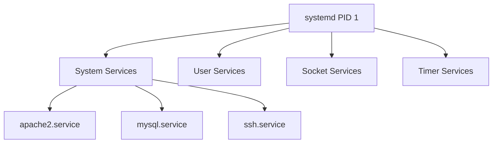
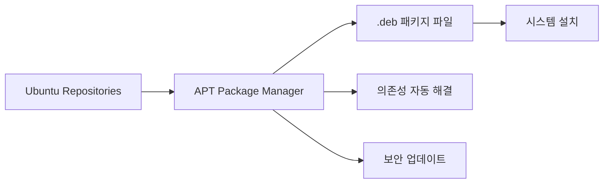

# Ubuntu 서비스와 패키지의 이해

## #01. 서비스 (Service)

### 1. 서비스 = 데몬(Daemon) = 백그라운드 프로세스

서비스는 시스템이 부팅될 때 자동으로 시작되어 백그라운드에서 지속적으로 실행되는 프로그램입니다.

| 용어 | 설명 | 예시 |
|------|------|------|
| **서비스(Service)** | `systemd`에서 관리하는 시스템 구성 요소 | apache2.service, mysql.service |
| **데몬(Daemon)** | 백그라운드에서 실행되는 프로세스 | httpd, mysqld, sshd |
| **유닛(Unit)** | `systemd`가 관리하는 모든 리소스의 단위 | .service, .socket, .timer |

### 2. 서비스의 특징

- ✅ **자동 시작**: 시스템 부팅 시 자동으로 시작
- ✅ **백그라운드 실행**: 사용자 개입 없이 지속 실행
- ✅ **네트워크 서비스**: 외부 요청을 대기하고 처리
- ✅ **시스템 리소스 관리**: CPU, 메모리, 파일 핸들러 관리

### 3. 주요 서비스 유형

| 카테고리 | 서비스 예시 | 설명 |
|----------|-------------|------|
| **웹 서버** | apache2, nginx | HTTP/HTTPS 요청 처리 |
| **데이터베이스** | mysql, postgresql, mongodb | 데이터 저장 및 관리 |
| **네트워크** | ssh, ftp, dhcp | 네트워크 통신 서비스 |
| **시스템** | systemd, cron, rsyslog | 시스템 관리 및 로깅 |

### 4. `systemd`

우분투(Ubuntu)를 포함한 대부분의 현대 리눅스 배포판에서 사용하는 **시스템 및 서비스 관리자(System and Service Manager)**

쉽게 말해서, **부팅부터 종료까지 운영체제의 모든 프로세스를 관리하는 “init 시스템”**

Ubuntu 15.04 이후부터 **systemd**가 기본 init 시스템으로 사용된다.



### 5. systemctl 명령어

`systemctl`은 **`systemd`를 제어하는 명령어 도구(command line tool)**

**중요**: 서비스 관리는 root 권한이 필요하므로 명령어 앞에 `sudo`를 붙여야 한다.

> `sudo`는 일반 사용자가 관리자 권한을 빌려서 명령어를 실행하려고 할 때 사용하는 옵션

#### 기본 서비스 제어 명령

| 명령어 | 설명 | 예시 |
|--------|------|------|
| `sudo systemctl start 서비스명` | 서비스 시작 | `sudo systemctl start apache2` |
| `sudo systemctl stop 서비스명` | 서비스 중지 | `sudo systemctl stop apache2` |
| `sudo systemctl restart 서비스명` | 서비스 재시작 | `sudo systemctl restart apache2` |
| `sudo systemctl reload 서비스명` | 설정만 다시 로드 | `sudo systemctl reload apache2` |

#### 서비스 상태 관리

```bash
# 서비스 상태 확인
sudo systemctl status apache2

# 서비스 활성화 (부팅시 자동 시작)
sudo systemctl enable apache2

# 서비스 비활성화 (부팅시 자동 시작 해제)
sudo systemctl disable apache2
```

#### 고급 조회 명령

```bash
# 모든 서비스 목록 보기
sudo systemctl list-units --type=service

# 활성화된 서비스만 보기
sudo systemctl list-units --type=service --state=active

# 실패한 서비스 보기
sudo systemctl list-units --type=service --state=failed

# 부팅시 자동 시작 서비스 목록
sudo systemctl list-unit-files --type=service --state=enabled

# 특정 서비스 검색
sudo systemctl list-unit-files | grep mysql
```

### 6. 서비스 로그 확인 (journalctl)

`journalctl`은 `systemd`의 로그 관리 도구

```bash
# 특정 서비스 로그 보기
sudo journalctl -u apache2

# 실시간 로그 모니터링
sudo journalctl -u apache2 -f

# 최근 100줄만 보기
sudo journalctl -u apache2 -n 100

# 특정 시간 이후 로그 보기
sudo journalctl -u apache2 --since "2025-01-01 00:00:00"
```

### 7. (고급) 서비스 시작에 실패한 경우

서비스를 시작하지 못하는 원인을 파악하기 위해 서비스 시작과 함께 로그를 함께 표시해야 한다.

```bash
sudo systemctl restart 서비스명 && journalctl -fu 서비스명
```


## #02. Ubuntu 패키지

패키지란 하나의 소프트웨어를 설치·업데이트·삭제할 수 있도록, 실행 파일 + 설정 파일 + 문서 + 의존성 정보 등을 모아놓은 파일 묶음.

> 쉽게 말하면 설치 파일

### 1. 패키지 시스템 개요

Ubuntu의 패키지 관리는 **APT(Advanced Package Tool)** 를 기반으로 합니다.



### 2. APT 저장소 시스템

#### 기본 저장소 구성

```bash
# 저장소 목록 확인
cat /etc/apt/sources.list.d/ubuntu.sources
```

아래와 같이 출력된다.

```bash
Types: deb
URIs: http://kr.archive.ubuntu.com/ubuntu/
Suites: noble noble-updates noble-backports
Components: main restricted universe multiverse
Signed-By: /usr/share/keyrings/ubuntu-archive-keyring.gpg

Types: deb
URIs: http://security.ubuntu.com/ubuntu/
Suites: noble-security
Components: main restricted universe multiverse
Signed-By: /usr/share/keyrings/ubuntu-archive-keyring.gpg
```

각 블록은 APT가 패키지를 가져올 저장소를 정의한다.

- Types: 어떤 형식의 저장소인지 (보통 deb, 즉 바이너리 패키지)
- URIs: 저장소 서버 주소(URL)
- Suites: 어떤 배포판/버전/업데이트 채널인지
- Components: 저장소 안의 카테고리(메인/제한/커뮤니티/비공식 등)
- Signed-By: 저장소 패키지 서명을 검증할 때 사용할 GPG 키 파일

**첫 번째 블록 해석**


```bash
# 바이너리 패키지 저장소 사용
Types: deb

# 한국 미러 서버에서 패키지를 받음
URIs: http://kr.archive.ubuntu.com/ubuntu/

# noble → Ubuntu 24.04 LTS (개발 코드명: Noble Numbat) 기본 릴리스
# noble-updates → 안정성/버그 수정 업데이트
# noble-backports → 공식 지원은 아니지만 최신 패키지 백포트
#   백포트: 최신 소프트웨어를 오래된 안정 버전에 맞춰 다시 빌드해서 제공하는 저장소
Suites: noble noble-updates noble-backports

# main → Canonical이 공식 지원하는 핵심 패키지
# restricted → 드라이버 등 제한된 라이선스 패키지
# universe → 커뮤니티가 관리하는 오픈소스 패키지
# multiverse → 저작권/특허 문제로 제한된 패키지
Components: main restricted universe multiverse

# 이 저장소의 패키지는 /usr/share/keyrings/ubuntu-archive-keyring.gpg로 서명 검증
Signed-By: /usr/share/keyrings/ubuntu-archive-keyring.gpg
```

#### 저장소 목록 갱신하기

새로운 패키지 설치 전에 항상 실행한다 (권장)

```shell
$ sudo apt-get upgrade
```

#### 패키지 설치

```shell
$ sudo apt-get install 패키지이름
```

#### 패키지 재설치

```shell
$ sudo apt-get --reinstall install 패키지이름
```

#### 패키지 삭제 : 설정파일은 지우지 않음

```shell
$ sudo apt-get remove -y 패키지이름
```

#### 설정파일까지 모두 지움

```shell
$ sudo apt-get purge -y 패키지이름
```

#### 패키지 검색

```shell
$ sudo apt-cache search 패키지이름
```

#### 패키지 정보 보기

```shell
$ sudo apt-cache show 패키지이름
```

#### 사용하지 않는 패키지 제거

```shell
$ sudo apt-get autoremove
```

#### 설치 완료 후 설치를 위해 내려받은 파일 제거

```shell
$ sudo apt-get clean
$ sudo apt-get autoclean
```

### 3. apt 명령어 (간소화된 버전)

Ubuntu 16.04부터 `apt` 명령어가 도입되어 더 간단하게 사용할 수 있습니다.

| apt-get/apt-cache | apt | 설명 |
|-------------------|-----|------|
| `apt-get update` | `apt update` | 패키지 목록 업데이트 |
| `apt-get upgrade` | `apt upgrade` | 패키지 업그레이드 |
| `apt-get install` | `apt install` | 패키지 설치 |
| `apt-get remove` | `apt remove` | 패키지 제거 |
| `apt-cache search` | `apt search` | 패키지 검색 |
| `apt-cache show` | `apt show` | 패키지 정보 표시 |
| `apt-get autoremove` | `apt autoremove` | 불필요한 패키지 제거 |
