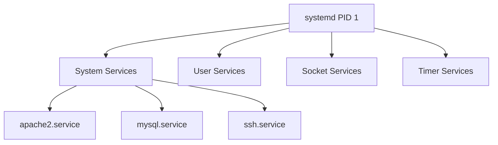
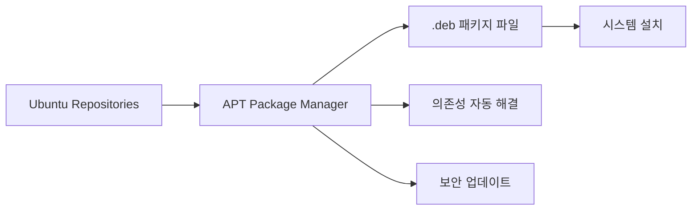

## #01. 서비스 (Service) 개념

### 1. 서비스 = 데몬(Daemon) = 백그라운드 프로세스

서비스는 시스템이 부팅될 때 자동으로 시작되어 백그라운드에서 지속적으로 실행되는 프로그램입니다.

| 용어 | 설명 | 예시 |
|------|------|------|
| **서비스(Service)** | systemd에서 관리하는 시스템 구성 요소 | apache2.service, mysql.service |
| **데몬(Daemon)** | 백그라운드에서 실행되는 프로세스 | httpd, mysqld, sshd |
| **유닛(Unit)** | systemd가 관리하는 모든 리소스의 단위 | .service, .socket, .timer |

### 2. 서비스의 특징

- ✅ **자동 시작**: 시스템 부팅 시 자동으로 시작
- ✅ **백그라운드 실행**: 사용자 개입 없이 지속 실행
- ✅ **네트워크 서비스**: 외부 요청을 대기하고 처리
- ✅ **시스템 리소스 관리**: CPU, 메모리, 파일 핸들러 관리

### 3. 주요 서비스 유형

| 카테고리 | 서비스 예시 | 설명 |
|----------|-------------|------|
| **웹 서버** | apache2, nginx | HTTP/HTTPS 요청 처리 |
| **데이터베이스** | mysql, postgresql, mongodb | 데이터 저장 및 관리 |
| **네트워크** | ssh, ftp, dhcp | 네트워크 통신 서비스 |
| **시스템** | systemd, cron, rsyslog | 시스템 관리 및 로깅 |

## #02. systemd 서비스 관리 (2025년 완전 가이드)

### 1. systemd 개요

Ubuntu 15.04 이후부터 **systemd**가 기본 init 시스템으로 사용됩니다.


```mermaid
graph TD
    A[systemd PID 1] --> B[System Services]
    A --> C[User Services]
    A --> D[Socket Services]
    A --> E[Timer Services]
    B --> F[apache2.service]
    B --> G[mysql.service]
    B --> H[ssh.service]
```

### 2. 서비스 파일 위치

#### 시스템 서비스 파일
- **주 위치**: `/usr/lib/systemd/system/` 또는 `/lib/systemd/system/`
- **사용자 정의**: `/etc/systemd/system/` (우선순위 높음)
- **런타임**: `/run/systemd/system/` (임시)

#### 파일명 규칙
```bash
서비스명.service
# 예시: apache2.service, mysql.service, ssh.service
```

##### 서비스 시작하기

```shell
$ sudo systemctl start 서비스명
```

##### 서비스 중지하기

### 3. systemctl 명령어 완전 가이드

> **중요**: 서비스 관리는 root 권한이 필요하므로 명령어 앞에 `sudo`를 붙여야 합니다.

#### 기본 서비스 제어 명령

| 명령어 | 설명 | 예시 |
|--------|------|------|
| `sudo systemctl start 서비스명` | 서비스 시작 | `sudo systemctl start apache2` |
| `sudo systemctl stop 서비스명` | 서비스 중지 | `sudo systemctl stop apache2` |
| `sudo systemctl restart 서비스명` | 서비스 재시작 | `sudo systemctl restart apache2` |
| `sudo systemctl reload 서비스명` | 설정만 다시 로드 | `sudo systemctl reload apache2` |

#### 서비스 상태 관리

```bash
# 서비스 상태 확인 (가장 중요!)
sudo systemctl status apache2

# 서비스 활성화 (부팅시 자동 시작)
sudo systemctl enable apache2

# 서비스 비활성화 (부팅시 자동 시작 해제)
sudo systemctl disable apache2

# 서비스 상태와 활성화 여부 동시 확인
sudo systemctl is-active apache2    # active/inactive
sudo systemctl is-enabled apache2   # enabled/disabled
```

#### 고급 조회 명령

```bash
# 모든 서비스 목록 보기
sudo systemctl list-units --type=service

# 활성화된 서비스만 보기
sudo systemctl list-units --type=service --state=active

# 실패한 서비스 보기
sudo systemctl list-units --type=service --state=failed

# 부팅시 자동 시작 서비스 목록
sudo systemctl list-unit-files --type=service --state=enabled

# 특정 서비스 검색
sudo systemctl list-unit-files | grep mysql
```

#### 서비스 로그 확인 (journalctl)

```bash
# 특정 서비스 로그 보기
sudo journalctl -u apache2

# 실시간 로그 모니터링
sudo journalctl -u apache2 -f

# 최근 100줄만 보기
sudo journalctl -u apache2 -n 100

# 특정 시간 이후 로그 보기
sudo journalctl -u apache2 --since "2025-01-01 00:00:00"
```

### 4. 실무 활용 예시

#### 웹 서버 운영 시나리오

```bash
# 1. Apache 웹 서버 설치 후 서비스 시작
sudo apt update
sudo apt install apache2
sudo systemctl start apache2
sudo systemctl enable apache2

# 2. 서비스 상태 확인
sudo systemctl status apache2

# 3. 설정 변경 후 리로드 (서비스 중단 없이)
sudo systemctl reload apache2

# 4. 문제 발생시 로그 확인
sudo journalctl -u apache2 -f

# 5. 필요시 재시작
sudo systemctl restart apache2
```

### 5. 사용자 정의 서비스 만들기

#### 간단한 서비스 파일 예시

```bash
# /etc/systemd/system/myapp.service 파일 생성
sudo nano /etc/systemd/system/myapp.service
```

```ini
[Unit]
Description=My Custom Application
After=network.target

[Service]
Type=simple
User=www-data
WorkingDirectory=/opt/myapp
ExecStart=/usr/bin/node /opt/myapp/app.js
Restart=always
RestartSec=10

[Install]
WantedBy=multi-user.target
```

```bash
# 서비스 등록 및 시작
sudo systemctl daemon-reload
sudo systemctl enable myapp
sudo systemctl start myapp
```

## #03. Ubuntu 패키지 관리 시스템 (2025년 완전 가이드)

### 1. 패키지 시스템 개요

Ubuntu의 패키지 관리는 **APT(Advanced Package Tool)** 를 기반으로 합니다.


```mermaid
graph LR
    A[Ubuntu Repositories] --> B[APT Package Manager]
    B --> C[.deb 패키지 파일]
    C --> D[시스템 설치]
    B --> E[의존성 자동 해결]
    B --> F[보안 업데이트]
```

#### 패키지 관리자 발전사

| 도구 | 도입 시기 | 특징 | 사용 권장도 |
|------|-----------|------|-------------|
| `apt-get` | 1998년 | 전통적 명령어, 스크립트 친화적 | ⭐⭐⭐ (스크립트용) |
| `apt` | 2014년 | 사용자 친화적, 컬러 출력 | ⭐⭐⭐⭐⭐ (대화형) |
| `snap` | 2016년 | 범용 패키지, 컨테이너화 | ⭐⭐⭐⭐ (신규 앱) |
| `flatpak` | 2015년 | 샌드박스 앱, 크로스 배포판 | ⭐⭐⭐ (데스크톱 앱) |

### 2. APT 저장소 시스템

#### 기본 저장소 구성

```bash
# 저장소 목록 확인
cat /etc/apt/sources.list
```

```bash
# Ubuntu 24.04 LTS 기본 저장소 예시
deb http://archive.ubuntu.com/ubuntu noble main restricted
deb http://archive.ubuntu.com/ubuntu noble-updates main restricted
deb http://security.ubuntu.com/ubuntu noble-security main restricted
deb http://archive.ubuntu.com/ubuntu noble universe multiverse
```

#### 저장소 구성 요소

| 구성 요소 | 설명 | 포함 패키지 |
|-----------|------|-------------|
| **main** | 공식 지원 오픈소스 | 핵심 시스템, 서버 패키지 |
| **restricted** | 공식 지원 상용 드라이버 | NVIDIA, AMD 드라이버 |
| **universe** | 커뮤니티 오픈소스 | 대부분의 소프트웨어 |
| **multiverse** | 상용/제한적 라이선스 | 코덱, 상용 소프트웨어 |

```shell
$ sudo apt-get upgrade
```

#### 3) 의존성검사하며 설치하기

```shell
$ sudo apt-get dist-upgrade
```

#### 4) 패키지 설치

```shell
$ sudo apt-get install 패키지이름
```

#### 5) 패키지 재설치

```shell
$ sudo apt-get --reinstall install 패키지이름
```

#### 6) 패키지 삭제 : 설정파일은 지우지 않음

```shell
$ sudo apt-get remove -y 패키지이름
```

#### 7) 설정파일까지 모두 지움

```shell
$ sudo apt-get purge -y 패키지이름
```

#### 8) 패키지 검색

```shell
$ sudo apt-cache search 패키지이름
```

#### 9) 패키지 정보 보기

```shell
$ sudo apt-cache show 패키지이름
```

#### 10) 사용하지 않는 패키지 제거

```shell
$ sudo apt-get autoremove
```

#### 11) 내려받은 파일 제거

```shell
$ sudo apt-get clean
$ sudo apt-get autoclean
```

### 3. apt 명령어 (간소화된 버전)

Ubuntu 16.04부터 `apt` 명령어가 도입되어 더 간단하게 사용할 수 있습니다.

| apt-get/apt-cache | apt | 설명 |
|-------------------|-----|------|
| `apt-get update` | `apt update` | 패키지 목록 업데이트 |
| `apt-get upgrade` | `apt upgrade` | 패키지 업그레이드 |
| `apt-get install` | `apt install` | 패키지 설치 |
| `apt-get remove` | `apt remove` | 패키지 제거 |
| `apt-cache search` | `apt search` | 패키지 검색 |
| `apt-cache show` | `apt show` | 패키지 정보 표시 |
| `apt-get autoremove` | `apt autoremove` | 불필요한 패키지 제거 |

## #03. 서비스 고급 관리

### 1. 서비스 로그 확인

#### systemd 로그 확인 (journalctl)

```shell
# 모든 로그 확인
$ sudo journalctl

# 특정 서비스 로그 확인
$ sudo journalctl -u apache2

# 실시간 로그 모니터링
$ sudo journalctl -u apache2 -f

# 최근 로그만 확인
$ sudo journalctl -u apache2 --since "2024-01-01" --until "2024-01-02"

# 로그 레벨별 필터링
$ sudo journalctl -u apache2 -p err
```

#### 전통적인 로그 파일 확인

```shell
# 시스템 로그
$ sudo tail -f /var/log/syslog

# 인증 로그
$ sudo tail -f /var/log/auth.log

# 커널 로그
$ sudo dmesg

# 부팅 로그
$ sudo cat /var/log/boot.log
```

### 2. 서비스 의존성 관리

```shell
# 서비스 의존성 확인
$ sudo systemctl list-dependencies apache2

# 역방향 의존성 확인
$ sudo systemctl list-dependencies apache2 --reverse

# 의존성 트리 표시
$ sudo systemctl list-dependencies apache2 --all
```

### 3. 서비스 설정 파일 편집

```shell
# 서비스 설정 파일 편집
$ sudo systemctl edit apache2

# 전체 설정 파일 덮어쓰기
$ sudo systemctl edit --full apache2

# 설정 재로드 (재시작 없이)
$ sudo systemctl reload apache2

# 설정 변경 후 데몬 재로드
$ sudo systemctl daemon-reload
```

### 4. 사용자 정의 서비스 생성

#### 간단한 서비스 파일 예시

```ini
# /etc/systemd/system/myapp.service
[Unit]
Description=My Custom Application
After=network.target

[Service]
Type=simple
User=myuser
WorkingDirectory=/opt/myapp
ExecStart=/opt/myapp/myapp.sh
Restart=always
RestartSec=10

[Install]
WantedBy=multi-user.target
```

#### 서비스 등록 및 실행

```shell
# 서비스 파일 생성 후
$ sudo systemctl daemon-reload
$ sudo systemctl enable myapp
$ sudo systemctl start myapp
$ sudo systemctl status myapp
```

## #04. 패키지 고급 관리

### 1. 패키지 버전 관리

```shell
# 설치 가능한 패키지 버전 확인
$ apt-cache policy apache2

# 특정 버전 설치
$ sudo apt install apache2=2.4.41-4ubuntu3.14

# 패키지 홀드 (업그레이드 방지)
$ sudo apt-mark hold apache2

# 홀드 해제
$ sudo apt-mark unhold apache2

# 홀드된 패키지 목록 확인
$ apt-mark showhold
```

### 2. 소스에서 패키지 빌드

```shell
# 소스 코드 다운로드
$ apt source apache2

# 빌드 의존성 설치
$ sudo apt build-dep apache2

# 패키지 빌드
$ sudo apt-get source --compile apache2
```

### 3. 패키지 캐시 관리

```shell
# 캐시 위치 확인
$ du -sh /var/cache/apt/archives/

# 캐시 통계 확인
$ apt-cache stats

# 깨진 패키지 수정
$ sudo apt --fix-broken install

# 패키지 데이터베이스 재구성
$ sudo dpkg --configure -a
```

### 4. PPA (Personal Package Archives) 관리

```shell
# PPA 추가
$ sudo add-apt-repository ppa:username/ppa-name

# PPA 제거
$ sudo add-apt-repository --remove ppa:username/ppa-name

# 저장소 목록 확인
$ cat /etc/apt/sources.list
$ ls /etc/apt/sources.list.d/

# 저장소 키 관리
$ sudo apt-key list
$ sudo apt-key add keyfile.gpg
```

## #05. 시스템 모니터링

### 1. 실행 중인 서비스 확인

```shell
# 모든 활성 서비스
$ sudo systemctl list-units --type=service --state=active

# 실패한 서비스
$ sudo systemctl list-units --type=service --state=failed

# 서비스 상태 요약
$ sudo systemctl status

# 부팅 시간 분석
$ systemd-analyze
$ systemd-analyze blame
$ systemd-analyze critical-chain
```

### 2. 시스템 리소스 모니터링

```shell
# 실시간 프로세스 모니터링
$ top
$ htop

# 메모리 사용량
$ free -h
$ cat /proc/meminfo

# 디스크 사용량
$ df -h
$ du -sh /*

# 네트워크 연결 상태
$ netstat -tulpn
$ ss -tulpn

# I/O 모니터링
$ iotop
$ iostat
```

### 3. 로그 분석 도구

```shell
# 로그 파일 크기 확인
$ sudo du -sh /var/log/*

# 로그 순환 설정 확인
$ cat /etc/logrotate.conf
$ ls /etc/logrotate.d/

# 실시간 로그 분석
$ sudo tail -f /var/log/syslog | grep ERROR
$ sudo journalctl -f | grep -i error
```

## #06. 보안 관리

### 1. 패키지 보안 업데이트

```shell
# 보안 업데이트만 설치
$ sudo unattended-upgrade

# 보안 업데이트 확인
$ apt list --upgradable | grep -i security

# 자동 업데이트 설정
$ sudo dpkg-reconfigure unattended-upgrades
```

### 2. 서비스 보안 설정

```shell
# 서비스 권한 확인
$ sudo systemctl show apache2 | grep -i user

# 네트워크 포트 확인
$ sudo netstat -tlpn | grep apache2

# 방화벽 상태 확인
$ sudo ufw status
$ sudo iptables -L
```

### 3. 패키지 무결성 검사

```shell
# 설치된 패키지 무결성 확인
$ sudo debsums -c

# 특정 패키지 파일 확인
$ dpkg -V apache2

# 패키지 설치 기록 확인
$ grep " install " /var/log/dpkg.log
$ grep " upgrade " /var/log/dpkg.log
```

## #07. 문제 해결

### 1. 서비스 문제 해결

```shell
# 서비스 상태 자세히 확인
$ sudo systemctl status apache2 -l

# 서비스 종속성 문제 확인
$ sudo systemctl list-dependencies apache2 --failed

# 서비스 재시작 실패 시
$ sudo systemctl reset-failed apache2
$ sudo systemctl start apache2
```

### 2. 패키지 문제 해결

```shell
# 깨진 패키지 수정
$ sudo apt --fix-broken install

# 패키지 잠금 해제
$ sudo fuser -vki /var/lib/dpkg/lock-frontend
$ sudo rm /var/lib/dpkg/lock-frontend

# 패키지 데이터베이스 복구
$ sudo dpkg --configure -a
$ sudo apt update --fix-missing
```

### 3. 디스크 공간 부족 시

```shell
# 패키지 캐시 정리
$ sudo apt clean
$ sudo apt autoremove

# 로그 파일 정리
$ sudo journalctl --vacuum-time=7d
$ sudo journalctl --vacuum-size=100M

# 큰 파일 찾기
$ sudo find /var -type f -size +100M
$ sudo du -sh /var/log/* | sort -hr
```

이제 Ubuntu 서비스와 패키지 관리에 대한 포괄적인 가이드가 완성되었습니다. 기본적인 서비스 관리부터 고급 패키지 관리, 시스템 모니터링, 보안 관리, 문제 해결까지 실무에서 필요한 모든 내용을 포함했습니다.