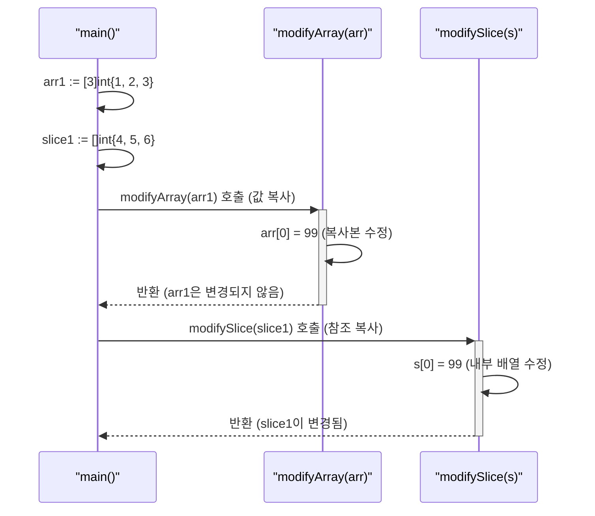

---
title: "Go언어의 컬렉션 자료형"
description: "이 포스팅에서는 Go의 대표적인 컬렉션 자료형(배열, 슬라이스, 맵)을 Java와 비교하며, 실제로 데이터를 집계하는 프로그램을 완성하는 과정을 다룹니다. 각 단계마다 실습 예제를 통해 직접 코드를 작성해보고, 최종적으로 `학생 점수 집계` 프로그램을 완성합니다."
categories: [03.Coding,Golang]
date:   2024-10-17 11:33:00 +0900
author: Hossam
image: /images/indexs/golang.webp
tags: [Programming,Golang,Coding,Go-Collections]
pin: true
math: true
mermaid: true
---

# Go언어의 컬렉션 자료형

## 1. Go의 컬렉션 자료형과 Java 비교

Go는 데이터를 효율적으로 관리하기 위한 다양한 컬렉션 자료형을 제공한다. Java 개발자에게 익숙한 개념들이지만, Go만의 특징과 차이점을 이해하는 것이 중요하다.

### 2.1 배열 (Arrays)

*   **Go**: 고정된 크기를 가지며, 선언 시 크기가 결정된다. 모든 요소는 동일한 타입이어야 한다. 배열은 값 타입(value type)으로, 함수에 전달될 때 복사된다.
    ```go
    var a [3]int // int 타입 3개 요소를 갖는 배열
    b := [2]string{"Go", "Java"} // 문자열 2개 요소를 갖는 배열
    ```
*   **Java**: Go와 마찬가지로 고정된 크기를 가지며, 선언 시 크기가 결정된다. 배열은 객체이며, 참조 타입(reference type)으로 동작한다.
    ```java
    int[] a = new int[3]; // int 타입 3개 요소를 갖는 배열
    String[] b = {"Go", "Java"}; // 문자열 2개 요소를 갖는 배열
    ```

### 2.2 슬라이스 (Slices)

*   **Go**: Go에서 가장 유연하게 사용되는 컬렉션 타입이다. 배열을 기반으로 하지만, 동적인 크기를 가진다. 슬라이스는 길이(length)와 용량(capacity) 개념을 가지며, 용량을 초과하여 요소를 추가할 경우 내부적으로 더 큰 배열을 생성하여 데이터를 복사한다. Java의 `ArrayList`와 유사하게 동작하지만, 슬라이스 자체가 배열의 '뷰(view)'라는 점이 특징이다.
    ```go
    var s []int // nil 슬라이스 (길이 0, 용량 0)
    s = append(s, 1, 2, 3) // 요소 추가
    t := make([]int, 5) // 길이 5, 용량 5인 슬라이스 생성
    u := make([]int, 0, 10) // 길이 0, 용량 10인 슬라이스 생성
    ```
*   **Java**: `java.util.ArrayList`와 같은 컬렉션 클래스를 사용하여 동적인 크기의 배열을 구현한다. 내부적으로 배열을 사용하며, 크기가 부족할 경우 새로운 배열을 생성하여 요소를 복사하는 방식은 Go의 슬라이스와 유사하다.
    ```java
    ArrayList<Integer> list = new ArrayList<>(); // 동적 배열
    list.add(1); list.add(2); list.add(3);
    ```

### 2.3 맵 (Maps)

*   **Go**: 키-값(key-value) 쌍을 저장하는 해시 테이블 기반의 컬렉션이다. Java의 `HashMap`과 유사하게 동작한다. 키는 고유해야 하며, 값은 중복될 수 있다. `make` 함수를 사용하여 초기화해야 한다.
    ```go
    m := make(map[string]int) // string 키, int 값 맵 생성
    m["apple"] = 10 // 값 추가
    ```
*   **Java**: `java.util.HashMap` 클래스를 사용하여 키-값 쌍을 저장한다. Go의 맵과 개념적으로 동일하며, 내부적으로 해시 테이블을 사용한다.
    ```java
    HashMap<String, Integer> map = new HashMap<>(); // string 키, Integer 값 맵 생성
    map.put("apple", 10); // 값 추가
    ```


---

## 3. 실습 1: 배열과 슬라이스 선언 및 초기화

Go에서 배열은 고정된 크기를 가지며, 슬라이스는 동적인 크기를 가진다.

**실습 파일: `03-컬렉션/01-array_slice/main.go`**

아래 예제는 Go의 배열과 슬라이스가 함수에 전달될 때 어떻게 다르게 동작하는지 보여준다. `modifyArray` 함수는 배열의 복사본을 받아 수정하므로 원본 `arr1`은 변경되지 않는다. 반면 `modifySlice` 함수는 슬라이스의 내부 배열을 가리키는 헤더를 복사하므로, 함수 내에서 요소를 수정하면 원본 `slice1`에 영향을 준다.



```go
package main

import "fmt"

func main() {
    /** 배열 선언 및 초기화 */

    // Go 배열: 고정된 크기. Java의 `int[] arr = new int[3];`와 유사하지만, Go 배열은 값 타입이다.
    // 배열의 크기는 타입의 일부이므로, [3]int와 [4]int는 다른 타입이다.
    var arr1 = [3]int{1, 2, 3}
    fmt.Println("배열 arr1:", arr1)

    // Go 배열 리터럴: `...`을 사용하여 컴파일러가 초기화 값의 개수에 따라 배열 크기를 자동 추론하게 한다.
    // Java의 `{}` 초기화와 유사.
    arr2 := [...]string{"apple", "banana", "cherry"}
    fmt.Println("배열 arr2:", arr2)

    // 배열은 값 타입(Value Type): 함수에 전달 시 복사됨. Java의 기본 타입(int, boolean 등)과 유사.
    // 따라서 `modifyArray` 함수 내에서 `arr_copy`를 변경해도 원본 `arr1`에는 영향을 주지 않는다.
    modifyArray(arr1)
    fmt.Println("modifyArray 호출 후 arr1 (변화 없음):", arr1)

    /** 슬라이스 선언 및 초기화 */

    // Go 슬라이스 리터럴: 동적 크기. Java의 `ArrayList<Integer> list = new ArrayList<>(Arrays.asList(4, 5, 6));`와 유사.
    // 슬라이스는 내부적으로 배열을 참조하며, 길이(len)와 용량(cap)을 가진다.
    slice1 := []int{4, 5, 6}
    fmt.Println("슬라이스 slice1:", slice1)

    // `make` 함수를 이용한 슬라이스 생성: Java의 `new ArrayList<>(initialCapacity);`와 유사.
    // `make([]T, length, capacity)`
    // `length`: 슬라이스의 초기 길이 (요소는 제로 값으로 초기화된다).
    // `capacity`: 슬라이스의 내부 배열이 가질 수 있는 최대 길이 (생략 시 `length`와 동일).
    slice2 := make([]int, 5) // 길이 5, 용량 5인 슬라이스 (모든 요소는 제로 값으로 초기화)
    fmt.Println("슬라이스 slice2 (make로 생성):", slice2)

    slice3 := make([]string, 0, 10) // 길이 0, 용량 10인 슬라이스. 요소를 추가할 때 용량 내에서 효율적으로 확장된다.
    fmt.Println("슬라이스 slice3 (길이 0, 용량 10):", slice3)

    // 슬라이스는 참조 타입(Reference Type)처럼 동작: 함수에 전달 시 내부 배열을 공유.
    // Java에서 객체(예: ArrayList)를 함수에 전달하여 객체 내부를 변경하는 것과 유사.
    modifySlice(slice1)
    fmt.Println("modifySlice 호출 후 slice1 (변화 있음):", slice1)

    // nil 슬라이스: 선언만 하고 초기화하지 않은 슬라이스 (길이 0, 용량 0, 내부 배열 없음).
    // Java의 `null` 참조와 유사하지만, Go의 nil 슬라이스는 `len`과 `cap` 함수를 사용할 수 있으며, `append`도 가능하다.
    var nilSlice []int
    fmt.Printf("nilSlice: %v, 길이: %d, 용량: %d\n", nilSlice, len(nilSlice), cap(nilSlice))
    if nilSlice == nil { // nil 슬라이스는 `nil`과 비교할 수 있다.
        fmt.Println("nilSlice는 nil이다.")
    }
}

// 배열을 수정하는 함수 (배열은 값 타입이므로 원본은 변경되지 않음)
// 함수 인자로 배열이 전달될 때, 배열 전체가 복사된다.
func modifyArray(arr [3]int) {
    arr[0] = 99 // 복사된 배열의 첫 번째 요소를 변경
    fmt.Println("modifyArray 내부:", arr)
}

// 슬라이스를 수정하는 함수 (슬라이스는 내부 배열을 공유하므로 원본이 변경될 수 있음)
// 함수 인자로 슬라이스가 전달될 때, 슬라이스 헤더(포인터, 길이, 용량)가 복사된다.
// 이 복사된 헤더의 포인터는 원본 슬라이스의 내부 배열을 가리킨다.
func modifySlice(s []int) {
    s[0] = 99 // 슬라이스 헤더의 포인터를 통해 내부 배열의 첫 번째 요소를 변경. 이는 원본 슬라이스에도 영향을 준다.
    fmt.Println("modifySlice 내부:", s)
}
```

---

## 4. 실습 2: 슬라이스에 요소 추가 및 삭제

슬라이스는 동적인 크기를 가지므로, 요소를 추가하거나 삭제하는 것이 가능하다. `append` 함수를 사용하여 요소를 추가하고, 슬라이싱과 `append`를 조합하여 요소를 삭제한다.

**실습 파일: `03-컬렉션/02-slice-append-delete/main.go`**

아래 예제는 `append` 함수를 사용하여 슬라이스에 요소를 추가하는 과정을 보여준다. `append`는 슬라이스의 용량이 부족할 경우, Go 런타임이 자동으로 더 큰 내부 배열을 할당하고 기존 요소를 복사하여 확장한다. 또한, 슬라이싱과 `append`를 조합하여 특정 인덱스의 요소를 효과적으로 삭제하는 방법을 보여준다.

```go
package main

import "fmt"

func main() {
    /** 슬라이스에 요소 추가 (append) */

    // `append` 함수는 슬라이스에 요소를 추가하고, 새로운 슬라이스를 반환한다.
    // 따라서 반환 값을 반드시 기존 슬라이스 변수에 재할당해야 한다.
    // 용량이 부족하면 Go 런타임이 자동으로 더 큰 내부 배열을 할당하고 기존 요소를 복사한다.
    // Java의 `ArrayList.add()`는 내부적으로 배열 크기를 늘리지만, Go는 명시적으로 재할당해야 한다.
    slice := []int{1, 2, 3}
    fmt.Printf("초기 슬라이스: %v, 길이: %d, 용량: %d\n", slice, len(slice), cap(slice))

    slice = append(slice, 4) // 단일 요소 추가. Java의 `list.add(4);`와 유사.
    fmt.Printf("4 추가 후: %v, 길이: %d, 용량: %d\n", slice, len(slice), cap(slice))

    slice = append(slice, 5, 6) // 여러 요소 추가. `append`는 가변 인자(variadic arguments)를 받는다.
    fmt.Printf("5, 6 추가 후: %v, 길이: %d, 용량: %d\n", slice, len(slice), cap(slice))

    anotherSlice := []int{7, 8}
    // `...` 연산자를 사용하여 다른 슬라이스의 모든 요소를 현재 슬라이스에 추가한다.
    // Java의 `list.addAll(anotherList);`와 유사하다.
    slice = append(slice, anotherSlice...)
    fmt.Printf("다른 슬라이스 추가 후: %v, 길이: %d, 용량: %d\n", slice, len(slice), cap(slice))

    /** 슬라이스에서 요소 삭제 */

    // Go는 Java의 `list.remove(index)`나 `list.remove(Object)`와 같은 직접적인 삭제 메서드를 제공하지 않는다.
    // 슬라이싱(slicing)과 `append`를 조합하여 요소를 삭제하는 것이 일반적인 방법이다.

    // 인덱스 1의 요소 삭제 (값 20 삭제)
    sliceToDelete := []int{10, 20, 30, 40, 50}
    fmt.Println("삭제 전 슬라이스:", sliceToDelete)
    // `sliceToDelete[:1]`은 인덱스 0까지의 슬라이스([10])를 생성한다.
    // `sliceToDelete[2:]`는 인덱스 2부터 끝까지의 슬라이스([30, 40, 50])를 생성한다.
    // 이 둘을 `append`하여 인덱스 1의 요소를 건너뛰는 효과를 낸다.
    sliceToDelete = append(sliceToDelete[:1], sliceToDelete[2:]...)
    fmt.Println("인덱스 1 (20) 삭제 후:", sliceToDelete) // 결과: [10 30 40 50]

    // 중간 요소 삭제 (인덱스 2의 값 40 삭제)
    sliceToDelete = append(sliceToDelete[:2], sliceToDelete[3:]...)
    fmt.Println("인덱스 2 (40) 삭제 후:", sliceToDelete) // 결과: [10 30 50]

    // 마지막 요소 삭제
    // 슬라이스의 길이를 1 줄여서 마지막 요소를 제외한다.
    sliceToDelete = sliceToDelete[:len(sliceToDelete)-1]
    fmt.Println("마지막 요소 (50) 삭제 후:", sliceToDelete) // 결과: [10 30]

    // 특정 값 삭제 (예: 30 삭제)
    // Go는 Java의 `remove(Object)`와 같은 직접적인 값 삭제 메서드를 제공하지 않는다.
    // 탐색하면서 해당 값을 제외하고 새 슬라이스를 만들거나, 위와 같은 슬라이싱 기법을 사용해야 한다.
    // 여기서는 예시를 위해 간단한 루프를 사용한다.
    sliceByValue := []int{10, 20, 30, 20, 40}
    valToRemove := 20
    // 새 슬라이스를 생성하고, 삭제할 값을 제외한 요소들만 추가한다.
    newSlice := make([]int, 0, len(sliceByValue))
    for _, v := range sliceByValue {
        if v != valToRemove {
            newSlice = append(newSlice, v)
        }
    }
    sliceByValue = newSlice
    fmt.Println("값 20 삭제 후:", sliceByValue) // 결과: [10 30 40]
}
```

---

## 5. 실습 3: 맵(Map) 선언, 값 추가 및 삭제

Go의 맵은 키-값 쌍을 저장하는 데 사용된다. 맵은 `make` 함수로 초기화해야 하며, 키의 존재 여부를 확인하는 특별한 문법이 있다.

**실습 파일: `03-컬렉션/03-map/main.go`**

아래 예제는 맵을 생성하고, 키-값 쌍을 추가, 수정, 조회, 삭제하는 전체 과정을 보여준다.

특히 Go의 "comma ok" 관용구를 사용하여 키의 존재 여부를 안전하게 확인하는 방법과 `delete` 함수로 요소를 제거하는 흐름을 설명한다.

```go
package main

import "fmt"

func main() {
    /** 맵 선언 및 초기화 */

    // 맵 리터럴을 이용한 초기화. 키-값 쌍을 중괄호 `{}` 안에 나열한다.
    // Java의 `HashMap<String, Integer> map = new HashMap<>();`와 유사.
    scores := map[string]int{"Alice": 90, "Bob": 85}
    fmt.Println("초기 맵:", scores)

    // `make` 함수를 이용한 맵 생성. 맵은 반드시 `make`로 초기화해야 한다.
    // `make(map[KeyType]ValueType, initialCapacity)`
    // `initialCapacity`는 선택 사항이며, 맵의 초기 크기를 미리 할당하여 성능을 최적화할 수 있다.
    // Java의 `new HashMap<>(initialCapacity);`와 유사.
    playerStats := make(map[string]int)
    fmt.Println("빈 맵 (make로 생성):", playerStats)

    /** 맵에 값 추가 및 수정 */

    // 값 추가: `map[key] = value` 형태로 추가한다. 키가 없으면 추가되고, 있으면 값이 수정된다.
    // Java의 `map.put("key", value);`와 유사.
    playerStats["Health"] = 100
    playerStats["Mana"] = 50
    fmt.Println("값 추가 후:", playerStats)

    // 값 수정: 기존 키에 새로운 값을 할당하면 값이 수정된다.
    // Java의 `map.put("key", newValue);`와 유사.
    playerStats["Health"] = 90
    fmt.Println("값 수정 후:", playerStats)

    /** 맵에서 값 가져오기 및 키 존재 여부 확인 */

    // 값 가져오기: `map[key]` 형태로 값을 가져온다. 키가 없으면 값 타입의 제로 값을 반환한다.
    // Java의 `map.get("key");`와 유사하지만, Go는 키가 없을 때 `null` 대신 제로 값을 반환한다.
    mana := playerStats["Mana"]
    fmt.Println("Mana:", mana)

    // 키 존재 여부 확인 (comma ok): Go의 독특한 문법으로, 값과 함께 키의 존재 여부를 `bool` 값으로 반환한다.
    // Java의 `map.containsKey("key");`와 유사하다. Go는 값과 함께 존재 여부를 반환한다.
    hp, ok := playerStats["Health"]
    if ok { // `ok`가 `true`이면 키가 존재한다.
        fmt.Println("Health 값:", hp)
    } else {
        fmt.Println("Health 키가 존재하지 않는다.")
    }

    gold, ok := playerStats["Gold"]
    if ok {
        fmt.Println("Gold 값:", gold)
    } else {
        fmt.Println("Gold 키가 존재하지 않는다.")
    }

    /** 맵에서 값 삭제 */

    // `delete` 함수를 사용하여 키-값 쌍을 삭제한다.
    // 존재하지 않는 키를 삭제해도 런타임 에러가 발생하지 않는다.
    // Java의 `map.remove("key");`와 유사.
    delete(playerStats, "Mana")
    fmt.Println("Mana 삭제 후:", playerStats)

    delete(playerStats, "NonExistentKey") // 존재하지 않는 키 삭제 시도
    fmt.Println("존재하지 않는 키 삭제 시도 후:", playerStats)

    /** 맵의 특징 */

    // 맵은 순서가 보장되지 않는다. 탐색 시마다 순서가 달라질 수 있다.
    // Java의 `HashMap`도 순서가 보장되지 않는다. 순서가 필요한 경우 `LinkedHashMap`을 사용한다.
    // 맵의 제로 값은 `nil`이다. `nil` 맵은 요소를 추가할 수 없으며, 사용하려면 `make`로 초기화해야 한다.
    // Java의 `null` 맵에 `put` 시 `NullPointerException` 발생과 유사하다.
    var nilMap map[string]int
    fmt.Printf("nilMap: %v, nil 여부: %t\n", nilMap, nilMap == nil)
    // nilMap["test"] = 10 // 런타임 패닉 발생: assignment to entry in nil map
}
```

---

## 6. 실습 4: 컬렉션 탐색 (for-range)

Go에서 컬렉션을 탐색하는 가장 일반적이고 강력한 방법은 `for-range` 문이다. `for-range`는 배열, 슬라이스, 문자열, 맵, 채널 등 다양한 컬렉션을 탐색할 수 있다.

**실습 파일: `03-컬렉션/04-iterate/main.go`**

아래 예제는 `for-range` 루프를 사용하여 슬라이스, 맵, 문자열 등 다양한 컬렉션을 탐색하는 방법을 보여준다.

슬라이스를 탐색할 때, 루프 변수 `num`은 원본 요소의 복사본이므로, 이를 수정해도 원본 슬라이스 `numbers`는 변경되지 않는다는 점이 중요하다.

```go
package main

import "fmt"

func main() {
    /** 슬라이스 탐색 */

    // for-range는 인덱스와 값을 반환한다.
    // 값은 복사본이므로, 탐색 중 값을 변경해도 원본 슬라이스에는 영향을 주지 않는다.
    // Java의 향상된 for문(for-each)과 유사하지만, Go는 인덱스도 함께 얻을 수 있다.
    numbers := []int{10, 20, 30, 40, 50}
    fmt.Println("--- 슬라이스 탐색 ---")
    for i, num := range numbers {
        fmt.Printf("인덱스: %d, 값: %d\n", i, num)
        // num = 99 // num은 복사본이므로 원본 numbers에는 영향을 주지 않는다.
    }
    fmt.Println("탐색 후 슬라이스 (변화 없음):", numbers)

    // 값만 필요한 경우 인덱스를 _로 무시할 수 있다.
    // Java의 `for (int num : numbers)`와 동일한 효과.
    fmt.Println("--- 슬라이스 값만 탐색 ---")
    for _, num := range numbers {
        fmt.Println("값:", num)
    }

    /** 맵 탐색 */

    // 맵은 순서가 보장되지 않는다. 탐색할 때마다 순서가 다를 수 있다.
    // for-range는 키와 값을 반환한다.
    // Java의 `for (Map.Entry<String, Integer> entry : scores.entrySet())`와 유사.
    scores := map[string]int{"Alice": 90, "Bob": 85, "Charlie": 95}
    fmt.Println("--- 맵 탐색 ---")
    for name, score := range scores {
        fmt.Printf("학생: %s, 점수: %d\n", name, score)
    }

    // 키만 필요한 경우 값을 _로 무시할 수 있다.
    // Java의 `for (String name : scores.keySet())`와 유사.
    fmt.Println("--- 맵 키만 탐색 ---")
    for name := range scores {
        fmt.Println("학생:", name)
    }

    /** 문자열 탐색 */

    // 문자열을 for-range로 탐색하면 유니코드 코드 포인트(rune)를 반환한다.
    // 인덱스는 바이트 오프셋이다. Java는 `String.charAt(index)`로 char를 얻지만, 유니코드 처리는 별도.
    koreanString := "안녕하세요"
    fmt.Println("--- 문자열 탐색 ---")
    for i, r := range koreanString {
        fmt.Printf("인덱스: %d, 룬(문자): %c, 유니코드 값: %U\n", i, r, r)
    }

    /** 배열 탐색 (슬라이스와 유사) */

    arr := [3]string{"A", "B", "C"}
    fmt.Println("--- 배열 탐색 ---")
    for i, val := range arr {
        fmt.Printf("인덱스: %d, 값: %s\n", i, val)
    }
}
```

---

## 7. 실습 5: 최종 예제 - 학생 점수 집계 및 평균 계산

앞서 배운 컬렉션 자료형과 탐색 방법을 활용하여 간단한 학생 점수 집계 프로그램을 만들어 본다.

**실습 파일: `03-컬렉션/05-score-avg/main.go`**

이 최종 예제는 맵에 저장된 학생들의 점수를 `for-range` 루프로 탐색하며 총점을 계산하고, 이를 바탕으로 평균 점수를 구하는 전체 흐름을 보여준다. 정수 나눗셈 시 발생할 수 있는 데이터 손실을 막기 위해 `float64` 타입으로 명시적 형 변환을 수행하는 과정이 포함되어 있다.

```go
package main

import "fmt"

func main() {
    /** 맵을 이용한 점수 저장 */
    // Go 맵을 이용하여 학생 이름(string)을 키로, 점수(int)를 값으로 저장한다.
    // Java의 `HashMap<String, Integer> scores = new HashMap<>();`와 유사하다.
    scores := map[string]int{"Alice": 90, "Bob": 85, "Charlie": 95}

    sum := 0 // 총점을 저장할 변수 초기화

    /** `for-range`를 이용한 맵 탐색 및 합계 계산 */
    // 맵을 `for-range`로 탐색하여 각 학생의 점수를 `sum`에 더한다.
    // 키(`name`)는 필요 없으므로 `_`로 무시한다.
    // Java의 `for (int score : scores.values()) { sum += score; }`와 유사하다.
    for _, score := range scores {
        sum += score
    }

    /** 평균 계산 */
    // Go는 정수 나눗셈 시 소수점 이하를 버리므로, 정확한 평균을 위해 명시적 타입 변환이 필요하다.
    // `float64(sum)`은 `sum`을 `float64` 타입으로 변환한다.
    // `len(scores)`는 맵의 요소 개수(학생 수)를 반환한다.
    // Java의 `double avg = (double) sum / scores.size();`와 유사하다.
    avg := float64(sum) / float64(len(scores))
    // `fmt.Printf`를 사용하여 포맷팅된 문자열을 출력한다.
    // `%.2f`는 소수점 이하 두 자리까지 출력하도록 지정한다.
    fmt.Printf("총점: %d, 평균: %.2f\n", sum, avg)
}
```