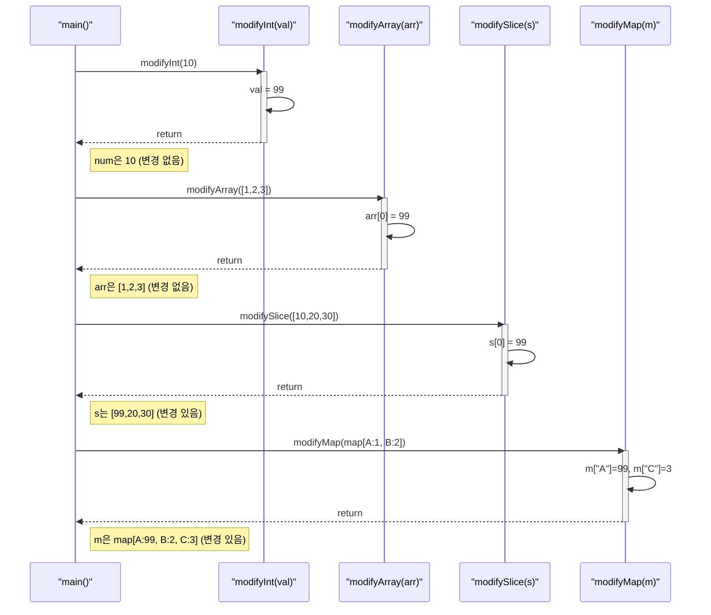
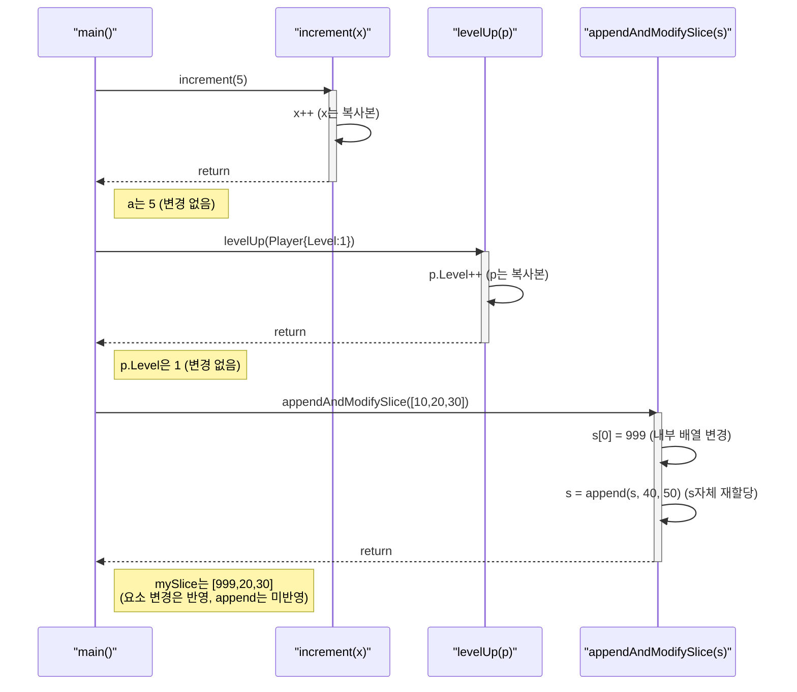
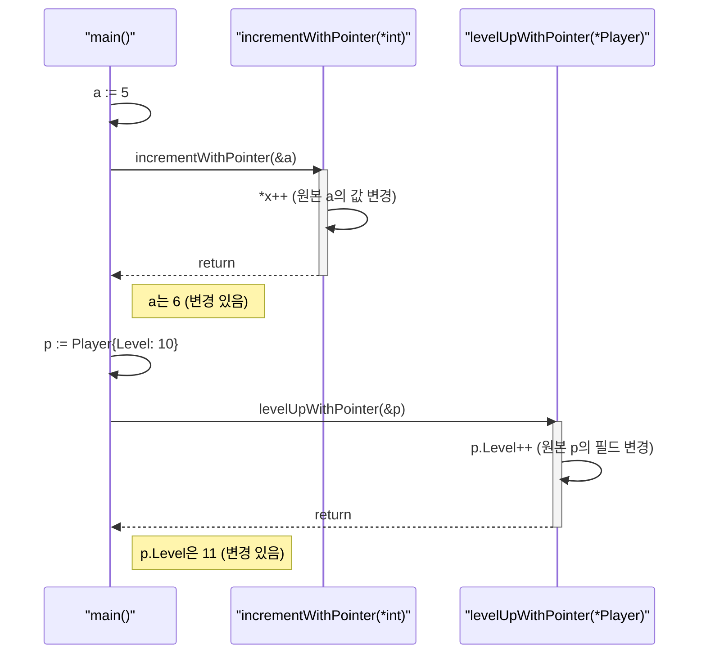
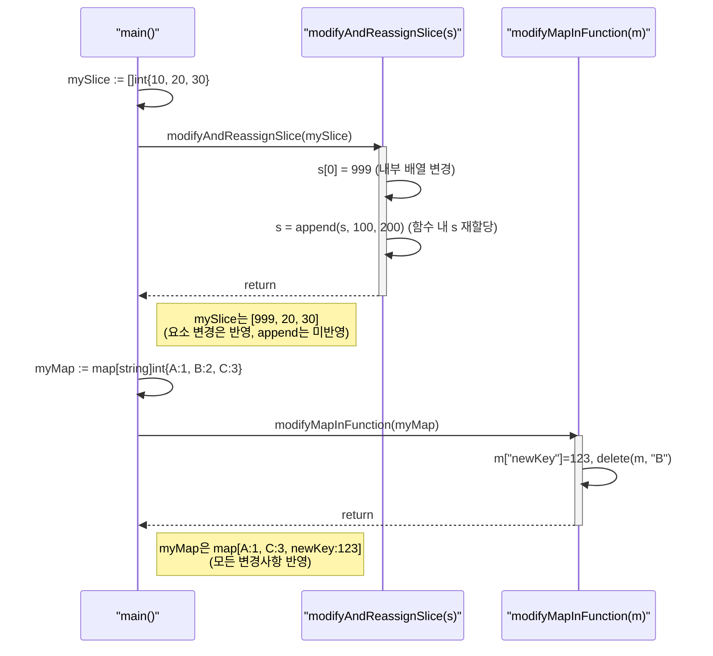
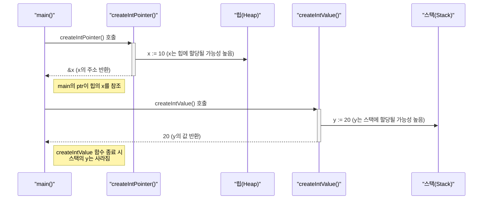
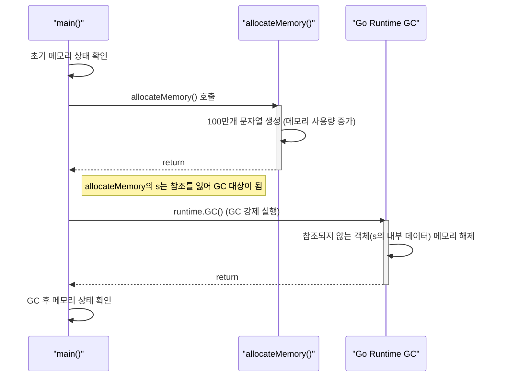

# Go 언어의 값/참조 전달, 메모리 개념: 효율적인 데이터 관리

## 데이터는 어떻게 전달되고 저장되는가?

프로그래밍에서 변수가 함수에 전달되거나 다른 변수에 할당될 때, 그 데이터가 어떻게 처리되는지 이해하는 것은 매우 중요하다.

특히 메모리 사용 효율성과 프로그램의 예측 가능성에 큰 영향을 미친다.

Java 개발자에게 익숙한 "값 전달(Pass by Value)"과 "참조 전달(Pass by Reference)" 개념은 Go 언어에서 다소 다르게 적용될 수 있다.

## 1. Go와 Java의 변수/객체 개념 비교

Java는 기본 타입(Primitive Types)과 참조 타입(Reference Types)을 명확히 구분한다.

기본 타입은 값을 직접 저장하고, 참조 타입은 객체의 메모리 주소를 저장한다.

Go는 모든 것이 "값"으로 전달된다는 철학을 가지고 있지만, 그 "값"이 무엇이냐에 따라 동작 방식이 달라진다.

### 1.1 Java의 데이터 타입 분류

*   **기본 타입 (Primitive Types)**: `int`, `double`, `boolean`, `char` 등. 변수에 실제 값이 저장된다. 함수에 전달될 때 값이 복사된다.
*   **참조 타입 (Reference Types)**: `Object`, `String`, 배열, 사용자 정의 클래스 등. 변수에 객체의 메모리 주소(참조)가 저장된다. 함수에 전달될 때 이 주소 값이 복사된다. 따라서 함수 내에서 객체의 내용을 변경하면 원본 객체도 변경된다.

### 1.2 Go의 데이터 타입 분류 및 전달 방식

Go는 모든 인자 전달이 **값 전달(Pass by Value)** 방식이다. 하지만 그 "값"이 무엇이냐에 따라 Java의 참조 전달처럼 동작하는 경우가 있다.

*   **값 타입 (Value Types)**: `int`, `float64`, `bool`, `string`, `array`, `struct` 등. 변수에 실제 값이 저장된다. 함수에 전달될 때 값이 통째로 복사된다. 따라서 함수 내에서 복사된 값을 변경해도 원본에는 영향을 주지 않는다.
*   **참조 타입처럼 동작하는 타입**: `slice`, `map`, `channel`, `function`. 이들은 내부적으로 포인터를 포함하는 구조체이다. 이 구조체 자체가 값으로 복사되어 전달되지만, 복사된 구조체가 가리키는 내부 데이터(배열, 해시 테이블 등)는 원본과 공유된다. 따라서 함수 내에서 이들의 요소를 변경하면 원본도 변경된다.
*   **포인터 (Pointers)**: Go에서 명시적으로 메모리 주소를 다루는 타입. 포인터 변수 자체는 값 타입이지만, 포인터가 가리키는 값을 변경하면 원본 변수의 값이 변경된다. 이는 Java에서 객체 참조를 통해 객체 내용을 변경하는 것과 유사한 효과를 낸다.

### 실습 1: 값 타입과 참조 타입처럼 동작하는 타입의 차이 이해하기

**실습 파일: `04-값참조,메모리/01-value-vs-reference/main.go`**

아래 코드는 Go에서 값 타입(int, 배열)과 참조 타입처럼 동작하는 타입(슬라이스, 맵)이 함수에 전달될 때 어떻게 다르게 동작하는지 보여준다.

`modifyInt`와 `modifyArray`는 값의 복사본을 받으므로 원본을 변경하지 못한다.

반면, `modifySlice`와 `modifyMap`은 내부 데이터 구조를 가리키는 헤더를 복사하므로 원본 데이터에 영향을 줄 수 있다.



```go
package main

import "fmt"

func main() {
    // 1.1 값 타입 (int)
    fmt.Println("---", "1.1 값 타입 (int)", "---")
    num := 10
    fmt.Println("원본 num:", num) // 10
    modifyInt(num)
    fmt.Println("modifyInt 호출 후 num:", num) // 10 (변화 없음)

    // 1.2 값 타입 (배열)
    fmt.Println("\n---", "1.2 값 타입 (배열)", "---")
    arr := [3]int{1, 2, 3}
    fmt.Println("원본 arr:", arr) // [1 2 3]
    modifyArray(arr)
    fmt.Println("modifyArray 호출 후 arr:", arr) // [1 2 3] (변화 없음)

    // 1.3 참조 타입처럼 동작하는 타입 (슬라이스)
    fmt.Println("\n---", "1.3 참조 타입처럼 동작하는 타입 (슬라이스)", "---")
    s := []int{10, 20, 30}
    fmt.Println("원본 s:", s) // [10 20 30]
    modifySlice(s)
    fmt.Println("modifySlice 호출 후 s:", s) // [99 20 30] (변화 있음)

    // 1.4 참조 타입처럼 동작하는 타입 (맵)
    fmt.Println("\n---", "1.4 참조 타입처럼 동작하는 타입 (맵)", "---")
    m := map[string]int{"A": 1, "B": 2}
    fmt.Println("원본 m:", m) // map[A:1 B:2]
    modifyMap(m)
    fmt.Println("modifyMap 호출 후 m:", m) // map[A:99 B:2 C:3] (변화 있음)
}

// int는 값 타입이므로 복사본이 전달된다.
func modifyInt(val int) {
    val = 99
    fmt.Println("  modifyInt 내부:", val) // 99
}

// 배열은 값 타입이므로 복사본이 전달된다.
func modifyArray(arr [3]int) {
    arr[0] = 99
    fmt.Println("  modifyArray 내부:", arr) // [99 2 3]
}

// 슬라이스는 내부 배열에 대한 포인터와 길이/용량을 포함하는 구조체이다.
// 이 구조체 자체가 값으로 복사되지만, 내부 배열은 원본과 공유된다.
func modifySlice(s []int) {
    s[0] = 99 // 내부 배열의 요소 변경
    fmt.Println("  modifySlice 내부:", s) // [99 20 30]
}

// 맵은 내부 해시 테이블에 대한 포인터를 포함하는 구조체이다.
// 이 구조체 자체가 값으로 복사되지만, 내부 해시 테이블은 원본과 공유된다.
func modifyMap(m map[string]int) {
    m["A"] = 99 // 내부 해시 테이블의 요소 변경
    m["C"] = 3  // 새 요소 추가
    fmt.Println("  modifyMap 내부:", m) // map[A:99 B:2 C:3]
}
```

---

## 2. 함수 인자 전달 방식: 값 전달 (Pass by Value)

Go 언어에서 함수에 인자를 전달하는 방식은 항상 **값 전달(Pass by Value)**이다.

이는 함수 호출 시 인자로 전달되는 변수의 "값"이 복사되어 함수 내부로 전달된다는 의미다.

Java의 기본 타입 전달 방식과 동일하다.

하지만 Java의 참조 타입처럼 동작하는 Go의 슬라이스, 맵 등은 이 "값"이 내부 데이터를 가리키는 주소이므로, 결과적으로 원본 데이터가 변경될 수 있다.

### 2.1 Go의 값 전달 원칙

*   **기본 타입 (int, bool, string 등)**: 변수에 저장된 실제 값이 복사된다.
*   **배열 (Array)**: 배열 전체가 복사된다. 배열의 크기가 크면 복사 비용이 발생할 수 있다.
*   **구조체 (Struct)**: 구조체 전체가 복사된다. 구조체 내부에 참조 타입처럼 동작하는 필드가 있다면, 그 필드의 "값"(즉, 내부 데이터의 주소)이 복사된다.
*   **슬라이스, 맵, 채널, 함수**: 이들은 내부적으로 포인터를 포함하는 헤더 구조체이다. 이 헤더 구조체 자체가 값으로 복사된다. 따라서 함수 내부에서 이 헤더를 재할당하면 원본에는 영향을 주지 않지만, 헤더가 가리키는 내부 데이터(예: 슬라이스의 내부 배열, 맵의 해시 테이블)를 변경하면 원본 데이터가 변경된다.

### 2.2 Java의 값 전달 vs. 참조 전달 (개념적 비교)

*   **Java의 기본 타입**: Go의 기본 타입과 동일하게 값 복사.
*   **Java의 객체**: 객체 자체는 복사되지 않고, 객체를 가리키는 "참조 값"(메모리 주소)이 복사된다. 따라서 함수 내에서 이 참조를 통해 객체의 내용을 변경하면 원본 객체도 변경된다. Go의 슬라이스/맵이 동작하는 방식과 유사하다.

### 실습 2: 값 전달의 실제 동작 확인하기

**실습 파일: `04-값참조,메모리/02-pass-by-value/main.go`**

이 예제는 값 전달의 동작을 명확히 보여준다.

`increment`와 `levelUp` 함수는 각각 int와 구조체의 복사본을 받아 수정하므로 원본 값은 그대로 유지된다.

`appendAndModifySlice`에서는 슬라이스 요소 변경(`s[0]=999`)은 원본에 영향을 주지만, `append`를 통해 슬라이스 헤더 자체를 변경하는 것은 함수 내의 복사본에만 적용되어 원본 `mySlice`의 길이와 용량은 변하지 않는다.



```go
package main

import "fmt"

// int는 값 타입이므로, 함수 내에서 변경해도 원본에 영향 없음
func increment(x int) {
    x++
    fmt.Println("  increment 함수 내부 x:", x)
}

// 배열은 값 타입이므로, 함수 내에서 변경해도 원본에 영향 없음
func changeArray(arr [3]int) {
    arr[0] = 100
    fmt.Println("  changeArray 함수 내부 arr:", arr)
}

// 구조체는 값 타입이므로, 함수 내에서 변경해도 원본에 영향 없음
type Player struct {
    Name  string
    Level int
}

func levelUp(p Player) {
    p.Level++
    fmt.Println("  levelUp 함수 내부 Player:", p)
}

// 슬라이스는 헤더가 값으로 전달되지만, 내부 배열은 공유된다.
// 따라서 슬라이스 요소를 변경하면 원본에 영향 있음.
func appendAndModifySlice(s []int) {
    s[0] = 999 // 원본 슬라이스 요소 변경
    s = append(s, 40, 50) // s 변수 자체를 재할당 (원본에는 영향 없음)
    fmt.Println("  appendAndModifySlice 함수 내부 s:", s)
}

func main() {
    // 2.1 기본 타입의 값 전달
    fmt.Println("---", "2.1 기본 타입의 값 전달", "---")
    a := 5
    fmt.Println("main 함수 시작 a:", a) // 5
    increment(a)
    fmt.Println("main 함수 종료 a:", a) // 5 (변화 없음)

    // 2.2 배열의 값 전달
    fmt.Println("\n---", "2.2 배열의 값 전달", "---")
    myArr := [3]int{1, 2, 3}
    fmt.Println("main 함수 시작 myArr:", myArr) // [1 2 3]
    changeArray(myArr)
    fmt.Println("main 함수 종료 myArr:", myArr) // [1 2 3] (변화 없음)

    // 2.3 구조체의 값 전달
    fmt.Println("\n---", "2.3 구조체의 값 전달", "---")
    p := Player{Name: "Hero", Level: 1}
    fmt.Println("main 함수 시작 Player:", p) // {Hero 1}
    levelUp(p)
    fmt.Println("main 함수 종료 Player:", p) // {Hero 1} (변화 없음)

    // 2.4 슬라이스의 값 전달 (내부 데이터 공유)
    fmt.Println("\n---", "2.4 슬라이스의 값 전달 (내부 데이터 공유)", "---")
    mySlice := []int{10, 20, 30}
    fmt.Println("main 함수 시작 mySlice:", mySlice) // [10 20 30]
    appendAndModifySlice(mySlice)
    fmt.Println("main 함수 종료 mySlice:", mySlice) // [999 20 30] (요소 변경은 반영, append는 반영 안됨)
}
```

---

## 3. 포인터 (Pointers): 참조 전달처럼 동작하게 하기

Go는 모든 것이 값 전달이지만, 특정 상황에서 원본 변수의 값을 함수 내에서 직접 변경해야 할 필요가 있다. 이때 **포인터(Pointer)**를 사용한다.

포인터는 변수의 메모리 주소를 저장하는 변수이며, 이를 통해 원본 값에 접근하고 수정할 수 있다.

Java에서는 객체 참조를 통해 간접적으로 메모리 주소를 다루지만, Go는 포인터를 명시적으로 제공한다.

### 3.1 포인터의 기본 개념

*   **`&` (주소 연산자)**: 변수 앞에 붙여 해당 변수의 메모리 주소를 얻는다.
    ```go
    var x int = 10      // 일반 데이터 타입의 변수
    var p *int = &x     // int타입 변수의 메모리 주소를 저장하기 위한 포인터 변수
    ```
*   **`*` (역참조 연산자)**: 포인터 변수 앞에 붙여 포인터가 가리키는 메모리 주소에 저장된 "값"을 얻거나 수정한다.
    ```go
    fmt.Println(*p) // p가 가리키는 값 (10) 출력
    *p = 20         // p가 가리키는 값 (x)을 20으로 변경
    ```

### 3.2 함수에서 포인터 활용

함수 인자로 포인터를 전달하면, 함수 내부에서 포인터가 가리키는 원본 변수의 값을 직접 수정할 수 있다.

이는 Java에서 객체 참조를 함수에 전달하여 객체의 필드를 변경하는 것과 유사한 효과를 낸다.

### 실습 3: 포인터를 사용하여 원본 값 변경하기

**실습 파일: `04-값참조,메모리/03-pointers/main.go`**

이 코드는 포인터를 사용하여 값 타입 변수의 원본을 직접 수정하는 방법을 보여준다.

`incrementWithPointer`와 `levelUpWithPointer` 함수는 각각 int와 Player 구조체의 메모리 주소(`&a`, `&p`)를 받는다.

함수 내에서 역참조 연산자(`*`)를 통해 해당 주소의 값을 직접 변경하므로, 함수 호출 후 원본 변수 `a`와 `p`의 값이 변경된다.



```go
package main

import "fmt"

// int 포인터를 인자로 받아 원본 int 값을 변경하는 함수
func incrementWithPointer(x *int) {
    *x++ // x가 가리키는 값(원본 변수)을 1 증가
    fmt.Println("  incrementWithPointer 함수 내부 *x:", *x)
}

// Player 구조체 포인터를 인자로 받아 원본 구조체 필드를 변경하는 함수
func levelUpWithPointer(p *Player) {
    p.Level++ // (*p).Level++ 와 동일 (Go가 자동으로 역참조)
    fmt.Println("  levelUpWithPointer 함수 내부 Player:", *p)
}

type Player struct {
    Name  string
    Level int
}

func main() {
    // 3.1 기본 타입에 포인터 사용
    fmt.Println("---", "3.1 기본 타입에 포인터 사용", "---")
    a := 5
    fmt.Println("main 함수 시작 a:", a) // 5
    incrementWithPointer(&a) // a의 주소를 전달
    fmt.Println("main 함수 종료 a:", a) // 6 (변화 있음)

    // 3.2 구조체에 포인터 사용
    fmt.Println("\n---", "3.2 구조체에 포인터 사용", "---")
    p := Player{Name: "Warrior", Level: 10}
    fmt.Println("main 함수 시작 Player:", p) // {Warrior 10}
    levelUpWithPointer(&p) // p의 주소를 전달
    fmt.Println("main 함수 종료 Player:", p) // {Warrior 11} (변화 있음)

    // 3.3 new 함수를 이용한 포인터 생성
    // new(T)는 T 타입의 제로 값으로 초기화된 변수를 할당하고 그 주소를 반환한다.
    newInt := new(int) // int 타입의 포인터 (*int) 반환, *newInt는 0으로 초기화
    fmt.Println("\n---", "3.3 new 함수를 이용한 포인터 생성", "---")
    fmt.Println("newInt 포인터 값:", newInt)   // 메모리 주소
    fmt.Println("newInt가 가리키는 값:", *newInt) // 0
    *newInt = 123
    fmt.Println("newInt가 가리키는 값 변경 후:", *newInt) // 123

    newPlayer := new(Player) // Player 타입의 포인터 (*Player) 반환, 필드는 제로 값으로 초기화
    fmt.Println("newPlayer 포인터 값:", newPlayer)
    fmt.Println("newPlayer가 가리키는 값:", *newPlayer) // { 0}
    newPlayer.Name = "Mage"
    newPlayer.Level = 5
    fmt.Println("newPlayer가 가리키는 값 변경 후:", *newPlayer) // {Mage 5}
}
```

---

## 4. 슬라이스, 맵, 채널의 동작 방식 (내부적으로 포인터 활용)

Go의 슬라이스, 맵, 채널은 "참조 타입"으로 동작한다고 설명했지만, 엄밀히 말하면 이들 자체는 내부적으로 포인터를 포함하는 **헤더 구조체**이다. 함수에 이들을 인자로 전달할 때, 이 헤더 구조체 자체가 값으로 복사된다.

하지만 이 헤더가 가리키는 내부 데이터(예: 슬라이스의 내부 배열, 맵의 해시 테이블)는 원본과 공유된다.

### 4.1 슬라이스 헤더 구조

슬라이스는 다음과 같은 3가지 요소를 포함하는 구조체이다:
*   **내부 배열에 대한 포인터**: 실제 데이터가 저장된 배열의 시작 주소.
*   **길이 (Length)**: 슬라이스가 현재 포함하고 있는 요소의 개수.
*   **용량 (Capacity)**: 슬라이스가 참조하는 내부 배열의 시작부터 끝까지의 최대 길이.

함수에 슬라이스를 전달하면 이 3가지 요소가 복사된다.

따라서 함수 내부에서 슬라이스의 요소를 변경하면 원본 슬라이스의 내부 배열이 변경되므로 원본에 영향을 준다.

하지만 함수 내부에서 `append` 등으로 슬라이스의 길이나 용량이 변경되어 새로운 내부 배열이 할당되면, 이는 복사된 헤더에만 적용되고 원본 슬라이스 변수에는 영향을 주지 않는다.

### 4.2 맵 헤더 구조

맵도 내부적으로 해시 테이블에 대한 포인터를 포함하는 구조체이다.

함수에 맵을 전달하면 이 헤더 구조체가 복사되지만, 헤더가 가리키는 해시 테이블은 원본과 공유된다.

따라서 함수 내부에서 맵의 요소를 추가, 삭제, 수정하면 원본 맵에 영향을 준다.

### 실습 4: 슬라이스, 맵의 동작 방식 심층 이해하기

**실습 파일: `04-값참조,메모리/04-slice-map-behavior/main.go`**

이 예제는 슬라이스와 맵의 내부 동작을 더 깊이 보여준다.

`modifyAndReassignSlice` 함수에서 슬라이스 요소 변경은 원본에 영향을 주지만, `append`는 함수 내의 복사된 슬라이스 헤더 `s`를 변경할 뿐 원본 `mySlice`에는 영향을 주지 못한다.

반면, `modifyMapInFunction`에서 맵에 가해진 모든 변경(추가, 삭제)은 내부 해시 테이블을 공유하므로 원본 `myMap`에 그대로 반영된다.



```go
package main

import "fmt"

// 슬라이스 헤더는 값으로 전달되지만, 내부 배열은 공유된다.
func modifyAndReassignSlice(s []int) {
    fmt.Println("  modifyAndReassignSlice 내부 - 초기 s:", s, "길이:", len(s), "용량:", cap(s))
    s[0] = 999 // 내부 배열의 요소 변경 (원본에 영향)
    fmt.Println("  modifyAndReassignSlice 내부 - 요소 변경 후 s:", s)

    // s 변수 자체를 재할당 (새로운 슬라이스 헤더 생성)
    // 이 변경은 함수 내부의 s 복사본에만 적용되고, 호출자의 원본 s에는 영향을 주지 않는다.
    s = append(s, 100, 200)
    fmt.Println("  modifyAndReassignSlice 내부 - append 후 s:", s, "길이:", len(s), "용량:", cap(s))
}

// 맵 헤더는 값으로 전달되지만, 내부 해시 테이블은 공유된다.
func modifyMapInFunction(m map[string]int) {
    fmt.Println("  modifyMapInFunction 내부 - 초기 m:", m)
    m["newKey"] = 123 // 새 키-값 추가 (원본에 영향)
    delete(m, "B")    // 키 삭제 (원본에 영향)
    fmt.Println("  modifyMapInFunction 내부 - 변경 후 m:", m)
}

func main() {
    // 4.1 슬라이스 동작 방식
    fmt.Println("---", "4.1 슬라이스 동작 방식", "---")
    mySlice := []int{10, 20, 30}
    fmt.Println("main 함수 시작 mySlice:", mySlice, "길이:", len(mySlice), "용량:", cap(mySlice))
    modifyAndReassignSlice(mySlice)
    fmt.Println("main 함수 종료 mySlice:", mySlice, "길이:", len(mySlice), "용량:", cap(mySlice)) // 요소 변경은 반영, append는 반영 안됨

    // 4.2 맵 동작 방식
    fmt.Println("\n---", "4.2 맵 동작 방식", "---")
    myMap := map[string]int{"A": 1, "B": 2, "C": 3}
    fmt.Println("main 함수 시작 myMap:", myMap)
    modifyMapInFunction(myMap)
    fmt.Println("main 함수 종료 myMap:", myMap) // 변경 사항 모두 반영
}
```

---

## 5. 메모리 관리: 스택 vs. 힙 (간략히)

Go는 개발자가 메모리를 직접 할당하고 해제할 필요가 없도록 가비지 컬렉터(GC)를 제공한다.

변수가 스택에 할당될지 힙에 할당될지는 컴파일러의 **이스케이프 분석(Escape Analysis)**에 의해 결정된다.

### 5.1 스택 (Stack)

*   함수 호출 시 생성되는 지역 변수, 함수 인자 등이 저장되는 영역.
*   컴파일 시점에 크기가 결정되는 고정된 크기의 데이터에 주로 사용된다.
*   함수 호출이 끝나면 자동으로 메모리가 해제된다.
*   Java의 스택과 유사하게, 기본 타입 변수나 객체 참조 변수(객체 자체는 힙에)가 스택에 할당된다.

### 5.2 힙 (Heap)

*   런타임에 동적으로 할당되는 데이터가 저장되는 영역.
*   크기가 가변적이거나 함수 호출이 끝난 후에도 유지되어야 하는 데이터(예: `new`로 할당된 객체, 슬라이스의 내부 배열, 맵의 해시 테이블)에 주로 사용된다.
*   가비지 컬렉터에 의해 더 이상 참조되지 않을 때 메모리가 해제된다.
*   Java의 힙과 유사하게, 모든 객체는 힙에 할당된다.

### 5.3 이스케이프 분석 (Escape Analysis)

Go 컴파일러는 변수가 함수 범위를 벗어나(escape) 다른 곳에서 참조될 가능성이 있는지 분석한다.
*   **스택 할당**: 변수가 함수 내부에서만 사용되고 함수 종료 후 더 이상 필요 없는 경우.
*   **힙 할당**: 변수가 함수 외부로 "이스케이프"하여 함수 종료 후에도 참조될 수 있는 경우 (예: 함수의 반환 값으로 포인터가 전달되거나, 전역 변수에 할당되는 경우).

이 분석은 개발자가 명시적으로 스택/힙을 지정할 필요 없이 컴파일러가 최적의 메모리 할당을 결정하도록 돕는다.

**실무 팁:**

- 큰 구조체나 배열을 함수에 전달할 때는 값 복사 비용이 크므로, 포인터로 전달하는 것이 메모리 효율에 유리합니다.
- Go에서는 포인터를 남용하면 코드의 가독성이 떨어질 수 있으니, 꼭 필요한 경우에만 사용하세요.
- 구조체 내에 슬라이스, 맵 등 참조 타입 필드가 있다면, 구조체를 값으로 전달해도 내부 데이터는 공유될 수 있으니 주의하세요.

### 실습 5: 메모리 할당 개념 이해하기 (간접적 확인)

Go에서 스택/힙 할당을 직접 제어하거나 관찰하기는 어렵지만, 이스케이프 분석의 개념을 이해하기 위한 간접적인 예시를 살펴본다.

**실습 파일: `04-값참조,메모리/05-memory-allocation/main.go`**

이 코드는 Go 컴파일러의 이스케이프 분석을 간접적으로 보여준다.

`createIntPointer` 함수는 포인터를 반환하므로, 내부 변수 `x`는 함수가 종료된 후에도 `main`에서 참조해야 한다. 따라서 `x`는 힙에 할당될 가능성이 높다.

반면, `createIntValue`의 변수 `y`는 함수 내에서만 사용되므로 스택에 할당되었다가 함수 종료와 함께 사라질 가능성이 높다.



```go
package main

import "fmt"

// 이 함수는 int 포인터를 반환하므로, x는 힙에 할당될 가능성이 높다 (이스케이프).
func createIntPointer() *int {
    x := 10 // x는 함수 내부에서 선언되었지만, 주소가 반환되므로 힙으로 이스케이프될 수 있다.
    fmt.Println("  createIntPointer 내부 - x의 주소:", &x)
    return &x
}

// 이 함수는 int 값을 반환하므로, y는 스택에 할당될 가능성이 높다.
func createIntValue() int {
    y := 20 // y는 함수 종료 후 더 이상 참조되지 않으므로 스택에 할당될 가능성이 높다.
    fmt.Println("  createIntValue 내부 - y의 주소 (개념적):", &y) // 실제 주소는 스택 프레임 내
    return y
}

// 큰 구조체를 값으로 반환하는 경우 (복사 비용 발생)
type LargeStruct struct {
    Data [1024]byte // 1KB 크기의 배열
}

func createLargeStructByValue() LargeStruct {
    var s LargeStruct
    // s에 데이터 채우기
    return s // s 전체가 복사되어 반환된다.
}

// 큰 구조체를 포인터로 반환하는 경우 (복사 비용 감소, 힙 할당 가능성 높음)
func createLargeStructByPointer() *LargeStruct {
    s := new(LargeStruct) // 힙에 할당될 가능성 높음
    // s에 데이터 채우기
    return s // 포인터 값만 복사되어 반환된다.
}

func main() {
    // 5.1 이스케이프 분석 예시
    fmt.Println("---", "5.1 이스케이프 분석 예시", "---")
    ptr := createIntPointer()
    fmt.Println("main 함수 - ptr이 가리키는 값:", *ptr) // 10
    *ptr = 15
    fmt.Println("main 함수 - ptr이 가리키는 값 변경 후:", *ptr) // 15

    val := createIntValue()
    fmt.Println("main 함수 - val:", val) // 20

    // 5.2 큰 데이터 구조 전달 방식에 따른 메모리 효율성 (개념적)
    fmt.Println("\n---", "5.2 큰 데이터 구조 전달 방식에 따른 메모리 효율성", "---")
    // 값으로 전달: LargeStruct 전체가 복사된다. (비용 높음)
    largeVal := createLargeStructByValue()
    fmt.Printf("LargeStruct (값): %p\n", &largeVal)

    // 포인터로 전달: 포인터 값만 복사된다. (비용 낮음)
    largePtr := createLargeStructByPointer()
    fmt.Printf("LargeStruct (포인터): %p\n", largePtr)
}
```

---

## 6. 가비지 컬렉션 (Garbage Collection)

Go는 Java와 마찬가지로 **가비지 컬렉션(GC)**을 통해 자동 메모리 관리를 수행한다.

개발자가 명시적으로 메모리를 할당 해제할 필요가 없어 메모리 누수(Memory Leak)를 방지하고 개발 생산성을 높인다.

### 6.1 Go의 GC 특징

*   **동시성 GC**: Go의 GC는 대부분의 작업을 애플리케이션과 동시에 수행하여 프로그램 실행을 멈추는 시간(Stop-the-World, STW)을 최소화한다. 이는 Java의 최신 GC(G1, ZGC 등)와 유사한 목표를 가진다.
*   **마크-스윕(Mark-Sweep) 방식**: Go의 GC는 기본적으로 마크-스윕 알고리즘을 사용한다.
    *   **Mark (표시)**: GC 루트(실행 중인 고루틴의 스택, 전역 변수 등)에서부터 도달 가능한 모든 객체를 표시한다.
    *   **Sweep (청소)**: 표시되지 않은(도달 불가능한) 객체들을 메모리에서 해제한다.
*   **튜닝 불필요**: 대부분의 경우 Go의 GC는 별도의 튜닝 없이도 잘 동작하도록 설계되었다.

### 6.2 Java의 GC와 비교

Java는 다양한 GC 알고리즘(Serial, Parallel, CMS, G1, ZGC, Shenandoah 등)을 제공하며, JVM 옵션을 통해 세밀한 튜닝이 가능하다. Go의 GC는 Java의 GC에 비해 튜닝 옵션이 적고, 대부분의 경우 Go 런타임이 최적의 결정을 내리도록 설계되었다. 두 언어 모두 개발자가 메모리 해제에 신경 쓸 필요가 없다는 공통점을 가진다.

### 실습 6: 가비지 컬렉션 개념 이해하기 (간접적 확인)

Go의 GC는 자동으로 동작하므로, 코드에서 직접 GC를 "실습"하기는 어렵다. 하지만 많은 객체를 생성하여 GC가 동작하는 상황을 간접적으로 유도해 볼 수 있다.

**실무 팁 및 오해 방지:**

- Go의 GC는 대부분 자동으로 동작하며, 명시적으로 `runtime.GC()`를 호출하는 것은 테스트나 벤치마크 목적 외에는 거의 사용하지 않는다. (명시적 GC 호출은 금지!!!)
- 실제 서비스 코드에서는 GC를 직접 제어하지 않고, 메모리 사용량이 많아질 때 자동으로 동작하도록 두는 것이 안전하다.
- Java와 달리 Go는 GC 튜닝 옵션이 적으므로, 메모리 사용 패턴을 코드로 최적화하는 것이 더 중요하다.

**실행 결과 예시**

```
---
6.1 GC 동작 확인 (간접적)
---
초기 메모리 사용량 (HeapAlloc): 10 MB
    메모리 할당 완료. (GC 대상)
    GC 강제 호출 완료.
GC 후 메모리 사용량 (HeapAlloc): 5 MB

---
6.2 GC의 자동 동작
---
Go의 GC는 대부분 자동으로 백그라운드에서 동작하며, 개발자가 명시적으로 호출할 필요는 없다.
메모리 사용량이 일정 수준을 넘거나, 특정 조건이 되면 자동으로 실행된다.
```

**실습 파일: `04-값참조,메모리/06-gc-concept/main.go`**

이 코드는 가비지 컬렉션의 동작을 간접적으로 보여줍니다. `allocateMemory` 함수가 실행되면 대량의 문자열이 메모리에 할당된다.

함수가 종료된 후, 이 문자열들을 담고 있던 슬라이스 `s`는 더 이상 참조되지 않으므로 가비지 컬렉터(GC)의 수거 대상이 된다.

`runtime.GC()`를 호출하여 GC를 강제로 실행하면, 수거 대상이 된 메모리가 해제되어 `HeapAlloc` (힙에 할당된 총 메모리)이 줄어드는 것을 확인할 수 있다.



```go
package main

import (
    "fmt"
    "runtime"
    "time"
)

// 대량의 문자열 슬라이스를 생성하여 메모리 사용량을 늘리는 함수
func allocateMemory() {
    var s []string
    for i := 0; i < 1000000; i++ { // 100만 개의 문자열 생성
        s = append(s, fmt.Sprintf("Hello, Go GC! %d", i))
    }
    // 함수 종료 후 s는 더 이상 참조되지 않으므로 GC 대상이 된다.
    fmt.Println("  메모리 할당 완료. (GC 대상)")
}

func main() {
    fmt.Println("---", "6.1 GC 동작 확인 (간접적)", "---")

    // 초기 메모리 상태 확인
    var m runtime.MemStats
    runtime.ReadMemStats(&m)
    fmt.Printf("초기 메모리 사용량 (HeapAlloc): %v MB\n", m.HeapAlloc / 1024 / 1024)

    // 대량의 메모리 할당 함수 호출
    allocateMemory()

    // GC가 동작할 시간을 주기 위해 잠시 대기
    time.Sleep(2 * time.Second)

    // GC 호출 (명시적 호출은 권장되지 않지만, 테스트 목적으로 사용)
    runtime.GC()
    fmt.Println("  GC 강제 호출 완료.")

    // GC 후 메모리 상태 확인
    runtime.ReadMemStats(&m)
    fmt.Printf("GC 후 메모리 사용량 (HeapAlloc): %v MB\n", m.HeapAlloc / 1024 / 1024)

    fmt.Println("\n---", "6.2 GC의 자동 동작", "---")
    fmt.Println("Go의 GC는 대부분 자동으로 백그라운드에서 동작하며, 개발자가 명시적으로 호출할 필요는 없다.")
    fmt.Println("메모리 사용량이 일정 수준을 넘거나, 특정 조건이 되면 자동으로 실행된다.")
}
```