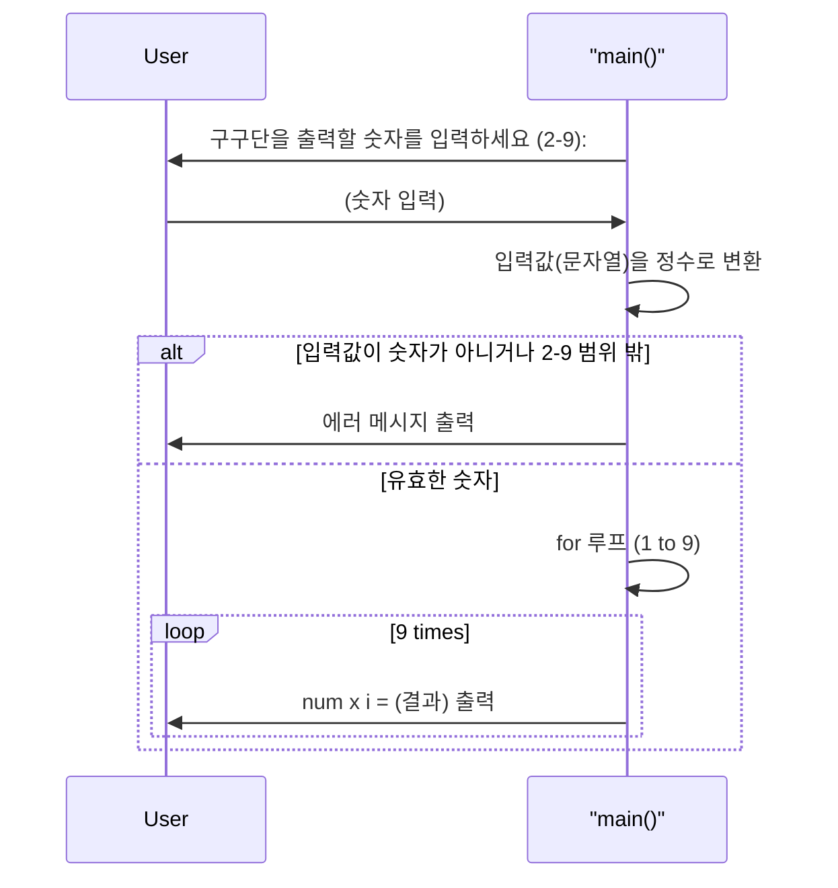
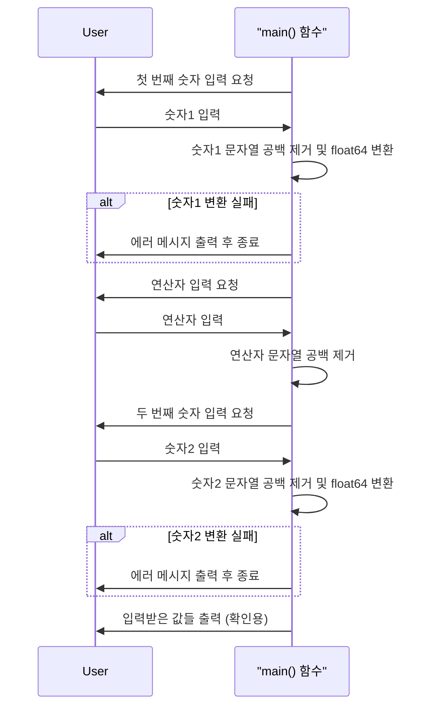
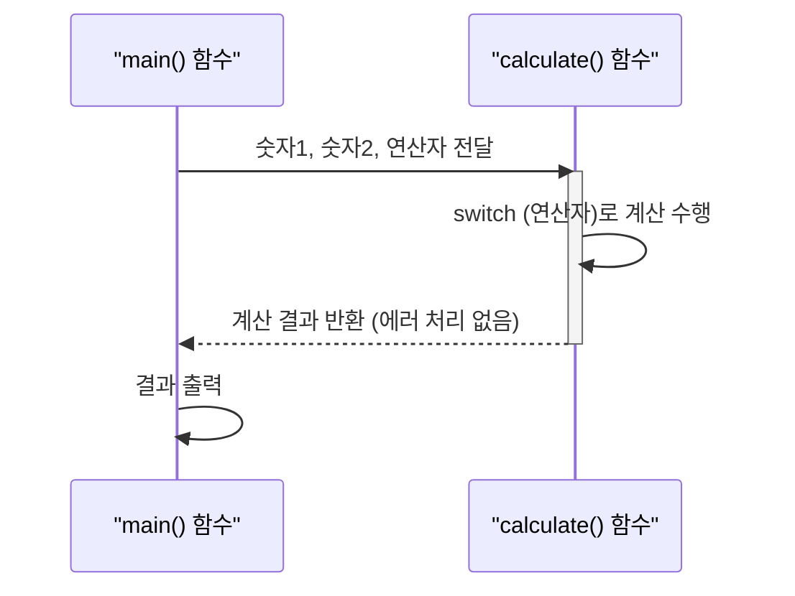
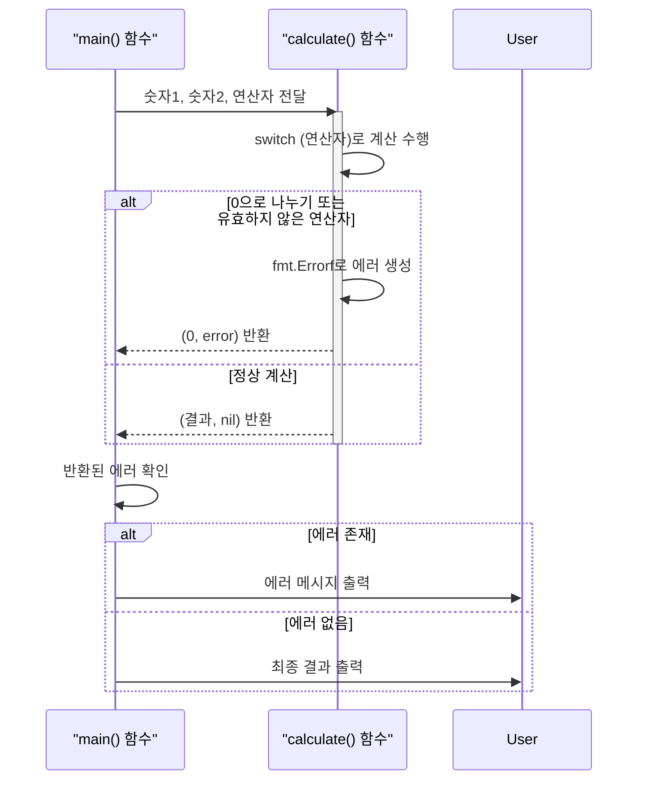
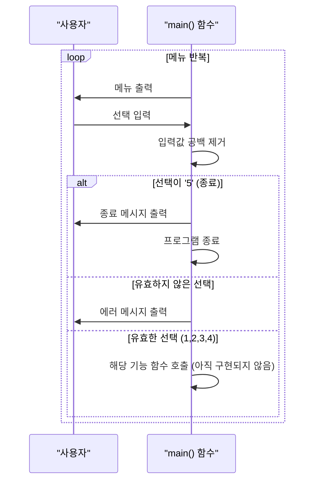
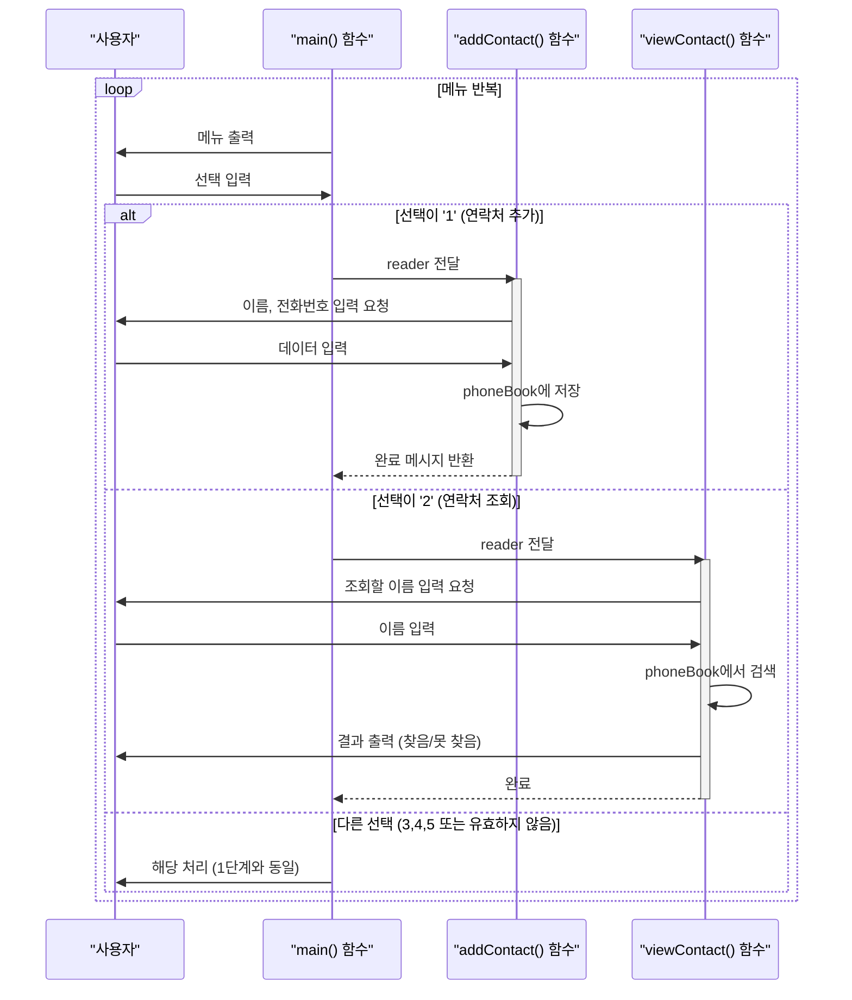
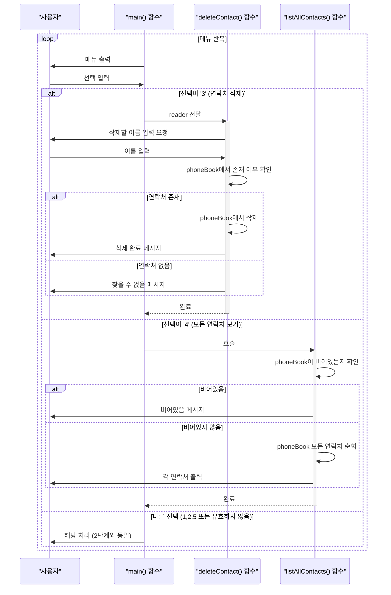
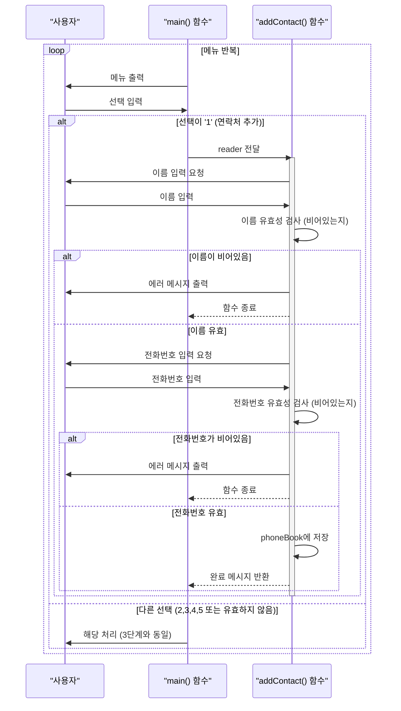

# Go 언어로 만드는 유틸리티: 구구단, 계산기, 전화번호부

이전 포스팅에서 Go 언어의 기본 문법과 컬렉션 자료형, 그리고 값/참조 전달 및 메모리 개념을 학습했음. 이제 이러한 지식을 바탕으로 실제 생활에서 유용하게 활용될 수 있는 간단한 유틸리티 프로그램을 직접 만들어 볼 것임. 구구단 출력기, 간단한 계산기, 그리고 전화번호부 관리 프로그램을 구현하면서 Go 언어의 실용적인 활용법을 익히는 것이 목표임.

---

## 1. 구구단 출력기 (Multiplication Table Generator)

구구단 출력기는 반복문과 기본적인 입출력 기능을 학습하기에 좋은 예제임. 사용자로부터 숫자를 입력받아 해당 숫자의 구구단을 출력하는 프로그램을 만들어 볼 것임.

### 사용될 주요 API

-   `fmt.Print`, `fmt.Println`, `fmt.Printf`: 표준 출력(콘솔)에 텍스트를 출력함. `Printf`는 포맷팅된 문자열을 출력할 때 사용함.
-   `bufio.NewReader(os.Stdin)`: 표준 입력(키보드)으로부터 데이터를 효율적으로 읽기 위한 `Reader` 객체를 생성함.
-   `reader.ReadString('\n')`: `Reader`로부터 줄바꿈 문자(`\n`)가 나올 때까지 한 줄을 읽어 문자열로 반환함.
-   `strings.TrimSpace(s string)`: 문자열의 앞뒤 공백(스페이스, 탭, 줄바꿈 등)을 제거한 새 문자열을 반환함.
-   `strconv.Atoi(s string)`: 문자열을 정수(int)로 변환함. 변환에 성공하면 정수 값과 `nil` 에러를, 실패하면 0과 에러 객체를 반환함.

### 실행 흐름 다이어그램



### 예제 소스

```go
package main

import (
	"bufio"   // 버퍼를 사용하여 입출력을 효율적으로 처리하는 기능 제공함
	"fmt"     // 표준 입출력 및 문자열 포맷팅 관련 기능 제공함
	"os"      // 운영체제와 상호작용하는 기능 제공함 (표준 입력/출력 등)
	"strconv" // 문자열을 숫자 타입으로, 또는 그 반대로 변환하는 기능 제공함
	"strings" // 문자열 처리 관련 다양한 함수 제공함
)

func main() {
	// 사용자에게 구구단 숫자를 입력받도록 안내함
	fmt.Print("구구단을 출력할 숫자를 입력하세요 (2-9): ")

	// 표준 입력(키보드)으로부터 데이터를 읽기 위한 Reader 객체를 생성함
	reader := bufio.NewReader(os.Stdin)
	// Reader로부터 줄바꿈 문자(\n)가 나올 때까지 한 줄을 읽어옴
	input, _ := reader.ReadString('\n')
	// 읽어온 문자열의 앞뒤 공백(줄바꿈 포함)을 제거함
	input = strings.TrimSpace(input)

	// 입력받은 문자열을 정수(int)로 변환함
	// strconv.Atoi는 문자열을 정수로 변환하며, 변환 실패 시 에러를 함께 반환함
	num, err := strconv.Atoi(input)
	// 에러가 발생했는지 확인함 (즉, 입력이 유효한 숫자가 아닌 경우)
	if err != nil {
		fmt.Println("잘못된 입력임. 숫자를 입력해야 함.")
		return // 에러 메시지 출력 후 프로그램 종료
	}

	// 입력된 숫자가 2에서 9 사이의 유효한 범위에 있는지 확인함
	if num < 2 || num > 9 {
		fmt.Println("2에서 9 사이의 숫자를 입력해야 함.")
		return // 유효하지 않은 범위일 경우 메시지 출력 후 종료
	}

	// 구구단 시작을 알리는 메시지를 출력함
	fmt.Printf("--- %d단 ---\n", num)
	// 1부터 9까지 반복하며 구구단 결과를 출력함
	for i := 1; i <= 9; i++ {
		fmt.Printf("%d x %d = %d\n", num, i, num*i)
	}
}
```

### 코드 해설

이 코드는 사용자로부터 숫자를 입력받아 해당 숫자의 구구단을 출력하는 프로그램임.

1.  **패키지 임포트**: `bufio`는 효율적인 입력 처리, `fmt`는 출력, `os`는 표준 입력 접근, `strconv`는 문자열-숫자 변환, `strings`는 문자열 공백 제거에 사용됨.
2.  **사용자 입력 처리**: `bufio.NewReader(os.Stdin)`를 통해 표준 입력 리더를 생성하고, `reader.ReadString('\n')`으로 사용자 입력을 한 줄 읽어옴. `strings.TrimSpace`를 사용하여 입력된 문자열의 불필요한 공백(특히 줄바꿈 문자)을 제거함.
3.  **문자열을 정수로 변환 및 유효성 검사**: `strconv.Atoi(input)` 함수를 사용하여 문자열 형태의 사용자 입력을 정수로 변환함. 이 함수는 변환 성공 여부와 함께 에러를 반환하므로, `if err != nil`을 통해 입력이 유효한 숫자인지 확인함. 또한, `num < 2 || num > 9` 조건을 통해 입력된 숫자가 구구단 범위(2~9) 내에 있는지 검사함. 유효하지 않은 입력이거나 범위를 벗어나면 적절한 메시지를 출력하고 프로그램을 종료함.
4.  **구구단 출력**: 유효한 숫자가 입력되면 `for` 루프를 사용하여 1부터 9까지 반복하며 구구단 결과를 `fmt.Printf`로 출력함. `fmt.Printf`는 C언어의 `printf`와 유사하게 포맷 지정자를 사용하여 다양한 형식으로 값을 출력할 수 있게 함.

### 실행 결과 예시

```
구구단을 출력할 숫자를 입력하세요 (2-9): 3
--- 3단 ---
3 x 1 = 3
3 x 2 = 6
3 x 3 = 9
3 x 4 = 12
3 x 5 = 15
3 x 6 = 18
3 x 7 = 21
3 x 8 = 24
3 x 9 = 27
```

---

## 2. 간단한 계산기 (Simple Calculator)

사용자로부터 두 개의 숫자와 하나의 연산자(+, -, *, /)를 입력받아 계산 결과를 출력하는 간단한 계산기를 만들어 볼 것임. 조건문(`if-else` 또는 `switch`)과 함수 활용법을 익힐 수 있음.

이 계산기 프로그램은 다음 3단계로 나누어 구현 과정을 설명할 것임:

1.  **1단계: 사용자 입력 받기 및 숫자 변환**
2.  **2단계: 계산 로직 함수 구현**
3.  **3단계: 에러 처리 추가 및 최종 출력**

---

### 2.1. 1단계: 사용자 입력 받기 및 숫자 변환

이 단계에서는 사용자로부터 두 개의 숫자와 연산자를 입력받고, 입력된 문자열을 숫자로 변환하는 기본적인 과정을 다룸. 숫자 변환 시 발생할 수 있는 간단한 에러 처리도 포함함.

#### 사용될 주요 API

-   `fmt.Print`, `fmt.Println`: 표준 출력(콘솔)에 텍스트를 출력함.
-   `bufio.NewReader(os.Stdin)`: 표준 입력(키보드)으로부터 데이터를 효율적으로 읽기 위한 `Reader` 객체를 생성함.
-   `reader.ReadString('\n')`: `Reader`로부터 줄바꿈 문자(`\n`)가 나올 때까지 한 줄을 읽어 문자열로 반환함.
-   `strings.TrimSpace(s string)`: 문자열의 앞뒤 공백(스페이스, 탭, 줄바꿈 등)을 제거한 새 문자열을 반환함.
-   `strconv.ParseFloat(s string, bitSize int)`: 문자열을 부동 소수점 숫자(float64)로 변환함. `bitSize`는 비트 크기(32 또는 64)를 지정함.

#### 실행 흐름 다이어그램



#### 예제 소스 (1단계)

```go
package main

import (
	"bufio"   // 버퍼를 사용하여 입출력을 효율적으로 처리하는 기능 제공함
	"fmt"     // 표준 입출력 및 문자열 포맷팅 관련 기능 제공함
	"os"      // 운영체제와 상호작용하는 기능 제공함 (표준 입력/출력 등)
	"strconv" // 문자열을 숫자 타입으로, 또는 그 반대로 변환하는 기능 제공함
	"strings" // 문자열 처리 관련 다양한 함수 제공함
)

func main() {
	reader := bufio.NewReader(os.Stdin)

	// 1. 첫 번째 숫자 입력 처리
	fmt.Print("첫 번째 숫자를 입력하세요: ")
	input1, _ := reader.ReadString('\n')
	// 문자열을 float64 타입으로 변환함. 64는 비트 크기를 의미함.
	num1, err := strconv.ParseFloat(strings.TrimSpace(input1), 64)
	if err != nil {
		fmt.Println("잘못된 입력임. 숫자를 입력해야 함.")
		return
	}

	// 2. 연산자 입력 처리
	fmt.Print("연산자를 입력하세요 (+, -, *, /): ")
	operator, _ := reader.ReadString('\n')
	operator = strings.TrimSpace(operator)

	// 3. 두 번째 숫자 입력 처리
	fmt.Print("두 번째 숫자를 입력하세요: ")
	input2, _ := reader.ReadString('\n')
	num2, err := strconv.ParseFloat(strings.TrimSpace(input2), 64)
	if err != nil {
		fmt.Println("잘못된 입력임. 숫자를 입력해야 함.")
		return
	}

	// 입력받은 값들을 확인용으로 출력함
	fmt.Printf("입력된 값: 숫자1=%.2f, 연산자='%s', 숫자2=%.2f\n", num1, operator, num2)
}
```

#### 코드 해설

이 1단계 코드는 계산기 프로그램의 사용자 입력 처리 부분을 담당함.

1.  **패키지 임포트**: `bufio`, `fmt`, `os`, `strconv`, `strings` 패키지를 사용하여 사용자 입력, 출력, 문자열-숫자 변환 등의 기능을 활용함.
2.  **사용자 입력 받기**: `bufio.NewReader(os.Stdin)`를 통해 표준 입력 리더를 생성하고, `reader.ReadString('\n')`으로 사용자 입력을 한 줄씩 읽어옴. `strings.TrimSpace`를 사용하여 입력된 문자열의 앞뒤 공백(줄바꿈 문자 포함)을 제거함.
3.  **숫자 변환 및 에러 처리**: `strconv.ParseFloat` 함수를 사용하여 입력받은 문자열을 `float64` 타입의 숫자로 변환함. 이 함수는 변환 성공 여부와 함께 에러를 반환하므로, `if err != nil`을 통해 입력이 유효한 숫자인지 확인함. 유효하지 않은 입력일 경우 에러 메시지를 출력하고 프로그램을 종료함. 연산자는 문자열 그대로 사용함.
4.  **입력 확인**: 마지막으로 입력받아 변환된 숫자와 연산자를 출력하여, 다음 단계로 넘어가기 전에 입력이 올바르게 처리되었는지 확인함.

#### 실행 결과 예시

```
첫 번째 숫자를 입력하세요: 10.5
연산자를 입력하세요 (+, -, *, /): *
두 번째 숫자를 입력하세요: 2
입력된 값: 숫자1=10.50, 연산자='*', 숫자2=2.00
```

---

### 2.2. 2단계: 계산 로직 함수 구현

이 단계에서는 실제 사칙연산을 수행하는 `calculate` 함수를 구현함. `main` 함수에서 입력받은 값들을 이 `calculate` 함수로 전달하여 계산을 수행하고 결과를 받아 출력함. 이 단계에서는 아직 에러 처리를 포함하지 않고 순수 계산 로직에 집중함.

#### 사용될 주요 API

-   `func functionName(params) returnType`: Go에서 함수를 정의하는 기본 문법임.
-   `switch` 문: 여러 조건 중 하나를 선택하여 코드를 실행하는 제어문임. Go의 `switch`는 `break` 없이도 해당 `case`만 실행하고 자동으로 종료됨.

#### 실행 흐름 다이어그램



#### 예제 소스 (2단계)

```go
package main

import (
	"bufio"
	"fmt"
	"os"
	"strconv"
	"strings"
)

// calculate 함수는 두 개의 float64 숫자와 하나의 문자열 연산자를 받아 계산 결과를 반환함.
// 이 단계에서는 에러 처리를 포함하지 않고 순수 계산 로직에 집중함.
func calculate(num1, num2 float64, operator string) float64 {
	var result float64 // 계산 결과를 저장할 변수

	// Go의 switch 문은 Java보다 유연함. break를 명시하지 않아도 자동으로 다음 case로 넘어가지 않음.
	switch operator {
	case "+":
		result = num1 + num2
	case "-":
		result = num1 - num2
	case "*":
		result = num1 * num2
	case "/":
		result = num1 / num2 // 이 단계에서는 0으로 나누는 경우를 처리하지 않음
	}
	return result // 계산 결과를 반환함
}

func main() {
	reader := bufio.NewReader(os.Stdin)

	// 첫 번째 숫자 입력 처리
	fmt.Print("첫 번째 숫자를 입력하세요: ")
	input1, _ := reader.ReadString('\n')
	num1, err := strconv.ParseFloat(strings.TrimSpace(input1), 64)
	if err != nil {
		fmt.Println("잘못된 입력임. 숫자를 입력해야 함.")
		return
	}

	// 연산자 입력 처리
	fmt.Print("연산자를 입력하세요 (+, -, *, /): ")
	operator, _ := reader.ReadString('\n')
	operator = strings.TrimSpace(operator)

	// 두 번째 숫자 입력 처리
	fmt.Print("두 번째 숫자를 입력하세요:
") // 줄바꿈 추가
	input2, _ := reader.ReadString('\n')
	num2, err := strconv.ParseFloat(strings.TrimSpace(input2), 64)
	if err != nil {
		fmt.Println("잘못된 입력임. 숫자를 입력해야 함.")
		return
	}

	// calculate 함수 호출 및 결과 출력
	// calculate 함수가 반환하는 단일 결과 값을 받음.
	result := calculate(num1, num2, operator)
	fmt.Printf("계산 결과: %.2f %s %.2f = %.2f\n", num1, operator, num2, result)
}
```

#### 코드 해설

이 2단계 코드는 계산의 핵심 로직을 `calculate` 함수로 분리하여 구현함.

1.  **`calculate` 함수 정의**:
    *   `func calculate(num1, num2 float64, operator string) float64` 형태로 정의되어 두 개의 `float64` 숫자와 `string` 연산자를 인자로 받고, `float64` 타입의 계산 결과만을 반환함. 이 단계에서는 에러 처리를 포함하지 않으므로 반환 타입이 단일 값임.
    *   `switch` 문을 사용하여 입력된 `operator`에 따라 덧셈, 뺄셈, 곱셈, 나눗셈을 수행함. Go의 `switch` 문은 `break` 키워드를 명시하지 않아도 해당 `case` 실행 후 자동으로 `switch` 문을 빠져나옴.
    *   나눗셈의 경우, 아직 0으로 나누는 상황에 대한 예외 처리가 없으므로, `num2`가 0일 경우 `NaN` (Not a Number) 또는 `Inf` (Infinity)와 같은 예상치 못한 결과가 나올 수 있음. 이는 다음 단계에서 개선할 부분임.
2.  **`main` 함수에서 `calculate` 호출**:
    *   `main` 함수는 1단계와 동일하게 사용자로부터 숫자와 연산자를 입력받고 변환함.
    *   변환된 `num1`, `num2`, `operator`를 `calculate` 함수에 전달하고, `calculate` 함수가 반환하는 결과 값을 `result` 변수에 저장함.
    *   최종적으로 `fmt.Printf`를 사용하여 계산 과정을 포함한 결과를 출력함.

#### 실행 결과 예시

```
첫 번째 숫자를 입력하세요: 10
연산자를 입력하세요 (+, -, *, /): +
두 번째 숫자를 입력하세요: 5
계산 결과: 10.00 + 5.00 = 15.00
```

---

### 2.3. 3단계: 에러 처리 추가 및 최종 출력

이 최종 단계에서는 계산기 프로그램에 견고한 에러 처리 로직을 추가함. `calculate` 함수에서 발생할 수 있는 에러(0으로 나누기, 유효하지 않은 연산자)를 명확하게 반환하고, `main` 함수에서 이 에러를 적절히 처리하여 사용자에게 친화적인 메시지를 제공함.

#### 사용될 주요 API

-   `fmt.Errorf(format string, a ...interface{})`: 포맷팅된 문자열을 기반으로 새로운 에러 객체를 생성하여 반환함. Go에서 에러를 생성하는 표준적인 방법임.
-   Go의 다중 반환 값 (`(value, error)`): 함수가 여러 값을 반환할 수 있는 Go의 특징을 활용하여, 계산 결과와 함께 에러 객체를 반환함. 에러가 없으면 `nil`을 반환함.
-   `if err != nil`: Go에서 에러를 확인하는 표준적인 방법임. `nil`은 "값이 없음"을 의미하며, 에러가 발생하지 않았을 때 사용됨.

#### 실행 흐름 다이어그램



#### 예제 소스 (3단계 - 최종본)

```go
package main

import (
	"bufio"
	"fmt"
	"os"
	"strconv"
	"strings"
)

// calculate 함수는 두 개의 float64 숫자와 하나의 문자열 연산자를 받아 계산 결과를 반환함.
// Go 함수는 다중 반환 값(multiple return values)을 지원하여, 결과와 에러를 동시에 반환할 수 있음.
func calculate(num1, num2 float64, operator string) (float64, error) {
	var result float64 // 계산 결과를 저장할 변수

	// Go의 switch 문은 Java보다 유연함. break를 명시하지 않아도 자동으로 다음 case로 넘어가지 않음.
	switch operator {
	case "+":
		result = num1 + num2
	case "-":
		result = num1 - num2
	case "*":
		result = num1 * num2
	case "/":
		// 0으로 나누는 경우를 방지함
		if num2 == 0 {
			// fmt.Errorf를 사용하여 새로운 에러 객체를 생성하여 반환함
			return 0, fmt.Errorf("0으로 나눌 수 없음.")
		}
		result = num1 / num2
	default:
		// 유효하지 않은 연산자가 입력된 경우 에러를 생성함
		return 0, fmt.Errorf("유효하지 않은 연산자임: %s", operator)
	}
	// 계산 결과와 에러(없으면 nil)를 반환함
	return result, nil // 정상적인 경우 에러는 nil로 반환
}

func main() {
	reader := bufio.NewReader(os.Stdin)

	// 첫 번째 숫자 입력 처리
	fmt.Print("첫 번째 숫자를 입력하세요: ")
	input1, _ := reader.ReadString('\n')
	// 문자열을 float64 타입으로 변환함. 64는 비트 크기를 의미함.
	num1, err := strconv.ParseFloat(strings.TrimSpace(input1), 64)
	if err != nil {
		fmt.Println("잘못된 입력임. 숫자를 입력해야 함.")
		return
	}

	// 연산자 입력 처리
	fmt.Print("연산자를 입력하세요 (+, -, *, /): ")
	operator, _ := reader.ReadString('\n')
	operator = strings.TrimSpace(operator)

	// 두 번째 숫자 입력 처리
	fmt.Print("두 번째 숫자를 입력하세요: ")
	input2, _ := reader.ReadString('\n')
	num2, err := strconv.ParseFloat(strings.TrimSpace(input2), 64)
	if err != nil {
		fmt.Println("잘못된 입력임. 숫자를 입력해야 함.")
		return
	}

	// calculate 함수 호출 및 결과 처리
	// Go의 다중 반환 값(result, calcErr)을 받아 처리함.
	result, calcErr := calculate(num1, num2, operator)
	// calculate 함수에서 에러가 반환되었는지 확인함
	if calcErr != nil {
		fmt.Println("에러:", calcErr) // 에러 메시지 출력
	} else {
		// 에러가 없으면 계산 결과를 포맷팅하여 출력함
		fmt.Printf("결과: %.2f %s %.2f = %.2f\n", num1, operator, num2, result)
		}
}
```

#### 코드 해설

이 최종 단계에서는 계산기 프로그램에 견고한 에러 처리 로직을 추가하여 안정성을 높임.

1.  **`calculate` 함수의 에러 처리 강화**:
    *   **다중 반환 값 활용**: `func calculate(...) (float64, error)` 형태로 함수를 정의하여 계산 결과와 함께 에러 객체를 반환하도록 변경함. 정상적인 경우 `nil` 에러를 반환함.
    *   **0으로 나누기 방지**: `if num2 == 0` 조건을 추가하여 0으로 나누는 경우를 감지하고, `return 0, fmt.Errorf("0으로 나눌 수 없음.")`을 통해 에러 메시지를 포함한 에러 객체를 즉시 반환함.
    *   **유효하지 않은 연산자 처리**: `switch` 문의 `default` 케이스에서 `return 0, fmt.Errorf("유효하지 않은 연산자임: %s", operator)`를 사용하여 알 수 없는 연산자가 입력되었을 때 에러를 반환함.
2.  **`main` 함수의 에러 처리**:
    *   `result, calcErr := calculate(num1, num2, operator)`와 같이 `calculate` 함수가 반환하는 두 개의 값을 받음.
    *   `if calcErr != nil` 구문을 사용하여 `calculate` 함수에서 에러가 발생했는지 확인함.
    *   에러가 발생했다면 `fmt.Println("에러:", calcErr)`를 통해 사용자에게 에러 메시지를 출력함.
    *   에러가 없다면 `fmt.Printf`를 사용하여 최종 계산 결과를 출력함.

이러한 에러 처리 로직을 통해 프로그램은 예상치 못한 상황에서도 사용자에게 명확한 피드백을 제공하며 안정적으로 동작함.

#### 실행 결과 예시

**성공적인 계산:**
```
첫 번째 숫자를 입력하세요: 4
연산자를 입력하세요 (+, -, *, /): +
두 번째 숫자를 입력하세요: 23
결과: 4.00 + 23.00 = 27.00
```

**0으로 나누는 경우:**
```
첫 번째 숫자를 입력하세요: 10
연산자를 입력하세요 (+, -, *, /): /
두 번째 숫자를 입력하세요: 0
에러: 0으로 나눌 수 없음.
```

**유효하지 않은 연산자:**
```
첫 번째 숫자를 입력하세요: 5
연산자를 입력하세요 (+, -, *, /): %
두 번째 숫자를 입력하세요: 2
에러: 유효하지 않은 연산자임: %
```


---

## 3. 전화번호부 관리 (Phone Book Manager)

맵(Map)을 활용하여 간단한 전화번호부 관리 프로그램을 만들어 볼 것임. 연락처 추가, 조회, 삭제 기능을 구현하면서 맵의 활용법과 메뉴 기반 CLI(Command Line Interface) 프로그램의 기본 구조를 익힐 수 있음.

이 전화번호부 프로그램은 다음 4단계로 나누어 구현 과정을 설명할 것임:

1.  **1단계: 기본 구조 및 메뉴 설정**
2.  **2단계: 핵심 기능 구현 (추가 및 조회)**
3.  **3단계: 부가 기능 구현 (삭제 및 전체 목록 보기)**
4.  **4단계: 기능 개선 및 안정성 강화**

---

### 3.1. 1단계: 기본 구조 및 메뉴 설정

이 단계에서는 전화번호부 프로그램의 기본적인 틀을 잡고, 사용자에게 메뉴를 표시하며 선택을 입력받는 무한 루프를 구현함. 각 메뉴 항목은 향후 구현될 함수를 호출하는 형태로 구성함.

#### 사용될 주요 API

-   `bufio.NewReader(os.Stdin)`: 표준 입력(키보드)으로부터 데이터를 효율적으로 읽기 위한 `Reader` 객체를 생성함.
-   `reader.ReadString('\n')`: `Reader`로부터 줄바꿈 문자(`\n`)가 나올 때까지 한 줄을 읽어 문자열로 반환함.
-   `strings.TrimSpace(s string)`: 문자열의 앞뒤 공백(스페이스, 탭, 줄바꿈 등)을 제거한 새 문자열을 반환함.
-   `for {}`: 조건 없는 `for` 루프는 무한 루프를 생성함. `break` 또는 `return` 문으로 종료할 수 있음.
-   `switch` 문: 메뉴 선택과 같이 여러 조건에 따라 다른 코드를 실행할 때 사용함. 조건식 없이 `case`만으로도 사용 가능함.

#### 실행 흐름 다이어그램



#### 예제 소스 (1단계)

```go
package main

import (
	"bufio"
	"fmt"
	"os"
	"strings"
)

// 전화번호부를 저장할 전역 맵(map)을 선언함.
// 이 단계에서는 초기화하지 않고 선언만 함.
var phoneBook map[string]string

func main() {
	// 맵을 초기화함.
	phoneBook = make(map[string]string)

	reader := bufio.NewReader(os.Stdin)

	// 무한 루프를 통해 사용자에게 메뉴를 계속 표시함.
	for {
		fmt.Println("\n--- 전화번호부 ---")
		fmt.Println("1. 연락처 추가")
		fmt.Println("2. 연락처 조회")
		fmt.Println("3. 연락처 삭제")
		fmt.Println("4. 모든 연락처 보기")
		fmt.Println("5. 종료")
		fmt.Print("메뉴를 선택하세요: ")

		choice, _ := reader.ReadString('\n')
		choice = strings.TrimSpace(choice)

		switch choice {
		case "1":
			fmt.Println("연락처 추가 기능 (아직 구현되지 않음)")
			// addContact(reader) // 다음 단계에서 구현
		case "2":
			fmt.Println("연락처 조회 기능 (아직 구현되지 않음)")
			// viewContact(reader) // 다음 단계에서 구현
		case "3":
			fmt.Println("연락처 삭제 기능 (아직 구현되지 않음)")
			// deleteContact(reader) // 다음 단계에서 구현
		case "4":
			fmt.Println("모든 연락처 보기 기능 (아직 구현되지 않음)")
			// listAllContacts() // 다음 단계에서 구현
		case "5":
			fmt.Println("전화번호부를 종료함.")
			return
		default:
			fmt.Println("유효하지 않은 메뉴임. 다시 선택해야 함.")
		}
	}
}
```

#### 코드 해설

이 1단계 코드는 전화번호부 프로그램의 가장 기본적인 골격을 만듦.

1.  **`phoneBook` 맵 선언 및 초기화**: `var phoneBook map[string]string`으로 맵을 선언하고, `main` 함수 내에서 `phoneBook = make(map[string]string)`을 통해 초기화함. 이는 키와 값이 모두 `string` 타입인 빈 맵을 생성함.
2.  **무한 루프 (`for {}`)**: 프로그램이 종료될 때까지 계속 실행되는 무한 루프를 설정함. 이 루프 안에서 사용자에게 메뉴를 반복적으로 표시함.
3.  **메뉴 표시 및 입력 처리**: `fmt.Println`을 사용하여 사용자에게 5가지 메뉴 옵션을 보여주고, `bufio.NewReader(os.Stdin)`와 `reader.ReadString('\n')`을 통해 사용자 입력을 받음. `strings.TrimSpace`로 입력된 문자열의 앞뒤 공백(특히 줄바꿈 문자)을 제거함.
4.  **`switch` 문을 이용한 메뉴 분기**: 사용자의 `choice`에 따라 다른 코드를 실행하는 `switch` 문을 사용함.
    *   `"1"`부터 `"4"`까지의 `case`에서는 해당 기능이 아직 구현되지 않았음을 알리는 메시지를 출력함. 실제 기능 함수 호출은 주석 처리되어 있음.
    *   `"5"`를 선택하면 `fmt.Println`으로 종료 메시지를 출력하고 `return` 문을 통해 `main` 함수를 종료하여 프로그램이 종료되도록 함.
    *   `default` 케이스는 유효하지 않은 메뉴 선택에 대한 에러 메시지를 처리함.

이 단계에서는 프로그램의 흐름 제어와 사용자 인터페이스의 기본 틀을 마련하는 데 중점을 둠.

#### 실행 결과 예시

```
--- 전화번호부 ---
1. 연락처 추가
2. 연락처 조회
3. 연락처 삭제
4. 모든 연락처 보기
5. 종료
메뉴를 선택하세요: 1
연락처 추가 기능 (아직 구현되지 않음)

--- 전화번호부 ---
1. 연락처 추가
2. 연락처 조회
3. 연락처 삭제
4. 모든 연락처 보기
5. 종료
메뉴를 선택하세요: 6
유효하지 않은 메뉴임. 다시 선택해야 함.

--- 전화번호부 ---
1. 연락처 추가
2. 연락처 조회
3. 연락처 삭제
4. 모든 연락처 보기
5. 종료
메뉴를 선택하세요: 5
전화번호부를 종료함.
```

---

### 3.2. 2단계: 핵심 기능 구현 (추가 및 조회)

이 단계에서는 전화번호부의 가장 기본적인 기능인 '연락처 추가'와 '연락처 조회' 기능을 구현함. `map` 자료구조를 사용하여 데이터를 저장하고 검색하는 방법을 익힘.

#### 사용될 주요 API

-   `map[KeyType]ValueType`: Go에서 키-값 쌍 데이터를 저장하는 데 사용되는 자료구조임.
-   `phoneBook[name] = phone`: 맵에 새로운 키-값 쌍을 추가하거나 기존 키의 값을 업데이트함.
-   `value, ok := phoneBook[key]`: 맵에서 키에 해당하는 값을 가져오고, 키의 존재 여부(`ok`는 `bool` 타입)를 함께 반환함.

#### 실행 흐름 다이어그램



#### 예제 소스 (2단계)

```go
package main

import (
	"bufio"
	"fmt"
	"os"
	"strings"
)

// 전화번호부를 저장할 전역 맵(map)을 선언하고 초기화함.
var phoneBook = make(map[string]string)

func main() {
	reader := bufio.NewReader(os.Stdin)

	for {
		fmt.Println("\n--- 전화번호부 ---")
		fmt.Println("1. 연락처 추가")
		fmt.Println("2. 연락처 조회")
		fmt.Println("3. 연락처 삭제")
		fmt.Println("4. 모든 연락처 보기")
		fmt.Println("5. 종료")
		fmt.Print("메뉴를 선택하세요: ")

		choice, _ := reader.ReadString('\n')
		choice = strings.TrimSpace(choice)

		switch choice {
		case "1":
			addContact(reader) // 연락처 추가 함수 호출
		case "2":
			viewContact(reader) // 연락처 조회 함수 호출
		case "3":
			fmt.Println("연락처 삭제 기능 (아직 구현되지 않음)")
			// deleteContact(reader) // 다음 단계에서 구현
		case "4":
			fmt.Println("모든 연락처 보기 기능 (아직 구현되지 않음)")
			// listAllContacts() // 다음 단계에서 구현
		case "5":
			fmt.Println("전화번호부를 종료함.")
			return
		default:
			fmt.Println("유효하지 않은 메뉴임. 다시 선택해야 함.")
		}
	}
}

// 연락처 추가 함수
// 사용자로부터 이름과 전화번호를 입력받아 phoneBook 맵에 저장함.
func addContact(reader *bufio.Reader) {
	fmt.Print("이름을 입력하세요: ")
	name, _ := reader.ReadString('\n')
	name = strings.TrimSpace(name)

	fmt.Print("전화번호를 입력하세요: ")
	phone, _ := reader.ReadString('\n')
	phone = strings.TrimSpace(phone)

	phoneBook[name] = phone // 맵에 새로운 연락처 추가 또는 기존 연락처 업데이트
	fmt.Printf("'%s' 연락처가 추가되었음.\n", name)
}

// 연락처 조회 함수
// 사용자로부터 이름을 입력받아 phoneBook 맵에서 해당 연락처를 찾아 출력함.
func viewContact(reader *bufio.Reader) {
	fmt.Print("조회할 이름을 입력하세요: ")
	name, _ := reader.ReadString('\n')
	name = strings.TrimSpace(name)

	// 맵에서 값 가져오기 및 키의 존재 여부 확인.
	// `ok` 변수는 키가 맵에 존재하면 true, 없으면 false를 가짐.
	phone, ok := phoneBook[name]
	if ok {
		fmt.Printf("이름: %s, 전화번호: %s\n", name, phone)
	} else {
		fmt.Printf("'%s' 연락처를 찾을 수 없음.\n", name)
	}
}
```

#### 코드 해설

이 2단계 코드는 전화번호부의 핵심 기능인 연락처 추가와 조회를 구현함.

1.  **`phoneBook` 맵 초기화**: `var phoneBook = make(map[string]string)`을 통해 전역 변수로 맵을 선언함과 동시에 초기화하여, 프로그램 시작 시 바로 사용할 수 있도록 함.
2.  **`addContact` 함수 구현**:
    *   `addContact(reader *bufio.Reader)` 함수는 `bufio.Reader`를 인자로 받아 사용자로부터 이름과 전화번호를 입력받음.
    *   `phoneBook[name] = phone` 구문을 사용하여 입력받은 이름(키)과 전화번호(값)를 `phoneBook` 맵에 저장함. 만약 동일한 이름의 연락처가 이미 존재하면, 해당 이름의 전화번호가 새로 입력된 값으로 업데이트됨.
    *   연락처 추가 성공 메시지를 출력함.
3.  **`viewContact` 함수 구현**:
    *   `viewContact(reader *bufio.Reader)` 함수는 사용자로부터 조회할 이름을 입력받음.
    *   `phone, ok := phoneBook[name]` 구문을 사용하여 맵에서 해당 이름을 조회함. Go의 맵 조회는 두 개의 값을 반환하는데, 첫 번째는 값이고 두 번째(`ok`)는 해당 키가 맵에 존재하는지 여부를 나타내는 불리언 값임.
    *   `if ok` 조건문을 사용하여 연락처의 존재 여부를 확인하고, 존재하면 이름과 전화번호를 출력하고, 존재하지 않으면 찾을 수 없다는 메시지를 출력함.
4.  **`main` 함수에서 함수 호출**: `main` 함수의 `switch` 문에서 `case "1"`과 `case "2"`에 해당하는 주석을 제거하고 `addContact(reader)`와 `viewContact(reader)` 함수를 실제로 호출하도록 변경함.

이 단계에서는 `map`의 기본적인 사용법과 CLI 프로그램에서 사용자 입력을 받아 데이터를 처리하는 방식을 익힘.

#### 실행 결과 예시

```
--- 전화번호부 ---
1. 연락처 추가
2. 연락처 조회
3. 연락처 삭제
4. 모든 연락처 보기
5. 종료
메뉴를 선택하세요: 1
이름을 입력하세요: 김철수
전화번호를 입력하세요: 010-1111-2222
'김철수' 연락처가 추가되었음.

--- 전화번호부 ---
1. 연락처 추가
2. 연락처 조회
3. 연락처 삭제
4. 모든 연락처 보기
5. 종료
메뉴를 선택하세요: 2
조회할 이름을 입력하세요: 김철수
이름: 김철수, 전화번호: 010-1111-2222

--- 전화번호부 ---
1. 연락처 추가
2. 연락처 조회
3. 연락처 삭제
4. 모든 연락처 보기
5. 종료
메뉴를 선택하세요: 2
조회할 이름을 입력하세요: 이영희
'이영희' 연락처를 찾을 수 없음.

--- 전화번호부 ---
1. 연락처 추가
2. 연락처 조회
3. 연락처 삭제
4. 모든 연락처 보기
5. 종료
메뉴를 선택하세요: 5
전화번호부를 종료함.
```

---

### 3.3. 3단계: 부가 기능 구현 (삭제 및 전체 목록 보기)

이 단계에서는 전화번호부의 나머지 핵심 기능인 '연락처 삭제'와 '모든 연락처 보기' 기능을 구현함. `map`에서 특정 항목을 삭제하고, 맵의 모든 요소를 순회하며 출력하는 방법을 익힘.

#### 사용될 주요 API

-   `delete(map, key)`: 맵에서 특정 키-값 쌍을 삭제함.
-   `len(map)`: 맵에 저장된 요소의 개수를 반환함.
-   `for key, value := range map`: 맵의 모든 키-값 쌍을 순회하는 데 사용되는 `for range` 구문임. 맵은 순서를 보장하지 않으므로 순회 순서는 달라질 수 있음.

#### 실행 흐름 다이어그램



#### 예제 소스 (3단계)

```go
package main

import (
	"bufio"
	"fmt"
	"os"
	"strings"
)

// 전화번호부를 저장할 전역 맵(map)을 선언하고 초기화함.
var phoneBook = make(map[string]string)

func main() {
	reader := bufio.NewReader(os.Stdin)

	for {
		fmt.Println("\n--- 전화번호부 ---")
		fmt.Println("1. 연락처 추가")
		fmt.Println("2. 연락처 조회")
		fmt.Println("3. 연락처 삭제")
		fmt.Println("4. 모든 연락처 보기")
		fmt.Println("5. 종료")
		fmt.Print("메뉴를 선택하세요: ")

		choice, _ := reader.ReadString('\n')
		choice = strings.TrimSpace(choice)

		switch choice {
		case "1":
			addContact(reader)
		case "2":
			viewContact(reader)
		case "3":
			deleteContact(reader) // 연락처 삭제 함수 호출
		case "4":
			listAllContacts() // 모든 연락처 보기 함수 호출
		case "5":
			fmt.Println("전화번호부를 종료함.")
			return
		default:
			fmt.Println("유효하지 않은 메뉴임. 다시 선택해야 함.")
		}
	}
}

// 연락처 추가 함수
func addContact(reader *bufio.Reader) {
	fmt.Print("이름을 입력하세요: ")
	name, _ := reader.ReadString('\n')
	name = strings.TrimSpace(name)

	fmt.Print("전화번호를 입력하세요: ")
	phone, _ := reader.ReadString('\n')
	phone = strings.TrimSpace(phone)

	phoneBook[name] = phone
	fmt.Printf("'%s' 연락처가 추가되었음.\n", name)
}

// 연락처 조회 함수
func viewContact(reader *bufio.Reader) {
	fmt.Print("조회할 이름을 입력하세요: ")
	name, _ := reader.ReadString('\n')
	name = strings.TrimSpace(name)

	phone, ok := phoneBook[name]
	if ok {
		fmt.Printf("이름: %s, 전화번호: %s\n", name, phone)
	} else {
		fmt.Printf("'%s' 연락처를 찾을 수 없음.\n", name)
	}
}

// 연락처 삭제 함수
// 사용자로부터 이름을 입력받아 phoneBook 맵에서 해당 연락처를 삭제함.
func deleteContact(reader *bufio.Reader) {
	fmt.Print("삭제할 이름을 입력하세요: ")
	name, _ := reader.ReadString('\n')
	name = strings.TrimSpace(name)

	// 삭제 전에 해당 키가 맵에 존재하는지 확인함.
	_, ok := phoneBook[name]
	if ok {
		delete(phoneBook, name) // 맵에서 키-값 쌍 삭제
		fmt.Printf("'%s' 연락처가 삭제되었음.\n", name)
	} else {
		fmt.Printf("'%s' 연락처를 찾을 수 없음.\n", name)
	}
}

// 모든 연락처 보기 함수
// phoneBook 맵에 저장된 모든 연락처를 출력함.
func listAllContacts() {
	// 전화번호부가 비어 있는지 확인함.
	if len(phoneBook) == 0 {
		fmt.Println("전화번호부가 비어 있음.")
		return
	}
	fmt.Println("\n--- 모든 연락처 ---")
	// 맵을 순회하며 모든 연락처를 출력함.
	// 맵은 순서를 보장하지 않으므로, 출력 순서는 실행 시마다 달라질 수 있음.
	for name, phone := range phoneBook {
		fmt.Printf("이름: %s, 전화번호: %s\n", name, phone)
	}
}
```

#### 코드 해설

이 3단계 코드는 전화번호부의 나머지 기능인 연락처 삭제와 모든 연락처 보기를 구현하여 프로그램의 핵심 기능을 모두 완성함.

1.  **`deleteContact` 함수 구현**:
    *   `deleteContact(reader *bufio.Reader)` 함수는 사용자로부터 삭제할 이름을 입력받음.
    *   `_, ok := phoneBook[name]`을 사용하여 해당 이름의 연락처가 맵에 존재하는지 먼저 확인함.
    *   `if ok` 조건문으로 연락처가 존재하면 `delete(phoneBook, name)` 함수를 호출하여 맵에서 해당 키-값 쌍을 삭제함. 삭제 성공 메시지를 출력함.
    *   연락처가 존재하지 않으면 찾을 수 없다는 메시지를 출력함.
2.  **`listAllContacts` 함수 구현**:
    *   `listAllContacts()` 함수는 `len(phoneBook)`을 사용하여 `phoneBook` 맵이 비어 있는지 확인함. 비어 있으면 비어 있다는 메시지를 출력하고 함수를 종료함.
    *   맵이 비어 있지 않으면 `for name, phone := range phoneBook` 구문을 사용하여 맵의 모든 키-값 쌍을 순회함. 이 구문은 각 반복마다 키(`name`)와 값(`phone`)을 반환함.
    *   각 연락처의 이름과 전화번호를 `fmt.Printf`로 출력함. Go의 맵은 순서를 보장하지 않으므로, 출력되는 연락처의 순서는 실행할 때마다 다를 수 있음.
3.  **`main` 함수에서 함수 호출**: `main` 함수의 `switch` 문에서 `case "3"`과 `case "4"`에 해당하는 주석을 제거하고 `deleteContact(reader)`와 `listAllContacts()` 함수를 실제로 호출하도록 변경함.

이 단계에서는 `map`에서 요소를 삭제하고, 맵의 모든 요소를 효율적으로 순회하는 방법을 익힘. 이제 전화번호부의 모든 기본 기능이 구현되었음.

#### 실행 결과 예시

```
--- 전화번호부 ---
1. 연락처 추가
2. 연락처 조회
3. 연락처 삭제
4. 모든 연락처 보기
5. 종료
메뉴를 선택하세요: 1
이름을 입력하세요: 홍길동
전화번호를 입력하세요: 010-1234-5678
'홍길동' 연락처가 추가되었음.

--- 전화번호부 ---
1. 연락처 추가
2. 연락처 조회
3. 연락처 삭제
4. 모든 연락처 보기
5. 종료
메뉴를 선택하세요: 1
이름을 입력하세요: 김영희
전화번호를 입력하세요: 010-9876-5432
'김영희' 연락처가 추가되었음.

--- 전화번호부 ---
1. 연락처 추가
2. 연락처 조회
3. 연락처 삭제
4. 모든 연락처 보기
5. 종료
메뉴를 선택하세요: 4

--- 모든 연락처 ---
이름: 홍길동, 전화번호: 010-1234-5678
이름: 김영희, 전화번호: 010-9876-5432

--- 전화번호부 ---
1. 연락처 추가
2. 연락처 조회
3. 연락처 삭제
4. 모든 연락처 보기
5. 종료
메뉴를 선택하세요: 3
삭제할 이름을 입력하세요: 홍길동
'홍길동' 연락처가 삭제되었음.

--- 전화번호부 ---
1. 연락처 추가
2. 연락처 조회
3. 연락처 삭제
4. 모든 연락처 보기
5. 종료
메뉴를 선택하세요: 4

--- 모든 연락처 ---
이름: 김영희, 전화번호: 010-9876-5432

--- 전화번호부 ---
1. 연락처 추가
2. 연락처 조회
3. 연락처 삭제
4. 모든 연락처 보기
5. 종료
메뉴를 선택하세요: 5
전화번호부를 종료함.
```

---

### 3.4. 4단계: 기능 개선 및 안정성 강화

이 최종 단계에서는 전화번호부 프로그램의 사용자 경험을 개선하고 안정성을 높이기 위한 추가적인 유효성 검사 및 에러 처리 로직을 구현함. 특히, 연락처 추가 시 이름이나 전화번호가 비어있는 경우를 처리하여 프로그램의 견고함을 높임.

#### 사용될 주요 API

-   `strings.TrimSpace(s string)`: 문자열의 앞뒤 공백을 제거함. 이 함수를 사용하여 입력된 문자열이 실제로 비어있는지 확인하는 데 활용함.
-   `if condition { ... }`: 조건문을 사용하여 특정 조건(예: 입력값이 비어있는 경우)에 따라 다른 로직을 실행함.

#### 실행 흐름 다이어그램



#### 예제 소스 (4단계 - 최종본)

```go
package main

import (
	"bufio"
	"fmt"
	"os"
	"strings"
)

// 전화번호부를 저장할 전역 맵(map)을 선언하고 초기화함.
var phoneBook = make(map[string]string)

func main() {
	reader := bufio.NewReader(os.Stdin)

	for {
		fmt.Println("\n--- 전화번호부 ---")
		fmt.Println("1. 연락처 추가")
		fmt.Println("2. 연락처 조회")
		fmt.Println("3. 연락처 삭제")
		fmt.Println("4. 모든 연락처 보기")
		fmt.Println("5. 종료")
		fmt.Print("메뉴를 선택하세요: ")

		choice, _ := reader.ReadString('\n')
		choice = strings.TrimSpace(choice)

		switch choice {
		case "1":
			addContact(reader)
		case "2":
			viewContact(reader)
		case "3":
			deleteContact(reader)
		case "4":
			listAllContacts()
		case "5":
			fmt.Println("전화번호부를 종료함.")
			return
		default:
			fmt.Println("유효하지 않은 메뉴임. 다시 선택해야 함.")
		}
	}
}

// 연락처 추가 함수
// 사용자로부터 이름과 전화번호를 입력받아 phoneBook 맵에 저장함.
// 이름과 전화번호가 비어있는 경우를 처리함.
func addContact(reader *bufio.Reader) {
	fmt.Print("이름을 입력하세요: ")
	name, _ := reader.ReadString('\n')
	name = strings.TrimSpace(name)
	if name == "" {
		fmt.Println("이름은 비워둘 수 없음.")
		return
	}

	fmt.Print("전화번호를 입력하세요: ")
	phone, _ := reader.ReadString('\n')
	phone = strings.TrimSpace(phone)
	if phone == "" {
		fmt.Println("전화번호는 비워둘 수 없음.")
		return
	}

	phoneBook[name] = phone
	fmt.Printf("'%s' 연락처가 추가되었음.\n", name)
}

// 연락처 조회 함수
func viewContact(reader *bufio.Reader) {
	fmt.Print("조회할 이름을 입력하세요: ")
	name, _ := reader.ReadString('\n')
	name = strings.TrimSpace(name)
	if name == "" { // 이름이 비어있는 경우 처리
		fmt.Println("조회할 이름을 입력해야 함.")
		return
	}

	phone, ok := phoneBook[name]
	if ok {
		fmt.Printf("이름: %s, 전화번호: %s\n", name, phone)
	} else {
		fmt.Printf("'%s' 연락처를 찾을 수 없음.\n", name)
	}
}

// 연락처 삭제 함수
func deleteContact(reader *bufio.Reader) {
	fmt.Print("삭제할 이름을 입력하세요: ")
	name, _ := reader.ReadString('\n')
	name = strings.TrimSpace(name)
	if name == "" { // 이름이 비어있는 경우 처리
		fmt.Println("삭제할 이름을 입력해야 함.")
		return
	}

	_, ok := phoneBook[name]
	if ok {
		delete(phoneBook, name)
		fmt.Printf("'%s' 연락처가 삭제되었음.\n", name)
	} else {
		fmt.Printf("'%s' 연락처를 찾을 수 없음.\n", name)
	}
}

// 모든 연락처 보기 함수
func listAllContacts() {
	if len(phoneBook) == 0 {
		fmt.Println("전화번호부가 비어 있음.")
		return
	}
	fmt.Println("\n--- 모든 연락처 ---")
	for name, phone := range phoneBook {
		fmt.Printf("이름: %s, 전화번호: %s\n", name, phone)
	}
}
```

#### 코드 해설

이 최종 4단계 코드는 전화번호부 프로그램의 사용자 경험과 안정성을 더욱 향상시킴.

1.  **`addContact` 함수 유효성 검사 강화**:
    *   이름과 전화번호를 입력받은 후 `strings.TrimSpace`를 통해 공백을 제거한 결과가 `""` (빈 문자열)인지 확인하는 `if name == ""` 및 `if phone == ""` 조건을 추가함.
    *   만약 이름이나 전화번호가 비어있으면, 사용자에게 적절한 에러 메시지를 출력하고 `return`을 통해 함수를 즉시 종료하여 유효하지 않은 데이터가 맵에 저장되는 것을 방지함.
2.  **`viewContact` 및 `deleteContact` 함수 유효성 검사 추가**:
    *   조회하거나 삭제할 이름을 입력받을 때도 `if name == ""` 조건을 추가하여, 사용자가 이름을 입력하지 않고 엔터를 누른 경우에 대한 에러 처리를 강화함.
    *   이를 통해 사용자에게 더 명확한 피드백을 제공하고, 불필요한 맵 검색/삭제 시도를 줄임.

이러한 유효성 검사 로직을 통해 프로그램은 사용자 입력에 대해 더욱 견고하게 반응하며, 예상치 못한 상황에서도 안정적으로 동작할 수 있게 됨.

#### 실행 결과 예시

```
--- 전화번호부 ---
1. 연락처 추가
2. 연락처 조회
3. 연락처 삭제
4. 모든 연락처 보기
5. 종료
메뉴를 선택하세요: 1
이름을 입력하세요:
이름은 비워둘 수 없음.

--- 전화번호부 ---
1. 연락처 추가
2. 연락처 조회
3. 연락처 삭제
4. 모든 연락처 보기
5. 종료
메뉴를 선택하세요: 1
이름을 입력하세요: 박영희
전화번호를 입력하세요:
전화번호는 비워둘 수 없음.

--- 전화번호부 ---
1. 연락처 추가
2. 연락처 조회
3. 연락처 삭제
4. 모든 연락처 보기
5. 종료
메뉴를 선택하세요: 1
이름을 입력하세요: 박영희
전화번호를 입력하세요: 010-7777-8888
'박영희' 연락처가 추가되었음.

--- 전화번호부 ---
1. 연락처 추가
2. 연락처 조회
3. 연락처 삭제
4. 모든 연락처 보기
5. 종료
메뉴를 선택하세요: 2
조회할 이름을 입력하세요:
조회할 이름을 입력해야 함.

--- 전화번호부 ---
1. 연락처 추가
2. 연락처 조회
3. 연락처 삭제
4. 모든 연락처 보기
5. 종료
메뉴를 선택하세요: 3
삭제할 이름을 입력하세요:
삭제할 이름을 입력해야 함.

--- 전화번호부 ---
1. 연락처 추가
2. 연락처 조회
3. 연락처 삭제
4. 모든 연락처 보기
5. 종료
메뉴를 선택하세요: 5
전화번호부를 종료함.
```