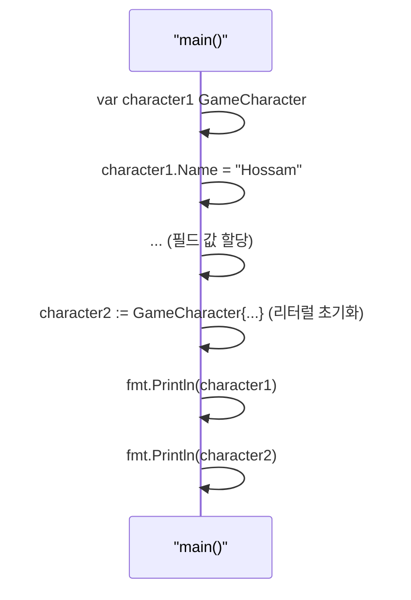
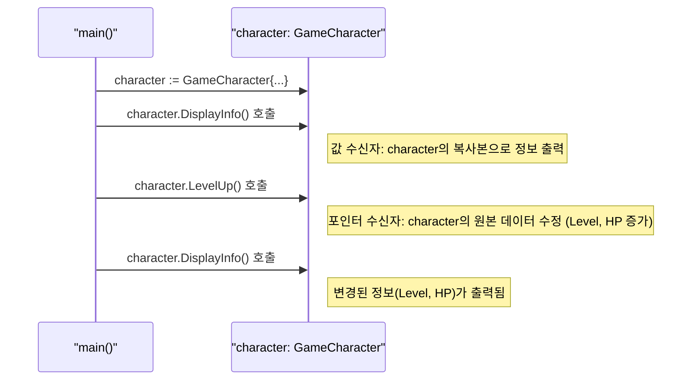
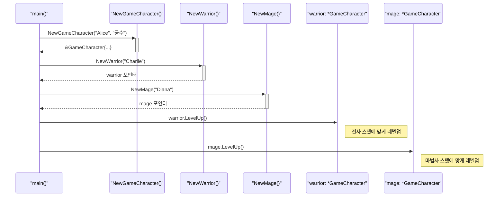
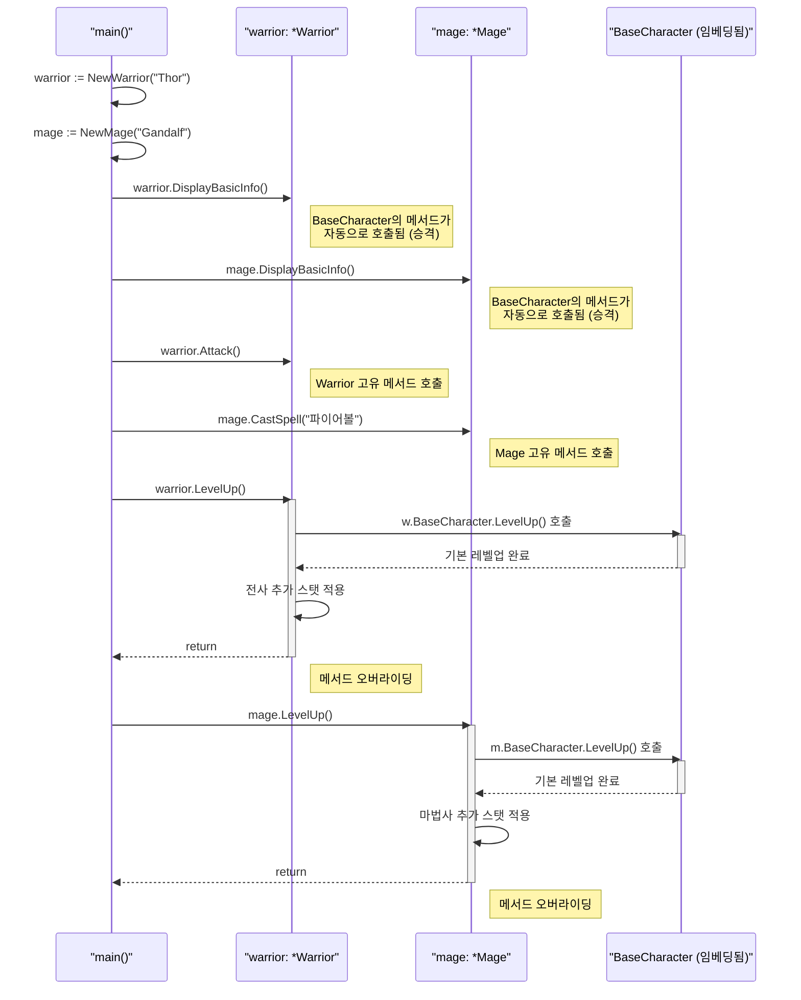
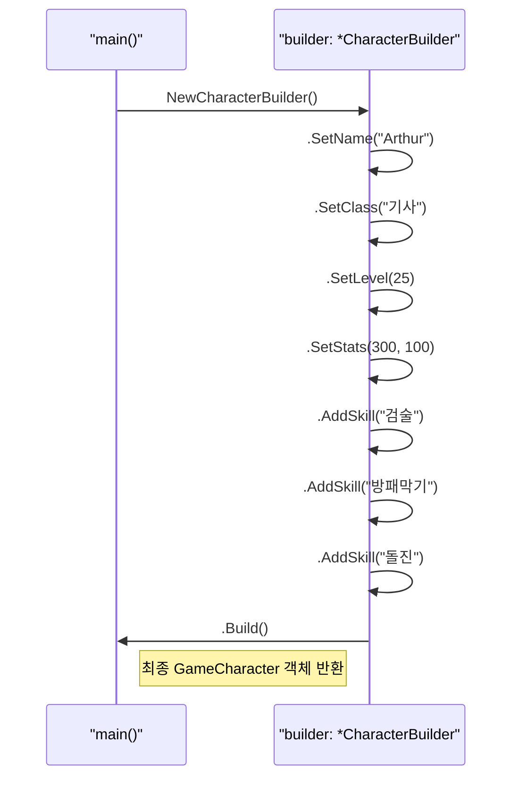
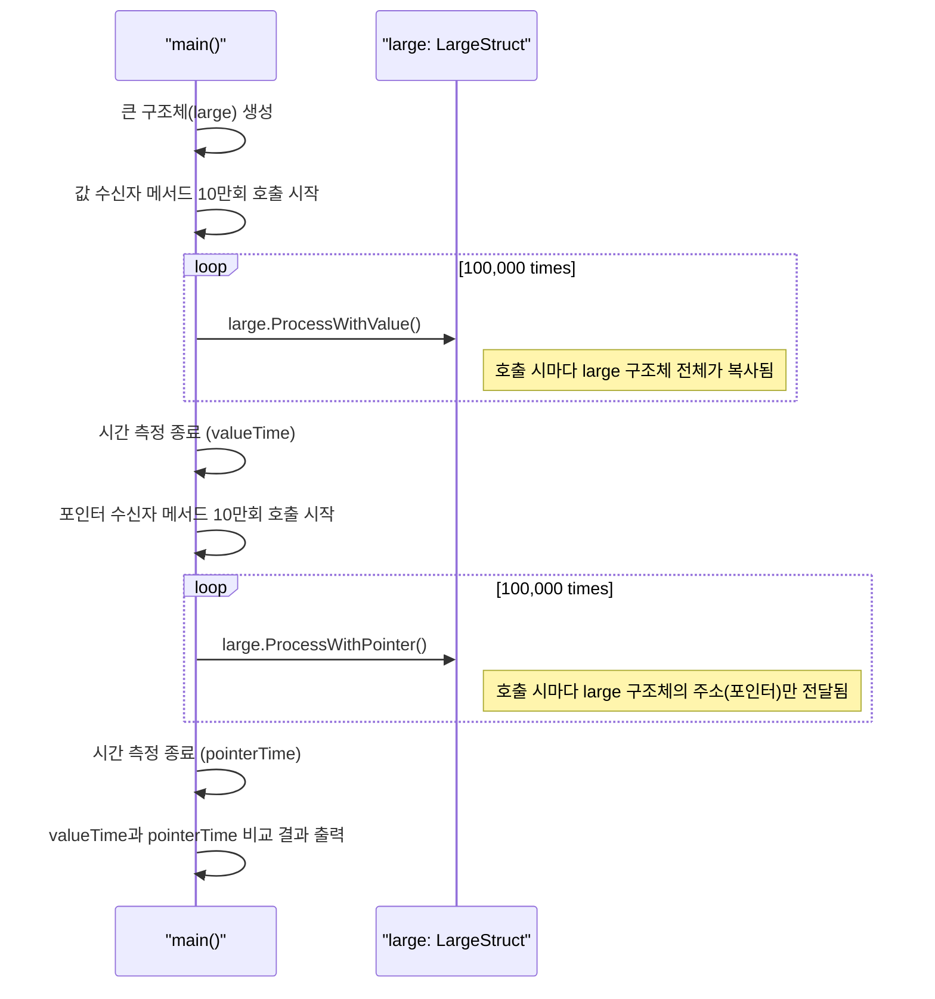

---
title: "Go 구조체와 메서드"
description: "Go의 구조체(Struct)와 메서드(Method)를 Java 클래스와 비교하며 이해하고, 값/포인터 수신자의 개념을 실습으로 알아봅니다."
categories: [03.Coding,Golang]
date:   2024-10-22 10:00:00 +0900
author: Hossam
image: /images/indexs/golang.webp
tags: [Programming, Golang, Coding, Go-Struct, Go-Method, OOP]
pin: false
math: true
mermaid: true
---

# Go 구조체와 메서드

Java에서 모든 것을 `class`로 설계하는 데 익숙한 우리에게 Go의 `struct`는 조금 다르게 다가온다.

Java 개발자의 시선으로 Go의 객체지향적인 설계 방법 살펴보기 위해서 RPG 게임의 기본 단위인 **'게임 캐릭터'**를 직접 만들어보려고 한다.

이 글에서는 Go의 구조체와 메서드 개념을 확실히 이해하는 것이 목표이다.


## 1. 구조체(Struct): 데이터의 뼈대

Go에서 `구조체(Struct)`는 여러 데이터 필드를 묶어 관리하는 사용자 정의 타입

Java의 클래스에서 메서드는 제외하고, 데이터 필드만 남겨둔 형태와 매우 유사함.

즉, 순수한 데이터의 명세서라고 할 수 있음.

### Go 구조체 vs Java 클래스 (데이터 관점)

| 구분 | Go `struct` | Java `class` |
|---|---|---|
| 목적 | 관련 데이터 필드의 묶음 | 데이터(필드)와 행위(메서드)의 묶음 |
| 선언 | `type 이름 struct { ... }` | `class 이름 { ... }` |
| 특징 | 데이터 정의에만 집중 | 데이터와 메서드를 함께 정의 |
| 예시 | 캐릭터의 이름, 레벨, HP 등 | 캐릭터의 속성 + 걷기, 공격하기 등 |

### 실습 (1): 게임 캐릭터 구조체 정의하기

먼저, 우리만의 캐릭터를 표현할 데이터 뼈대를 만들어 봄.

**실습 파일: `06-구조체와-메서드/01-구조체-정의/main.go`**

아래 코드는 `GameCharacter`라는 구조체를 정의하고, 이 구조체를 사용해 `character1`과 `character2`라는 두 개의 인스턴스(객체)를 생성하는 과정을 보여줍니다. `character1`은 변수 선언 후 필드에 값을 할당하는 방식을, `character2`는 선언과 동시에 값을 초기화하는 리터럴 방식을 사용합니다.



```go
package main

import "fmt"

// GameCharacter 구조체를 정의함.
// Java의 클래스와 유사하게 관련 데이터(필드)를 묶는 역할을 함.
// 하지만 Java 클래스와 달리 메서드를 포함하지 않고 순수하게 데이터만 정의함.
type GameCharacter struct {
    Name  string // 캐릭터의 이름을 저장하는 필드
    Level int    // 캐릭터의 레벨을 저장하는 필드
    HP    int    // 캐릭터의 체력을 저장하는 필드
    MP    int    // 캐릭터의 마나를 저장하는 필드
}

// 프로그램의 시작점인 main 함수임.
func main() {
    // GameCharacter 구조체의 인스턴스(객체)를 생성함.
    // var 키워드를 사용하여 'character1'이라는 이름의 변수를 선언하고, GameCharacter 타입으로 지정함.
    var character1 GameCharacter

    // 필드에 값을 할당함. .(점) 연산자를 사용하여 각 필드에 접근함.
    character1.Name = "Hossam"
    character1.Level = 99
    character1.HP = 8000
    character1.MP = 12000

    // 구조체 인스턴스를 초기화하는 또 다른 방법 (리터럴 초기화)
    // 선언과 동시에 중괄호 {} 안에 필드와 값을 직접 명시하여 인스턴스를 생성함.
    character2 := GameCharacter{
        Name:  "Alex",
        Level: 50,
        HP:    5000,
        MP:    7000,
    }

    // 생성된 구조체 인스턴스의 정보를 출력함.
    // Println 함수는 구조체를 출력할 때 필드와 값을 보기 좋게 표시해줌.
    fmt.Println("캐릭터 1 정보:", character1)
    fmt.Println("캐릭터 2 정보:", character2)

    // 특정 필드에 접근하여 값을 개별적으로 출력할 수도 있음.
    fmt.Printf("캐릭터 2의 이름: %s, 레벨: %d\n", character2.Name, character2.Level)
}
```

위 코드는 `GameCharacter`라는 설계도를 만들고, 이 설계도를 바탕으로 `character1`과 `character2`라는 실제 캐릭터 인스턴스를 생성하는 과정을 보여줌. Java에서 `new` 키워드로 객체를 생성하는 것과 개념적으로 동일함.

---

## 2. 메서드(Method): 데이터에 생명을 불어넣다

구조체가 데이터의 뼈대라면, **메서드(Method)**는 그 뼈대에 붙는 살과 근육임. 즉, 특정 타입(구조체 등)에 종속되어 동작하는 함수를 의미함. Java 클래스 내부에 메서드를 선언하는 것과 달리, Go는 구조체 외부에 `func (수신자) 메서드명()` 형태로 선언하여 구조체와 연결(바인딩)함.

이때 등장하는 **수신자(Receiver)** 개념이 Java 개발자에게는 가장 중요함. 수신자는 메서드가 어떤 데이터와 연결되는지를 알려주는 매개변수임.

### 값 수신자 vs 포인터 수신자

| 구분 | 값 수신자 (Value Receiver) | 포인터 수신자 (Pointer Receiver) |
|---|---|---|
| 선언 | `func (c GameCharacter) ...` | `func (c *GameCharacter) ...` |
| 동작 원리 | 메서드 호출 시 **데이터의 복사본**이 전달됨 | 메서드 호출 시 **데이터의 원본 주소(포인터)**가 전달됨 |
| Java 비유 | 원시 타입을 메서드 인자로 넘기는 것과 유사 | 객체를 메서드 인자로 넘겨 `this`로 필드를 변경하는 것과 유사 |
| 주 사용처 | 원본 데이터를 수정할 필요가 없을 때 (e.g., 정보 출력) | 원본 데이터를 **수정해야 할 때** (e.g., 상태 변경) |

### 실습 (2): 캐릭터에 메서드 추가하기

이제 우리 캐릭터가 스스로 정보를 표시하고, 레벨업도 할 수 있도록 메서드를 추가해 봄.

**실습 파일: `06-구조체와-메서드/02-메서드-바인딩/main.go`**

이 코드는 `GameCharacter` 구조체에 `DisplayInfo`와 `LevelUp` 두 메서드를 추가합니다. `DisplayInfo`는 원본을 수정할 필요가 없으므로 값 수신자를 사용하고, `LevelUp`은 레벨과 체력을 직접 변경해야 하므로 포인터 수신자를 사용합니다. `main` 함수에서 `LevelUp`을 호출하면 `character`의 원본 데이터가 변경되고, 이는 이후 `DisplayInfo` 호출 시 변경된 상태로 출력되는 것을 통해 확인할 수 있습니다.



```go
package main

import "fmt"

// GameCharacter 구조체를 정의함.
type GameCharacter struct {
    Name  string // 캐릭터 이름
    Level int    // 레벨
    HP    int    // 체력
    MP    int    // 마나
}

// '값 수신자(Value Receiver)' 메서드
// (c GameCharacter)는 이 메서드가 GameCharacter 타입에 속해 있음을 나타냄.
// 'c'는 메서드 내에서 구조체 인스턴스의 복사본에 접근할 때 사용하는 변수임.
// 원본 데이터를 수정하지 않고 단순히 정보를 보여주는 경우에 값 수신자를 사용함.
func (c GameCharacter) DisplayInfo() {
    fmt.Printf("이름: %s, 레벨: %d, HP: %d, MP: %d\n", c.Name, c.Level, c.HP, c.MP)
}

// '포인터 수신자(Pointer Receiver)' 메서드
// (c *GameCharacter)는 메서드가 구조체의 포인터에 바인딩됨을 의미함.
// Java에서 객체의 메서드가 'this'를 통해 원본 객체를 수정하는 것과 유사함.
// 메서드 내에서 구조체의 원본 필드 값을 변경해야 할 때 포인터 수신자를 사용함.
func (c *GameCharacter) LevelUp() {
    c.Level++ // c가 가리키는 원본 인스턴스의 Level 필드를 1 증가시킴.
    c.HP += 100 // 원본 인스턴스의 HP를 100 증가시킴.
    fmt.Printf("%s가 레벨업! (현재 레벨: %d)\n", c.Name, c.Level)
}

// 프로그램의 시작점인 main 함수임.
func main() {
    // GameCharacter 인스턴스를 생성하고 초기화함.
    character := GameCharacter{
        Name:  "Hossam",
        Level: 99,
        HP:    8000,
        MP:    12000,
    }

    // DisplayInfo 메서드를 호출함.
    // 이 메서드는 '값 수신자'이므로 character 인스턴스의 복사본을 사용하여 정보를 출력함.
    fmt.Println("--- 초기 상태 ---")
    character.DisplayInfo()

    // LevelUp 메서드를 호출함.
    // 이 메서드는 '포인터 수신자'이므로 character 인스턴스의 원본 데이터를 직접 수정함.
    fmt.Println("\n--- 레벨업 진행 ---")
    character.LevelUp()

    // 레벨업 후 변경된 상태를 확인하기 위해 다시 DisplayInfo 메서드를 호출함.
    // Level과 HP가 변경된 것을 확인할 수 있음.
    fmt.Println("\n--- 레벨업 후 상태 ---")
    character.DisplayInfo()
}
```

`DisplayInfo`는 캐릭터의 상태를 바꾸지 않고 보여주기만 하므로 **값 수신자**로 충분함. 하지만 `LevelUp`은 캐릭터의 레벨과 체력을 **직접 수정**해야 하므로, 원본에 접근할 수 있는 **포인터 수신자**를 사용해야만 함.

---

## 3. 생성자 함수 패턴: 캐릭터 공장을 만들어보자

Java에서는 클래스에 생성자(Constructor)를 정의하여 객체 초기화 로직을 구현함. Go에는 생성자가 없지만, **생성자 함수(Constructor Function)** 패턴을 사용하여 동일한 효과를 얻을 수 있음.

### Go 생성자 함수 vs Java 생성자

| 구분 | Go 생성자 함수 | Java 생성자 |
|---|---|---|
| 정의 방식 | `func NewTypeName() *TypeName` | `public ClassName() { ... }` |
| 특징 | 관례적으로 `New`로 시작하는 일반 함수 | 클래스 이름과 동일한 특수 메서드 |
| 반환값 | 보통 포인터를 반환 | 반환값 없음 (객체 자동 생성) |
| 유연성 | 다양한 생성자 함수 정의 가능 | 오버로딩으로 다양한 생성자 정의 |

### 실습 (3): 캐릭터 생성자 함수 만들기

**실습 파일: `06-구조체와-메서드/03-생성자-함수/main.go`**

이 코드는 다양한 생성자 함수를 통해 캐릭터를 만드는 방법을 보여줍니다. `NewGameCharacter`는 기본 캐릭터를, `NewWarrior`와 `NewMage`는 특정 직업에 맞는 능력치를 가진 캐릭터를 생성하는 팩토리 역할을 합니다. `main` 함수에서는 이 함수들을 호출하여 여러 종류의 캐릭터를 손쉽게 생성하고, 각 캐릭터의 `LevelUp` 메서드를 호출하여 직업별로 스탯이 다르게 오르는 것을 확인합니다.



```go
package main

import "fmt"

// GameCharacter 구조체 정의
type GameCharacter struct {
    Name  string
    Level int
    HP    int
    MP    int
    Class string // 직업 필드 추가
}

// 기본 캐릭터 생성자 함수
// Go의 관례에 따라 'New' + 타입명으로 함수명을 정함
// 포인터를 반환하여 메모리 효율성을 높임
func NewGameCharacter(name, class string) *GameCharacter {
    return &GameCharacter{
        Name:  name,
        Level: 1,    // 기본 레벨 1로 시작
        HP:    100,  // 기본 체력 100
        MP:    50,   // 기본 마나 50
        Class: class,
    }
}

// 고급 캐릭터 생성자 함수 (커스텀 스탯)
// Java의 생성자 오버로딩과 유사한 효과
func NewAdvancedCharacter(name, class string, level, hp, mp int) *GameCharacter {
    return &GameCharacter{
        Name:  name,
        Level: level,
        HP:    hp,
        MP:    mp,
        Class: class,
    }
}

// 팩토리 패턴: 직업별 캐릭터 생성
func NewWarrior(name string) *GameCharacter {
    return &GameCharacter{
        Name:  name,
        Level: 1,
        HP:    150,  // 전사는 체력이 높음
        MP:    30,   // 마나는 낮음
        Class: "전사",
    }
}

func NewMage(name string) *GameCharacter {
    return &GameCharacter{
        Name:  name,
        Level: 1,
        HP:    80,   // 마법사는 체력이 낮음
        MP:    120,  // 마나는 높음
        Class: "마법사",
    }
}

// 캐릭터 정보 표시 메서드 (값 수신자)
func (c GameCharacter) DisplayInfo() {
    fmt.Printf("이름: %s, 직업: %s, 레벨: %d, HP: %d, MP: %d\n",
               c.Name, c.Class, c.Level, c.HP, c.MP)
}

// 레벨업 메서드 (포인터 수신자)
func (c *GameCharacter) LevelUp() {
    c.Level++
    // 직업별로 다른 스탯 증가
    switch c.Class {
    case "전사":
        c.HP += 20
        c.MP += 5
    case "마법사":
        c.HP += 10
        c.MP += 15
    default:
        c.HP += 15
        c.MP += 10
    }
    fmt.Printf("%s(%s)가 레벨업! (현재 레벨: %d)\n", c.Name, c.Class, c.Level)
}

func main() {
    fmt.Println("=== 다양한 캐릭터 생성 방법 ===")

    // 1. 기본 생성자 사용
    character1 := NewGameCharacter("Alice", "궁수")
    fmt.Println("1. 기본 생성자로 생성:")
    character1.DisplayInfo()

    // 2. 고급 생성자 사용
    character2 := NewAdvancedCharacter("Bob", "도적", 10, 200, 80)
    fmt.Println("\n2. 고급 생성자로 생성:")
    character2.DisplayInfo()

    // 3. 팩토리 패턴 사용
    warrior := NewWarrior("Charlie")
    mage := NewMage("Diana")

    fmt.Println("\n3. 팩토리 패턴으로 생성:")
    warrior.DisplayInfo()
    mage.DisplayInfo()

    fmt.Println("\n=== 레벨업 테스트 ===")
    warrior.LevelUp()
    mage.LevelUp()

    fmt.Println("\n레벨업 후:")
    warrior.DisplayInfo()
    mage.DisplayInfo()
}
```

---

## 4. 구조체 임베딩: Go식 상속

Java의 상속(`extends`)과 달리, Go는 **구조체 임베딩(Struct Embedding)**을 통해 코드 재사용을 구현함. 이는 "has-a" 관계가 아닌 "is-a" 관계를 표현하는 Go만의 독특한 방식임.

### Go 임베딩 vs Java 상속

| 구분 | Go 임베딩 | Java 상속 |
|---|---|---|
| 키워드 | 별도 키워드 없음 (익명 필드) | `extends` |
| 메서드 호출 | 자동으로 승격(promotion) | `super.method()` 또는 직접 호출 |
| 다중 상속 | 지원 (여러 구조체 임베딩 가능) | 미지원 (단일 상속만) |
| 오버라이딩 | 메서드 재정의로 구현 | `@Override` 어노테이션 |

### 실습 (4): 임베딩을 활용한 캐릭터 계층 구조

**실습 파일: `06-구조체와-메서드/04-구조체-임베딩/main.go`**

이 코드는 `BaseCharacter`를 `Warrior`와 `Mage` 구조체에 임베딩하여 코드 재사용성을 높이는 방법을 보여줍니다. `Warrior`와 `Mage`는 `BaseCharacter`의 필드와 메서드(`DisplayBasicInfo`)를 직접 자신의 것처럼 사용할 수 있습니다. 또한, 각 직업 구조체는 `LevelUp` 메서드를 자신에게 맞게 재정의(오버라이딩)하여, 부모의 `LevelUp`을 호출하면서 자신만의 추가 스탯을 올리는 확장된 기능을 수행합니다.



```go
package main

import "fmt"

// 기본 캐릭터 구조체 (부모 역할)
type BaseCharacter struct {
    Name  string
    Level int
    HP    int
    MP    int
}

// 기본 캐릭터 메서드들
func (bc *BaseCharacter) DisplayBasicInfo() {
    fmt.Printf("이름: %s, 레벨: %d, HP: %d, MP: %d\n",
               bc.Name, bc.Level, bc.HP, bc.MP)
}

func (bc *BaseCharacter) LevelUp() {
    bc.Level++
    bc.HP += 10
    bc.MP += 5
    fmt.Printf("%s가 레벨업! (레벨: %d)\n", bc.Name, bc.Level)
}

// 전사 구조체 (임베딩을 통한 "상속")
type Warrior struct {
    BaseCharacter        // 익명 필드로 임베딩
    Strength      int    // 전사만의 고유 필드
    Armor         int    // 방어력
}

// 전사의 고유 메서드
func (w *Warrior) Attack() {
    damage := w.Strength * 2
    fmt.Printf("%s가 검으로 공격! 데미지: %d\n", w.Name, damage)
}

// 메서드 오버라이딩 (BaseCharacter의 LevelUp을 재정의)
func (w *Warrior) LevelUp() {
    w.BaseCharacter.LevelUp() // 부모의 메서드 호출
    w.Strength += 3           // 전사만의 추가 스탯 증가
    w.Armor += 2
    fmt.Printf("전사 스탯 증가: 힘 +3, 방어력 +2\n")
}

// 마법사 구조체
type Mage struct {
    BaseCharacter        // 임베딩
    Intelligence  int    // 지능
    ManaRegen     int    // 마나 재생력
}

// 마법사의 고유 메서드
func (m *Mage) CastSpell(spellName string) {
    manaCost := 20
    if m.MP >= manaCost {
        m.MP -= manaCost
        damage := m.Intelligence * 3
        fmt.Printf("%s가 %s 마법 시전! 데미지: %d (남은 MP: %d)\n",
                   m.Name, spellName, damage, m.MP)
    } else {
        fmt.Printf("%s의 마나가 부족합니다!\n", m.Name)
    }
}

// 마법사의 레벨업 오버라이딩
func (m *Mage) LevelUp() {
    m.BaseCharacter.LevelUp()
    m.Intelligence += 4
    m.ManaRegen += 2
    fmt.Printf("마법사 스탯 증가: 지능 +4, 마나재생 +2\n")
}

// 전사 생성자
func NewWarrior(name string) *Warrior {
    return &Warrior{
        BaseCharacter: BaseCharacter{
            Name:  name,
            Level: 1,
            HP:    120,
            MP:    30,
        },
        Strength: 15,
        Armor:    10,
    }
}

// 마법사 생성자
func NewMage(name string) *Mage {
    return &Mage{
        BaseCharacter: BaseCharacter{
            Name:  name,
            Level: 1,
            HP:    80,
            MP:    100,
        },
        Intelligence: 20,
        ManaRegen:    5,
    }
}

func main() {
    fmt.Println("=== 구조체 임베딩 테스트 ===")

    // 캐릭터 생성
    warrior := NewWarrior("Thor")
    mage := NewMage("Gandalf")

    fmt.Println("초기 상태:")
    warrior.DisplayBasicInfo() // 임베딩된 메서드 자동 사용 가능
    mage.DisplayBasicInfo()

    fmt.Println("\n=== 고유 스킬 사용 ===")
    warrior.Attack()
    mage.CastSpell("파이어볼")

    fmt.Println("\n=== 레벨업 (오버라이딩된 메서드) ===")
    warrior.LevelUp()
    mage.LevelUp()

    fmt.Println("\n레벨업 후 상태:")
    warrior.DisplayBasicInfo()
    mage.DisplayBasicInfo()

    // 임베딩된 필드에 직접 접근도 가능
    fmt.Printf("\n전사의 힘: %d, 방어력: %d\n", warrior.Strength, warrior.Armor)
    fmt.Printf("마법사의 지능: %d, 마나재생: %d\n", mage.Intelligence, mage.ManaRegen)
}
```

---

## 5. 메서드 체이닝: 매끄러운 호출 연결

Java의 Builder 패턴이나 jQuery의 메서드 체이닝처럼, Go에서도 메서드가 수신자 자신을 반환하도록 하여 연쇄 호출을 구현할 수 있음.

### 실습 (5): 메서드 체이닝으로 캐릭터 설정하기

**실습 파일: `06-구조체와-메서드/05-메서드-체이닝/main.go`**

이 코드는 빌더 패턴을 사용하여 메서드 체이닝을 구현합니다. `NewCharacterBuilder`로 빌더를 생성한 후, `SetName`, `SetClass` 등 여러 설정 메서드를 연속적으로 호출합니다. 각 설정 메서드는 자기 자신(`*CharacterBuilder`)을 반환하므로, 점(.)을 찍어 계속해서 다른 메서드를 호출할 수 있습니다. 마지막으로 `Build` 메서드를 호출하여 최종 설정이 완료된 `GameCharacter` 객체를 얻습니다.



```go
package main

import "fmt"

// CharacterBuilder 구조체
type CharacterBuilder struct {
    character *GameCharacter
}

// GameCharacter 구조체 (기존 정의 재사용)
type GameCharacter struct {
    Name   string
    Level  int
    HP     int
    MP     int
    Class  string
    Skills []string
}

// 새로운 빌더 생성
func NewCharacterBuilder() *CharacterBuilder {
    return &CharacterBuilder{
        character: &GameCharacter{
            Level:  1,
            HP:     100,
            MP:     50,
            Skills: make([]string, 0),
        },
    }
}

// 체이닝 메서드들 (모두 *CharacterBuilder를 반환)
func (cb *CharacterBuilder) SetName(name string) *CharacterBuilder {
    cb.character.Name = name
    return cb // 자기 자신을 반환하여 체이닝 가능
}

func (cb *CharacterBuilder) SetClass(class string) *CharacterBuilder {
    cb.character.Class = class
    return cb
}

func (cb *CharacterBuilder) SetLevel(level int) *CharacterBuilder {
    cb.character.Level = level
    return cb
}

func (cb *CharacterBuilder) SetStats(hp, mp int) *CharacterBuilder {
    cb.character.HP = hp
    cb.character.MP = mp
    return cb
}

func (cb *CharacterBuilder) AddSkill(skill string) *CharacterBuilder {
    cb.character.Skills = append(cb.character.Skills, skill)
    return cb
}

// 최종 캐릭터 반환
func (cb *CharacterBuilder) Build() *GameCharacter {
    return cb.character
}

// 캐릭터 정보 출력 메서드
func (gc *GameCharacter) DisplayFullInfo() {
    fmt.Printf("=== %s (%s) ===\n", gc.Name, gc.Class)
    fmt.Printf("레벨: %d, HP: %d, MP: %d\n", gc.Level, gc.HP, gc.MP)
    fmt.Printf("스킬: %v\n", gc.Skills)
    fmt.Println()
}

func main() {
    fmt.Println("=== 메서드 체이닝으로 캐릭터 생성 ===")

    // 메서드 체이닝을 사용한 캐릭터 생성
    warrior := NewCharacterBuilder().
        SetName("Arthur").
        SetClass("기사").
        SetLevel(25).
        SetStats(300, 100).
        AddSkill("검술").
        AddSkill("방패막기").
        AddSkill("돌진").
        Build()

    mage := NewCharacterBuilder().
        SetName("Merlin").
        SetClass("대마법사").
        SetLevel(30).
        SetStats(200, 400).
        AddSkill("파이어볼").
        AddSkill("아이스스피어").
        AddSkill("라이트닝").
        AddSkill("힐링").
        Build()

    // 결과 출력
    warrior.DisplayFullInfo()
    mage.DisplayFullInfo()
}
```

---

## 6. 수신자 선택 가이드라인

실무에서 값 수신자와 포인터 수신자 중 어떤 것을 선택할지 고민될 때 참고할 수 있는 가이드라인:

### 포인터 수신자를 사용해야 하는 경우

1. **메서드가 수신자를 수정하는 경우**
2. **구조체가 큰 경우** (복사 비용 절약)
3. **일관성 유지** (다른 메서드가 포인터 수신자를 사용하는 경우)

### 값 수신자를 사용해도 되는 경우

1. **수신자를 수정하지 않는 경우**
2. **구조체가 작은 경우** (기본 타입, 작은 구조체)
3. **불변성이 중요한 경우**

### 실습 (6): 성능 비교 테스트

**실습 파일: `06-구조체와-메서드/06-성능비교/main.go`**

이 코드는 동일한 작업을 수행하는 값 수신자 메서드(`ProcessWithValue`)와 포인터 수신자 메서드(`ProcessWithPointer`)의 실행 시간을 비교합니다. `LargeStruct`는 큰 배열을 포함하고 있어 복사 비용이 많이 듭니다. 루프를 반복하며 각 메서드를 호출했을 때, 값 수신자는 매번 구조체 전체를 복사하므로 시간이 더 오래 걸리는 반면, 포인터 수신자는 주소값만 전달하므로 훨씬 빠른 성능을 보입니다.



```go
package main

import (
    "fmt"
    "time"
)

// 큰 구조체 예제
type LargeStruct struct {
    Data [1000]int
    Name string
    ID   int
}

// 값 수신자 메서드
func (ls LargeStruct) ProcessWithValue() int {
    sum := 0
    for _, v := range ls.Data {
        sum += v
    }
    return sum
}

// 포인터 수신자 메서드
func (ls *LargeStruct) ProcessWithPointer() int {
    sum := 0
    for _, v := range ls.Data {
        sum += v
    }
    return sum
}

func main() {
    // 큰 구조체 인스턴스 생성
    large := LargeStruct{
        Name: "TestStruct",
        ID:   1,
    }

    // 배열에 데이터 채우기
    for i := 0; i < 1000; i++ {
        large.Data[i] = i
    }

    iterations := 100000

    // 값 수신자 성능 측정
    start := time.Now()
    for i := 0; i < iterations; i++ {
        large.ProcessWithValue()
    }
    valueTime := time.Since(start)

    // 포인터 수신자 성능 측정
    start = time.Now()
    for i := 0; i < iterations; i++ {
        large.ProcessWithPointer()
    }
    pointerTime := time.Since(start)

    fmt.Printf("=== 성능 비교 결과 (%d회 반복) ===\n", iterations)
    fmt.Printf("값 수신자 시간: %v\n", valueTime)
    fmt.Printf("포인터 수신자 시간: %v\n", pointerTime)
    fmt.Printf("성능 차이: %.2fx\n", float64(valueTime)/float64(pointerTime))
}
```

---

## 정리: Go 구조체와 메서드의 핵심

### Java 개발자가 기억해야 할 Go의 특징

1. **구조체는 데이터 컨테이너**: Java 클래스의 필드 부분만 담당
2. **메서드는 외부 바인딩**: 구조체 외부에서 연결하는 방식
3. **수신자가 핵심**: 값 vs 포인터 선택이 성능과 동작을 결정
4. **임베딩으로 재사용**: 상속 대신 구조체 조합으로 코드 재사용
5. **생성자 함수 패턴**: `New` 접두사 함수로 초기화 로직 구현
