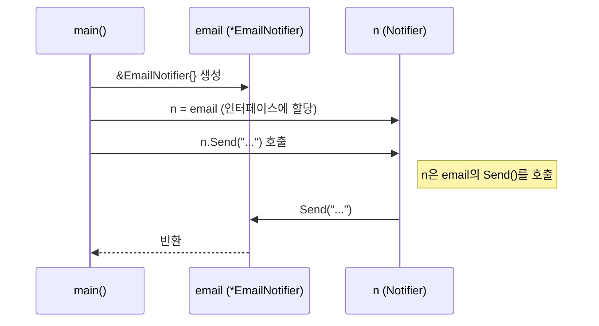
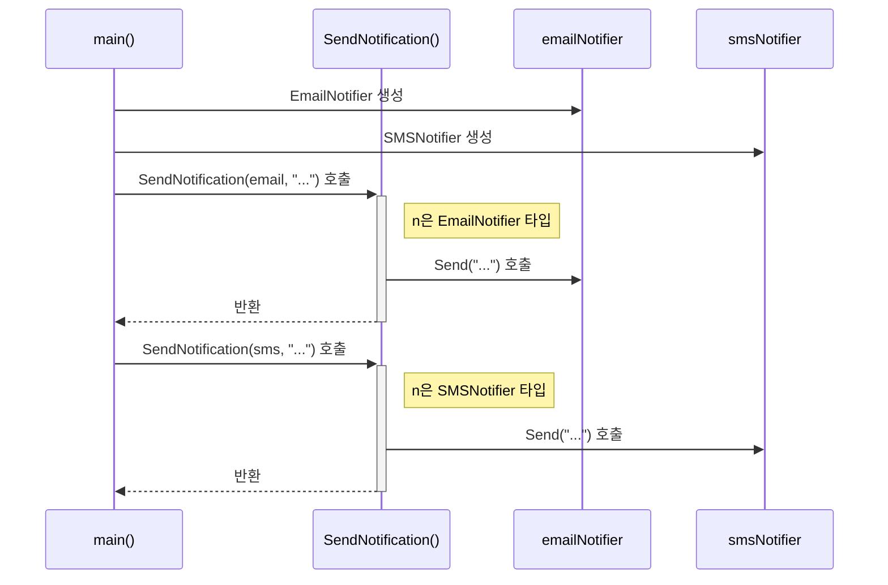
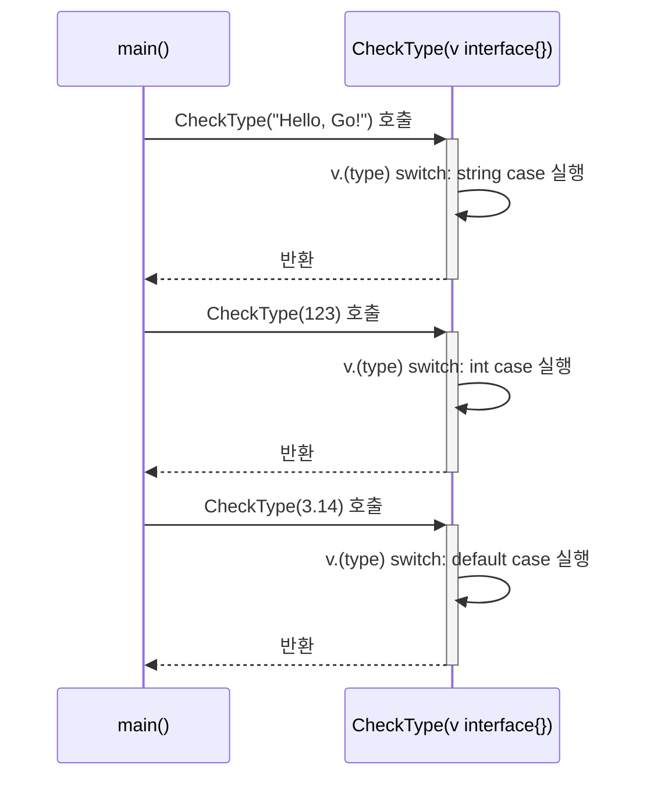

---
title: "Go 언어 인터페이스와 다형성"
description: "Go의 핵심 기능인 인터페이스를 Java와 비교하며 이해하고, 다형성을 활용한 실용적인 예제를 다룸."
categories: [03.Coding,Golang]
date:   2024-10-24 10:00:00 +0900
author: Hossam
image: /images/indexs/golang.webp
tags: [Programming,Golang,Coding]
pin: false
math: true
mermaid: true
---

# Go 언어 인터페이스

Go에서 인터페이스는 **메서드들의 집합**을 정의한 타입임. 특정 타입이 인터페이스에 정의된 모든 메서드를 구현하고 있다면, 그 타입은 해당 인터페이스를 **암시적으로(implicitly)** 구현한 것으로 간주됨. 이는 `implements` 키워드를 사용해 명시적으로 구현을 선언해야 하는 Java와 가장 큰 차이점임.

## 1. Go 인터페이스 vs Java 인터페이스

Go의 접근 방식은 "덕 타이핑(Duck Typing)" 철학을 따름. "만약 어떤 새가 오리처럼 걷고, 오리처럼 꽥꽥거린다면, 나는 그 새를 오리라고 부르겠다"는 의미처럼, 실제 타입이 무엇인지보다 **어떤 메서드를 가지고 있는지**가 더 중요함.

| 항목 | Go 언어 | Java |
|---|---|---|
| **구현 방식** | **암시적 구현 (Implicit)** | **명시적 구현 (Explicit)** |
| **키워드** | 없음 | `implements` |
| **핵심 철학** | 덕 타이핑 (Duck Typing) | 명시적 계약 (Explicit Contract) |
| **유연성** | 매우 높음. 코드 의존성 감소 | 상대적으로 낮음. 강한 타입 체크 |
| **빈 인터페이스** | `interface{}` (모든 타입 표현 가능) | `Object` 클래스 (모든 객체의 최상위) |
| **예시** | `var n Notifier = EmailNotifier{}` | `Notifier n = new EmailNotifier();` |

---

## 2. 스토리텔링: 통합 알림 시스템 만들기

이번 실습에서는 다양한 종류의 알림(이메일, SMS 등)을 보낼 수 있는 통합 알림 시스템을 만들어 볼 것임. 이 과정에서 인터페이스가 어떻게 다형성을 구현하고 코드를 유연하게 만드는지 확인할 수 있음.

### 실습 폴더 구조

먼저 VSCode에서 `07-인터페이스` 라는 실습 폴더를 생성함. 앞으로의 예제는 이 폴더 아래에 생성될 것임.

```
07-인터페이스
│
├─01-인터페이스-기본
│      main.go
│
├─02-인터페이스-다형성
│      main.go
│
├─03-빈-인터페이스
│      main.go
│
└─04-타입-어설션
        main.go
```

---

## 3. 인터페이스 기본

먼저 모든 알림 방식이 따라야 할 규약(메서드 집합), 즉 `Notifier` 인터페이스를 정의하고, 이메일 알림 타입을 구현해봄.

### 실행 흐름 다이어그램



**실습 파일: `07-인터페이스/01-인터페이스-기본/main.go`**
```go
package main

import "fmt"

// Notifier 인터페이스를 정의.
// 이 인터페이스는 string 타입의 메시지를 받는 Send 메서드 하나를 가지고 있음.
// 이 메서드를 구현하는 모든 타입은 Notifier로 간주될 수 있음.
type Notifier interface {
	Send(message string)
}

// EmailNotifier 구조체를 정의. 이메일 수신자 주소를 필드로 가짐.
type EmailNotifier struct {
	Recipient string
}

// EmailNotifier 타입에 대한 Send 메서드를 구현.
// 이 메서드는 Notifier 인터페이스의 요구사항을 만족시킴.
// (e *EmailNotifier)는 포인터 리시버로, 메서드 내에서 구조체 필드 변경이 가능함을 의미.
func (e *EmailNotifier) Send(message string) {
	// fmt.Printf를 사용하여 포맷팅된 문자열을 콘솔에 출력.
	fmt.Printf("'%s' 주소로 이메일 발송: %s", e.Recipient, message)
}

func main() {
	// Notifier 타입의 변수 n을 선언.
	// 인터페이스는 그 자체로 인스턴스화될 수 없으며, 인터페이스를 구현한 구체적인 타입의 값을 담는 컨테이너 역할을 함.
	var n Notifier

	// EmailNotifier 구조체의 인스턴스를 생성하고 그 메모리 주소를 n에 할당.
	// EmailNotifier가 Send 메서드를 구현했기 때문에 Notifier 타입 변수에 할당이 가능함.
	// 이것이 Go의 '암시적 인터페이스 구현'임.
	n = &EmailNotifier{Recipient: "test@example.com"}

	// 인터페이스 변수 n을 통해 Send 메서드를 호출.
	// Go 런타임은 n이 실제로 가리키는 EmailNotifier의 Send 메서드를 찾아 실행해줌.
	n.Send("안녕하세요! Go 인터페이스 테스트입니다.")
}
```

---

## 4. 인터페이스와 다형성

이제 SMS 알림 방식을 추가하여 `Notifier` 인터페이스의 강력한 **다형성(Polymorphism)**을 확인해봄. 다형성이란 **하나의 인터페이스 타입으로 여러 가지 실제 타입의 객체를 다룰 수 있는 능력**을 의미함.

### 실행 흐름 다이어그램



**실습 파일: `07-인터페이스/02-인터페이스-다형성/main.go`**
```go
package main

import "fmt"

// Notifier 인터페이스는 변경 없이 그대로 사용.
type Notifier interface {
	Send(message string)
}

// EmailNotifier 구조체와 Send 메서드도 그대로 사용.
type EmailNotifier struct {
	Recipient string
}

func (e *EmailNotifier) Send(message string) {
	fmt.Printf("'%s' 주소로 이메일 발송: %s", e.Recipient, message)
}

// 새로운 알림 방식인 SMSNotifier 구조체를 정의.
type SMSNotifier struct {
	PhoneNumber string
}

// SMSNotifier 타입에 대한 Send 메서드를 구현.
// 이 또한 Notifier 인터페이스의 요구사항을 만족시킴.
func (s *SMSNotifier) Send(message string) {
	fmt.Printf("'%s' 번호로 SMS 발송: %s", s.PhoneNumber, message)
}

// 다형성을 보여주는 핵심 함수.
// 매개변수로 Notifier 인터페이스 타입을 받음.
// 이 함수는 전달된 실제 타입이 EmailNotifier인지 SMSNotifier인지 신경쓰지 않고,
// 오직 Send 메서드를 호출할 수 있다는 사실에만 의존함.
func SendNotification(n Notifier, message string) {
	fmt.Println("알림을 전송합니다...")
	n.Send(message)
}

func main() {
	// EmailNotifier 인스턴스를 생성.
	emailNotifier := &EmailNotifier{Recipient: "dev@hossam.com"}
	// SMSNotifier 인스턴스를 생성.
	smsNotifier := &SMSNotifier{PhoneNumber: "010-1234-5678"}

	// 동일한 SendNotification 함수에 서로 다른 타입의 값을 전달.
	// 인터페이스 덕분에 함수는 유연하게 두 타입을 모두 처리할 수 있음.
	SendNotification(emailNotifier, "새로운 기능이 배포되었습니다.")
	fmt.Println("--------------------")
	SendNotification(smsNotifier, "서버 점검이 30분 후에 시작됩니다.")
}
```

---

## 5. 빈 인터페이스: `interface{}`

Go에는 메서드를 하나도 정의하지 않은 특별한 인터페이스가 있음. 바로 **빈 인터페이스(`interface{}`)**임. 모든 타입은 0개의 메서드를 구현하고 있으므로, **모든 타입은 빈 인터페이스를 만족**함. Java의 `Object` 클래스와 유사하게, 어떤 값이든 담을 수 있는 만능 컨테이너로 사용됨.

**실습 파일: `07-인터페이스/03-빈-인터페이스/main.go`**
```go
package main

import "fmt"

// 빈 인터페이스를 매개변수로 받는 함수.
// 어떤 타입의 값이든 이 함수에 전달할 수 있음.
func PrintAnything(v interface{}) {
	fmt.Printf("값: %v, 타입: %T", v, v)
}

func main() {
	fmt.Println("--- 빈 인터페이스 테스트 ---")

	// 정수형 값을 전달
	PrintAnything(10)

	// 문자열 값을 전달
	PrintAnything("안녕하세요")

	// 구조체 값을 전달
	type Person struct {
		Name string
		Age  int
	}
	p := Person{Name: "Hossam", Age: 30}
	PrintAnything(p)
}
```

---

## 6. 타입 어설션 (Type Assertion)

빈 인터페이스는 모든 것을 담을 수 있지만, 담겨있는 실제 값의 필드나 메서드에 접근하려면 원래의 구체적인 타입으로 다시 변환해야 함. 이때 **타입 어설션**을 사용함. 이는 Java에서 `Object`를 구체적인 클래스로 캐스팅하는 것과 유사함.

### 타입 어설션 방법

1.  `value := i.(T)`: 인터페이스 `i`를 `T` 타입으로 변환. 만약 `i`가 `T` 타입이 아니면 프로그램은 `panic`을 발생시킴.
2.  `value, ok := i.(T)`: 더 안전한 방법. `ok`라는 bool 변수를 함께 받아, 변환 성공 여부를 확인. 성공 시 `ok`는 `true`, 실패 시 `false`가 됨. `panic`을 방지할 수 있어 권장됨.
3.  `switch v.(type)`: 여러 타입을 한 번에 검사할 때 유용.

### 실행 흐름 다이어그램



**실습 파일: `07-인터페이스/04-타입-어설션/main.go`**
```go
package main

import "fmt"

// 빈 인터페이스 값을 받아 타입에 따라 다른 동작을 수행하는 함수
func CheckType(v interface{}) {
	fmt.Printf("입력 값: %v\n", v)

	// 1. "value, ok" 패턴을 사용한 안전한 타입 어설션
	// v를 string 타입으로 변환 시도
	str, ok := v.(string)
	if ok {
		fmt.Printf("  (ok) 이 값은 문자열입니다: %s\n", str)
	} else {
		fmt.Println("  (ok) 이 값은 문자열이 아닙니다.")
	}

	// 2. switch 문을 사용한 타입 어설션 (Type Switch)
	// 여러 타입을 검사할 때 훨씬 간결하고 효율적임.
	switch t := v.(type) {
	case int:
		fmt.Printf("  (switch) 이 값은 정수이며, 2를 곱하면 %d 입니다.\n", t*2)
	case string:
		fmt.Printf("  (switch) 이 값은 문자열이며, 길이는 %d 입니다.\n", len(t))
	case bool:
		fmt.Printf("  (switch) 이 값은 불리언입니다: %t\n", t)
	default:
		// t의 타입은 v의 타입과 동일
		fmt.Printf("  (switch) 처리할 수 없는 타입입니다: %T\n", t)
	}
	fmt.Println("--------------------")
}

func main() {
	CheckType("Hello, Go!")
	CheckType(123)
	CheckType(true)
	CheckType(3.14)
}
```

## 7. 결론

Go의 인터페이스는 Java와 달리 **암시적**으로 구현되어 코드의 유연성과 확장성을 크게 높여줌. 개발자는 구체적인 타입이 아닌 **인터페이스(규약)**에 의존하여 코드를 작성하게 되므로, 결합도는 낮아지고 재사용성은 높아짐. 특히 `io.Reader`, `io.Writer`와 같은 표준 라이브러리의 핵심 인터페이스들은 Go 생태계의 기반을 이루는 중요한 개념이므로 반드시 숙지해야 함.