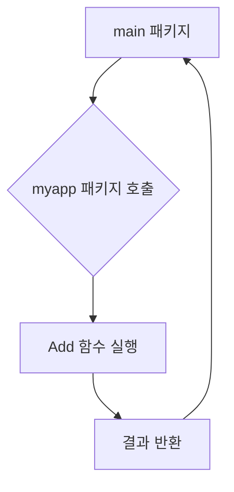

# Go언어 모듈과 패키지

Go 언어에서 코드를 구조화하고 재사용하는 핵심적인 방법인 모듈(Module)과 패키지(Package)에 대해 알아봄. Java의 패키지, Maven/Gradle과 비교하여 개념을 이해하고, 실제 프로젝트에서 어떻게 활용되는지 실습을 통해 학습함.

## 모듈 (Module)

Go 모듈은 **의존성 관리**를 위한 시스템임. (일반적인 모듈의 개념과 다소 다름)

프로젝트가 사용하는 패키지들의 묶음이며, 각 패키지의 정확한 버전을 명시하여 프로젝트의 빌드를 일관성 있고 재현 가능하게 만듦.

쉽게 이야기하면 프로젝트를 모듈 단위로 만들어야 패키지를 생성할 수 있음.

Java 개발자라면 Maven의 `pom.xml`이나 Gradle의 `build.gradle` 파일과 유사한 역할을 한다고 생각하면 쉬움.

### 모듈 초기화

프로젝트를 모듈로 만들기 위해서는 `go mod init {모듈이름}` 명령어를 사용해야 함.

**실습: `08-모듈,패키지`**

단원 폴더 위치에서 명령프롬프트를 열고 아래의 명령어를 수행

```bash
# 'hello-go'라는 이름의 모듈을 초기화
go mod init hello-go
```

위 명령을 실행하면 해당 폴더에 `go.mod` 파일이 생성됨.

**파일: `08-모듈,패키지/go.mod`**

```mod
module hello-go

go 1.25.0 // 이 프로젝트가 사용하는 Go 버전
```

`go.mod` 파일은 모듈의 이름, Go 버전, 그리고 프로젝트가 의존하는 다른 모듈(패키지)의 목록을 관리함.

> 이 파일을 직접 생성해도 됩니다.

## 패키지 (Package)

Go에서 패키지는 관련된 Go 소스 파일들을 하나의 단위로 묶는 메커니즘임. 같은 패키지에 속한 코드들은 서로의 식별자(변수, 함수, 타입 등)에 자유롭게 접근할 수 있음.

### Go 패키지와 Java 패키지 비교

Go와 Java는 모두 코드를 구성하기 위해 패키지 개념을 사용하지만, 몇 가지 중요한 차이점이 존재함.

| 구분 | Go (Golang) | Java |
|---|---|---|
| **선언** | `package <패키지명>` | `package <패키지명>;` |
| **디렉토리 구조** | 패키지명과 디렉토리명이 일치하는 것을 권장함. 하나의 디렉토리에는 하나의 패키지만 존재. | 패키지명이 반드시 디렉토리 구조와 일치해야 함. |
| **가시성(Visibility)** | 식별자(변수, 함수 등)의 첫 글자가 **대문자**이면 외부 노출(Public), **소문자**이면 비노출(Private). | `public`, `protected`, `private` 접근 제어자를 명시적으로 사용. |
| **컴파일 단위** | 패키지 단위로 컴파일됨. | 클래스 단위로 컴파일됨 (`.class` 파일 생성). |

### 패키지 생성 및 사용 실습

간단한 연산 기능을 제공하는 `myapp` 패키지를 만들고, `main` 패키지에서 이를 사용하는 실습을 진행함.

#### 실행 흐름도



#### 1. myapp 패키지 생성

**실습 파일: `08-모듈,패키지/myapp/mymath.go`**

Go 언어는 함수 단위이기 때문에 같은 패키지 안에 속한 모든 파일이 하나의 패키지 단위로 포함됨

```go
package myapp // 패키지를 'myapp'으로 선언

// 두 정수의 합을 반환하는 함수
// 함수 이름이 대문자 'A'로 시작하므로 외부 패키지에서 호출할 수 있음 (Public)
func Add(a int, b int) int {
	return a + b
}

// 두 정수의 차를 반환하는 함수
// 함수 이름이 소문자 's'로 시작하므로 외부에서 호출할 수 없음 (Private)
func subtract(a int, b int) int {
	return a - b
}
```

#### 2. main 패키지에서 myapp 패키지 사용

**실습 파일: `08-모듈,패키지/main.go`**

```go
package main

import (
	"fmt"
	"hello-go/myapp" // hello-go 모듈에 속한 myapp 패키지를 import
)

func main() {
	// myapp 패키지의 Add 함수 호출
	sum := myapp.Add(5, 3)
	fmt.Printf("5 + 3 = %d", sum)

	// 아래 코드는 컴파일 에러를 발생시킴
	// myapp 패키지의 subtract 함수는 소문자로 시작하여 외부에서 접근할 수 없기 때문
	// diff := myapp.subtract(5, 3)
	// fmt.Printf("5 - 3 = %d", diff)
}
```


## 실행을 위한 VSCode 설정 수정

Code Runner 익스텐션은 `Alt+Ctrl+N`을 누를 때 go 소스파일의 절대 경로를 실행하게 되어 있음

모듈 단위는 명령어가 모듈 디렉토리 위치에서 실행되어야 하므로 설정을 수정함으로서 모듈 폴더 이동 후 코드를 실행하게 변경해야 함

**이미 설정 파일에 `code-runner.executorMap`이 있다면 기존 내용을 수정**

```json
"code-runner.executorMap": {
    //... 생략 ...

    "go": "cd $dir && go run $fileName",

    //... 생략 ...
}
```

**없다면 아래 내용만 추가**

기존 항목과는 콤마(`,`)로 구분해야 함

```json
"code-runner.executorMap": {
    "go": "cd $dir && go run $fileName"
}
```