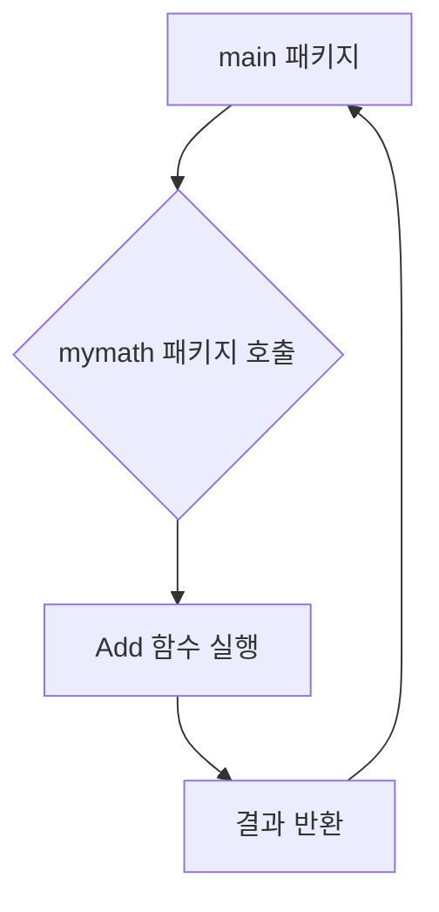
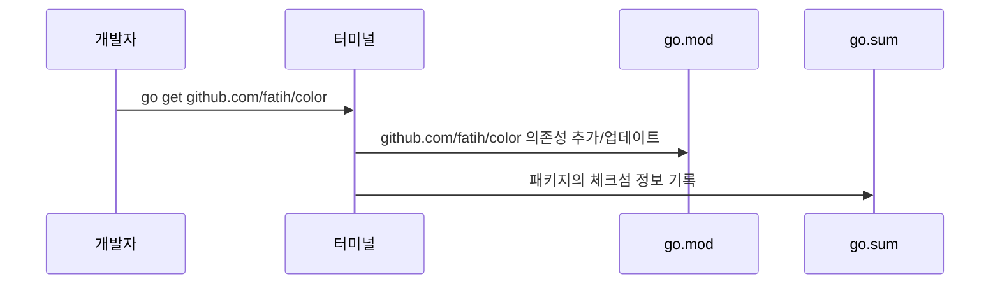

Go 언어에서 코드를 구조화하고 재사용하는 핵심적인 방법인 패키지(Package)와 모듈(Module)에 대해 알아봄. Java의 패키지, Maven/Gradle과 비교하여 개념을 이해하고, 실제 프로젝트에서 어떻게 활용되는지 실습을 통해 학습함.

## 패키지 (Package)

Go에서 패키지는 관련된 Go 소스 파일들을 하나의 단위로 묶는 메커니즘임. 같은 패키지에 속한 코드들은 서로의 식별자(변수, 함수, 타입 등)에 자유롭게 접근할 수 있음.

### Go 패키지와 Java 패키지 비교

Go와 Java는 모두 코드를 구성하기 위해 패키지 개념을 사용하지만, 몇 가지 중요한 차이점이 존재함.

| 구분 | Go (Golang) | Java |
|---|---|---|
| **선언** | `package <패키지명>` | `package <패키지명>;` |
| **디렉토리 구조** | 패키지명과 디렉토리명이 일치하는 것을 권장함. 하나의 디렉토리에는 하나의 패키지만 존재. | 패키지명이 반드시 디렉토리 구조와 일치해야 함. |
| **가시성(Visibility)** | 식별자(변수, 함수 등)의 첫 글자가 **대문자**이면 외부 노출(Public), **소문자**이면 비노출(Private). | `public`, `protected`, `private` 접근 제어자를 명시적으로 사용. |
| **컴파일 단위** | 패키지 단위로 컴파일됨. | 클래스 단위로 컴파일됨 (`.class` 파일 생성). |

### 패키지 생성 및 사용 실습

간단한 연산 기능을 제공하는 `mymath` 패키지를 만들고, `main` 패키지에서 이를 사용하는 실습을 진행함.

#### 실행 흐름도



#### 1. mymath 패키지 생성

**실습 파일: `08-패키지와-모듈/01-로컬-패키지-생성/mymath/mymath.go`**

```go
// mymath/mymath.go
package mymath // 패키지를 'mymath'로 선언

// 두 정수의 합을 반환하는 함수
// 함수 이름이 대문자 'A'로 시작하므로 외부 패키지에서 호출할 수 있음 (Public)
func Add(a int, b int) int {
	return a + b
}

// 두 정수의 차를 반환하는 함수
// 함수 이름이 소문자 's'로 시작하므로 외부에서 호출할 수 없음 (Private)
func subtract(a int, b int) int {
	return a - b
}
```

#### 2. main 패키지에서 mymath 패키지 사용

**실습 파일: `08-패키지와-모듈/01-로컬-패키지-생성/main.go`**

```go
// main.go
package main

import (
	"fmt"
	"myapp/mymath" // 우리가 만든 mymath 패키지를 import
)

func main() {
	// mymath 패키지의 Add 함수 호출
	sum := mymath.Add(5, 3)
	fmt.Printf("5 + 3 = %d
", sum)

	// 아래 코드는 컴파일 에러를 발생시킴
	// mymath 패키지의 subtract 함수는 소문자로 시작하여 외부에서 접근할 수 없기 때문
	// diff := mymath.subtract(5, 3)
	// fmt.Printf("5 - 3 = %d
", diff)
}
```

> **실행:** `main.go` 파일이 있는 위치에서 `go run main.go`를 실행하면 `5 + 3 = 8`이 출력됨. `mymath.subtract` 호출 부분의 주석을 해제하면 컴파일 에러가 발생함.

## 모듈 (Module)

Go 모듈은 **의존성 관리**를 위한 시스템임. 프로젝트가 사용하는 패키지들의 묶음이며, 각 패키지의 정확한 버전을 명시하여 프로젝트의 빌드를 일관성 있고 재현 가능하게 만듦.

Java 개발자라면 Maven의 `pom.xml`이나 Gradle의 `build.gradle` 파일과 유사한 역할을 한다고 생각하면 쉬움.

### 모듈 초기화

프로젝트를 모듈로 만들기 위해서는 `go mod init` 명령어를 사용해야 함.

**실습: `08-패키지와-모듈/02-모듈-초기화`**

```bash
# 02-모듈-초기화 폴더로 이동
cd 08-패키지와-모듈/02-모듈-초기화

# 'my-app'이라는 이름의 모듈을 초기화
go mod init my-app
```

위 명령을 실행하면 해당 폴더에 `go.mod` 파일이 생성됨.

**파일: `08-패키지와-모듈/02-모듈-초기화/go.mod`**

```mod
module my-app

go 1.22.0 // 이 프로젝트가 사용하는 Go 버전
```

`go.mod` 파일은 모듈의 이름, Go 버전, 그리고 프로젝트가 의존하는 다른 모듈(패키지)의 목록을 관리함.

### 외부 패키지 사용

`go get` 명령어를 사용하여 외부 패키지를 프로젝트에 추가할 수 있음.

#### 실행 흐름도



#### 실습: 외부 패키지로 터미널 출력 색상 변경

터미널 출력에 색을 입혀주는 유명한 패키지인 `github.com/fatih/color`를 사용해봄.

**실습 파일: `08-패키지와-모듈/03-외부-패키지-사용/main.go`**

```go
// main.go
package main

import "github.com/fatih/color" // 외부 패키지 import

func main() {
	// color 패키지를 사용하여 색상 있는 텍스트 출력
	color.Cyan("정보: 이것은 시안색 텍스트입니다.")
	color.Yellow("경고: 노란색으로 경고를 표시합니다.")
	color.Red("에러: 빨간색으로 에러를 강조합니다.")
}
```

> **실행 준비:** `main.go` 파일이 있는 폴더에서 `go mod init color-example`로 모듈을 먼저 초기화한 후, `go get github.com/fatih/color` 명령어로 패키지를 다운로드함.
>
> **실행:** `go run main.go`를 실행하면 터미널에 각기 다른 색상으로 텍스트가 출력됨. `go get` 실행 후 `go.mod`와 `go.sum` 파일의 내용이 어떻게 변경되었는지 확인해보는 것이 좋음.

## 정리

이번 시간에는 Go의 코드 구조화와 의존성 관리의 핵심인 패키지와 모듈에 대해 학습했음.

- **패키지**: 코드를 기능 단위로 묶는 방법. 식별자의 첫 글자 대소문자로 가시성을 제어함.
- **모듈**: 프로젝트의 의존성을 관리하는 시스템. `go.mod` 파일로 의존성을 명시하고 관리함.

Java의 패키지와 빌드 도구(Maven/Gradle)에 익숙하다면 Go의 패키지와 모듈 시스템도 금방 적응할 수 있을 것임. 이제부터는 프로젝트를 시작할 때 항상 `go mod init`으로 모듈을 초기화하고, 필요한 패키지를 `go get`으로 추가하는 습관을 들이는 것이 중요함.
