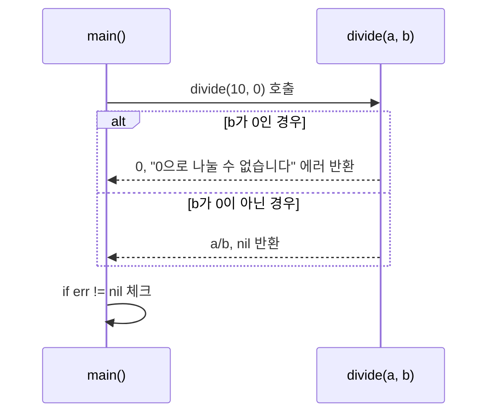
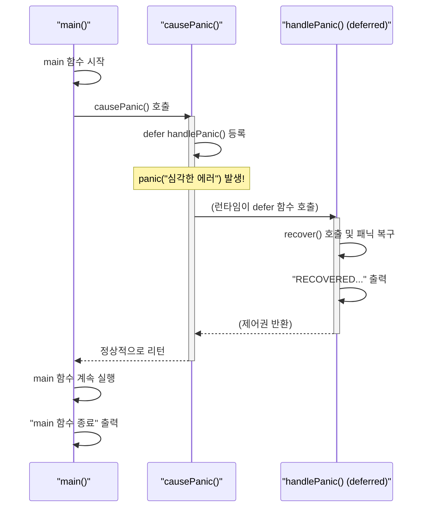

# Go언어 에러 처리

## Go의 에러 처리 철학

Java를 비롯한 많은 언어는 예외(Exception)를 처리하기 위해 `try-catch-finally` 구문을 사용함. 하지만 Go는 이러한 구문이 없음. 대신, Go는 **에러를 일반적인 값(value)으로 취급**함.

함수가 실패할 가능성이 있다면, 반환값으로 `error` 타입을 함께 반환하여 호출자에게 에러가 발생했음을 명시적으로 알림. 호출자는 반환된 `error` 값을 확인하고 적절한 처리를 해야 함.

> 이미 2단원에서 간략히 살펴본 내용 입니다.

### Go 에러 처리 vs Java 예외 처리

| 구분 | Go (Golang) | Java |
|---|---|---|
| **처리 방식** | 함수가 `error` 값을 반환. `if err != nil`로 체크. | `try-catch` 블록으로 예외를 잡아서 처리. |
| **에러 종류** | 컴파일 시점에 확인되지 않는 런타임 에러. | `Checked Exception`과 `Unchecked Exception` (RuntimeException)으로 구분. |
| **흐름 제어** | 일반적인 코드 흐름과 동일. `if`문으로 분기. | `try-catch`를 통해 코드 실행 흐름이 점프함. |
| **강제성** | `error` 반환값을 무시할 수 있음 (나쁜 습관). | `Checked Exception`은 반드시 처리해야 컴파일됨. |

## `error` 인터페이스 다루기

Go에서 에러는 다음 시그니처를 가진 `error`라는 내장 인터페이스임.

```go
type error interface {
    Error() string
}
```

어떤 타입이든 `Error() string` 메서드를 구현하면 `error` 타입으로 사용될 수 있음.

### 기본 에러 처리 실습

0으로 나누기 연산을 시도할 때 에러를 반환하는 함수를 만들어봄.

#### 실행 흐름도



**실습 파일: `09-에러처리/01-기본-에러-처리/main.go`**

```go
package main

import (
	"errors"
	"fmt"
)

// 두 수를 나누는 함수. 실패 시 error를 반환함.
func divide(a, b float64) (float64, error) {
	// 나누는 수가 0인 경우
	if b == 0 {
		// errors.New 함수로 새로운 에러 메시지를 생성하여 반환
		return 0, errors.New("0으로 나눌 수 없습니다")
	}
	// 성공한 경우, 결과와 함께 nil을 반환 (에러가 없다는 의미)
	return a / b, nil
}

func main() {
	// 성공 사례
	result, err := divide(10, 2)
	if err != nil { // 에러가 발생했는지 확인
		fmt.Printf("에러 발생: %s\n", err)
	} else {
		fmt.Printf("10 / 2 = %.2f\n", result)
	}

	// 실패 사례
	result, err = divide(10, 0)
	if err != nil { // 에러가 발생했는지 확인
		fmt.Printf("에러 발생: %s\n", err)
	} else {
		fmt.Printf("10 / 0 = %.2f\n", result)
	}
}
```

> **실행:** `go run main.go`를 실행하면, 첫 번째 `divide` 호출은 성공하고 두 번째 호출에서는 "에러 발생: 0으로 나눌 수 없습니다"라는 메시지가 출력됨.

## `panic`과 `recover`

대부분의 에러는 `error` 값을 반환하여 처리해야 하지만, 프로그램이 더 이상 정상적으로 실행될 수 없는 심각한 상황에서는 `panic`을 사용할 수 있음.

- **`panic`**: 현재 함수의 실행을 즉시 멈추고, `defer`된 함수들을 실행한 후 상위 호출 함수로 제어를 넘김. 이 과정이 콜 스택의 최상단(main 함수)까지 반복되면 프로그램이 비정상 종료됨. Java의 `RuntimeException`과 유사하게, 예측 불가능하거나 복구 불가능한 상황에 사용됨.
- **`recover`**: `panic`으로 인해 중단된 프로그램의 제어를 다시 획득하는 데 사용되는 내장 함수. `defer`된 함수 내에서만 직접 호출해야 의미가 있음. `recover`는 `panic`이 발생했을 때 `panic`에 전달된 값을 반환하고, 그렇지 않으면 `nil`을 반환함.

### `panic`과 `recover` 실습

#### 실행 흐름도



**실습 파일: `09-에러처리/02-패닉과-복구/main.go`**

```go
package main

import "fmt"

// panic으로부터 프로그램을 복구하는 함수
func handlePanic() {
	// recover() 함수를 호출
	// 만약 패닉 상태라면, recover는 panic에 전달된 값을 반환함
	a := recover()
	if a != nil {
		fmt.Println("RECOVERED:", a) // 복구 메시지 출력
	}
}

// 패닉을 발생시키는 함수
func causePanic() {
	// 함수가 종료되기 직전에 항상 handlePanic이 실행되도록 defer 설정
	defer handlePanic()

	// "심각한 에러" 메시지와 함께 패닉 발생
	panic("심각한 에러")
}

func main() {
	fmt.Println("main 함수 시작")
	causePanic() // 패닉을 발생시키는 함수 호출
	// causePanic 내부에서 panic이 발생했지만, handlePanic에 의해 복구되었으므로
	// 프로그램이 종료되지 않고 이 라인이 실행됨.
	fmt.Println("main 함수 종료")
}
```

> **실행:** `go run main.go`를 실행하면 "심각한 에러"로 인해 프로그램이 중단되지 않고, "RECOVERED: 심각한 에러" 메시지가 출력된 후 "main 함수 종료"까지 정상적으로 실행됨. `defer`와 `recover`가 없었다면 프로그램은 `panic`과 함께 비정상 종료되었을 것임.

## 정리

Go의 에러 처리는 명시적이며, 개발자가 에러를 인지하고 처리하도록 유도함.

- **`error` 값**: 예측 가능한 오류(예: 파일 없음, 네트워크 연결 실패, 잘못된 입력)에 사용. 함수의 반환값으로 처리.
- **`panic`**: 프로그래머의 실수나 정말로 복구 불가능한 상황(예: nil 포인터 역참조, 배열 인덱스 초과)에 사용.
- **`recover`**: `panic`이 서버 전체를 다운시키는 것을 방지하는 등, 제한적인 목적으로 사용해야 함.

Java의 `try-catch`에 익숙한 개발자에게는 처음에는 어색할 수 있지만, Go의 방식은 코드를 더 단순하고 예측 가능하게 만드는 장점이 있음. 항상 `if err != nil`을 습관화하는 것이 좋음.