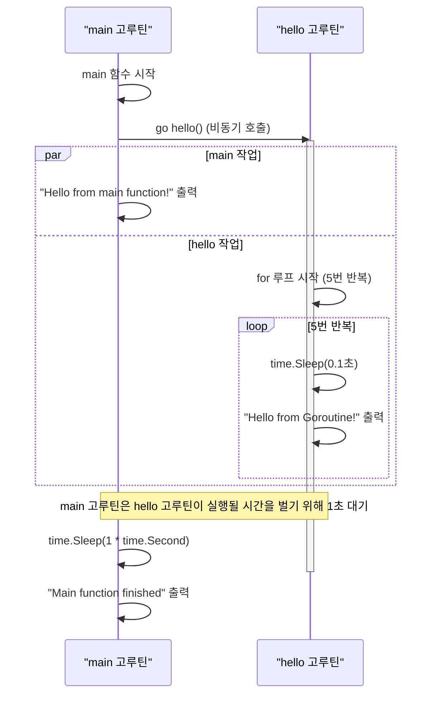
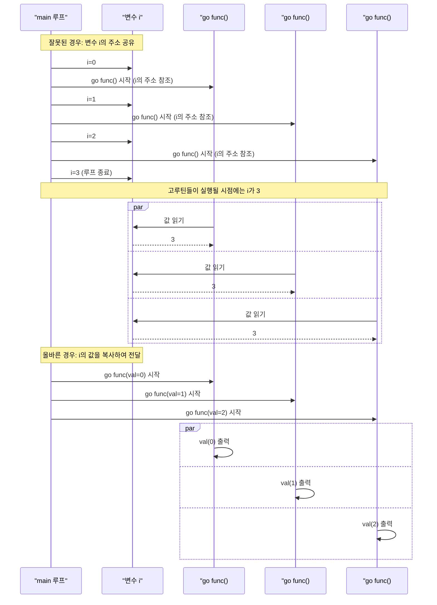

# Go언어 고루틴 (Goroutine) - 가벼운 동시성 처리

Go 언어의 가장 강력한 기능 중 하나인 고루틴(Goroutine)을 통해 동시성(Concurrency) 프로그래밍의 기초를 알아봄. Java의 스레드(Thread)와 비교하여 고루틴이 왜 '가벼운 스레드'라 불리는지 이해하고, `go` 키워드를 사용해 동시성을 구현하는 방법을 실습함.

## 고루틴이란?

고루틴은 Go 런타임이 관리하는 **매우 가벼운 논리적 스레드**임. 운영체제의 스레드(OS Thread)보다 훨씬 적은 메모리(초기 약 2KB)로 시작하며, 생성과 전환 비용이 매우 저렴하여 수천, 수만 개를 동시에 실행하는 것도 가능함.

### 고루틴 vs Java 스레드

Java 개발자에게 고루틴은 `Thread` 클래스나 `Runnable` 인터페이스를 구현하는 것과 유사하게 느껴질 수 있지만, 근본적인 차이가 있음.

| 구분 | Go 고루틴 (Goroutine) | Java 스레드 (Thread) |
|---|---|---|
| **실행 단위** | Go 런타임이 관리하는 논리적 스레드 | 운영체제(OS)가 직접 관리하는 OS 스레드 |
| **메모리** | 초기 약 2KB, 필요에 따라 동적 확장 | 고정된 크기의 스택 (보통 1MB 이상) |
| **생성/전환 비용** | 매우 저렴하고 빠름 | 상대적으로 비싸고 느림 |
| **개수** | 수만 ~ 수백만 개 생성 가능 | 수백 ~ 수천 개 생성 시 시스템에 부담 |
| **생성 방법** | `go` 키워드 + 함수 호출 | `new Thread().start()` 또는 `ExecutorService` 사용 |

## `go` 키워드로 고루틴 시작하기

Go에서 함수를 비동기적으로 실행하는 것은 놀랍도록 간단함. 함수 호출 앞에 `go` 키워드만 붙이면 됨.

### 기본 고루틴 실습

`hello` 함수를 일반적인 동기 방식으로 호출했을 때와, `go` 키워드를 붙여 고루틴으로 비동기 호출했을 때의 차이를 알아봄.

#### 실행 흐름도



**실습 파일: `10-고루틴/01-기본-고루틴/main.go`**

```go
package main

import (
	"fmt"
	time "time"
)

// "Hello" 메시지를 5번 출력하는 함수
func hello() {
	for i := 0; i < 5; i++ {
		time.Sleep(100 * time.Millisecond) // 0.1초 대기
		fmt.Println("Hello from Goroutine!")
	}
}

func main() {
	// 1. 일반적인 함수 호출 (동기 방식)
	// hello() 함수가 모두 실행될 때까지 main 함수는 대기함
	// hello()

	// 2. 고루틴을 사용한 함수 호출 (비동기 방식)
	go hello() // hello() 함수를 새로운 고루틴에서 실행

	fmt.Println("Hello from main function!")

	// main 함수가 바로 종료되면, 생성된 고루틴이 실행될 기회조차 얻지 못하고 사라짐
	// 이를 방지하기 위해 임시로 1초간 대기 (좋은 방법은 아님)
	time.Sleep(1 * time.Second)

	fmt.Println("Main function finished")
}
```

> **실행:** `go run main.go`를 실행하면, `main` 함수의 출력과 `hello` 고루틴의 출력이 뒤섞여 나오는 것을 볼 수 있음. 이는 두 작업이 동시에 실행되고 있다는 증거임. `time.Sleep` 주석을 해제하거나 시간을 줄이면 `hello` 고루틴의 출력이 보이지 않을 수 있음.

> **주의:** `time.Sleep`을 사용하여 고루틴을 기다리는 것은 실전에서 사용하면 안 되는 방법임. 정확한 동기화가 필요하며, 이는 다음 시간에 배울 **채널(Channel)**과 **WaitGroup**으로 해결함.

## 익명 함수와 고루틴

별도의 함수를 정의하지 않고, 일회성으로 사용할 함수를 익명 함수(Anonymous Function)로 만들어 바로 고루틴으로 실행할 수 있음.

### 반복문에서 고루틴 사용 시 주의점

반복문 안에서 고루틴을 사용할 때, 반복문의 변수를 그대로 사용하면 예상치 못한 결과가 발생할 수 있음. 이는 모든 고루틴이 같은 변수(의 메모리 주소)를 참조하기 때문임.

#### 실행 흐름도



**실습 파일: `10-고루틴/02-익명함수/main.go`**

```go
package main

import (
	"fmt"
	time "time"
)

func main() {
	// 잘못된 예: 반복 변수 i를 직접 사용
	fmt.Println("잘못된 경우:")
	for i := 0; i < 3; i++ {
		// 이 고루틴은 i의 메모리 주소를 참조함
		// 고루틴이 실행될 시점에는 반복문이 끝나 i는 3이 되어 있을 가능성이 높음
		go func() {
			fmt.Println(i)
		}()
	}
	time.Sleep(1 * time.Second)

	fmt.Println("\n올바른 예 (1): 변수 복사")
	// 올바른 예 (1): 반복 변수를 고루틴 내의 지역 변수로 복사
	for i := 0; i < 3; i++ {
		i := i // 새로운 변수 i에 현재 i의 값을 복사 (Shadowing)
		go func() {
			fmt.Println(i) // 복사된 변수를 사용
		}()
	}
	time.Sleep(1 * time.Second)

	fmt.Println("\n올바른 예 (2): 인자로 전달")
	// 올바른 예 (2): 반복 변수를 고루틴 함수의 인자로 전달
	for i := 0; i < 3; i++ {
		go func(val int) {
			fmt.Println(val)
		}(i) // 현재 i의 값을 인자로 전달
	}
	time.Sleep(1 * time.Second)
}
```

> **실행:** `go run main.go`를 실행하면, '잘못된 경우'에는 `3`만 여러 번 출력될 수 있지만, '올바른 예'에서는 `0, 1, 2`가 순서 없이 올바르게 출력됨.

## 정리

고루틴은 Go의 동시성을 매우 쉽고 강력하게 만들어주는 핵심 기능임.

- `go` 키워드 하나로 함수를 비동기적으로 실행할 수 있음.
- OS 스레드보다 훨씬 가벼워 수많은 동시 작업을 부담 없이 처리할 수 있음.
- 반복문에서 사용할 때는 클로저 문제를 피하기 위해 변수를 복사하거나 인자로 넘겨야 함.
