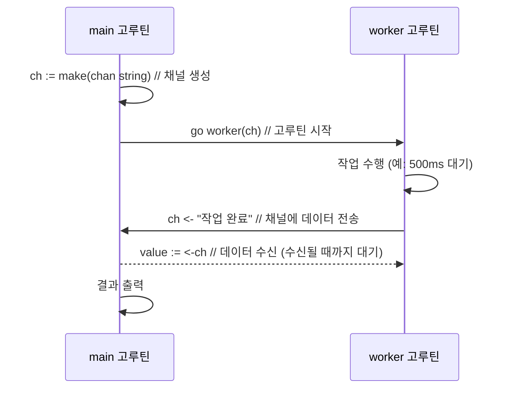
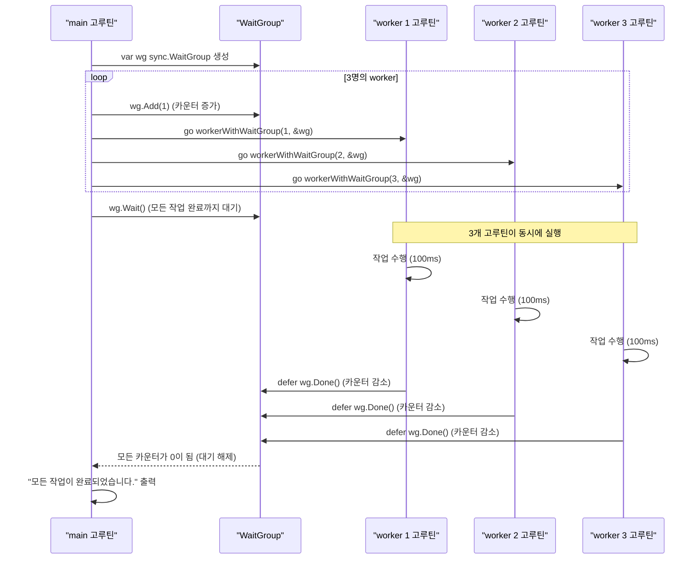
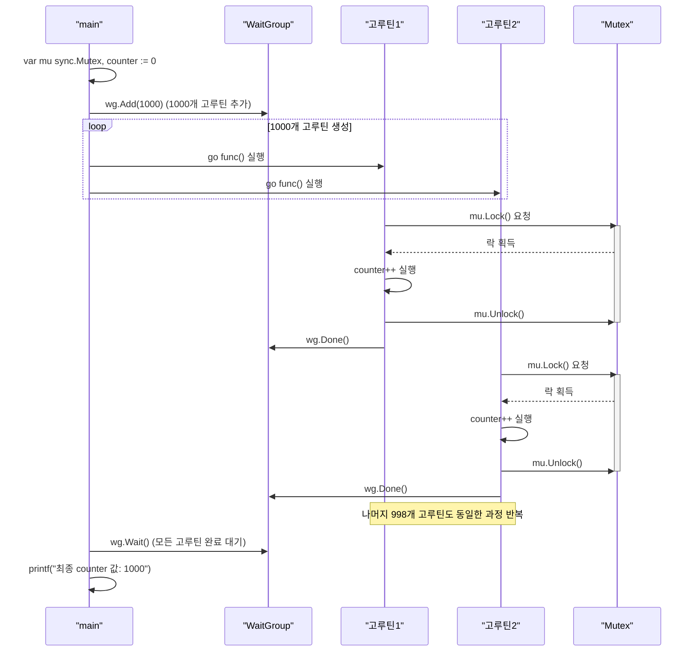

# Go언어 채널과 동기화

## 채널 (Channel)

채널은 고루틴 간에 데이터를 주고받을 수 있는 **타입이 지정된 통로**임. `<-` 연산자를 사용하여 채널에 데이터를 보내거나(`ch <- value`) 채널로부터 데이터를 받을 수 있음(`value := <-ch`).

### 기본 채널 실습

작업자(worker) 고루틴이 작업을 수행한 후, 그 결과를 `main` 고루틴에게 채널을 통해 전달하는 예제임.

이 예제는 지난 시간에 `time.Sleep`으로 해결했던 동기화 문제를 우아하게 해결함.

결국은 비동기 작업에 대한 결과를 반환받는 방법으로 이해할 수 있음.

#### 실행 흐름도



**실습 파일: `11-채널,동기화/01-기본-채널/main.go`**

```go
package main

import (
	"fmt"
	"time"
)

// 문자열을 받는 채널을 인자로 받는 함수
func worker(ch chan string) {
	fmt.Println("Worker: 작업 시작...")
	time.Sleep(500 * time.Millisecond) // 작업을 시뮬레이션하기 위해 0.5초 대기
	fmt.Println("Worker: 작업 완료")

	// 채널에 작업 완료 메시지를 보냄
	ch <- "작업이 성공적으로 끝났습니다."
}

func main() {
	// string 타입의 데이터를 주고받을 수 있는 채널 생성
	ch := make(chan string)

	// worker 함수를 고루틴으로 실행하고, 생성한 채널을 넘겨줌
	go worker(ch)

	// 채널로부터 데이터가 수신될 때까지 이 라인에서 대기(blocking)함
	msg := <-ch

	// 데이터가 수신되면 대기가 풀리고 다음 코드가 실행됨
	fmt.Printf("Main: 수신된 메시지 - '%s'\n", msg)
}
```

> **실행:** `go run main.go`를 실행하면, `main` 함수는 `worker` 고루틴이 채널에 데이터를 보낼 때까지 기다렸다가 메시지를 출력하고 종료됨. 더 이상 `time.Sleep`에 의존할 필요가 없음.

## `sync.WaitGroup`

여러 개의 고루틴이 모두 끝날 때까지 기다려야 할 때 `sync.WaitGroup`을 사용함. 채널로도 구현할 수 있지만, `WaitGroup`이 더 직관적이고 편리함.

- `wg.Add(n)`: 기다려야 할 고루틴의 수를 `n`만큼 추가.
- `wg.Done()`: 고루틴이 작업을 완료했음을 알림. `Add`로 추가한 카운터를 1 감소시킴. `defer`와 함께 사용하는 경우가 많음.
- `wg.Wait()`: 카운터가 0이 될 때까지 대기.

### WaitGroup 실습

여러 명의 작업자(worker)가 동시에 작업을 수행하고, 모든 작업이 끝날 때까지 `main` 함수가 기다리도록 구현함.

#### 실행 흐름도



**실습 파일: `11-채널,동기화/02-WaitGroup/main.go`**

```go
package main

import (
	"fmt"
	"sync"
	"time"
)

// WaitGroup의 포인터와 작업자 ID를 인자로 받는 함수
func workerWithWaitGroup(id int, wg *sync.WaitGroup) {
	// 함수가 종료될 때 wg.Done()을 호출하여 작업 완료를 알림
	defer wg.Done()

	fmt.Printf("Worker %d: 작업 시작\n", id)
	time.Sleep(100 * time.Millisecond) // 작업 시뮬레이션
	fmt.Printf("Worker %d: 작업 완료\n", id)
}

func main() {
	// WaitGroup 생성
	var wg sync.WaitGroup

	// 3개의 작업자 고루틴을 실행
	for i := 1; i <= 3; i++ {
		// 기다려야 할 고루틴의 수를 1 증가시킴
		wg.Add(1)
		// worker 함수를 고루틴으로 실행
		go workerWithWaitGroup(i, &wg)
	}

	// 모든 고루틴이 Done()을 호출할 때까지 (카운터가 0이 될 때까지) 대기
	wg.Wait()

	fmt.Println("Main: 모든 작업이 완료되었습니다.")
}
```

> **실행:** `go run main.go`를 실행하면, 3명의 작업자가 동시에 작업을 수행하고, 모든 작업이 완료된 후에야 `main` 함수가 종료 메시지를 출력함.

## `sync.Mutex` (상호 배제)

채널이 Go의 주된 동시성 처리 방식이지만, 여러 고루틴이 **메모리(변수)를 직접 공유**해야 하는 경우도 있음. 이때 공유 데이터에 대한 접근을 한 번에 하나의 고루틴만 하도록 제어해야 하며, 이를 위해 `sync.Mutex`(Mutual Exclusion, 상호 배제)를 사용함.

- `mu.Lock()`: 뮤텍스 락을 획득. 다른 고루틴이 이미 락을 가지고 있다면, 락이 해제될 때까지 대기.
- `mu.Unlock()`: 뮤텍스 락을 해제.

### Mutex 실습 (데이터 경쟁 문제 해결)

여러 고루틴이 공유 변수 `counter`를 동시에 증가시킬 때 발생하는 데이터 경쟁(Data Race) 문제와 이를 `Mutex`로 해결하는 방법을 알아봄.

#### 실행 흐름도



**실습 파일: `11-채널,동기화/03-Mutex/main.go`**

```go
package main

import (
	"fmt"
	"sync"
)

func main() {
	var wg sync.WaitGroup
	var mu sync.Mutex // 뮤텍스 생성
	counter := 0

	// 1000개의 고루틴을 실행하여 counter를 1씩 증가시킴
	for i := 0; i < 1000; i++ {
		wg.Add(1)
		go func() {
			defer wg.Done()

			// counter에 접근하기 전에 Lock을 획득
			mu.Lock()
			counter++ // 이 연산은 원자적(atomic)이지 않음
			// Lock을 해제하여 다른 고루틴이 접근할 수 있도록 함
			mu.Unlock()
		}()
	}

	wg.Wait() // 모든 고루틴이 끝날 때까지 대기

	// mu.Lock()/Unlock()을 주석 처리하고 실행하면,
	// 데이터 경쟁으로 인해 counter 값이 1000이 아닐 수 있음.
	fmt.Printf("최종 counter 값: %d\n", counter)
}
```

> **데이터 경쟁 탐지:** `go run -race main.go` 명령어를 사용하면 Go 런타임이 데이터 경쟁을 탐지하여 알려줌. `mu.Lock()`과 `mu.Unlock()`을 주석 처리하고 이 명령어로 실행해보면 데이터 경쟁이 발생했다는 보고를 볼 수 있음.

## 정리

- **채널**: 고루틴 간의 안전한 데이터 통신 채널. Go의 동시성 철학을 가장 잘 나타냄.
- **WaitGroup**: 여러 고루틴의 작업 완료를 기다리는 간단하고 효율적인 방법.
- **Mutex**: 공유 메모리에 대한 접근을 동기화하여 데이터 경쟁을 방지하는 전통적인 방법.
