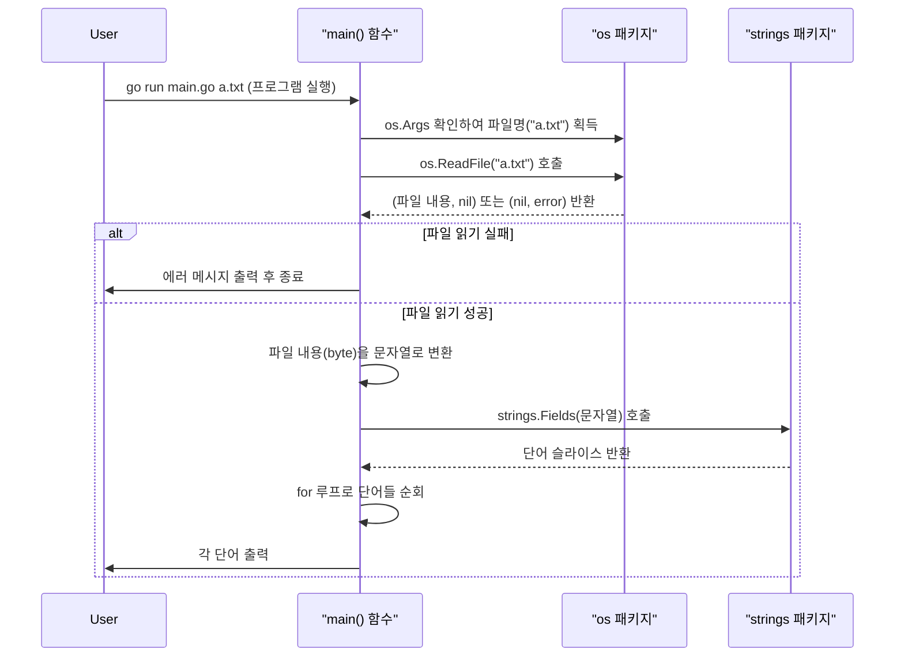
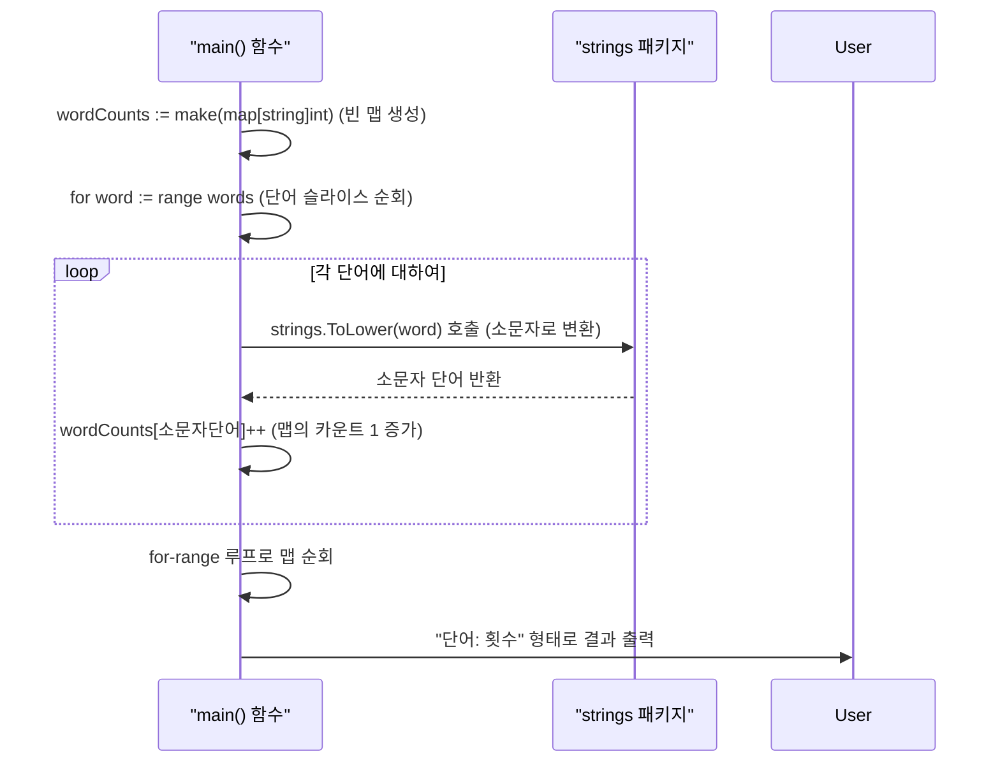
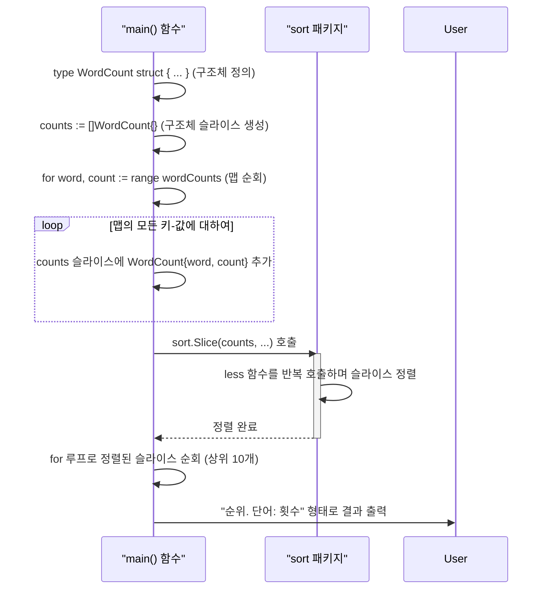

# 미니프로젝트: 파일 단어 빈도 분석기 만들기

지금까지 Go 언어의 기본 문법부터 구조체, 메서드, 에러 처리, 고루틴까지 다양한 개념을 학습했음. 이제 이 지식들을 종합하여 실용적인 커맨드라인(CLI) 도구를 만들어 볼 차례임.

이번 프로젝트의 목표는 **텍스트 파일의 단어 빈도를 분석하는 프로그램**을 만드는 것임. 이 과정을 통해 파일 입출력, 문자열 처리, 맵(map)을 이용한 데이터 집계, 구조체(struct)와 슬라이스(slice)를 활용한 정렬 등 Go 프로그래밍의 핵심적인 패턴을 익히게 될 것임.

프로그램은 다음과 같은 단계로 점진적으로 완성해 볼 것임.

1.  **1단계**: 파일 내용을 읽어 단어별로 분리하기
2.  **2단계**: 맵(Map)을 사용하여 단어의 빈도수 계산하기
3.  **3단계**: 구조체와 정렬(Sort) 기능을 이용해 결과 정렬 및 출력하기

---

## 1단계: 파일 읽고 단어로 분리하기

가장 먼저 할 일은 사용자가 지정한 파일을 읽고, 그 내용을 단어 단위로 쪼개는 것임.

### 사용될 주요 API

-   `os.Args`: 프로그램 실행 시 전달된 커맨드라인 인자(argument)를 담고 있는 문자열 슬라이스임. `os.Args[0]`은 프로그램 자신의 경로이며, `os.Args[1]`부터 사용자가 전달한 인자가 담김.
-   `os.ReadFile(filename string) ([]byte, error)`: 파일 경로를 인자로 받아, 파일 전체 내용을 바이트 슬라이스(`[]byte`)로 읽어옴. 파일이 없거나 읽기 권한이 없으면 `error`를 반환함.
-   `strings.Fields(s string) []string`: 문자열을 하나 이상의 공백(스페이스, 탭, 줄바꿈 등)을 기준으로 잘라 단어들의 슬라이스로 만들어 반환함.

### 실행 흐름 다이어그램



### 예제 소스 (1단계)

```go
// 07-미니프로젝트(2)/01-read-file/main.go
package main

import (
	"fmt"    // 표준 입출력 및 문자열 포맷팅 관련 기능 제공함
	"os"     // 운영체제와 상호작용하는 기능 제공함 (파일, 커맨드라인 인자 등)
	"strings"// 문자열 처리 관련 다양한 함수 제공함
)

func main() {
	// 1. 커맨드라인 인자(Argument) 확인
	// os.Args는 프로그램 실행 시 전달된 인자들의 슬라이스임.
	// os.Args[0]은 프로그램 이름, os.Args[1]부터가 실제 전달된 인자임.
	// 따라서 len(os.Args)가 2보다 작으면 파일명이 전달되지 않은 것임.
	if len(os.Args) < 2 {
		fmt.Println("사용법: go run main.go <파일명>")
		return // 인자가 없으면 메시지 출력 후 프로그램 종료
	}
	// 첫 번째 인자를 파일명으로 간주함.
	filename := os.Args[1]

	// 2. 파일 전체 내용 읽기
	// os.ReadFile은 파일 경로를 받아 파일 내용을 []byte 슬라이스와 error를 반환함.
	data, err := os.ReadFile(filename)
	// 파일 읽기 중 에러(파일이 없거나 권한 문제 등)가 발생했는지 확인함.
	if err != nil {
		fmt.Println("파일을 읽는 중 에러 발생:", err)
		return // 에러 발생 시 메시지 출력 후 종료
	}

	// 3. 파일 내용(byte 슬라이스)을 문자열로 변환
	// 컴퓨터는 텍스트를 숫자의 나열(byte)로 다루므로, 사람이 읽을 수 있는 문자열(string)로 변환함.
	text := string(data)

	// 4. 문자열을 공백 기준으로 잘라 단어 슬라이스로 분리
	// strings.Fields는 스페이스, 탭, 줄바꿈 등 하나 이상의 연속된 공백을 기준으로
	// 문자열을 쪼개어 단어들의 슬라이스([]string)를 만들어줌.
	words := strings.Fields(text)

	// 5. 분석 결과의 일부를 확인하기 위해 출력
	fmt.Printf("총 단어 수: %d
", len(words))
	fmt.Println("--- 파일의 첫 10개 단어 ---")
	// for 루프를 사용해 단어 슬라이스의 처음부터 최대 10개까지 출력함.
	// `i < len(words)` 조건은 단어 수가 10개 미만일 때 배열 인덱스 초과 에러를 방지함.
	for i := 0; i < 10 && i < len(words); i++ {
		fmt.Println(words[i])
	}
}
```

### 코드 해설

위 코드는 프로그램의 가장 기본적인 골격임.

1.  **패키지 임포트**: `fmt`는 콘솔 출력, `os`는 커맨드라인 인자 처리 및 파일 읽기, `strings`는 문자열을 단어로 분리하는 데 사용됨.
2.  **커맨드라인 인자 처리**: `os.Args`는 사용자가 프로그램을 실행할 때 전달한 값들을 담고 있는 문자열 슬라이스임. `go run main.go a.txt` 라고 실행했다면 `os.Args`는 `["main.go", "a.txt"]` 와 같은 값을 갖게 됨. 따라서 `len(os.Args) < 2` 라는 조건은 파일명을 입력하지 않은 경우를 걸러내는 역할을 함.
3.  **파일 읽기**: `os.ReadFile(filename)` 함수는 파일 전체를 한번에 읽어 `[]byte` (바이트 슬라이스) 형태로 반환함. Go에서 문자열은 내부적으로 UTF-8 인코딩된 바이트 배열로 표현되므로, `string(data)` 와 같이 간단한 타입 변환을 통해 바이트 슬라이스를 사람이 읽을 수 있는 문자열로 바꿀 수 있음.
4.  **단어 분리**: `strings.Fields(text)`는 매우 유용한 함수로, 단순히 띄어쓰기뿐만 아니라 탭(`	`), 줄바꿈(`
`) 등 다양한 공백 문자를 기준으로 문자열을 깔끔하게 단어들로 나누어줌.
5.  **결과 출력**: `len(words)`로 전체 단어 수를 확인하고, `for` 루프를 통해 슬라이스의 일부를 순회하며 내용을 확인함.

### 실행 결과 예시

`a.txt` 파일에 "Go is an open source programming language that makes it easy to build simple, reliable, and efficient software." 라는 내용이 저장되어 있다고 가정해봄.

```bash
$ go run main.go a.txt
총 단어 수: 19
--- 파일의 첫 10개 단어 ---
Go
is
an
open
source
programming
language
that
makes
it
```

---

## 2단계: 단어 빈도 계산하기

이제 분리된 단어들을 `map`에 저장하여 각 단어가 몇 번 등장했는지 횟수를 세어볼 것임.

### 사용될 주요 API

-   `make(map[string]int)`: 키는 `string` 타입(단어), 값은 `int` 타입(횟수)인 맵을 초기화하여 생성함.
-   `strings.ToLower(s string)`: 모든 영문 대문자를 소문자로 변환함. "Go"와 "go"를 같은 단어로 취급하기 위해 사용함.

### 실행 흐름 다이어그램



### 예제 소스 (2단계)

```go
// 07-미니프로젝트(2)/02-count-words/main.go
package main

import (
	"fmt"
	"os"
	"strings"
)

func main() {
	// 이전 단계와 동일: 커맨드라인 인자 확인 및 파일 읽기
	if len(os.Args) < 2 {
		fmt.Println("사용법: go run main.go <파일명>")
		return
	}
	filename := os.Args[1]

	data, err := os.ReadFile(filename)
	if err != nil {
		fmt.Println("파일 읽기 에러:", err)
		return
	}

	text := string(data)
	words := strings.Fields(text)

	// 1. 단어의 빈도를 저장할 맵(map) 생성
	// make 함수를 사용해 키는 string 타입, 값은 int 타입인 맵을 초기화함.
	// 이 맵은 각 단어(key)가 몇 번 등장했는지(value)를 저장하는 용도임.
	wordCounts := make(map[string]int)

	// 2. 단어 슬라이스를 순회하며 빈도 계산
	// for-range 구문을 사용해 슬라이스의 모든 단어를 하나씩 순회함.
	// `_`는 인덱스를 무시하겠다는 의미임.
	for _, word := range words {
		// "Go", "go", "GO" 등을 모두 같은 단어로 취급하기 위해 소문자로 변환함.
		// 이렇게 하면 대소문자 구분 없이 정확한 빈도를 셀 수 있음.
		lowerWord := strings.ToLower(word)
		
		// 맵에 해당 단어를 키로 하여 값을 1 증가시킴.
		// 만약 맵에 해당 키가 처음 등장하는 것이라면, Go는 int의 제로 값(0)으로 자동 초기화한 뒤 1을 더해줌.
		// 즉, `wordCounts[lowerWord] = wordCounts[lowerWord] + 1` 과 동일함.
		wordCounts[lowerWord]++
	}

	// 3. 계산된 빈도수 결과 출력
	fmt.Println("--- 단어 빈도수 ---")
	// for-range 구문으로 맵을 순회하며 모든 키(단어)와 값(횟수)을 출력함.
	// 맵은 순서를 보장하지 않으므로, 실행할 때마다 출력 순서가 달라질 수 있음.
	for word, count := range wordCounts {
		fmt.Printf("%s: %d
", word, count)
	}
}
```

### 코드 해설

1단계에서 얻은 단어 슬라이스를 바탕으로, 각 단어의 등장 횟수를 세는 로직이 추가되었음.

1.  **맵(Map) 초기화**: `make(map[string]int)` 코드는 단어(string)를 키로, 등장 횟수(int)를 값으로 갖는 맵을 생성함. 맵은 데이터를 키-값 쌍으로 저장하는 매우 효율적인 자료구조임.
2.  **대소문자 통일**: `strings.ToLower(word)`를 호출하여 모든 단어를 소문자로 바꿈. 이렇게 해야 "Apple"과 "apple"을 같은 단어로 집계할 수 있음. 데이터 정규화(Normalization)의 일종임.
3.  **빈도수 계산**: `wordCounts[lowerWord]++`는 이 코드의 핵심임.
    *   `wordCounts` 맵에서 `lowerWord`라는 키를 찾음.
    *   만약 키가 **존재하면**, 해당 키의 값(카운트)을 1 증가시킴.
    *   만약 키가 **존재하지 않으면**, Go는 자동으로 해당 키를 새로 만들고 값의 타입에 맞는 '제로 값'(int의 경우 0)으로 초기화한 뒤, 1을 더해 `wordCounts[lowerWord]`는 1이 됨. 이 덕분에 별도의 `if`문 없이도 코드를 간결하게 작성할 수 있음.
4.  **결과 출력**: `for-range` 루프를 사용해 맵의 모든 요소를 순회하며 결과를 출력함. **중요한 점은 맵은 순서를 보장하지 않는다는 것**임. 따라서 출력 결과는 실행할 때마다 순서가 바뀔 수 있음.

### 실행 결과 예시

`b.txt` 파일에 "A big black bug bit a big black dog on his big black nose." 라는 내용이 저장되어 있다고 가정해봄.

```bash
$ go run main.go b.txt
--- 단어 빈도수 ---
a: 2
big: 3
black: 3
bug: 1
bit: 1
dog: 1
on: 1
his: 1
nose.: 1
# (출력 순서는 실행 시마다 다를 수 있습니다)
```

---

## 3단계: 결과 정렬 및 상위 N개 출력하기

맵은 순서가 보장되지 않으므로, 가장 많이 등장한 단어 순으로 결과를 보려면 정렬 과정이 필요함. Go에서는 맵을 직접 정렬할 수 없으므로, 맵의 내용을 구조체 슬라이스로 옮겨 담은 뒤 정렬하는 것이 일반적인 방법임.

### 사용될 주요 API

-   `sort.Slice(slice any, less func(i, j int) bool)`: Go의 강력한 정렬 함수임. 어떤 타입의 슬라이스든 두 번째 인자로 전달된 `less` 함수의 조건에 따라 정렬할 수 있음. `less` 함수는 인덱스 `i`의 요소가 `j`의 요소보다 앞에 와야 하면 `true`를 반환하도록 작성해야 함.

### 실행 흐름 다이어그램



### 예제 소스 (3단계 - 최종본)

```go
// 07-미니프로젝트(2)/03-sort-result/main.go
package main

import (
	"fmt"
	"os"
	"sort"    // 슬라이스 정렬 기능을 제공하는 패키지임
	"strings"
)

// 1. 정렬을 위해 단어와 빈도를 함께 담을 구조체 정의
// 맵은 순서가 없어서 정렬할 수 없으므로,
// 단어와 빈도수 정보를 함께 담을 수 있는 구조체를 정의하고
// 이 구조체의 슬라이스를 만들어 정렬할 것임.
type WordCount struct {
	Word  string // 단어
	Count int    // 빈도수
}

func main() {
	// 이전 단계와 동일: 인자 확인, 파일 읽기, 단어 빈도 계산
	if len(os.Args) < 2 {
		fmt.Println("사용법: go run main.go <파일명>")
		return
	}
	filename := os.Args[1]

	data, err := os.ReadFile(filename)
	if err != nil {
		fmt.Println("파일 읽기 에러:", err)
		return
	}

	text := string(data)
	words := strings.Fields(text)
	wordCounts := make(map[string]int)

	for _, word := range words {
		lowerWord := strings.ToLower(word)
		wordCounts[lowerWord]++
	}

	// 2. 맵(map)을 구조체 슬라이스(slice)로 변환
	// 정렬을 수행하기 위해, 순서가 없는 맵의 데이터를 순서가 있는 슬라이스로 옮겨 담음.
	// `make`의 세 번째 인자로 용량(capacity)을 지정하면, 슬라이스가 동적으로 확장될 때 발생하는
	// 불필요한 메모리 재할당을 줄여 성능을 최적화할 수 있음.
	counts := make([]WordCount, 0, len(wordCounts))
	for word, count := range wordCounts {
		counts = append(counts, WordCount{Word: word, Count: count})
	}

	// 3. 슬라이스를 '빈도수' 기준으로 정렬
	// sort.Slice 함수는 어떤 타입의 슬라이스든 정렬할 수 있는 강력한 기능을 제공함.
	// 두 번째 인자로 'less' 함수를 전달해야 함.
	// 이 함수는 두 요소(i, j)를 비교하여 첫 번째 요소(i)가 앞으로 와야 하면 true를 반환함.
	// `counts[i].Count > counts[j].Count`는 빈도수(Count)가 큰 것이 앞으로 오도록(내림차순) 정렬하라는 의미임.
	sort.Slice(counts, func(i, j int) bool {
		return counts[i].Count > counts[j].Count
	})

	// 4. 최종 결과 출력 (상위 10개)
	// 정렬된 슬라이스를 순회하며 상위 10개의 결과만 출력함.
	// `i < len(counts)` 조건은 전체 단어 종류가 10개 미만일 경우를 대비한 안전장치임.
	for i := 0; i < 10 && i < len(counts); i++ {
		fmt.Printf("%d. %s: %d
", i+1, counts[i].Word, counts[i].Count)
	}
}
```

### 코드 해설

2단계까지의 결과는 순서가 뒤죽박죽이었음. 3단계에서는 이 결과를 사용자가 보기 좋게 빈도수 순으로 정렬하는 방법을 다룸.

1.  **`WordCount` 구조체 정의**: Go에서는 맵 자체를 정렬할 수 없음. 따라서 정렬을 하려면 정렬의 대상이 될 데이터들을 순서가 있는 자료구조, 즉 **슬라이스**에 담아야 함. `WordCount` 구조체는 단어(`Word`)와 빈도수(`Count`)를 한 묶음으로 다루기 위해 정의한 커스텀 데이터 타입임.
2.  **맵에서 슬라이스로 데이터 이전**: `for-range` 루프로 `wordCounts` 맵을 순회하며, 각 키-값 쌍을 `WordCount` 구조체 인스턴스로 만들어 `counts` 슬라이스에 `append` 함. 이 과정을 거치면 순서 없는 맵의 모든 정보가 순서 있는 슬라이스로 복사됨.
    *   **성능 팁**: `make([]WordCount, 0, len(wordCounts))` 처럼 `make` 함수에 세 번째 인자로 용량(capacity)을 주면, `append`가 반복될 때 슬라이스의 메모리 공간이 재할당되는 횟수를 최소화하여 효율을 높일 수 있음.
3.  **`sort.Slice`를 이용한 정렬**: 이 프로젝트의 핵심 중 하나임.
    *   `sort.Slice`는 Go의 표준 정렬 함수로, 어떤 구조의 슬라이스든 정렬할 수 있음.
    *   첫 번째 인자로는 정렬할 슬라이스(`counts`)를 전달함.
    *   두 번째 인자로는 **less 함수**라고 불리는 비교 함수를 직접 만들어 전달해야 함. 이 함수는 두 개의 인덱스 `i`와 `j`를 받아서, `슬라이스[i]`가 `슬라이스[j]`보다 **앞에 와야 한다면 `true`를 반환**하도록 로직을 작성해야 함.
    *   `return counts[i].Count > counts[j].Count` 라는 조건은 "i번째 요소의 Count가 j번째 요소의 Count보다 크면, i번째 요소가 더 앞 순서이다" 라는 의미임. 즉, `Count`를 기준으로 **내림차순** 정렬을 수행함. 오름차순으로 하려면 부등호를 `<`로 바꾸면 됨.
4.  **상위 N개 결과 출력**: 정렬이 완료된 슬라이스는 이제 빈도수가 높은 순서대로 정렬되어 있음. `for` 루프를 이용해 0번 인덱스부터 순서대로 출력하면 가장 빈도가 높은 단어부터 보이게 됨. `i < 10` 조건을 추가하여 상위 10개만 출력하도록 제한함.

### 실행 결과 예시

`b.txt` 파일("A big black bug bit a big black dog on his big black nose.")로 실행했을 때의 최종 결과임.

```bash
$ go run main.go b.txt
--- 'b.txt' 파일 단어 빈도 분석 결과 (상위 10개) ---
1. big: 3
2. black: 3
3. a: 2
4. bug: 1
5. bit: 1
6. dog: 1
7. on: 1
8. his: 1
9. nose.: 1
```
(빈도수가 같은 단어들(예: big, black)의 순서는 실행 시마다 바뀔 수 있음)

### 최종 정리

이로써 커맨드라인으로 전달된 파일의 단어 빈도를 분석하고, 가장 많이 사용된 단어 순으로 결과를 보여주는 프로그램을 완성했음. 이 프로젝트를 통해 Go의 기본적인 파일 처리, 문자열 조작, 맵, 구조체, 슬라이스, 그리고 `sort` 패키지의 활용법까지 종합적으로 경험할 수 있었음.

여기서 더 나아가 여러 파일을 동시에 분석하도록 **고루틴**을 적용해보거나, 특정 단어를 무시하는 기능 등을 추가하며 프로그램을 더 발전시켜 볼 수도 있을 것임.