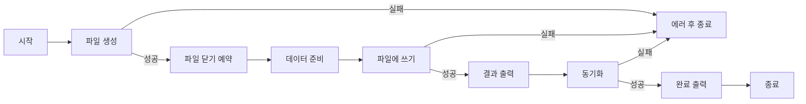
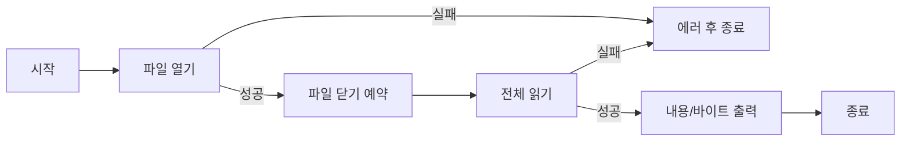
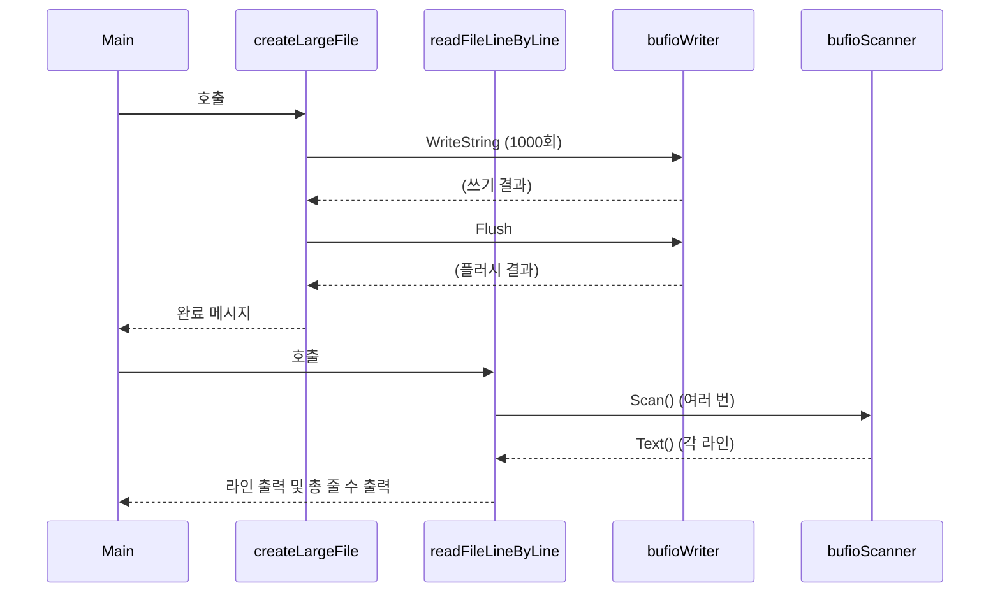
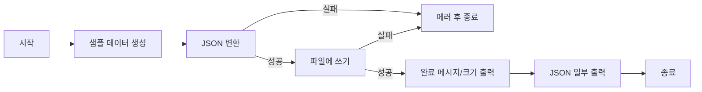
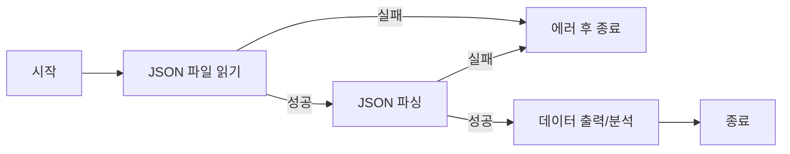
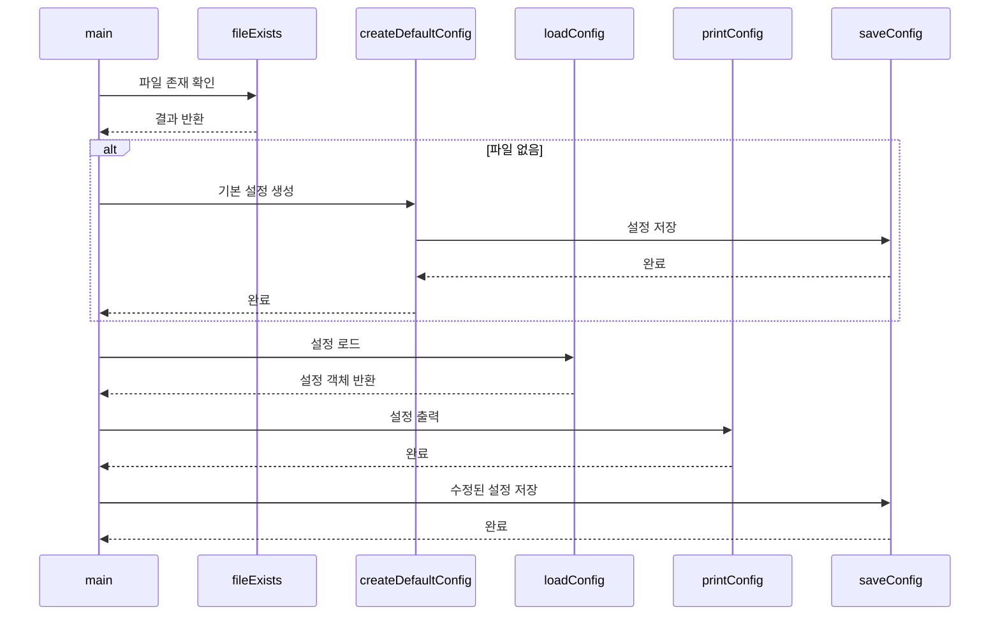

# Go 언어로 마스터하는 파일 입출력: 텍스트부터 JSON까지

## 1. 파일 입출력 개요

프로그램은 외부 데이터와 상호작용하기 위해 파일 입출력(File I/O) 기능을 사용함. Go 언어는 `os` 패키지와 `io` 패키지를 통해 파일 시스템과 상호작용하는 강력하고 유연한 방법을 제공함.

### 1.1. Go vs Java 파일 입출력 철학 비교

Java는 객체 지향적 접근 방식으로 스트림(Stream) 클래스들을 계층화하여 제공하는 반면, Go는 인터페이스 기반의 단순하고 직관적인 API를 제공함.

| 측면                    | Go 언어                                    | Java                                         |
|-------------------------|--------------------------------------------|--------------------------------------------|
| **설계 철학**           | 단순함과 명확함                            | 객체 지향과 확장성                          |
| **주요 패키지**         | `os`, `io`, `bufio`, `encoding/json`      | `java.io`, `java.nio`, `java.util.Scanner` |
| **파일 핸들링**         | `*os.File` 구조체 중심                     | `InputStream`/`OutputStream` 클래스 계층    |
| **에러 처리**           | 다중 반환값 (value, error)                 | 예외 처리 (try-catch-finally)              |
| **리소스 관리**         | `defer` 키워드로 명시적 관리               | `try-with-resources` 또는 `finally` 블록    |
| **버퍼링**              | `bufio` 패키지로 간단히 래핑               | `BufferedReader`/`BufferedWriter` 클래스    |
| **JSON 처리**           | 내장 `encoding/json` 패키지                | 외부 라이브러리 (Jackson, Gson 등)          |
| **메모리 효율성**       | 바이트 슬라이스 재사용 가능                | GC에 의존적인 객체 생성                     |

### 1.2. 파일 처리 패턴 비교

**Java 방식 (전통적인 방법):**
```java
// Java - 파일 읽기 예시
try (BufferedReader reader = new BufferedReader(new FileReader("data.txt"))) {
    String line;
    while ((line = reader.readLine()) != null) {
        System.out.println(line);
    }
} catch (IOException e) {
    e.printStackTrace();
}
```

**Go 방식:**
```go
// Go - 파일 읽기 예시
file, err := os.Open("data.txt")
if err != nil {
    log.Fatal(err)
}
defer file.Close()

scanner := bufio.NewScanner(file)
for scanner.Scan() {
    fmt.Println(scanner.Text())
}
```

### 1.3. Go vs Java 파일 처리 성능 비교

| 작업 유형              | Go 언어 특징                              | Java 특징                                 |
|------------------------|-------------------------------------------|--------------------------------------------|
| **메모리 사용량**      | 바이트 슬라이스 재사용으로 효율적         | 객체 생성/GC로 인한 오버헤드               |
| **동시성 처리**        | 고루틴으로 경량 스레드 지원               | 스레드 풀 관리 필요                        |
| **에러 처리**          | 명시적 에러 반환으로 예측 가능             | 예외 처리로 인한 성능 오버헤드             |
| **컴파일 최적화**      | 정적 컴파일로 런타임 최적화               | JIT 컴파일로 웜업 시간 필요                |

---

## 2. 기본 파일 입출력 실습

### 2.1. 기본 파일 쓰기 및 읽기

먼저 Go에서 가장 기본적인 파일 쓰기와 읽기 작업을 실습해봄. 파일을 생성하고 내용을 쓴 다음, 다시 읽어오는 과정을 통해 파일 입출력의 기본 개념을 익힘.

#### 실행 흐름 순서도



**실습 파일: `12-파일입출력/01-기본파일쓰기/main.go`**

```go
package main

import (
	"fmt"
	"os" // 운영체제와의 인터페이스를 제공하는 패키지
)

func main() {
	// 1. 파일 생성: os.Create()는 파일을 생성하거나 기존 파일을 덮어씀
	//    Java의 new FileOutputStream("example.txt")와 유사함
	file, err := os.Create("../example.txt")
	if err != nil {
		fmt.Println("파일 생성 실패:", err)
		return // Java의 throw new IOException()과 유사한 에러 처리
	}
	// 2. defer를 사용한 리소스 관리: Java의 try-with-resources와 유사
	//    함수가 종료될 때 자동으로 파일이 닫힘
	defer file.Close()

	// 3. 파일에 쓸 데이터 준비: Go는 바이트 슬라이스를 사용
	//    Java의 byte[] 배열과 유사하지만 더 유연함
	data := []byte("Go 언어 파일 입출력 실습\n첫 번째 줄입니다.\n두 번째 줄입니다.")

	// 4. 파일에 데이터 쓰기: Write 메서드는 바이트 슬라이스를 받음
	//    Java의 OutputStream.write(byte[])와 동일한 역할
	bytesWritten, err := file.Write(data)
	if err != nil {
		fmt.Println("파일 쓰기 실패:", err)
		return
	}

	// 5. 결과 출력 및 동기화
	fmt.Printf("파일에 %d 바이트를 성공적으로 썼습니다.\n", bytesWritten)

	// 6. 파일 버퍼를 디스크에 강제로 쓰기 (Java의 flush()와 유사)
	err = file.Sync()
	if err != nil {
		fmt.Println("파일 동기화 실패:", err)
		return
	}

	fmt.Println("파일 쓰기 완료")
}
```

#### 코드 설명

이 예제는 Go에서 가장 기본적인 파일 쓰기 방법을 보여줌:

1. **파일 생성 (`os.Create()`)**: 새 파일을 생성하거나 기존 파일을 덮어씀. Java의 `FileOutputStream`과 달리 단일 함수로 처리됨.

2. **에러 처리**: Go의 특징적인 다중 반환값을 활용하여 에러를 명시적으로 처리함. Java의 예외와 달리 컴파일 시점에 에러 처리를 강제함.

3. **리소스 관리 (`defer`)**: `defer` 키워드로 함수 종료 시 자동으로 파일을 닫음. Java의 try-with-resources보다 간결함.

4. **바이트 슬라이스 사용**: Go는 `[]byte` 타입으로 바이너리 데이터를 처리함. Java의 `byte[]`보다 유연하고 효율적임.

5. **동기화 (`Sync()`)**: 메모리 버퍼의 내용을 디스크에 강제로 쓰기. 중요한 데이터의 경우 필수적임.

**Java와의 차이점:**
- Go: 에러 반환 → 명시적 처리 → 예측 가능한 에러 핸들링
- Java: 예외 던지기 → try-catch → 런타임 에러 가능성

### 2.2. 기본 파일 읽기

가장 간단한 방법으로 파일의 전체 내용을 한 번에 메모리로 읽어오는 방법을 실습함. 작은 크기의 파일에 적합한 방식임.

#### 실행 흐름 순서도



**실습 파일: `12-파일입출력/02-기본파일읽기/main.go`**

```go
package main

import (
	"fmt"
	"io"  // 입출력 프리미티브를 제공하는 패키지
	"os"  // 운영체제 인터페이스 패키지
)

func main() {
	// 1. 파일 열기: os.Open()은 읽기 전용으로 파일을 엶
	//    Java의 new FileInputStream("example.txt")와 유사
	file, err := os.Open("../example.txt")
	if err != nil {
		fmt.Println("파일 열기 실패:", err)
		return // Java의 FileNotFoundException 처리와 유사
	}
	// 2. defer로 파일 닫기 보장
	defer file.Close()

	// 3. 파일 전체 내용 읽기: io.ReadAll()은 파일의 모든 내용을 메모리로 읽음
	//    작은 파일에 적합하며, Java의 Files.readAllBytes()와 유사
	content, err := io.ReadAll(file)
	if err != nil {
		fmt.Println("파일 읽기 실패:", err)
		return
	}

	// 4. 읽은 내용 출력: 바이트 슬라이스를 문자열로 변환
	//    Java의 new String(bytes, StandardCharsets.UTF_8)와 유사
	fmt.Println("파일 내용:")
	fmt.Printf("--- 시작 ---\n%s\n--- 끝 ---\n", string(content))

	// 5. 파일 크기 정보 출력
	fmt.Printf("총 %d 바이트를 읽었습니다.\n", len(content))
}
```

#### 코드 설명

이 예제는 파일의 전체 내용을 한 번에 메모리로 읽어오는 방법을 보여줌:

1. **파일 열기 (`os.Open()`)**: 읽기 전용으로 파일을 열음. Java의 `FileInputStream`과 달리 간단한 함수 호출로 처리됨.

2. **전체 내용 읽기 (`io.ReadAll()`)**: 파일의 모든 내용을 메모리로 한 번에 읽음. 작은 파일에 적합하며 Java의 `Files.readAllBytes()`와 유사함.

3. **바이트-문자열 변환**: Go는 `string([]byte)` 변환이 매우 간단함. Java처럼 인코딩을 명시할 필요가 없어 편리함.

4. **메모리 효율성**: 작은 파일에는 적합하지만 대용량 파일에는 메모리 부족을 일으킬 수 있음.

**Java와의 차이점:**
- Go: `io.ReadAll()` 한 번의 호출로 전체 읽기 완료
- Java: `FileInputStream` + 반복문 또는 `Files.readAllBytes()` 사용

**주의사항:**
- 대용량 파일 처리 시 메모리 부족 가능성
- 파일 크기를 미리 확인하고 사용하는 것이 좋음

### 2.3. 효율적인 대용량 파일 처리

대용량 파일을 처리할 때는 전체 파일을 메모리에 로드하는 것보다 버퍼를 사용하여 청크 단위로 처리하는 것이 효율적임. `bufio` 패키지를 활용한 스트리밍 방식을 실습해봄.

#### 실행 흐름 다이어그램



**실습 파일: `12-파일입출력/03-버퍼파일처리/main.go`**

```go
package main

import (
	"bufio"   // 버퍼링된 I/O 연산을 제공하는 패키지
	"fmt"
	"os"
)

func main() {
	// 1. 먼저 테스트용 대용량 파일 생성
	createLargeFile()

	// 2. 버퍼를 사용한 라인별 읽기
	readFileLineByLine()
}

// 테스트용 파일 생성 함수
func createLargeFile() {
	file, err := os.Create("../large_file.txt")
	if err != nil {
		fmt.Println("대용량 파일 생성 실패:", err)
		return
	}
	defer file.Close()

	// bufio.Writer를 사용하여 버퍼링된 쓰기 (Java의 BufferedWriter와 유사)
	writer := bufio.NewWriter(file)

	// 1000줄의 텍스트 데이터 생성
	for i := 1; i <= 1000; i++ {
		line := fmt.Sprintf("이것은 %d번째 줄입니다. 버퍼링된 파일 처리를 테스트합니다.\n", i)
		// WriteString은 문자열을 바로 쓸 수 있는 편의 메서드
		_, err := writer.WriteString(line)
		if err != nil {
			fmt.Println("라인 쓰기 실패:", err)
			return
		}
	}

	// 버퍼의 내용을 파일에 플러시 (Java의 BufferedWriter.flush()와 동일)
	err = writer.Flush()
	if err != nil {
		fmt.Println("버퍼 플러시 실패:", err)
		return
	}

	fmt.Println("테스트용 대용량 파일 생성 완료")
}

// 라인별 파일 읽기 함수
func readFileLineByLine() {
	file, err := os.Open("../large_file.txt")
	if err != nil {
		fmt.Println("파일 열기 실패:", err)
		return
	}
	defer file.Close()

	// bufio.Scanner를 사용한 라인별 읽기 (Java의 Scanner와 유사)
	scanner := bufio.NewScanner(file)
	lineCount := 0

	// Scan() 메서드는 다음 토큰(기본적으로 라인)이 있으면 true 반환
	// Java의 Scanner.hasNextLine()과 유사한 패턴
	for scanner.Scan() {
		lineCount++
		line := scanner.Text() // 현재 라인의 텍스트 반환 (개행문자 제외)

		// 처음 5줄과 마지막 5줄만 출력 (메모리 효율성 시연)
		if lineCount <= 5 || lineCount > 995 {
			fmt.Printf("라인 %d: %s\n", lineCount, line)
		} else if lineCount == 6 {
			fmt.Println("... (중간 라인들 생략) ...")
		}
	}

	// 스캔 과정에서 발생한 에러 확인 (EOF는 정상적인 종료이므로 에러가 아님)
	if err := scanner.Err(); err != nil {
		fmt.Println("파일 스캔 중 에러 발생:", err)
		return
	}

	fmt.Printf("\n총 %d줄을 처리했습니다.\n", lineCount)
}
```

#### 코드 설명

이 예제는 버퍼링을 활용한 효율적인 대용량 파일 처리 방법을 보여줌:

**1. 버퍼링된 파일 쓰기:**
- `bufio.NewWriter()`: 파일에 대한 버퍼링된 쓰기를 제공함. Java의 `BufferedWriter`와 동일한 역할
- `writer.WriteString()`: 문자열을 버퍼에 직접 쓸 수 있는 편의 메서드
- `writer.Flush()`: 버퍼의 내용을 실제 파일에 쓰기. 필수적으로 호출해야 함

**2. 버퍼링된 파일 읽기:**
- `bufio.NewScanner()`: 라인별로 파일을 읽는 스캐너 생성. Java의 `Scanner`와 유사
- `scanner.Scan()`: 다음 라인이 있으면 true 반환. 자동으로 개행문자 처리
- `scanner.Text()`: 현재 라인의 텍스트 반환 (개행문자 제외됨)

**3. 메모리 효율성의 핵심:**
- 전체 파일을 메모리에 로드하지 않고 라인별로 처리
- 큰 파일도 일정한 메모리 사용량으로 처리 가능
- 스트리밍 방식으로 실시간 처리 가능

**Java와의 차이점:**
- Go: `bufio.Scanner`로 간단한 라인별 처리
- Java: `BufferedReader.readLine()` 반복문 또는 `Stream API` 사용

**성능 장점:**
- 메모리 사용량이 파일 크기에 무관하게 일정함
- I/O 횟수를 줄여 성능 향상
- 대용량 로그 파일 처리에 적합

---
## 3. JSON 파일 처리

실무에서는 설정 파일이나 데이터 교환을 위해 JSON 형식을 자주 사용함. Go의 `encoding/json` 패키지를 사용하여 JSON 파일을 읽고 쓰는 방법을 실습해봄.

### 3.1. JSON 구조체 정의 및 파일 쓰기

먼저 JSON 데이터를 표현할 구조체를 정의하고, 이를 JSON 파일로 저장하는 방법을 학습함.

#### 실행 흐름 순서도



**실습 파일: `12-파일입출력/04-JSON파일쓰기/main.go`**

```go
package main

import (
	"encoding/json" // JSON 인코딩/디코딩을 위한 패키지
	"fmt"
	"os"
)

// User 구조체: JSON으로 변환될 데이터 구조
// Java의 POJO 클래스와 유사하지만, 태그를 통해 JSON 필드명을 지정할 수 있음
type User struct {
	ID       int      `json:"id"`                    // JSON에서 "id" 필드로 매핑
	Name     string   `json:"name"`                  // JSON에서 "name" 필드로 매핑
	Email    string   `json:"email"`                 // JSON에서 "email" 필드로 매핑
	Age      int      `json:"age"`                   // JSON에서 "age" 필드로 매핑
	Hobbies  []string `json:"hobbies"`               // JSON 배열로 매핑
	IsActive bool     `json:"is_active"`             // JSON에서 "is_active" 필드로 매핑
}

// UserConfig 구조체: 여러 사용자를 포함하는 설정 파일 형태
type UserConfig struct {
	Version     string `json:"version"`               // 설정 파일 버전
	LastUpdated string `json:"last_updated"`          // 마지막 업데이트 시간
	Users       []User `json:"users"`                 // 사용자 목록
}

func main() {
	// 1. 샘플 데이터 생성: Java의 생성자 패턴과 유사하지만 더 간결함
	config := UserConfig{
		Version:     "1.0",
		LastUpdated: "2024-11-01T09:00:00Z",
		Users: []User{
			{
				ID:       1,
				Name:     "김철수",
				Email:    "kim@example.com",
				Age:      25,
				Hobbies:  []string{"독서", "프로그래밍", "영화감상"},
				IsActive: true,
			},
			{
				ID:       2,
				Name:     "이영희",
				Email:    "lee@example.com",
				Age:      30,
				Hobbies:  []string{"요리", "여행"},
				IsActive: false,
			},
			{
				ID:       3,
				Name:     "박민수",
				Email:    "park@example.com",
				Age:      28,
				Hobbies:  []string{"운동", "게임", "음악"},
				IsActive: true,
			},
		},
	}

	// 2. 구조체를 JSON으로 변환: json.MarshalIndent()는 가독성 좋은 JSON 생성
	//    Java의 ObjectMapper.writeValueAsString()과 유사
	//    첫 번째 매개변수: 변환할 객체
	//    두 번째 매개변수: 각 줄의 접두사 (보통 빈 문자열)
	//    세 번째 매개변수: 들여쓰기 문자 (보통 공백 2개 또는 탭)
	jsonData, err := json.MarshalIndent(config, "", "  ")
	if err != nil {
		fmt.Println("JSON 변환 실패:", err)
		return
	}

	// 3. JSON 데이터를 파일에 쓰기: os.WriteFile()은 한 번에 파일 쓰기 완료
	//    Java의 Files.write()와 유사하지만 더 간단함
	err = os.WriteFile("../users.json", jsonData, 0644) // 0644는 파일 권한 (rw-r--r--)
	if err != nil {
		fmt.Println("파일 쓰기 실패:", err)
		return
	}

	fmt.Println("JSON 파일 생성 완료: users.json")
	fmt.Printf("파일 크기: %d 바이트\n", len(jsonData))

	// 4. 생성된 JSON 내용의 일부를 콘솔에 출력
	fmt.Println("\n생성된 JSON 내용:")
	fmt.Println(string(jsonData))
}
```

#### 코드 설명

이 예제는 Go 구조체를 JSON 파일로 저장하는 방법을 보여줌:

**1. 구조체 태그 활용:**
- `json:"field_name"` 태그로 JSON 필드명 지정
- Go의 필드명과 JSON 필드명을 다르게 설정 가능
- Java의 `@JsonProperty` 어노테이션과 유사한 역할

**2. JSON 마샬링 (`json.MarshalIndent()`):**
- 구조체를 JSON 바이트 슬라이스로 변환
- `MarshalIndent()`는 읽기 쉬운 형태로 포맷팅
- Java의 `ObjectMapper.writeValueAsString()`보다 간단

**3. 파일 쓰기 (`os.WriteFile()`):**
- 한 번의 함수 호출로 파일 생성과 데이터 쓰기 완료
- 파일 권한 설정 가능 (Unix 스타일: 0644)
- Java의 `Files.write()`보다 간결

**4. 에러 처리:**
- JSON 변환과 파일 쓰기 각각에 대한 명시적 에러 처리
- 컴파일 타임에 에러 처리를 강제하여 안정성 확보

**Java와의 차이점:**
- Go: 구조체 태그 + `json.MarshalIndent()` + `os.WriteFile()`
- Java: `@JsonProperty` + `ObjectMapper` + `FileWriter`/`Files.write()`

**장점:**
- 외부 라이브러리 없이 내장 패키지만으로 처리
- 타입 안전성 보장
- 성능이 우수함

### 3.2. JSON 파일 읽기 및 구조체 변환

이제 저장된 JSON 파일을 읽어서 Go 구조체로 변환하는 방법을 실습함.

#### JSON 파일 읽기 실행 흐름 다이어그램



**실습 파일: `12-파일입출력/05-JSON파일읽기/main.go`**

```go
package main

import (
	"encoding/json"
	"fmt"
	"os"
)

// 이전 예제와 동일한 구조체 정의
type User struct {
	ID       int      `json:"id"`
	Name     string   `json:"name"`
	Email    string   `json:"email"`
	Age      int      `json:"age"`
	Hobbies  []string `json:"hobbies"`
	IsActive bool     `json:"is_active"`
}

type UserConfig struct {
	Version     string `json:"version"`
	LastUpdated string `json:"last_updated"`
	Users       []User `json:"users"`
}

func main() {
	// 1. JSON 파일 읽기: os.ReadFile()은 파일 전체를 바이트 슬라이스로 읽음
	//    Java의 Files.readAllBytes()와 동일한 기능
	jsonData, err := os.ReadFile("../users.json")
	if err != nil {
		fmt.Println("파일 읽기 실패:", err)
		fmt.Println("먼저 JSON 파일 쓰기 예제를 실행하세요.")
		return
	}

	// 2. JSON 데이터를 구조체로 변환: json.Unmarshal()로 역직렬화
	//    Java의 ObjectMapper.readValue()와 유사
	//    두 번째 매개변수는 포인터여야 함 (값을 직접 수정하기 위해)
	var config UserConfig
	err = json.Unmarshal(jsonData, &config)
	if err != nil {
		fmt.Println("JSON 파싱 실패:", err)
		return
	}

	// 3. 읽어온 데이터 출력 및 분석
	fmt.Println("=== JSON 파일 읽기 성공 ===")
	fmt.Printf("설정 파일 버전: %s\n", config.Version)
	fmt.Printf("마지막 업데이트: %s\n", config.LastUpdated)
	fmt.Printf("총 사용자 수: %d명\n\n", len(config.Users))

	// 4. 각 사용자 정보 출력
	fmt.Println("=== 사용자 목록 ===")
	for i, user := range config.Users {
		fmt.Printf("[%d] 사용자 정보:\n", i+1)
		fmt.Printf("    ID: %d\n", user.ID)
		fmt.Printf("    이름: %s\n", user.Name)
		fmt.Printf("    이메일: %s\n", user.Email)
		fmt.Printf("    나이: %d세\n", user.Age)
		fmt.Printf("    활성 상태: %t\n", user.IsActive)
		fmt.Printf("    취미: %v\n", user.Hobbies) // %v는 값의 기본 형식으로 출력
		fmt.Println()
	}
}
```

#### 코드 설명

이 예제는 JSON 파일을 읽어서 Go 구조체로 변환하고 데이터를 분석하는 방법을 보여줌:

**1. JSON 파일 읽기 (`os.ReadFile()`):**
- 파일 전체를 바이트 슬라이스로 읽음
- 작은 JSON 파일에 적합한 방식
- Java의 `Files.readAllBytes()`와 유사

**2. JSON 언마샬링 (`json.Unmarshal()`):**
- JSON 바이트 데이터를 Go 구조체로 변환
- 포인터를 전달하여 구조체에 직접 값 할당
- Java의 `ObjectMapper.readValue()`와 유사하지만 더 안전

**3. 데이터 순회 및 분석:**
- `range` 키워드로 슬라이스 순회 (Java의 enhanced for-loop와 유사)
- 조건부 필터링과 통계 계산
- Go의 간결한 문법으로 복잡한 데이터 처리

**4. 타입 안전성:**
- 컴파일 타임에 구조체 필드 접근 검증
- JSON 구조와 Go 구조체 간의 자동 매핑
- 런타임 에러 최소화

**Java와의 차이점:**
- Go: `json.Unmarshal(&struct)` - 포인터 기반 직접 할당
- Java: `objectMapper.readValue(Class)` - 객체 반환 후 할당

**성능 특징:**
- 메모리 효율적인 바이트 슬라이스 처리
- GC 압박이 적은 구조체 기반 처리
- 빠른 JSON 파싱 성능

### 3.3. JSON 설정 파일 관리

실무에서 자주 사용되는 패턴인 설정 파일 관리 기능을 구현해봄. 설정을 읽고, 수정하고, 다시 저장하는 완전한 워크플로우를 실습함.

#### 설정 파일 관리 실행 흐름 다이어그램



**실습 파일: `12-파일입출력/06-설정파일관리/main.go`**

```go
package main

import (
	"encoding/json"
	"fmt"
	"os"
	"time"
)

// AppConfig 구조체: 애플리케이션 설정을 표현
type AppConfig struct {
	AppName     string            `json:"app_name"`
	Version     string            `json:"version"`
	Debug       bool              `json:"debug"`
	Port        int               `json:"port"`
	Database    DatabaseConfig    `json:"database"`
	Features    map[string]bool   `json:"features"`      // 기능 토글
	LastUpdated time.Time         `json:"last_updated"`
}

// DatabaseConfig 구조체: 데이터베이스 설정 (중첩 구조체 예시)
type DatabaseConfig struct {
	Host     string `json:"host"`
	Port     int    `json:"port"`
	Name     string `json:"name"`
	Username string `json:"username"`
	Password string `json:"password,omitempty"` // omitempty: 빈 값이면 JSON에서 제외
}

const configFileName = "../app_config.json"

func main() {
	// 1. 기본 설정 파일이 없으면 생성
	if !fileExists(configFileName) {
		fmt.Println("설정 파일이 없습니다. 기본 설정 파일을 생성합니다...")
		createDefaultConfig()
	}

	// 2. 설정 파일 읽기
	config, err := loadConfig()
	if err != nil {
		fmt.Println("설정 파일 로드 실패:", err)
		return
	}

	// 3. 현재 설정 출력
	printConfig(config)

	// 4. 사용자 입력을 통한 설정 수정 시뮬레이션
	fmt.Println("\n=== 설정 수정 ===")
	config.Debug = !config.Debug // 디버그 모드 토글
	config.Features["new_ui"] = true // 새로운 기능 활성화
	config.LastUpdated = time.Now() // 수정 시간 업데이트

	// 5. 수정된 설정 저장
	err = saveConfig(config)
	if err != nil {
		fmt.Println("설정 파일 저장 실패:", err)
		return
	}

	fmt.Println("설정이 성공적으로 업데이트되었습니다.")
}

// 파일 존재 여부 확인 함수
func fileExists(filename string) bool {
	_, err := os.Stat(filename)
	return !os.IsNotExist(err) // 파일이 존재하지 않는 에러가 아니면 파일이 존재함
}

// 기본 설정 파일 생성 함수
func createDefaultConfig() error {
	// 기본 설정값들 정의
	defaultConfig := AppConfig{
		AppName: "Go File I/O 실습 앱",
		Version: "1.0.0",
		Debug:   false,
		Port:    8080,
		Database: DatabaseConfig{
			Host:     "localhost",
			Port:     5432,
			Name:     "myapp_db",
			Username: "admin",
			Password: "", // 보안상 빈 값으로 설정
		},
		Features: map[string]bool{
			"logging":     true,
			"monitoring":  false,
			"caching":     true,
			"new_ui":      false,
		},
		LastUpdated: time.Now(),
	}

	return saveConfig(defaultConfig)
}

// 설정 파일 로드 함수
func loadConfig() (AppConfig, error) {
	var config AppConfig

	// 파일 읽기
	data, err := os.ReadFile(configFileName)
	if err != nil {
		return config, fmt.Errorf("파일 읽기 실패: %w", err) // 에러 래핑
	}

	// JSON 파싱
	err = json.Unmarshal(data, &config)
	if err != nil {
		return config, fmt.Errorf("JSON 파싱 실패: %w", err)
	}

	return config, nil
}

// 설정 파일 저장 함수
func saveConfig(config AppConfig) error {
	// JSON으로 변환 (가독성을 위해 들여쓰기 포함)
	data, err := json.MarshalIndent(config, "", "  ")
	if err != nil {
		return fmt.Errorf("JSON 변환 실패: %w", err)
	}

	// 파일에 쓰기 (0644 권한: 소유자는 읽기/쓰기, 그룹과 기타는 읽기만)
	err = os.WriteFile(configFileName, data, 0644)
	if err != nil {
		return fmt.Errorf("파일 쓰기 실패: %w", err)
	}

	return nil
}

// 설정 정보 출력 함수
func printConfig(config AppConfig) {
	fmt.Println("=== 현재 설정 ===")
	fmt.Printf("앱 이름: %s\n", config.AppName)
	fmt.Printf("버전: %s\n", config.Version)
	fmt.Printf("디버그 모드: %t\n", config.Debug)
	fmt.Printf("포트: %d\n", config.Port)
	fmt.Printf("마지막 업데이트: %s\n", config.LastUpdated.Format("2006-01-02 15:04:05"))

	fmt.Println("\n데이터베이스 설정:")
	fmt.Printf("  호스트: %s\n", config.Database.Host)
	fmt.Printf("  포트: %d\n", config.Database.Port)
	fmt.Printf("  데이터베이스명: %s\n", config.Database.Name)
	fmt.Printf("  사용자명: %s\n", config.Database.Username)

	fmt.Println("\n기능 설정:")
	for feature, enabled := range config.Features {
		status := "비활성화"
		if enabled {
			status = "활성화"
		}
		fmt.Printf("  %s: %s\n", feature, status)
	}
}
```

#### 코드 설명

이 예제는 실무에서 자주 사용되는 설정 파일 관리 패턴을 보여줌:

**1. 중첩 구조체와 맵 활용:**
- `DatabaseConfig`: 중첩된 구조체로 관련 설정을 그룹화
- `map[string]bool`: 동적인 기능 토글을 위한 맵 사용
- `time.Time`: 시간 정보의 JSON 직렬화/역직렬화

**2. 설정 파일 생존 주기 관리:**
- `fileExists()`: 파일 존재 여부 확인 (Java의 `Files.exists()`와 유사)
- `createDefaultConfig()`: 기본 설정 파일 자동 생성
- 초기 실행 시 설정 파일이 없으면 자동으로 생성

**3. 에러 래핑 (`fmt.Errorf()` with `%w`):**
- Go 1.13+ 에러 래핑 기능 활용
- 에러 체인을 통한 상세한 에러 정보 제공
- Java의 `Exception chaining`과 유사한 개념

**4. 함수 분리와 재사용성:**
- `loadConfig()`, `saveConfig()`: 설정 I/O 로직 분리
- `printConfig()`: 설정 출력 로직 분리
- 각 함수는 단일 책임을 가져 테스트와 유지보수가 용이

**5. JSON 태그 고급 사용:**
- `omitempty`: 빈 값인 경우 JSON에서 필드 제외
- 보안이 중요한 필드(패스워드)에 유용
- JSON 크기 최적화 효과

**실무 적용 포인트:**
- 설정 변경 후 자동 저장으로 데이터 손실 방지
- 중첩 구조로 설정의 논리적 그룹화
- 기본값 제공으로 사용자 편의성 향상
- 타입 안전성으로 런타임 에러 최소화

**Java Spring Boot와의 비교:**
- Go: 직접 구현하지만 단순하고 명확
- Java: `@ConfigurationProperties`로 자동화되지만 복잡

---

## 4. 결론

### Go 언어의 파일 입출력 장점

1. **간결한 API**: 복잡한 클래스 계층 없이 직관적인 함수들로 구성
2. **명시적 에러 처리**: 예외 처리보다 예측 가능하고 안전한 에러 관리
3. **효율적인 메모리 사용**: 바이트 슬라이스 재사용으로 GC 압박 감소
4. **내장 JSON 지원**: 별도 라이브러리 없이 JSON 처리 가능
5. **동시성 친화적**: 고루틴과 함께 사용하여 비동기 파일 처리 용이

### 보안 고려사항

1. **파일 권한 설정**: `os.WriteFile()`의 세 번째 매개변수로 적절한 권한 설정
2. **경로 검증**: `filepath.Clean()`을 사용하여 디렉토리 순회 공격 방지
3. **파일 크기 제한**: 대용량 파일 업로드 시 크기 제한 구현
4. **임시 파일 정리**: `defer os.Remove(tempFile)`로 임시 파일 자동 정리

실무에서는 로그 분석, 설정 파일 관리, 데이터 처리 파이프라인 등에서 이러한 파일 입출력 기능들을 조합하여 강력하고 효율적인 애플리케이션을 구축할 수 있음. 특히 마이크로서비스 아키텍처에서 설정 관리와 로그 처리에 Go의 파일 입출력 기능이 매우 유용하게 활용됨.