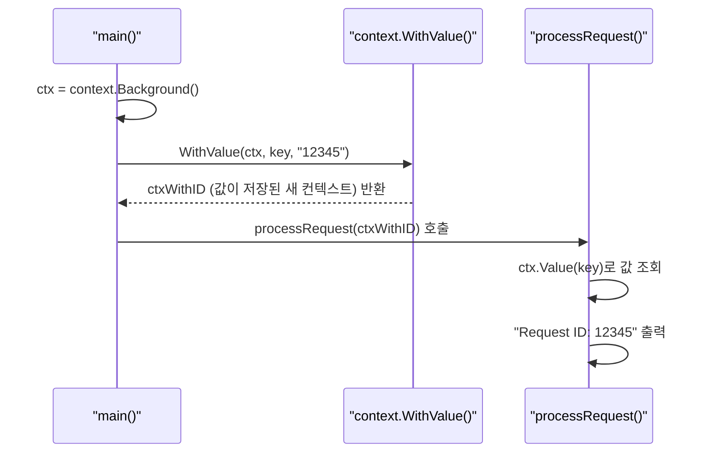

# Go 언어 컨텍스트 (Context)

Go 언어에서 `context` 패키지는 API 경계를 넘나드는 요청의 생명주기를 관리하기 위한 표준적인 방법을 제공함. 주요 기능은 **취소 신호 전파**, **타임아웃 및 데드라인 설정**, **요청 범위 값 전달**임. 특히 여러 고루틴에 걸쳐 작업이 수행되는 서버 환경에서 클라이언트의 연결 종료나 타임아웃을 모든 하위 작업에 전파하여 시스템 리소스를 효율적으로 관리할 수 있게 함.

## Go Context 쉽게 이해하기

Go의 `context`는 **작업을 시작할 때 생기는 "신호기"**로 이해할 수 있다.

- 여러 고루틴이 동시에 일할 때, **모두에게 작업을 중단하라고 알려주는 역할**
    - **택배 기사**가 여러 하청 업체(고루틴)에 물건 배송을 맡김
    - 고객이 주문을 취소하면, 기사(컨텍스트)는 모든 하청 업체들에게 **"그만 배송해!"**라고 신호를 보냄
    - 각 업체는 그 신호를 받으면, 일을 중단하고 리소스를 낭비하지 않게 됨
- 요청 전체에 필요한 **데이터 전달** 역할
    - 또한 기사(컨텍스트)는 배송서류(Request ID, 고객 정보)를 함께 들고 다니므로, 하청 업체도 동일한 데이터를 공유할 수 있음.

## 비유로 이해하기

## Java의 동시성 제어 vs Go의 Context

Java에서는 Go의 `Context`와 정확히 일치하는 단일 기능은 없음. 대신 여러 기능을 조합하여 비슷한 목적을 달성함.

| 구분 | Go (`context` 패키지) | Java | 설명 |
|---|---|---|---|
| **취소** | `context.WithCancel` | `Thread.interrupt()`, `Future.cancel()` | 작업 중단 신호를 보내지만, Go의 컨텍스트는 여러 고루틴에 걸쳐 신호를 전파하는 데 더 특화되어 있음. |
| **타임아웃** | `context.WithTimeout` | `Future.get(timeout, unit)` | 특정 시간 동안 결과를 기다리거나 작업을 제한하는 기능. |
| **값 전달** | `context.WithValue` | `ThreadLocal` | 스레드(고루틴) 범위 내에서 안전하게 값을 전달하는 메커니즘. |

Java의 `ThreadLocal`이 단일 스레드 내에서 값을 공유하는 데 초점을 맞춘다면, Go의 `context.WithValue`는 요청 처리와 같이 시작점(예: HTTP 핸들러)에서 여러 하위 고루틴으로 이어지는 작업 전체에 걸쳐 값을 전달하는 데 사용됨.

이번 시간에는 **외부 API를 호출하는 서버**를 가정하고, 클라이언트 요청이 타임아웃될 경우 모든 하위 작업을 안전하게 종료시키는 예제를 통해 컨텍스트의 활용법을 익혀보겠음.

---

## `context.WithValue`: 요청 범위 값 전달

`context.WithValue`는 부모 컨텍스트에 키-값 쌍을 저장한 새로운 컨텍스트를 반환함. 이렇게 저장된 값은 해당 컨텍스트를 전달받는 모든 함수에서 꺼내 쓸 수 있음. 주로 요청 ID, 인증 토큰 등과 같이 요청 전체에 걸쳐 필요한 데이터를 전달하는 데 사용됨.

### 실습 1: 컨텍스트로 값 전달하기

HTTP 요청이 들어왔을 때 생성된 "Request ID"를 명시적인 파라미터 전달 없이 여러 함수에 걸쳐 공유하는 예제임.

| API | 파라미터 | 리턴값 | 설명 |
|---|---|---|---|
| `context.Background()` | 없음 | `context.Context` | 비어있는 최상위 컨텍스트를 반환함. 보통 `main` 함수나 요청의 시작점에서 사용됨. |
| `context.WithValue(parent, key, val)` | `parent context.Context`, `key, val interface{}` | `context.Context` | 부모 컨텍스트에 키-값 쌍을 저장한 새로운 자식 컨텍스트를 반환함. |
| `(ctx Context).Value(key interface{})` | `interface{}` | `interface{}` | 컨텍스트 체인을 따라 올라가며 주어진 키에 해당하는 값을 찾아서 반환함. |

**실행 흐름**



**실습 파일: `13-컨텍스트/01-기본-컨텍스트/main.go`**

```go
package main

import (
	"context"
	"fmt"
)

// 1. 키 충돌을 방지하기 위해 사용자 정의 타입을 사용
type requestIDKey string

func processRequest(ctx context.Context) {
	// 2. 컨텍스트에서 "requestID" 키로 값을 조회
	id, ok := ctx.Value(requestIDKey("requestID")).(string)
	if !ok {
		id = "unknown"
	}
	fmt.Printf("Processing request with ID: %s\n", id)
}

func main() {
	// 3. 비어 있는 최상위 컨텍스트 생성
	ctx := context.Background()

	// 4. 컨텍스트에 "requestID"와 값 "12345"를 저장
	ctxWithID := context.WithValue(ctx, requestIDKey("requestID"), "12345")

	// 5. 값이 저장된 컨텍스트를 함수에 전달
	processRequest(ctxWithID)
}
```

### 실습 2: 취소 신호 전파

**실습 파일: `13-컨텍스트/02-취소신호전파/main.go`**

```go
package main

import (
	"context"
	"fmt"
	"time"
)

func worker(ctx context.Context, name string) {
	for {
		select {
		case <-ctx.Done(): // 취소 신호 수신
			fmt.Printf("[%s] 작업 중단: %v\n", name, ctx.Err())
			return
		default:
			fmt.Printf("[%s] 작업 진행 중...\n", name)
			time.Sleep(500 * time.Millisecond)
		}
	}
}

func main() {
	// 1. 최상위 컨텍스트 생성
	ctx := context.Background()

	// 2. 취소 가능한 컨텍스트 생성
	ctx, cancel := context.WithCancel(ctx)

	// 3. 두 개의 worker 고루틴 실행
	go worker(ctx, "A")
	go worker(ctx, "B")

	// 4. 2초 뒤 작업 취소
	time.Sleep(2 * time.Second)
	fmt.Println("메인: 취소 신호 전송")
	cancel()

	// 5. 고루틴 종료 대기
	time.Sleep(1 * time.Second)
}
```

### 실습 3: 타임아웃

**실습 파일: `13-컨텍스트/03-타임아웃/main.go`**

```go
package main

import (
	"context"
	"fmt"
	"time"
)

func task(ctx context.Context) {
	select {
	case <-time.After(3 * time.Second): // 3초 걸리는 작업 --> 타임아웃이 먼저 발생하여 실행되지 않음
		fmt.Println("작업 완료")
	case <-ctx.Done(): // 타임아웃 또는 취소
		fmt.Println("작업 중단:", ctx.Err())
	}
}

func main() {
	// 타임아웃 2초짜리 컨텍스트
	ctx, cancel := context.WithTimeout(context.Background(), 2*time.Second)
	defer cancel()

	task(ctx)
}
```