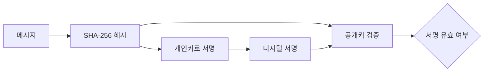

# Go 언어 암호화: 디지털 서명과 검증

블록체인이나 Web3 세계에서 가장 중요한 건 **“내 자산이 내 것임을 증명하는 것”**

이를 가능하게 해주는 핵심 기술이 바로 디지털 서명(Digital Signature)임.

쉽게 말해,

- ✍️ 개인키(Private Key) → 나만 가진 도장 (비밀 도장)
- 📢 공개키(Public Key) → 모두에게 알려진 도장 도감 (도장의 진짜 여부 확인)

내가 도장(개인키)으로 찍은 문서는, 누구든 공개키를 보고 “아! 이건 진짜 주인이 찍은 거구나” 하고 확인할 수 있음.

## 1. 디지털 서명과 Java의 암호화 비교

디지털 서명은 **비대칭 키 암호화**에 기반함. **개인키**로 데이터에 서명하면, 쌍이 되는 **공개키**를 가진 누구나 그 서명을 검증할 수 있음. 개인키는 소유자만 안전하게 보관하고, 공개키는 외부에 알려도 안전함.

Go와 Java는 모두 강력한 암호화 라이브러리를 내장하고 있지만, 사용 방식과 철학에서 차이가 있음.

| 항목 | Go (`crypto` 패키지) | Java (`java.security`, `javax.crypto`) |
|---|---|---|
| **철학** | 단순하고 직관적, 직접 조립해서 사용 | 포방대하고 설정이 많음, Provider 모델 사용 |
| **주요 알고리즘** | ECDSA, RSA, SHA256 | EC, RSA, SHA256 |
| **사용 편의성** | 코드가 짧고 직관적 | 상대적으로 복잡하고 장황함 |

Go는 "레고 블록"처럼 필요한 기능만 딱딱 꺼내 쓰는 느낌인 반면, Java는 "종합 공구함"처럼 다양한 도구가 있지만 조립법이 복잡함

## 2. 디지털 서명 흐름 이해하기

- 메시지 → SHA-256 해시로 요약 (지문 만들기)
- 개인키 → 지문에 도장 찍기 (서명 생성)
- 공개키 → 도장이 진짜인지 확인 (검증)



## 2. 디지털 서명에 필요한 Go 패키지

디지털 서명을 구현하기 위해 Go의 표준 라이브러리의 여러 `crypto` 관련 패키지를 조합해야 함.

-   `crypto/ecdsa`: **타원 곡선 디지털 서명 알고리즘(ECDSA)**. 키 생성, 서명, 검증의 핵심 역할을 함.
-   `crypto/elliptic`: 곡선함수들을 제공함
-   `crypto/sha256`: **SHA-256 해시 알고리즘**. 원본 데이터를 고정 길이의 해시값으로 변환하여 데이터의 무결성을 보장함.
-   `crypto/rand`: **암호학적 난수 생성기**. 안전한 키와 서명을 생성하는 데 필수적인 무작위성을 제공함.

### 곡선함수 유형

쉽게 말하면 **암호화에 사용할 운동장(곡선의 수학적 공간)**을 지정하는 것이라고 생각하면 됨.

그 운동장 위에서 개인키와 공개키가 만들어지고, 서명과 검증이 이루어짐.

| 함수 | 설명 | 보안 수준 |
|---|---|---|
| elliptic.P224() | 224비트 곡선 | 비교적 약함 (요즘은 잘 안 씀) |
| elliptic.P256() | 256비트 곡선 | 가장 널리 쓰임 (TLS, 블록체인 기본) |
| elliptic.P384() | 384비트 곡선 | 더 강력한 보안 필요 시 |
| elliptic.P521() | 521비트 곡선 | 최상위 보안, 하지만 연산 느림 |

## 3. 실습: 디지털 서명 생성 및 검증

다음 실습을 통해 디지털 서명의 전체 과정을 직접 체험해 보자.

1.  **키 생성**: ECDSA 개인키와 공개키 쌍을 만듦.
2.  **메시지 해싱**: 서명할 메시지의 SHA-256 해시를 계산함.
3.  **서명**: 개인키를 사용해 메시지 해시에 서명함.
4.  **검증**: 공개키를 사용해 서명이 유효한지 확인함.

**실습 파일: `14-암호화/main.go`**
```go
package main

import (
	"crypto/ecdsa"
	"crypto/elliptic"
	"crypto/rand"
	"crypto/sha256"
	"fmt"
	"log"
)

func main() {
	// 1. 키 생성
	privateKey, err := ecdsa.GenerateKey(elliptic.P256(), rand.Reader)
	if err != nil {
		log.Fatal(err)
	}
	publicKey := &privateKey.PublicKey

	// 키 출력
	fmt.Println("Private Key:", privateKey)
	fmt.Println("Public Key:", publicKey)

	// 2. 메시지 준비 및 해시
	message := []byte("hello world")
	hash := sha256.Sum256(message)
	fmt.Println("메시지 해시:", hash)

	// 3. 서명 생성
	signature, err := ecdsa.SignASN1(rand.Reader, privateKey, hash[:])
	if err != nil {
		log.Fatal(err)
	}
	fmt.Println("서명:", signature)

	// 4. 검증
	valid := ecdsa.VerifyASN1(publicKey, hash[:], signature)
	if valid {
		fmt.Println(">>> 서명 검증 성공!")
		fmt.Println(">>> 원문 메시지:", string(message))
	} else {
		fmt.Println(">>> 서명 검증 실패!")
	}

	// 5. 변조된 메시지 테스트
	fakeMessage := []byte("hello gopher")
	fakeHash := sha256.Sum256(fakeMessage)
	fakeValid := ecdsa.VerifyASN1(publicKey, fakeHash[:], signature)
	fmt.Printf(">>> 변조 메시지 검증 결과: %v\n", fakeValid)
}
```

### 실행 결과

```text
Private Key: ... 실행시마다 바뀜 ...
Public Key: ... 실행시마다 바뀜 ....
메시지 해시: ... 실행시마다 바뀜 ...
서명: ... 실행시마다 바뀜 ...
>>> 서명 검증 성공!
>>> 원문 메시지: hello world
>>> 변조 메시지 검증 결과: false
```

이 실습을 통해 개인키의 소유자만이 특정 데이터에 대한 유효한 서명을 생성할 수 있으며, 공개키를 가진 누구나 그 서명을 검증할 수 있음을 확인함. 이것이 바로 블록체인에서 거래의 소유권을 증명하고 신뢰를 구축하는 핵심 원리임.
