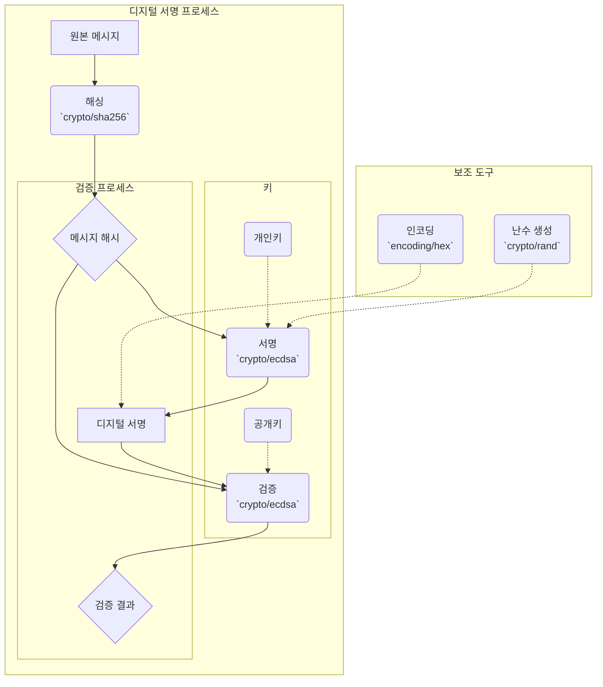
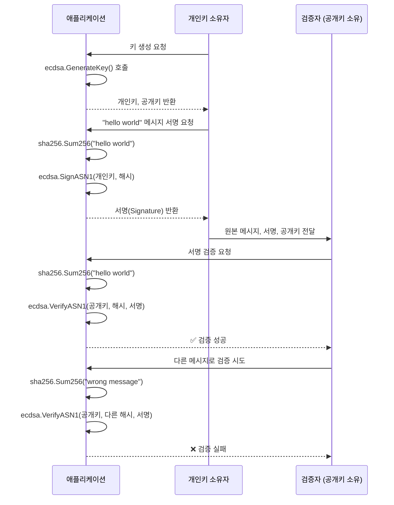

# Go 언어 암호화: 디지털 서명과 검증

Web3나 블록체인 기술의 중심에는 **암호학**이 자리 잡고 있음. 사용자의 자산을 보호하고, 거래의 신뢰성을 보장하는 핵심 기술이 바로 **디지털 서명**임. 이번 시간에는 Go 언어의 표준 `crypto` 라이브러리를 사용하여 디지털 서명을 생성하고 검증하는 원리를 알아볼 것임. 이 과정은 "내가 내 자산의 진정한 주인이다"라고 어떻게 증명하는지에 대한 이해를 도움.

## 1. 디지털 서명과 Java의 암호화 비교

디지털 서명은 **비대칭 키 암호화**에 기반함. **개인키**로 데이터에 서명하면, 쌍이 되는 **공개키**를 가진 누구나 그 서명을 검증할 수 있음. 개인키는 소유자만 안전하게 보관하고, 공개키는 외부에 알려도 안전함.

Go와 Java는 모두 강력한 암호화 라이브러리를 내장하고 있지만, 사용 방식과 철학에서 차이가 있음.

| 항목 | Go (`crypto` 패키지) | Java (`java.security`, `javax.crypto`) |
|---|---|---|
| **철학** | 간결하고 명확한 API 제공. 필요한 기능을 직접 조합. | 포괄적인 프레임워크. Provider 모델을 통한 유연성. |
| **주요 알고리즘** | `crypto/ecdsa`, `crypto/rsa`, `crypto/sha256` 등 | `Signature`, `KeyPairGenerator`, `MessageDigest` 클래스 |
| **사용 편의성** | 직관적이고 사용법이 간단함. | 상대적으로 설정이 복잡하고 코드가 길어질 수 있음. |
| **예시: 키 생성** | `ecdsa.GenerateKey(elliptic.P256(), rand.Reader)` | `KeyPairGenerator kpg = KeyPairGenerator.getInstance("EC"); kpg.initialize(256); kpg.generateKeyPair();` |

Go는 현대적인 암호화 요구에 맞춰 더 간결한 API를 제공하는 경향이 있음.

## 2. 디지털 서명에 필요한 Go 패키지

디지털 서명을 구현하기 위해 Go의 표준 라이브러리의 여러 `crypto` 관련 패키지를 조합해야 함.


```mermaid
graph TD
    subgraph "디지털 서명 프로세스"
        A[원본 메시지] --> B(해싱<br/>`crypto/sha256`);
        B --> C{메시지 해시};
        C --> D(서명<br/>`crypto/ecdsa`);
        D --> E[디지털 서명];

        subgraph "키"
            F(개인키) -.-> D;
            G(공개키) -.-> H;
        end

        subgraph "검증 프로세스"
            C --> H(검증<br/>`crypto/ecdsa`);
            E --> H;
            H --> I{검증 결과};
        end
    end

    subgraph "보조 도구"
        J(난수 생성<br/>`crypto/rand`) -.-> D;
        K(인코딩<br/>`encoding/hex`) -.-> E;
    end
```

-   `crypto/ecdsa`: **타원 곡선 디지털 서명 알고리즘(ECDSA)**. 키 생성, 서명, 검증의 핵심 역할을 함.
-   `crypto/sha256`: **SHA-256 해시 알고리즘**. 원본 데이터를 고정 길이의 해시값으로 변환하여 데이터의 무결성을 보장함.
-   `crypto/rand`: **암호학적 난수 생성기**. 안전한 키와 서명을 생성하는 데 필수적인 무작위성을 제공함.
-   `encoding/hex`: 키나 서명 같은 바이트 데이터를 사람이 읽을 수 있는 **16진수 문자열**로 변환하여 전송이나 저장을 용이하게 함.

## 3. 실습: 디지털 서명 생성 및 검증

다음 실습을 통해 디지털 서명의 전체 과정을 직접 체험해 보자.

1.  **키 생성**: ECDSA 개인키와 공개키 쌍을 만듦.
2.  **메시지 해싱**: 서명할 메시지의 SHA-256 해시를 계산함.
3.  **서명**: 개인키를 사용해 메시지 해시에 서명함.
4.  **검증**: 공개키를 사용해 서명이 유효한지 확인함.

**실습 파일: `15-암호화/01-디지털-서명-및-검증/main.go`**
```go
package main

import (
	"crypto/ecdsa"
	"crypto/elliptic"
	"crypto/rand"
	"crypto/sha256"
	"encoding/hex"
	"fmt"
	"log"
)

func main() {
	// 1. ECDSA 키 쌍 생성
	// ecdsa.GenerateKey 함수는 타원 곡선과 암호학적 난수 리더를 인자로 받아 개인키를 생성함.
	// elliptic.P256()은 NIST에서 정의한 256비트 타원 곡선으로, 보안성과 성능의 균형이 잘 잡혀 널리 사용됨.
	// rand.Reader는 암호학적으로 안전한 난수를 제공하는 인스턴스임.
	privateKey, err := ecdsa.GenerateKey(elliptic.P256(), rand.Reader)
	if err != nil {
		log.Fatalf("키 생성 실패: %v", err)
	}
	// 생성된 개인키로부터 공개키를 얻음.
	publicKey := &privateKey.PublicKey

	// 2. 생성된 키를 16진수 문자열로 변환하여 출력
	// 실제 애플리케이션에서는 개인키를 절대 노출해서는 안 되며, 안전하게 저장해야 함.
	// privateKey.D는 개인키의 실제 스칼라 값(큰 정수)임.
	privateKeyHex := hex.EncodeToString(privateKey.D.Bytes())
	// elliptic.Marshal은 공개키(X, Y 좌표)를 바이트 슬라이스로 변환함.
	publicKeyHex := hex.EncodeToString(elliptic.Marshal(publicKey.Curve, publicKey.X, publicKey.Y))
	fmt.Printf("개인키 (Hex): %s\n", privateKeyHex)
	fmt.Printf("공개키 (Hex): %s\n\n", publicKeyHex)

	// 3. 서명할 메시지 준비 및 해싱
	// 서명은 원본 데이터가 아닌, 데이터의 해시(고정된 길이의 요약본)에 대해 수행됨.
	message := []byte("hello world")
	// sha256.Sum256은 입력 데이터의 SHA-256 해시를 계산하여 32바이트 배열을 반환함.
	hash := sha256.Sum256(message)
	fmt.Printf("원본 메시지: %s\n", string(message))
	fmt.Printf("메시지 해시: %x\n\n", hash)

	// 4. 메시지 해시에 서명
	// ecdsa.SignASN1 함수는 개인키를 사용하여 데이터의 해시(hash)에 서명함.
	// 서명 결과는 두 개의 정수(r, s)로 구성되며, ASN.1 DER 형식으로 인코딩된 바이트 슬라이스로 반환됨.
	signature, err := ecdsa.SignASN1(rand.Reader, privateKey, hash[:])
	if err != nil {
		log.Fatalf("서명 실패: %v", err)
	}
	fmt.Printf("서명 (Hex): %x\n\n", signature)

	// 5. 서명 검증
	// ecdsa.VerifyASN1 함수는 공개키, 원본 해시, 서명을 사용하여 서명이 유효한지 확인함.
	// 공개키의 소유자(개인키를 가진 사람)가 해당 메시지에 서명했음을 증명함.
	valid := ecdsa.VerifyASN1(publicKey, hash[:], signature)
	if valid {
		fmt.Println("✅ 서명 검증 성공!")
	} else {
		fmt.Println("❌ 서명 검증 실패!")
	}

	// 6. (보너스) 다른 데이터로 검증 시도 -> 실패 확인
	// 서명된 데이터가 아닌 다른 데이터의 해시로 검증을 시도하면 반드시 실패해야 함.
	wrongMessage := []byte("hello gopher")
	wrongHash := sha256.Sum256(wrongMessage)
	valid = ecdsa.VerifyASN1(publicKey, wrongHash[:], signature)
	fmt.Printf("\n'wrong message'로 검증 시도...\n")
	if valid {
		fmt.Println("✅ 서명 검증 성공! (이러면 안됨)")
	} else {
		fmt.Println("❌ 서명 검증 실패! (예상된 결과)")
	}
}
```

### 실행 흐름 다이어그램


```mermaid
sequenceDiagram
    participant App as 애플리케이션
    participant Alice as 개인키 소유자
    participant Bob as 검증자 (공개키 소유)

    Alice->>App: 키 생성 요청
    App->>App: ecdsa.GenerateKey() 호출
    App-->>Alice: 개인키, 공개키 반환

    Alice->>App: "hello world" 메시지 서명 요청
    App->>App: sha256.Sum256("hello world")
    App->>App: ecdsa.SignASN1(개인키, 해시)
    App-->>Alice: 서명(Signature) 반환

    Alice->>Bob: 원본 메시지, 서명, 공개키 전달

    Bob->>App: 서명 검증 요청
    App->>App: sha256.Sum256("hello world")
    App->>App: ecdsa.VerifyASN1(공개키, 해시, 서명)
    App-->>Bob: ✅ 검증 성공

    Bob->>App: 다른 메시지로 검증 시도
    App->>App: sha256.Sum256("wrong message")
    App->>App: ecdsa.VerifyASN1(공개키, 다른 해시, 서명)
    App-->>Bob: ❌ 검증 실패
```

### 실행 결과

```text
개인키 (Hex): 2a8f... (실행 시마다 변경)
공개키 (Hex): 04d1... (실행 시마다 변경)

원본 메시지: hello world
메시지 해시: b94d27b9934d3e08a52e52d7da7dabfac484efe37a5380ee9088f7ace2efcde9

서명 (Hex): 3045... (실행 시마다 변경)

✅ 서명 검증 성공!

'wrong message'로 검증 시도...
❌ 서명 검증 실패! (예상된 결과)
```

이 실습을 통해 개인키의 소유자만이 특정 데이터에 대한 유효한 서명을 생성할 수 있으며, 공개키를 가진 누구나 그 서명을 검증할 수 있음을 확인함. 이것이 바로 블록체인에서 거래의 소유권을 증명하고 신뢰를 구축하는 핵심 원리임.
