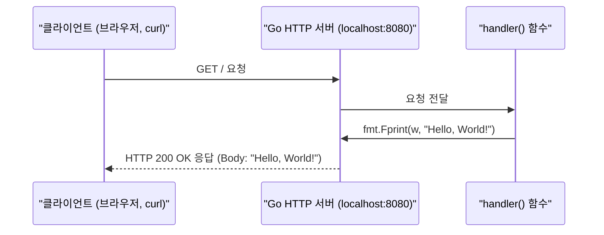
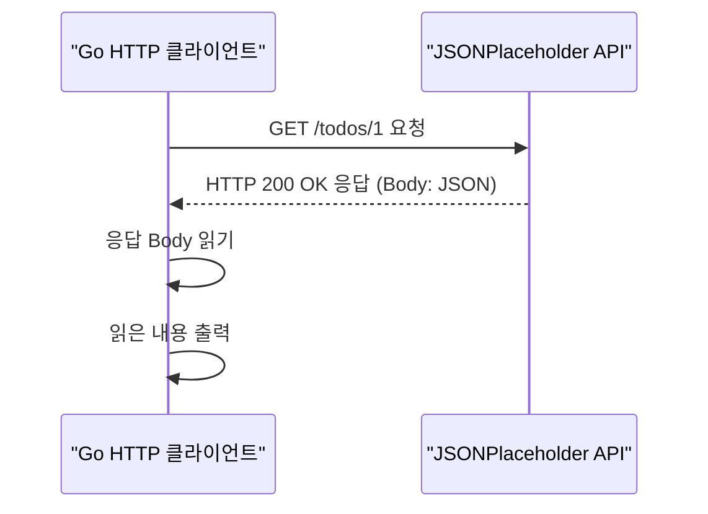
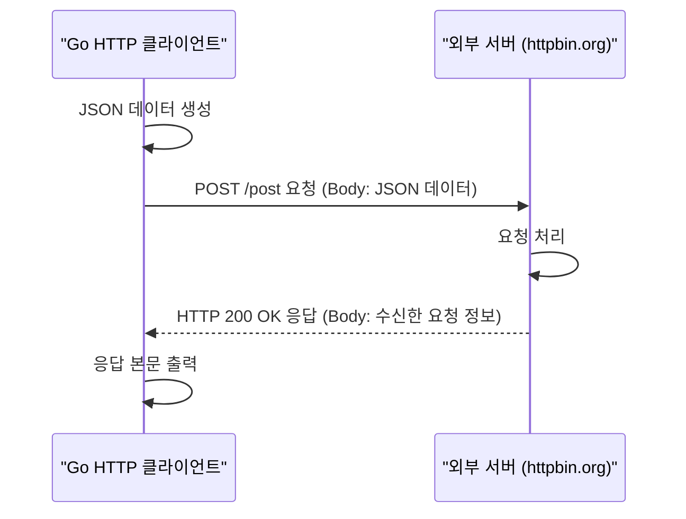

# Go 언어 HTTP 네트워킹

Go 언어는 `net/http`라는 강력한 표준 라이브러리를 통해 웹 개발을 지원함. 이 패키지만으로도 별도의 프레임워크나 외부 웹 서버(Nginx, Apache 등) 없이 상용 수준의 웹 서버와 클라이언트를 손쉽게 구현할 수 있음. 이는 Go가 마이크로서비스 아키텍처에서 인기를 끄는 주요 이유 중 하나임.

## Java의 웹 개발 vs Go의 `net/http`

Java 진영에서 웹 애플리케이션을 개발하는 것은 전통적으로 서블릿 컨테이너(Servlet Container)를 필요로 했음. 개발자는 서블릿 API에 맞춰 코드를 작성하고, 이를 WAR 파일로 패키징하여 Tomcat, Jetty, JBoss와 같은 웹 애플리케이션 서버(WAS)에 배포해야 했음. 물론 Spring Boot의 등장으로 내장 서버(Embedded Server) 개념이 도입되어 이 과정이 매우 단순화되었지만, 근본적으로는 서블릿 기술에 기반함.

반면, Go는 언어 자체의 표준 라이브러리가 경량 HTTP 서버 기능을 포함하고 있어, 컴파일된 실행 파일 하나만으로 즉시 웹 서비스를 시작할 수 있음.

| 구분 | Go (`net/http`) | Java | 설명 |
|---|---|---|---|
| **서버 실행** | `http.ListenAndServe` | 서블릿 컨테이너 (Tomcat, Jetty 등) | Go는 코드가 직접 서버를 실행. Java는 서버가 코드를 실행. (Spring Boot는 예외) |
| **요청 핸들러** | `http.HandlerFunc` | `HttpServlet` | 특정 URL 경로의 요청을 처리하는 함수 또는 객체. |
| **클라이언트** | `http.Client` | `java.net.http.HttpClient` (Java 11+) | HTTP 요청을 보내고 응답을 받는 기능. |

이번 시간에는 `net/http` 패키지를 사용하여 **간단한 API 서버**를 만들고, 이 서버에 요청을 보내는 **클라이언트**를 작성하는 전체 과정을 실습하겠음.

---

## 1. 간단한 HTTP 서버 만들기

Go에서 HTTP 서버를 만드는 것은 `http.HandleFunc`와 `http.ListenAndServe` 두 함수만 있으면 충분함.

- `http.HandleFunc(path, handler)`: 특정 URL 경로(`path`)로 들어오는 요청을 어떤 함수(`handler`)가 처리할지 등록.
- `http.ListenAndServe(addr, handler)`: 지정된 주소(`addr`)에서 들어오는 요청을 수신 대기하며 서버를 실행.

### 실습 1: Hello World 서버

가장 기본적인 형태의 웹 서버를 만들어보겠음. 이 서버는 어떤 경로로 요청이 들어오든 "Hello, World!"를 응답함.

| API | 파라미터 | 리턴값 | 설명 |
|---|---|---|---|
| `http.HandleFunc(pattern, handler)` | `string`, `func(ResponseWriter, *Request)` | 없음 | 특정 URL 패턴에 대한 요청을 처리할 핸들러 함수를 등록함. |
| `fmt.Fprint(w io.Writer, a ...interface{})` | `io.Writer`, `...interface{}` | `(n int, err error)` | `io.Writer` 인터페이스를 구현하는 객체(여기서는 `http.ResponseWriter`)에 문자열을 씀. |
| `http.ListenAndServe(addr, handler)` | `string`, `http.Handler` | `error` | 지정된 주소에서 HTTP 요청을 수신 대기함. `handler`가 `nil`이면 `DefaultServeMux`를 사용. |
| `log.Fatal(v ...interface{})` | `...interface{}` | 없음 | 로그 메시지를 출력하고 `os.Exit(1)`을 호출하여 프로그램을 즉시 종료함. |

**실행 흐름**



**실습 파일: `16-HTTP네트워킹/01-간단한-HTTP-서버/main.go`**

프로그램 실행 후 웹 브라우저를 열어서 `http://localhost:8080`으로 접속했을 때 "Hello, World!"라는 메시지가 출력되면 성공!

서버의 가동을 중지하기 위해서는 VSCode에서 `F1`키를 누르고 `Stop Code Run` 명령을 선택해서 실행한다.

```go
package main

import (
	"fmt"
	"log"
	"net/http"
)

// 1. 요청을 처리할 핸들러 함수 정의
func handler(w http.ResponseWriter, r *http.Request) {
	// 2. ResponseWriter에 응답 내용을 씀
	fmt.Fprint(w, "Hello, World!")
}

func main() {
	// 3. "/" 경로와 핸들러 함수를 매핑
	http.HandleFunc("/", handler)

	fmt.Println("Server starting on port 8080...")
	// 4. 8080 포트에서 서버를 시작
	log.Fatal(http.ListenAndServe(":8080", nil))
}
```

**코드 해설**

1.  `handler` 함수는 `http.HandlerFunc` 타입의 시그니처를 따름. `http.ResponseWriter`는 클라이언트에 응답을 작성하기 위한 것이고, `*http.Request`는 클라이언트의 요청 정보를 담고 있음.
2.  `fmt.Fprint`는 `io.Writer`에 문자열을 쓰는 함수. `http.ResponseWriter`가 `io.Writer` 인터페이스를 구현하고 있으므로, 이를 통해 클라이언트에게 응답 본문을 보낼 수 있음.
3.  `http.HandleFunc`는 `DefaultServeMux`(기본 HTTP 요청 멀티플렉서)에 특정 경로와 핸들러를 등록하는 함수임.
4.  `http.ListenAndServe`는 서버를 시작하고 들어오는 요청을 수신 대기함. 이 함수는 블로킹 함수이며, 정상적으로 종료되지 않음. 만약 서버 시작에 실패하면 에러를 반환하며, `log.Fatal`은 이 에러를 출력하고 프로그램을 종료시킴.

---

## 2. HTTP 클라이언트 작성하기

Go로 HTTP 클라이언트를 작성하는 것 또한 매우 간단함. `net/http` 패키지는 `GET`, `POST` 등 다양한 HTTP 메서드를 지원함.

### 실습 2: 외부 API에 GET 요청 보내기

공개된 테스트 API인 `JSONPlaceholder`에 GET 요청을 보내고, 받은 JSON 응답을 출력하는 클라이언트를 만들어보겠음.

| API | 파라미터 | 리턴값 | 설명 |
|---|---|---|---|
| `http.Get(url string)` | `string` | `(*http.Response, error)` | 주어진 URL에 GET 요청을 보내고, 응답과 에러를 반환함. |
| `(r *Response).Body.Close()` | 없음 | `error` | 응답 본문을 닫아 리소스를 해제함. `defer`와 함께 사용하는 것이 필수적. |
| `io.ReadAll(r io.Reader)` | `io.Reader` | `([]byte, error)` | `io.Reader`에서 모든 데이터를 읽어 바이트 슬라이스로 반환함. (`ioutil.ReadAll`은 Go 1.16부터 deprecated) |

**실행 흐름**



**실습 파일: `16-HTTP네트워킹/02-HTTP-클라이언트-GET/main.go`**

```go
package main

import (
	"fmt"
	"io"
	"log"
	"net/http"
)

func main() {
	url := "https://jsonplaceholder.typicode.com/todos/1"

	// 1. http.Get 함수로 GET 요청 전송
	resp, err := http.Get(url)
	if err != nil {
		log.Fatalf("Error fetching URL: %v", err)
	}
	// 2. 함수 종료 시점에 응답 본문을 닫도록 예약
	defer resp.Body.Close()

	// 3. 응답 본문을 모두 읽음
	body, err := io.ReadAll(resp.Body)
	if err != nil {
		log.Fatalf("Error reading response body: %v", err)
	}

	// 4. 읽은 본문을 문자열로 변환하여 출력
	fmt.Println(string(body))
}
```

**코드 해설**

1.  `http.Get`은 GET 요청을 보내는 가장 간단한 방법임. 내부적으로 `http.DefaultClient`를 사용하여 요청을 수행함.
2.  `defer resp.Body.Close()`: HTTP 응답 본문은 스트리밍 데이터임. 데이터를 모두 읽은 후에는 반드시 `Close()`를 호출하여 네트워크 연결과 같은 시스템 리소스를 해제해야 함. `defer`를 사용하면 함수가 종료되기 직전에 항상 `Close()`가 호출되도록 보장할 수 있어 편리함.
3.  `ioutil.ReadAll`: `resp.Body`는 `io.Reader` 인터페이스 타입임. `ReadAll` 함수는 이 Reader에서 더 이상 읽을 데이터가 없을 때까지(EOF) 모든 데이터를 읽어들여 바이트 슬라이스로 반환함.
4.  `string(body)`: 읽어들인 바이트 슬라이스를 사람이 읽을 수 있는 문자열로 변환하여 출력함.

### 실습 3: POST 요청으로 데이터 전송하기

`http.Post` 함수나 `http.NewRequest`를 사용하면 POST 요청도 쉽게 보낼 수 있음. 여기서는 JSON 데이터를 POST로 전송하는 예제를 다룸.

| API | 파라미터 | 리턴값 | 설명 |
|---|---|---|---|
| `bytes.NewBuffer(buf []byte)` | `[]byte` | `*bytes.Buffer` | 주어진 바이트 슬라이스를 읽는 버퍼를 생성함. `io.Reader` 인터페이스를 만족함. |
| `http.Post(url, contentType, body)` | `string`, `string`, `io.Reader` | `(*http.Response, error)` | 주어진 URL에 POST 요청을 보냄. `Content-Type` 헤더와 요청 본문을 함께 전달. |

**실행 흐름**



**실습 파일: `16-HTTP네트워킹/03-HTTP-클라이언트-POST/main.go`**

```go
package main

import (
	"fmt"
	"io" // ioutil 대신 io 패키지 사용
	"log"
	"net/http"
	"net/url" // FormData 생성을 위해 import
)

func main() {
	postUrl := "https://httpbin.org/post"
	// 1. 전송할 FormData 데이터 생성
	formData := url.Values{}
	formData.Set("name", "Gemini")
	formData.Set("level", "100")

	// 2. http.PostForm 함수로 POST 요청
	// 이 함수는 자동으로 Content-Type을 application/x-www-form-urlencoded 로 설정합니다.
	resp, err := http.PostForm(postUrl, formData)
	if err != nil {
		log.Fatalf("Error making POST request: %v", err)
	}
	defer resp.Body.Close()

	// 3. 응답 본문 읽기 및 출력
	body, err := io.ReadAll(resp.Body)
	if err != nil {
		log.Fatalf("Error reading response body: %v", err)
	}
	fmt.Println(string(body))
}
```

**코드 해설**

1.  `jsonData := []byte(...)`: 전송할 데이터를 바이트 슬라이스 형태로 준비함. 실제 애플리케이션에서는 Go 구조체를 `json.Marshal`하여 이 데이터를 생성하는 경우가 많음.
2.  `http.Post(...)`: 세 번째 인자로 요청 본문(body)을 받는데, 이 인자는 `io.Reader` 인터페이스 타입이어야 함. `bytes.NewBuffer`는 바이트 슬라이스로부터 `io.Reader`를 만족하는 인메모리 버퍼를 만들어주므로, POST 요청의 본문으로 사용하기에 적합함. 두 번째 인자로 `Content-Type` 헤더 값을 직접 지정함.
3.  응답을 처리하는 과정은 `GET` 요청과 동일함.

이처럼 Go의 `net/http` 패키지는 서버와 클라이언트 양쪽의 기능을 모두 강력하게 지원하여, 네트워크 프로그래밍을 매우 직관적이고 효율적으로 만들어 줌. 다음 장에서는 이를 활용하여 본격적인 REST API 서버를 구축하는 방법을 알아보겠음.