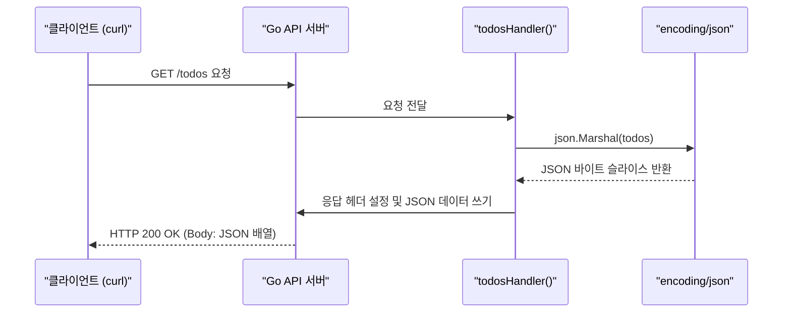
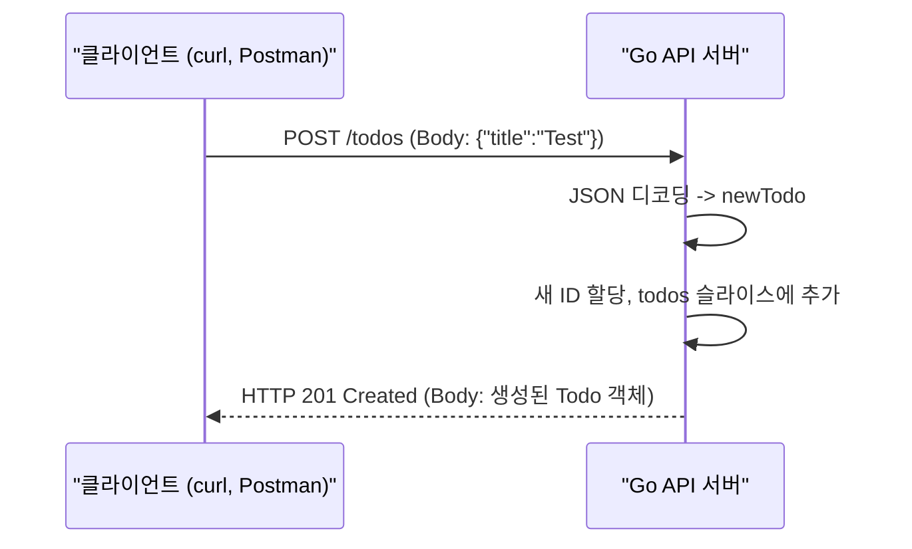
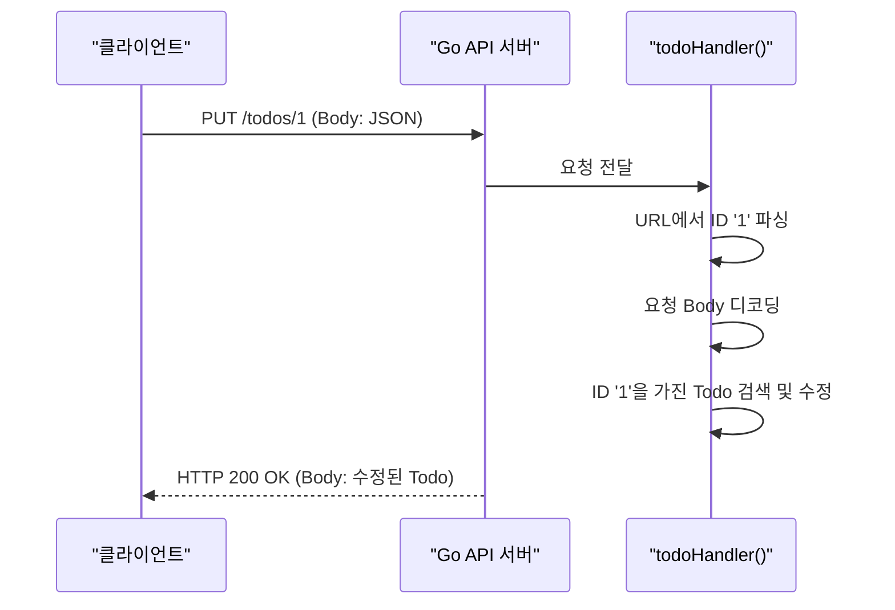

# Go 언어로 구축하는 REST API 서버

REST(Representational State Transfer)는 웹 서비스 아키텍처 스타일의 하나로, 자원(Resource)을 URI로 표현하고 해당 자원에 대한 행위(Verb)를 HTTP 메서드(GET, POST, PUT, DELETE 등)로 정의하는 방식임. 지난 시간에 배운 `net/http` 패키지를 기반으로, 이번에는 완전한 CRUD 기능을 갖춘 REST API 서버를 구축하는 방법을 알아보겠음.

## Java Spring Boot vs Go `net/http`

Java 진영에서 REST API를 개발할 때 사실상의 표준은 Spring Boot (Spring Web MVC)임. Spring Boot는 어노테이션(Annotation)을 사용하여 매우 선언적이고 간결하게 라우팅을 정의할 수 있음.

| 구분 | Go (`net/http`) | Java (`Spring Boot`) | 설명 |
|---|---|---|---|
| **라우팅** | `http.HandleFunc` + `r.Method` 스위치 | `@RestController`, `@GetMapping`, `@PostMapping` | Go는 코드 기반으로 명시적으로 라우팅. Spring은 어노테이션 기반으로 선언적으로 라우팅. |
| **JSON 처리** | `encoding/json` 패키지 | Jackson/Gson 라이브러리 (자동) | Go는 `Marshal`, `Unmarshal`을 수동 호출. Spring은 프레임워크가 자동으로 객체-JSON 변환을 처리. |
| **의존성** | 표준 라이브러리만으로 가능 | Spring 프레임워크 의존성 | Go는 외부 의존성 없이도 충분히 구현 가능. |

Go의 방식이 더 절차적이고 명시적인 반면, Spring은 더 선언적이고 마법 같은(magic) 부분이 많음. 이번 시간에는 표준 라이브러리만 사용하여 REST API의 동작 원리를 깊이 이해하는 데 초점을 맞추겠음. 관리할 자원은 **할 일(Todo) 목록**임.

---

## 1단계: API 기본 구조 및 조회(Read) 기능 구현

먼저 `Todo` 항목을 표현할 구조체와 데이터를 임시로 저장할 메모리 내 데이터베이스(슬라이스)를 만듦. 그리고 모든 할 일 목록을 조회하는 `GET /todos` 엔드포인트를 구현함.

### 실습 1: 할 일 목록 조회 API

| API | 파라미터 | 리턴값 | 설명 |
|---|---|---|---|
| `json.Marshal(v interface{})` | `interface{}` | `([]byte, error)` | Go의 데이터 구조(struct, slice 등)를 JSON 형식의 바이트 슬라이스로 인코딩(마샬링)함. |
| `http.Error(w, error, code)` | `ResponseWriter`, `string`, `int` | 없음 | 클라이언트에게 지정된 상태 코드와 에러 메시지를 응답으로 보냄. |
| `(h Header).Set(key, value string)` | `string`, `string` | 없음 | 응답 헤더에 특정 키와 값을 설정함. 기존에 키가 있으면 덮어씀. |
| `(w ResponseWriter).Write(b []byte)` | `[]byte` | `(int, error)` | 클라이언트에게 응답 본문으로 바이트 슬라이스를 씀. |

**실행 흐름**



**실습 파일: `17-REST-API/main.go`**

> 코드 실행 후 VSCode의 ThunderClient 익스텐션으로 테스트 가능

> 서버의 가동을 중지하기 위해서는 VSCode에서 `F1`키를 누르고 `Stop Code Run` 명령을 선택해서 실행한다.

```go
package main

import (
	"encoding/json"
	"fmt"
	"log"
	"net/http"
)

/** 1. Todo 자원을 나타내는 구조체 정의 */
type Todo struct {
	ID        int    `json:"id"`
	Title     string `json:"title"`
	Completed bool   `json:"completed"`
}

/** 2. 데이터베이스를 대신할 인메모리 슬라이스 */
var todos = []Todo{
	{ID: 1, Title: "Learn Go", Completed: false},
	{ID: 2, Title: "Build REST API", Completed: false},
}

/** 3. /todos 경로의 요청을 처리하는 핸들러 */
func todosHandler(w http.ResponseWriter, r *http.Request) {
	switch r.Method {
	/** 4. GET 요청 처리 */
	case http.MethodGet:
		jsonBytes, err := json.Marshal(todos)
		if err != nil {
			http.Error(w, err.Error(), http.StatusInternalServerError)
			return
		}
		w.Header().Set("Content-Type", "application/json")
		w.WriteHeader(http.StatusOK)
		w.Write(jsonBytes)
	default:
		http.Error(w, "Method not allowed", http.StatusMethodNotAllowed)
	}
}

func main() {
	// `/todos` 라고만 적용할 경우 todos 이후의 path 파라미터를 받지 못하고 404 에러가 발생함
	http.HandleFunc("/todos/", todosHandler)
	fmt.Println("Server starting on port 8080...")
	log.Fatal(http.ListenAndServe(":8080", nil))
}
```

---

## 2단계: 생성(Create) 기능 구현

이제 `POST /todos` 요청을 통해 새로운 할 일 항목을 추가하는 기능을 구현함. 클라이언트는 JSON 형식의 `Todo` 데이터를 요청 본문(Request Body)에 담아 전송해야 함.

### 실습 2: 새 할 일 항목 추가 (POST)

`todosHandler`에 `http.MethodPost` 케이스를 추가함.

| API | 파라미터 | 리턴값 | 설명 |
|---|---|---|---|
| `json.NewDecoder(r io.Reader)` | `io.Reader` | `*json.Decoder` | `io.Reader`(예: `r.Body`)에서 JSON 데이터를 읽는 디코더를 생성함. |
| `(dec *Decoder).Decode(v interface{})` | `interface{}` | `error` | JSON 데이터를 읽어 Go 데이터 구조(주로 포인터)에 디코딩(언마샬링)함. |
| `(w ResponseWriter).WriteHeader(code int)` | `int` | 없음 | HTTP 응답 상태 코드를 설정함. `w.Write` 호출 전에 사용해야 함. |
| `json.NewEncoder(w io.Writer)` | `io.Writer` | `*json.Encoder` | `io.Writer`(예: `w`)에 JSON 데이터를 쓰는 인코더를 생성함. |
| `(enc *Encoder).Encode(v interface{})` | `interface{}` | `error` | Go 데이터 구조를 JSON으로 인코딩하여 스트림에 직접 씀. |

**실행 흐름**



**실습 파일: `17-REST-API/main.go`**

> 기존 코드에 내용 추가

```go
/** 6. PK역할을 수행할 ID변수 */
var nextID = 3

/** 1. Todo 자원을 나타내는 구조체 정의 */
type Todo struct {
	// ... (이전 실습과 동일)
}

/** 2. 데이터베이스를 대신할 인메모리 슬라이스 */
var todos = []Todo{
	// ... (이전 실습과 동일)
}

/** 3. /todos 경로의 요청을 처리하는 핸들러 */
func todosHandler(w http.ResponseWriter, r *http.Request) {
	switch r.Method {
	/** 4. GET 요청 처리 */
	case http.MethodGet:
		// ... (이전 실습과 동일)

	/** 6. POST 요청 처리 */
	case http.MethodPost:
		// 폼 데이터 파싱
		if err := r.ParseForm(); err != nil {
			http.Error(w, "Failed to parse form", http.StatusBadRequest)
			return
		}

		// 폼 값 추출
		title := r.PostFormValue("title")
		if title == "" {
			http.Error(w, "Title is required", http.StatusBadRequest)
			return
		}
		// "true"가 아니면 모두 false로 처리
		completed := r.PostFormValue("completed") == "true"

		// 새 Todo 객체 생성
		newTodo := Todo{
			ID:        nextID,
			Title:     title,
			Completed: completed,
		}
		nextID++

		// 새 Todo를 슬라이스에 추가
		todos = append(todos, newTodo)

		// 성공 응답 전송
		w.Header().Set("Content-Type", "application/json")
		w.WriteHeader(http.StatusOK)
		json.NewEncoder(w).Encode(newTodo)

	default:
		http.Error(w, "Method not allowed", http.StatusMethodNotAllowed)
	}
}
```

---

## 3단계: 수정(Update) 및 삭제(Delete) 기능 구현

마지막으로 특정 ID를 가진 자원을 수정(`PUT`)하고 삭제(`DELETE`)하는 기능을 구현함. 이를 위해서는 `/todos/{id}`와 같은 형태의 URL에서 `{id}` 부분을 파싱해야 함. 표준 라이브러리만으로는 이 작업이 다소 번거롭기 때문에, 실제 프로젝트에서는 `gorilla/mux`나 `chi` 같은 라우팅 라이브러리를 사용하는 것이 일반적임. 여기서는 `strings.TrimPrefix`을 사용하여 간단히 구현해 보겠음.

### 실습 3: 특정 할 일 수정 및 삭제

`/todos/` 경로를 처리할 새로운 핸들러 `todoHandler`를 추가함.

| API | 파라미터 | 리턴값 | 설명 |
|---|---|---|---|
| `strings.TrimPrefix(s, prefix string)` | `string`, `string` | `string` | 문자열 `s`가 `prefix`로 시작하면, 그 부분을 제외한 나머지 문자열을 반환함. |
| `strconv.Atoi(s string)` | `string` | `(int, error)` | 문자열을 정수로 변환함. `Atoi`는 "ASCII to Integer"의 약자. |
| `http.StatusNoContent` | (상수) | `int` | `204 No Content` 상태 코드를 나타내는 상수. 성공적으로 처리했지만 반환할 콘텐츠가 없을 때 사용. |

**실행 흐름 (PUT 요청)**



**실습 파일: `17-REST-API/main.go`**

기존 코드에 내용 추가

```go
import (
	"encoding/json"
	"fmt"
	"log"
	"net/http"
	"strconv"   // <-- 추가
	"strings"   // <-- 추가
)

// ...

/** 3. /todos 경로의 요청을 처리하는 핸들러 */
func todosHandler(w http.ResponseWriter, r *http.Request) {
	switch r.Method {
	/** 4. GET 요청 처리 */
	case http.MethodGet:
		// ... (이전 실습과 동일)

	/** 6. POST 요청 처리 */
	case http.MethodPost:
		// ... (이전 실습과 동일)

	/** 7. PUT 요청 처리 */
	case http.MethodPut:
		// URL 경로에서 ID 추출
		idStr := strings.TrimPrefix(r.URL.Path, "/todos/")
		id, err := strconv.Atoi(idStr)
		if err != nil {
			http.Error(w, "Invalid ID", http.StatusBadRequest)
			return
		}

		// 요청 파라미터인 title, completed 추출
		title := r.PostFormValue("title")
		completed := r.PostFormValue("completed") == "true"

		for i := range todos {
			if todos[i].ID == id {
				todos[i].Title = title
				todos[i].Completed = completed

				// 성공 응답 전송
				w.Header().Set("Content-Type", "application/json")
				w.WriteHeader(http.StatusOK)
				json.NewEncoder(w).Encode(todos[i])
				return
			}
		}
		http.Error(w, "Todo not found", http.StatusNotFound)

	/** 8. DELETE 요청 처리 (삭제) */
	case http.MethodDelete:
		// URL 경로에서 ID 추출
		idStr := strings.TrimPrefix(r.URL.Path, "/todos/")
		id, err := strconv.Atoi(idStr)
		if err != nil {
			http.Error(w, "Invalid ID", http.StatusBadRequest)
			return
		}

		for i, t := range todos {
			if t.ID == id {
				todos = append(todos[:i], todos[i+1:]...)

				// 성공 응답 전송
				w.Header().Set("Content-Type", "application/json")
				w.WriteHeader(http.StatusOK)
				return
			}
		}
		http.Error(w, "Todo not found", http.StatusNotFound)

	default:
		http.Error(w, "Method not allowed", http.StatusMethodNotAllowed)
	}
}
```
