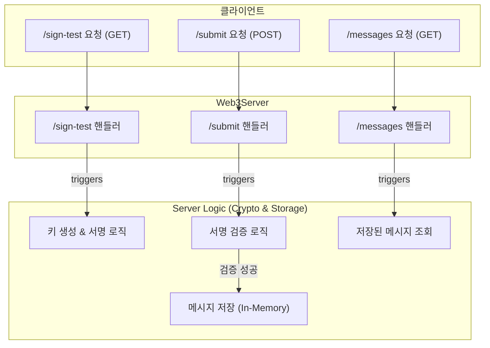

# Go 최종 프로젝트: Web3 디지털 서명 서버 구축하기

지금까지 Go 언어의 기본 문법부터 동시성, 그리고 암호화까지의 여정을 통해 우리는 강력한 애플리케이션을 만들 수 있는 지식을 쌓았음. 이제 배운 모든 것을 활용하여 Web3의 핵심 원리를 담은 최종 프로젝트를 진행할 차례임. 이 프로젝트에서는 외부 라이브러리 없이 Go의 표준 기능만으로 **디지털 서명 생성 및 검증 API 서버**를 구축하며, 견고하고 안전한 서버를 설계하는 방법을 알아볼 것임.

이 서버는 사용자가 자신의 신원(개인키)을 사용해 메시지에 서명하고, 서버는 이를 공개키로 검증함으로써 메시지의 소유권과 무결성을 증명하는 과정을 구현함. 이는 블록체인 지갑이 거래에 서명하는 핵심 원리와 정확히 일치함.

## 1. 프로젝트 목표 및 Java와의 비교

이 프로젝트의 목표는 Go의 `net/http`와 `crypto` 패키지를 활용하여 다음과 같은 기능을 가진 서버를 만드는 것임.

-   **키 생성**: 클라이언트 역할을 시뮬레이션하여 ECDSA 키 쌍을 생성.
-   **서명**: 생성된 개인키로 특정 메시지에 서명.
-   **검증**: 외부에서 전달받은 공개키, 원본 메시지, 서명을 이용해 서명의 유효성을 검증하고, 성공 시 메시지를 저장.

Java로 유사한 시스템을 만든다면 Spring Boot와 Bouncy Castle 라이브러리를 사용하는 것이 일반적임. Go의 접근 방식은 시스템의 동작 원리를 더 깊이 이해하게 해줌.

| 항목 | Go (`net/http` + `crypto`) | Java (Spring Boot + Bouncy Castle) |
|---|---|---|
| **접근 방식** | 표준 라이브러리를 조합하여 밑바닥부터(from-scratch) 구현. Go의 간결함과 핵심 기능 집중 철학을 보여줌. | `@RestController`, `@PostMapping` 등 어노테이션 기반으로 빠르게 API를 개발. Bouncy Castle 같은 외부 라이브러리로 암호화 기능 추가. |
| **서버 구현** | `http.HandleFunc`로 라우팅을 직접 등록하고 `http.ListenAndServe`로 서버를 실행. | 내장된 Tomcat/Netty 위에서 동작하며, 복잡한 설정이 추상화되어 있음. |
| **의존성** | 없음 (표준 라이브러리만 사용) | Spring Boot 관련 라이브러리, 암호화 라이브러리 등 의존성 추가 필요. |
| **결과물** | 모든 코드가 명시적으로 드러나는 단일 바이너리 파일. | 다양한 설정 파일과 라이브러리를 포함하는 `.jar` 파일. |

## 2. 서버 아키텍처

서버의 구조를 명확하게 이해하기 위한 아키텍처 다이어그램은 다음과 같음. 이 다이어그램은 클라이언트의 요청이 어떻게 서버의 각 컴포넌트(핸들러, 내부 로직)와 상호작용하는지 보여줌.



-   **Client**: `curl`이나 웹 브라우저 같은 도구를 통해 서버에 API를 요청.
-   **Server (Handlers)**: `net/http`를 통해 특정 URL 경로(`/sign-test` 등)의 요청을 받아 처리하는 진입점.
-   **Server Logic**: 실제 암호화 연산(키 생성, 서명, 검증)과 데이터(검증된 메시지)를 관리하는 부분.

## 3. 구현 심층 분석

이제 서버의 전체 코드를 각 기능 단위로 나누어 심층적으로 분석해 보자.

### 3.1. 데이터 구조와 전역 변수

서버의 상태를 관리하고 API 요청/응답에 사용될 데이터 구조를 먼저 정의함.

**실습 파일: `20-최종프로젝트/main.go (step1)`**

```go
package main

import (
	"crypto/ecdsa"
	"crypto/elliptic"
	"crypto/rand"
	"crypto/sha256"
	"encoding/hex"
	"encoding/json"
	"fmt"
	"log"
	"net/http"
	"sync"
	"time"
)

// Message는 사용자가 서명할 데이터의 구조를 정의합니다.
type Message struct {
	Content   string    `json:"content"`
	Timestamp time.Time `json:"timestamp"`
}

// SignedMessage는 원본 메시지와 서명, 공개키를 함께 담습니다.
type SignedMessage struct {
	Message   Message `json:"message"`
	Signature string  `json:"signature"`
	PublicKey string  `json:"publicKey"`
}

// 검증된 메시지들을 저장하는 인메모리 슬라이스와 이를 보호하기 위한 뮤텍스입니다.
var (
	verifiedMessages []SignedMessage
	mu               sync.Mutex
)
```

-   `Message`, `SignedMessage`: API가 JSON 형식으로 주고받을 데이터의 Go 표현임. `json:"..."` 태그는 JSON 필드명과 Go 구조체 필드를 매핑함.
-   `verifiedMessages`: 검증된 메시지를 저장하는 공유 메모리 공간(슬라이스)임.
-   `mu (sync.Mutex)`: Go의 HTTP 서버는 여러 요청을 동시에(concurrently) 처리하기 때문에, 여러 요청이 `verifiedMessages` 슬라이스에 동시에 접근하면 데이터가 깨질 수 있음(Race Condition). `Mutex`는 이 슬라이스에 한 번에 하나의 고루틴만 접근하도록 보장하는 **잠금(Lock)** 장치임.

### 3.2. HTTP 핸들러 분석

`main` 함수에 등록된 각 핸들러는 특정 경로의 요청을 처리하는 역할을 함.

#### `handleSubmit`: 서명 검증 및 저장

이 핸들러는 서버의 핵심 두뇌로, 클라이언트가 보낸 서명을 검증함.

**실습 파일: `20-최종프로젝트/main.go (step2)`**

```go
func handleSubmit(w http.ResponseWriter, r *http.Request) {
	// ... 요청 파싱 및 메시지 재구성 로직 ...

	// 서명을 검증합니다.
	if !verify(signedMsg.PublicKey, signedMsg.Signature, msgBytes) {
		http.Error(w, "서명이 유효하지 않습니다.", http.StatusUnauthorized)
		return
	}

	// 뮤텍스를 사용하여 슬라이스에 대한 동시 접근을 제어합니다.
	mu.Lock() // 다른 고루틴의 접근을 막기 위해 잠금을 획득합니다.
	verifiedMessages = append(verifiedMessages, signedMsg)
	mu.Unlock() // 작업이 끝났으므로 잠금을 해제합니다.

	fmt.Printf("검증 성공 및 메시지 저장: %s\n", signedMsg.Message.Content)

	w.WriteHeader(http.StatusCreated)
	fmt.Fprintln(w, "메시지가 성공적으로 검증 및 저장되었습니다.")
}
```

-   **핵심 로직**: 요청에서 받은 공개키, 서명, 메시지를 `verify` 함수로 넘겨 유효성을 확인.
-   **동시성 처리**: `verify`가 성공하면, `mu.Lock()`으로 `verifiedMessages` 슬라이스를 독점적으로 사용하겠다고 선언함. 데이터를 추가한 뒤, `mu.Unlock()`으로 다른 고루틴이 사용할 수 있도록 잠금을 해제함. 이 과정 덕분에 여러 `submit` 요청이 동시에 들어와도 데이터가 안전하게 저장됨.

#### `handleGetMessages`: 저장된 메시지 조회

**실습 파일: `20-최종프로젝트/main.go (step3)`**

```go
func handleGetMessages(w http.ResponseWriter, r *http.Request) {
	mu.Lock() // 데이터를 읽는 동안 다른 고루틴이 쓰는 것을 방지하기 위해 잠금을 획득합니다.
	defer mu.Unlock() // 함수가 종료될 때 반드시 잠금이 해제되도록 defer 키워드를 사용합니다.

	w.Header().Set("Content-Type", "application/json")

    // CORS 접근 허용
    w.Header().Set("Access-Control-Allow-Origin", "*")
    w.Header().Set("Access-Control-Allow-Methods", "GET, POST, PUT, DELETE")
    w.Header().Set("Access-Control-Allow-Headers", "Content-Type")

	if len(verifiedMessages) == 0 {
		w.Write([]byte("[]"))
		return
	}
	json.NewEncoder(w).Encode(verifiedMessages)
}
```

-   **안전한 읽기**: 데이터를 쓰는 작업뿐만 아니라, 읽는 작업 중에도 데이터가 변경되는 것을 막기 위해 잠금이 필요함. `defer mu.Unlock()`은 함수의 로직이 끝나면(에러 발생 포함) 항상 잠금을 해제하도록 보장하는 Go의 유용한 패턴임.

### 3.3. 암호화 로직: `verify` 함수

서명의 유효성을 검증하는 `verify` 함수는 정확한 키 처리가 매우 중요함.

**실습 파일: `20-최종프로젝트/main.go (step4)`**

```go
func verify(publicKeyHex string, signatureHex string, data []byte) bool {
	// 1. 16진수 문자열을 바이트 슬라이스로 디코딩합니다.
	publicKeyBytes, err := hex.DecodeString(publicKeyHex)
	// ...

	// 2. 바이트 슬라이스에서 ECDSA 공개키 객체를 복원합니다.
	curve := elliptic.P256()
	x, y := elliptic.Unmarshal(curve, publicKeyBytes)
	if x == nil {
		return false // Unmarshal 실패
	}
	publicKey := &ecdsa.PublicKey{Curve: curve, X: x, Y: y}

	// 3. 원본 데이터의 해시를 계산하고 서명을 검증합니다.
	hash := sha256.Sum256(data)
	return ecdsa.VerifyASN1(publicKey, hash[:], sigBytes)
}
```

-   **키 역직렬화**: `elliptic.Unmarshal`은 `handleSignTest`에서 `Marshal`로 변환했던 공개키 바이트를 다시 타원 곡선 위의 점(X, Y 좌표)으로 복원함. 이 과정이 정확해야만 올바른 공개키로 서명을 검증할 수 있음.

## 4. 프론트엔드 연동 실습 (HTML + JavaScript)

`curl`을 사용하는 것도 좋은 방법이지만, 실제 웹 애플리케이션과의 연동을 체험해보기 위해 간단한 HTML과 JavaScript로 테스트 페이지를 만들 수 있습니다. 이 코드를 `test.html` 파일로 저장하고 웹 브라우저에서 열면, 버튼 클릭만으로 서버 API를 테스트할 수 있습니다.

(주의: 이 예제는 Go 서버가 `http://localhost:8080`에서 실행 중이라고 가정합니다. 만약 브라우저 콘솔에 CORS 오류가 발생한다면, Go 서버 측에서 CORS 헤더를 허용하는 로직을 추가해야 합니다.)

### `test.html` 전체 코드

**실습 파일: `20-최종프로젝트/test.html`**

> vscode의 live-server를 통해서 실행하세요.

```html
<!DOCTYPE html>
<html lang="ko">
<head>
    <meta charset="UTF-8">
    <meta name="viewport" content="width=device-width, initial-scale=1.0">
    <title>Go Web3 Server Test</title>
    <style>
        body { font-family: sans-serif; line-height: 1.6; padding: 20px; max-width: 800px; margin: auto; }
        h1, h2 { border-bottom: 2px solid #eee; padding-bottom: 10px; }
        button { padding: 10px 15px; font-size: 16px; cursor: pointer; margin-right: 10px; }
        pre { background-color: #f4f4f4; padding: 15px; border-radius: 5px; white-space: pre-wrap; word-wrap: break-word; }
        .step { margin-bottom: 30px; }
        .status { font-weight: bold; }
    </style>
</head>
<body>

    <h1>Go Web3 Server Frontend Test</h1>

    <div class="step">
        <h2>Step 1: Get Signed Message Sample</h2>
        <button id="get-btn">/sign-test 호출</button>
        <p class="status">Response:</p>
        <pre id="get-response">(Not called yet)</pre>
    </div>

    <div class="step">
        <h2>Step 2: Submit for Verification</h2>
        <button id="submit-btn" disabled> /submit 호출</button>
        <p class="status">Response:</p>
        <pre id="submit-response">(Waiting for Step 1)</pre>
    </div>

    <div class="step">
        <h2>Step 3: View All Verified Messages</h2>
        <button id="view-btn">/messages 호출</button>
        <p class="status">Response:</p>
        <pre id="view-response">(Not called yet)</pre>
    </div>

    <script>
        const getBtn = document.getElementById('get-btn');
        const submitBtn = document.getElementById('submit-btn');
        const viewBtn = document.getElementById('view-btn');

        const getResponseEl = document.getElementById('get-response');
        const submitResponseEl = document.getElementById('submit-response');
        const viewResponseEl = document.getElementById('view-response');

        let signedMessagePayload = null;

        // Step 1: /sign-test 호출
        getBtn.addEventListener('click', async () => {
            getResponseEl.textContent = 'Loading...';
            try {
                const response = await fetch('http://localhost:8080/sign-test');
                if (!response.ok) {
                    throw new Error(`HTTP error! status: ${response.status}`);
                }
                const data = await response.json();

                signedMessagePayload = data; // 받은 데이터 저장
                getResponseEl.textContent = JSON.stringify(data, null, 2);
                submitBtn.disabled = false; // 2단계 버튼 활성화
                submitResponseEl.textContent = '(Ready to submit)';

            } catch (error) {
                getResponseEl.textContent = `Error: ${error.message}`;
            }
        });

        // Step 2: /submit 호출
        submitBtn.addEventListener('click', async () => {
            if (!signedMessagePayload) {
                submitResponseEl.textContent = 'Error: No payload from Step 1.';
                return;
            }
            submitResponseEl.textContent = 'Loading...';
            try {
                const response = await fetch('http://localhost:8080/submit', {
                    method: 'POST',
                    headers: {
                        'Content-Type': 'application/json',
                    },
                    body: JSON.stringify(signedMessagePayload),
                });

                const responseText = await response.text();
                if (!response.ok) {
                    throw new Error(`HTTP error! status: ${response.status} - ${responseText}`);
                }
                submitResponseEl.textContent = `Success: ${responseText}`;

            } catch (error) {
                submitResponseEl.textContent = `Error: ${error.message}`;
            }
        });

        // Step 3: /messages 호출
        viewBtn.addEventListener('click', async () => {
            viewResponseEl.textContent = 'Loading...';
            try {
                const response = await fetch('http://localhost:8080/messages');
                if (!response.ok) {
                    throw new Error(`HTTP error! status: ${response.status}`);
                }
                const data = await response.json();
                viewResponseEl.textContent = JSON.stringify(data, null, 2);

            } catch (error) {
                viewResponseEl.textContent = `Error: ${error.message}`;
            }
        });
    </script>

</body>
</html>
```

## 5. 최종 결론

이 프로젝트를 통해 우리는 Go의 표준 라이브러리만으로 Web3의 핵심적인 인증 메커니즘을 구현하고, 동시성 문제까지 고려하여 견고한 서버를 설계하는 실전적인 경험을 해보았음. **개인키로 소유권을 증명한다**는 개념을 안전하고 올바른 코드로 직접 구현하는 과정은 매우 의미 있는 학습 경험임.

이것으로 Go 언어 학습 시리즈를 마무리함. 이 과정을 통해 Go의 간결함과 강력한 동시성, 그리고 시스템 프로그래밍의 즐거움을 충분히 느꼈기를 바람. 이제 여러분은 Go로 어떤 종류의 애플리케이션이든 만들 수 있는 튼튼한 기초를 갖추게 되었음.

## 6. 전체 소스 코드 (main.go)

**실습 파일: `20-최종프로젝트/main.go (final)`**

아래는 동시성 문제가 해결된 최종 `main.go` 파일의 전체 코드입니다.

```go
package main

import (
	"crypto/ecdsa"
	"crypto/elliptic"
	"crypto/rand"
	"crypto/sha256"
	"encoding/hex"
	"encoding/json"
	"fmt"
	"log"
	"net/http"
	"sync"
	"time"
)

// Message는 사용자가 서명할 데이터의 구조를 정의합니다.
type Message struct {
	Content   string    `json:"content"`
	Timestamp time.Time `json:"timestamp"`
}

// SignedMessage는 원본 메시지와 서명, 공개키를 함께 담습니다.
type SignedMessage struct {
	Message   Message `json:"message"`
	Signature string  `json:"signature"`
	PublicKey string  `json:"publicKey"`
}

// 검증된 메시지들을 저장하는 인메모리 슬라이스와 이를 보호하기 위한 뮤텍스입니다.
var (
	verifiedMessages []SignedMessage
	mu               sync.Mutex
)

// verify 함수는 공개키, 서명, 원본 데이터(바이트)를 받아 서명의 유효성을 검증합니다.
// 이 함수는 이제 올바른 키 역직렬화 로직을 포함합니다.
func verify(publicKeyHex string, signatureHex string, data []byte) bool {
	// 1. 16진수 문자열을 바이트 슬라이스로 디코딩합니다.
	publicKeyBytes, err := hex.DecodeString(publicKeyHex)
	if err != nil {
		return false
	}
	sigBytes, err := hex.DecodeString(signatureHex)
	if err != nil {
		return false
	}

	// 2. 바이트 슬라이스에서 ECDSA 공개키 객체를 복원합니다.
	curve := elliptic.P256()
	x, y := elliptic.Unmarshal(curve, publicKeyBytes)
	if x == nil {
		return false // Unmarshal 실패
	}
	publicKey := &ecdsa.PublicKey{Curve: curve, X: x, Y: y}

	// 3. 원본 데이터의 해시를 계산합니다.
	hash := sha256.Sum256(data)

	// 4. 복원된 공개키를 사용하여 서명을 검증합니다.
	return ecdsa.VerifyASN1(publicKey, hash[:], sigBytes)
}

// handleSubmit는 클라이언트로부터 서명된 메시지를 받아 검증하고 저장하는 HTTP 핸들러입니다.
func handleSubmit(w http.ResponseWriter, r *http.Request) {
	if r.Method != http.MethodPost {
		http.Error(w, "POST 메서드만 허용됩니다.", http.StatusMethodNotAllowed)
		return
	}

	var signedMsg SignedMessage
	if err := json.NewDecoder(r.Body).Decode(&signedMsg); err != nil {
		http.Error(w, "잘못된 요청 본문입니다.", http.StatusBadRequest)
		return
	}

	msgBytes, err := json.Marshal(signedMsg.Message)
	if err != nil {
		http.Error(w, "메시지 직렬화 실패.", http.StatusInternalServerError)
		return
	}

	if !verify(signedMsg.PublicKey, signedMsg.Signature, msgBytes) {
		http.Error(w, "서명이 유효하지 않습니다.", http.StatusUnauthorized)
		return
	}

	// 뮤텍스를 사용하여 슬라이스에 대한 동시 접근을 제어합니다.
	mu.Lock()
	verifiedMessages = append(verifiedMessages, signedMsg)
	mu.Unlock()

	fmt.Printf("검증 성공 및 메시지 저장: %s\n", signedMsg.Message.Content)

	w.WriteHeader(http.StatusCreated)
	fmt.Fprintln(w, "메시지가 성공적으로 검증 및 저장되었습니다.")
}

// handleGetMessages는 저장된 모든 검증된 메시지 목록을 JSON 형태로 반환합니다.
func handleGetMessages(w http.ResponseWriter, r *http.Request) {
	if r.Method != http.MethodGet {
		http.Error(w, "GET 메서드만 허용됩니다.", http.StatusMethodNotAllowed)
		return
	}

	mu.Lock() // 읽기 작업도 Lock을 거는 것이 안전합니다 (혹은 RWMutex 사용).
	defer mu.Unlock()

	w.Header().Set("Content-Type", "application/json")

    // CORS 접근 허용
    w.Header().Set("Access-Control-Allow-Origin", "*")
    w.Header().Set("Access-Control-Allow-Methods", "GET, POST, PUT, DELETE")
    w.Header().Set("Access-Control-Allow-Headers", "Content-Type")

	// 슬라이스를 직접 인코딩하면 nil일 경우 'null'이 되므로, 빈 슬라이스를 만들어 처리합니다.
	if len(verifiedMessages) == 0 {
		w.Write([]byte("[]"))
		return
	}
	json.NewEncoder(w).Encode(verifiedMessages)
}

// handleSignTest는 키 생성, 메시지 생성, 서명 과정을 시뮬레이션하여 클라이언트에게 보여주는 학습용 핸들러입니다.
func handleSignTest(w http.ResponseWriter, r *http.Request) {
	// 1. 새 키 쌍 생성
	privateKey, err := ecdsa.GenerateKey(elliptic.P256(), rand.Reader)
	if err != nil {
		http.Error(w, "키 생성 실패", http.StatusInternalServerError)
		return
	}

	// 2. 공개키를 표준 형식의 바이트 슬라이스로 변환 (Marshal 사용)
	publicKeyBytes := elliptic.Marshal(privateKey.PublicKey.Curve, privateKey.PublicKey.X, privateKey.PublicKey.Y)
	publicKeyHex := hex.EncodeToString(publicKeyBytes)

	// 3. 테스트 메시지 생성
	msg := Message{
		Content:   "이것은 Go로 서명된 테스트 메시지입니다.",
		Timestamp: time.Now(),
	}
	msgBytes, _ := json.Marshal(msg)

	// 4. 메시지에 서명
	hash := sha256.Sum256(msgBytes)
	signature, err := ecdsa.SignASN1(rand.Reader, privateKey, hash[:])
	if err != nil {
		http.Error(w, "서명 생성 실패", http.StatusInternalServerError)
		return
	}

	// 5. 서명된 메시지 객체 생성
	signedMsg := SignedMessage{
		Message:   msg,
		Signature: hex.EncodeToString(signature),
		PublicKey: publicKeyHex,
	}

	// 6. 결과를 JSON으로 클라이언트에게 반환
	w.Header().Set("Content-Type", "application/json")
	json.NewEncoder(w).Encode(signedMsg)
}

// main 함수는 서버의 진입점입니다.
func main() {
	http.HandleFunc("/sign-test", handleSignTest)
	http.HandleFunc("/submit", handleSubmit)
	http.HandleFunc("/messages", handleGetMessages)

	fmt.Println("Web3 학습용 서버 시작 (포트: 8080)")
	fmt.Println("사용법:")
	fmt.Println("1. 브라우저나 curl로 'http://localhost:8080/sign-test'에 접속하여 서명된 메시지 샘플 확인")
	fmt.Println("2. 위 결과(JSON 전체)를 복사하여 '/submit' 엔드포인트에 POST 요청 전송")
	fmt.Println("3. 'http://localhost:8080/messages'에 접속하여 저장된 메시지 확인")

	if err := http.ListenAndServe(":8080", nil); err != nil {
		log.Fatalf("서버 시작 실패: %v", err)
	}
}
```