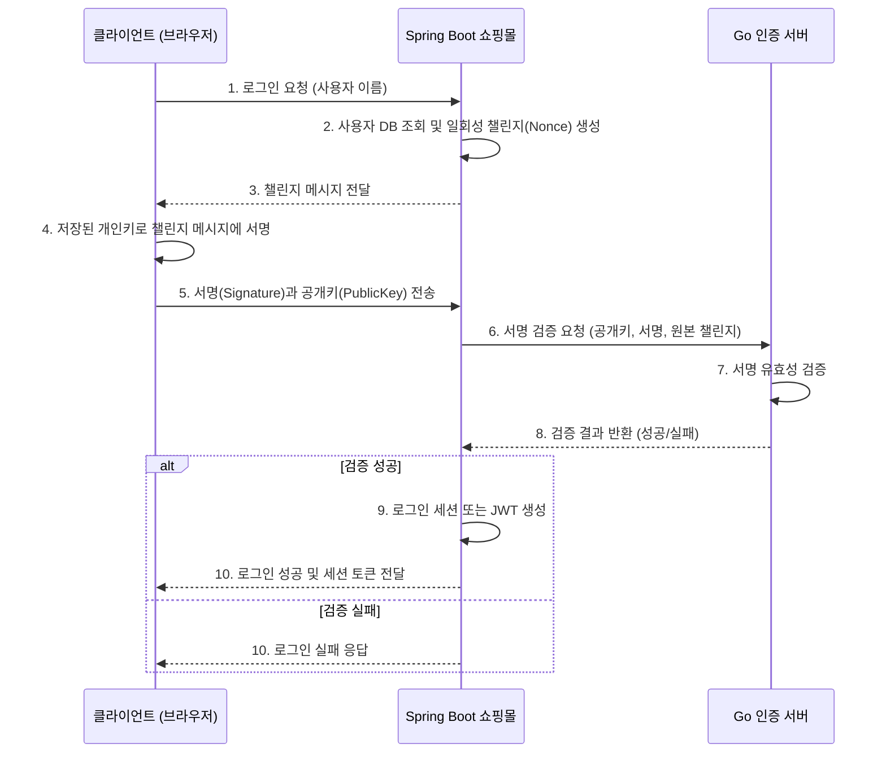

# Go언어와 Spring Boot를 활용한 Web3 로그인 시스템 구축

## 1. 들어가며: 비밀번호 없는 시대를 향하여

기존의 ID/Password 기반 인증 방식은 서비스 제공자와 사용자 모두에게 불편함과 위험을 안겨주었습니다. 비밀번호 유출 사고는 끊이지 않으며, 사용자들은 수많은 사이트의 비밀번호를 기억해야 하는 부담을 가집니다.

이번 포스팅에서는 이러한 문제를 해결하기 위해 **비밀번호 없는(Passwordless) 인증 시스템**을 구축하는 최종 프로젝트를 제안합니다. 사용자는 자신의 암호화 키 쌍(개인키/공개키)을 이용해 신원을 증명하며, Go 언어로 구현된 **인증 마이크로서비스**가 이 과정의 핵심적인 역할을 담당하게 됩니다.

이 프로젝트를 통해 Go 언어의 장점인 성능과 간결함을 활용하여 보안에 민감한 인증 로직을 어떻게 독립적인 서비스로 구축할 수 있는지 학습하게 될 것입니다.

-   **참고 자료:**
    -   [Go언어 최종프로젝트 Web3Server 소개](./24-11-12-Go언어-최종프로젝트-Web3Server.md)
    -   [Go언어 RestApi](./24-11-10-Go언어-RestApi.md)
    -   [Go언어 HTTP네트워킹](./24-11-09-Go언어-HTTP네트워킹.md)

## 2. 프로젝트 목표

기존 Spring Boot 기반 쇼핑몰의 전통적인 인증 방식을 제거하고, Go 언어로 작성된 **디지털 서명 검증 서버**를 연동하여 안전하고 현대적인 "Web3 로그인" 시스템을 완성합니다.

-   **Spring Boot 쇼핑몰**: 주 비즈니스 로직과 사용자 계정 관리를 담당합니다.
-   **Go 인증 서버**: 디지털 서명의 유효성을 검증하는 API를 제공하는 독립적인 마이크로서비스 역할을 합니다.

## 3. 시스템 아키텍처와 로그인 흐름

로그인 과정은 클라이언트(브라우저), Spring Boot 쇼핑몰, 그리고 Go 인증 서버 간의 유기적인 통신을 통해 이루어집니다.



### 상세 워크플로우

1.  **회원가입**
    1.  사용자가 브라우저에서 회원가입 시, 클라이언트(JavaScript)에서 **ECDSA 키 쌍**을 생성합니다.
    2.  **개인키**는 브라우저의 `localStorage`와 같은 안전한 곳에 저장합니다.
    3.  **공개키**만 회원 정보와 함께 Spring Boot 서버로 전송하여 DB에 `password` 대신 저장합니다.

2.  **로그인**
    1.  사용자가 ID 입력 후 로그인을 시도합니다.
    2.  Spring Boot 서버는 DB에서 사용자를 확인하고, **일회성 난수(Nonce)**를 포함한 **챌린지 메시지**를 생성해 클라이언트에 전달합니다. (예: `"로그인을 위해 서명해주세요: nonce-a1b2c3d4"`)
    3.  클라이언트는 저장된 개인키로 이 메시지에 서명합니다.
    4.  클라이언트는 `원본 챌린지`, `서명`, `공개키`를 Spring Boot 서버로 보냅니다.
    5.  Spring Boot 서버는 이 데이터를 Go 인증 서버로 전달하여 검증을 요청합니다.
    6.  검증이 성공하면, Spring Boot 서버는 JWT 같은 세션 토큰을 발급하여 로그인을 완료시킵니다.

-   **참고 자료:**
    -   [Go언어 암호화](./24-11-05-Go언어-암호화.md)
    -   [Go언어 패키지,모듈](./24-10-25-Go언어-패키지,모듈.md)

## 4. 요구사항 및 API 명세

### Part 1: Go 인증 서버

-   **역할**: 순수한 서명 검증 엔진.
-   **엔드포인트**: `/verify-signature` (POST)
-   **Request Body**:
    ```json
    {
        "message": "로그인을 위해 서명해주세요: nonce-a1b2c3d4e5f6",
        "signature": "3045...",
        "publicKey": "04f8..."
    }
    ```
-   **Response Body**:
    ```json
    {
        "verified": true
    }
    ```

### Part 2: Spring Boot 쇼핑몰

-   **데이터 모델**: `User` 엔티티의 `password` 필드를 `publicKey` 필드로 대체합니다.
-   **회원가입**: 클라이언트로부터 `username`, `publicKey`를 받아 저장합니다.
-   **로그인 흐름 (API)**:
    -   **/login/challenge (POST)**: `username`을 받아 `challenge` 메시지를 반환합니다.
    -   **/login/verify (POST)**: `username`, `publicKey`, `signature`, `challenge`를 받아 Go 서버에 검증을 요청하고, 성공 시 JWT를 발급합니다.

### Part 3: 클라이언트 (JavaScript)

-   **회원가입**: ECDSA 키 쌍을 생성하고 개인키는 저장, 공개키는 서버로 전송합니다.
-   **로그인**: 서버로부터 받은 챌린지 메시지를 개인키로 서명하여 서버에 검증을 요청합니다.

## 5. 학습 목표

이 프로젝트를 통해 다음과 같은 현대적인 웹 개발 기술과 보안 개념을 체득할 수 있습니다.

-   **비밀번호 없는 인증(Passwordless)** 방식의 원리 이해 및 구현
-   **챌린지-응답 메커니즘**을 통한 재전송 공격(Replay Attack) 방어
-   **인증 로직의 마이크로서비스화**를 통한 시스템 보안성 및 확장성 향상
-   Go와 Spring Boot(Java)라는 **이기종 언어 간의 API 연동** 경험

다음 포스팅부터는 실제 코드를 통해 각 파트를 구현하는 과정을 상세히 다루겠습니다.
