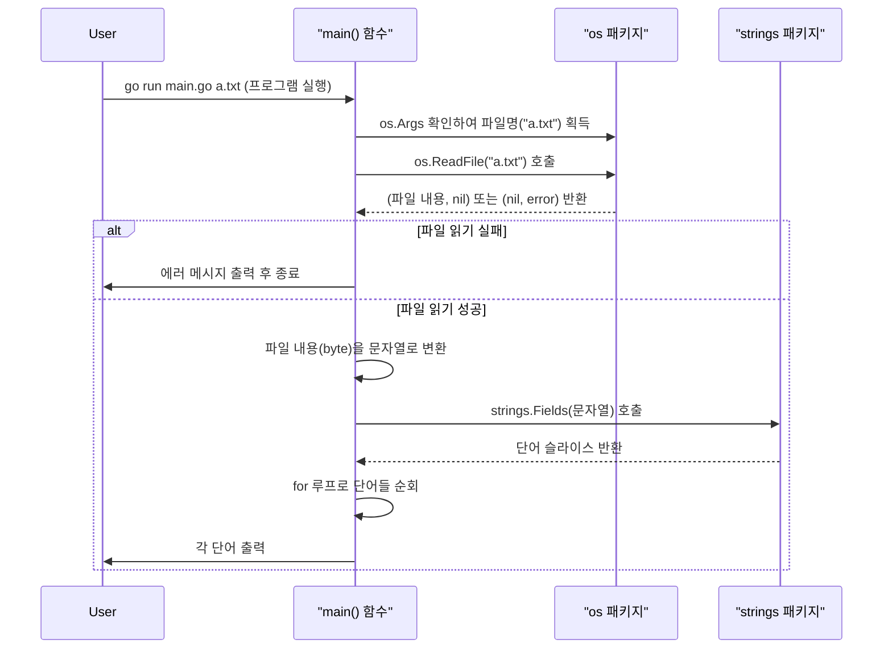
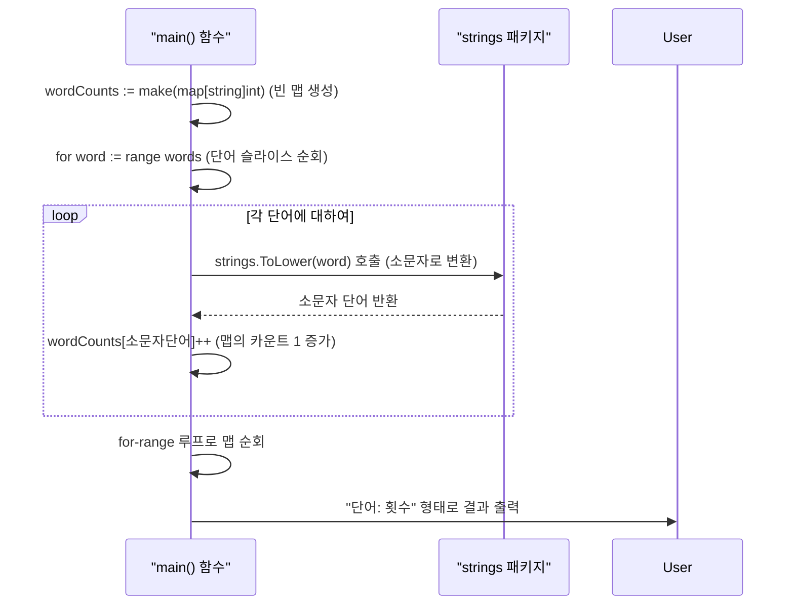
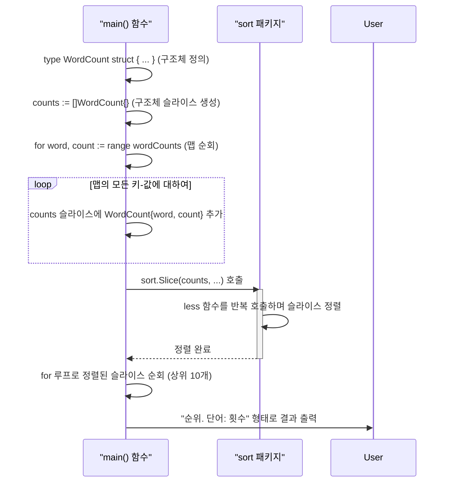

# 미니프로젝트: 파일 단어 빈도 분석기 만들기

지금까지 Go 언어의 기본 문법부터 구조체, 메서드, 에러 처리, 고루틴까지 다양한 개념을 학습했습니다. 이제 이 지식들을 종합하여 실용적인 커맨드라인(CLI) 도구를 만들어 볼 차례입니다.

이번 프로젝트의 목표는 **텍스트 파일의 단어 빈도를 분석하는 프로그램**을 만드는 것입니다. 이 과정을 통해 파일 입출력, 문자열 처리, 맵(map)을 이용한 데이터 집계, 구조체(struct)와 슬라이스(slice)를 활용한 정렬 등 Go 프로그래밍의 핵심적인 패턴을 익히게 될 것입니다.

프로그램은 다음과 같은 단계로 점진적으로 완성해 보겠습니다.

1.  **1단계**: 파일 내용을 읽어 단어별로 분리하기
2.  **2단계**: 맵(Map)을 사용하여 단어의 빈도수 계산하기
3.  **3단계**: 구조체와 정렬(Sort) 기능을 이용해 결과 정렬 및 출력하기

---

## 1단계: 파일 읽고 단어로 분리하기

가장 먼저 할 일은 사용자가 지정한 파일을 읽고, 그 내용을 단어 단위로 쪼개는 것입니다.

### 사용될 주요 API

-   `os.Args`: 프로그램 실행 시 전달된 커맨드라인 인자(argument)를 담고 있는 문자열 슬라이스입니다. `os.Args[0]`은 프로그램 자신의 경로이며, `os.Args[1]`부터 사용자가 전달한 인자가 담깁니다.
-   `os.ReadFile(filename string) ([]byte, error)`: 파일 경로를 인자로 받아, 파일 전체 내용을 바이트 슬라이스(`[]byte`)로 읽어옵니다. 파일이 없거나 읽기 권한이 없으면 `error`를 반환합니다.
-   `strings.Fields(s string) []string`: 문자열을 하나 이상의 공백(스페이스, 탭, 줄바꿈 등)을 기준으로 잘라 단어들의 슬라이스로 만들어 반환합니다.

### 실행 흐름 다이어그램



### 예제 소스 (1단계)

```go
// 07-미니프로젝트(2)/01-read-file/main.go
package main

import (
	"fmt"
	"os"
	"strings"
)

func main() {
	// 1. 커맨드라인 인자 확인
	if len(os.Args) < 2 {
		fmt.Println("사용법: go run main.go <파일명>")
		return // 인자가 없으면 프로그램 종료
	}
	filename := os.Args[1] // 첫 번째 인자를 파일명으로 사용

	// 2. 파일 읽기
	data, err := os.ReadFile(filename)
	if err != nil {
		fmt.Println("파일을 읽는 중 에러 발생:", err)
		return
	}

	// 3. 파일 내용을 문자열로 변환
	text := string(data)

	// 4. 문자열을 단어 슬라이스로 분리
	words := strings.Fields(text)

	// 5. 결과 확인 (단어 개수 및 일부 단어 출력)
	fmt.Printf("총 단어 수: %d
", len(words))
	fmt.Println("--- 파일의 첫 10개 단어 ---")
	for i := 0; i < 10 && i < len(words); i++ {
		fmt.Println(words[i])
	}
}
```

---

## 2단계: 단어 빈도 계산하기

이제 분리된 단어들을 `map`에 저장하여 각 단어가 몇 번 등장했는지 횟수를 세어보겠습니다.

### 사용될 주요 API

-   `make(map[string]int)`: 키는 `string` 타입(단어), 값은 `int` 타입(횟수)인 맵을 초기화하여 생성합니다.
-   `strings.ToLower(s string)`: 모든 영문 대문자를 소문자로 변환합니다. "Go"와 "go"를 같은 단어로 취급하기 위해 사용합니다.

### 실행 흐름 다이어그램



### 예제 소스 (2단계)

```go
// 07-미니프로젝트(2)/02-count-words/main.go
package main

import (
	"fmt"
	"os"
	"strings"
)

func main() {
	if len(os.Args) < 2 {
		fmt.Println("사용법: go run main.go <파일명>")
		return
	}
	filename := os.Args[1]

	data, err := os.ReadFile(filename)
	if err != nil {
		fmt.Println("파일 읽기 에러:", err)
		return
	}

	text := string(data)
	words := strings.Fields(text)

	// 1. 단어 빈도를 저장할 맵 생성
	wordCounts := make(map[string]int)

	// 2. 단어 슬라이스를 순회하며 빈도 계산
	for _, word := range words {
		// "Go"와 "go"를 같은 단어로 취급하기 위해 소문자로 변환
		lowerWord := strings.ToLower(word)
		wordCounts[lowerWord]++ // 맵에 해당 단어의 카운트 1 증가
	}

	// 3. 결과 출력
	fmt.Println("--- 단어 빈도수 ---")
	for word, count := range wordCounts {
		fmt.Printf("%s: %d
", word, count)
	}
}
```

---

## 3단계: 결과 정렬 및 상위 N개 출력하기

맵은 순서가 보장되지 않으므로, 가장 많이 등장한 단어 순으로 결과를 보려면 정렬 과정이 필요합니다. Go에서는 맵을 직접 정렬할 수 없으므로, 맵의 내용을 구조체 슬라이스로 옮겨 담은 뒤 정렬하는 것이 일반적인 방법입니다.

### 사용될 주요 API

-   `sort.Slice(slice any, less func(i, j int) bool)`: Go의 강력한 정렬 함수입니다. 어떤 타입의 슬라이스든 두 번째 인자로 전달된 `less` 함수의 조건에 따라 정렬할 수 있습니다. `less` 함수는 인덱스 `i`의 요소가 `j`의 요소보다 앞에 와야 하면 `true`를 반환하도록 작성합니다.

### 실행 흐름 다이어그램



### 예제 소스 (3단계 - 최종본)

```go
// 07-미니프로젝트(2)/03-sort-result/main.go
package main

import (
	"fmt"
	"os"
	"sort"
	"strings"
)

// 1. 정렬을 위해 단어와 빈도를 담을 구조체 정의
type WordCount struct {
	Word  string
	Count int
}

func main() {
	if len(os.Args) < 2 {
		fmt.Println("사용법: go run main.go <파일명>")
		return
	}
	filename := os.Args[1]

	data, err := os.ReadFile(filename)
	if err != nil {
		fmt.Println("파일 읽기 에러:", err)
		return
	}

	text := string(data)
	words := strings.Fields(text)
	wordCounts := make(map[string]int)

	for _, word := range words {
		lowerWord := strings.ToLower(word)
		wordCounts[lowerWord]++
	}

	// 2. 맵을 구조체 슬라이스로 변환
	// 정렬을 하기 위해 순서가 없는 맵을 순서가 있는 슬라이스로 옮겨 담는다.
	counts := make([]WordCount, 0, len(wordCounts))
	for word, count := range wordCounts {
		counts = append(counts, WordCount{word, count})
	}

	// 3. 슬라이스 정렬
	// sort.Slice를 사용하여 Count 필드를 기준으로 내림차순 정렬한다.
	sort.Slice(counts, func(i, j int) bool {
		return counts[i].Count > counts[j].Count
	})

	// 4. 최종 결과 출력 (상위 10개)
	fmt.Printf("--- '%s' 파일 단어 빈도 분석 결과 (상위 10개) ---
", filename)
	for i := 0; i < 10 && i < len(counts); i++ {
		fmt.Printf("%d. %s: %d
", i+1, counts[i].Word, counts[i].Count)
	}
}
```

### 최종 정리

이로써 커맨드라인으로 전달된 파일의 단어 빈도를 분석하고, 가장 많이 사용된 단어 순으로 결과를 보여주는 프로그램을 완성했습니다. 이 프로젝트를 통해 Go의 기본적인 파일 처리, 문자열 조작, 맵, 구조체, 슬라이스, 그리고 `sort` 패키지의 활용법까지 종합적으로 경험할 수 있었습니다.

여기서 더 나아가 여러 파일을 동시에 분석하도록 **고루틴**을 적용해보거나, 특정 단어를 무시하는 기능 등을 추가하며 프로그램을 더 발전시켜 볼 수도 있을 것입니다.
