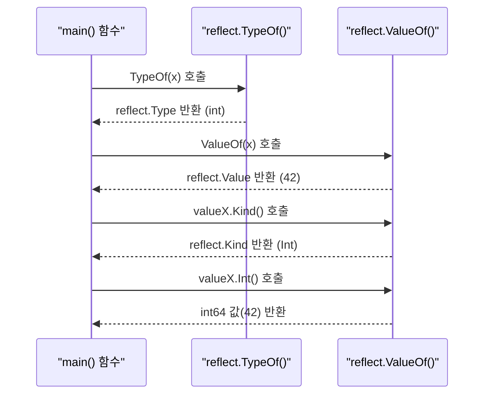
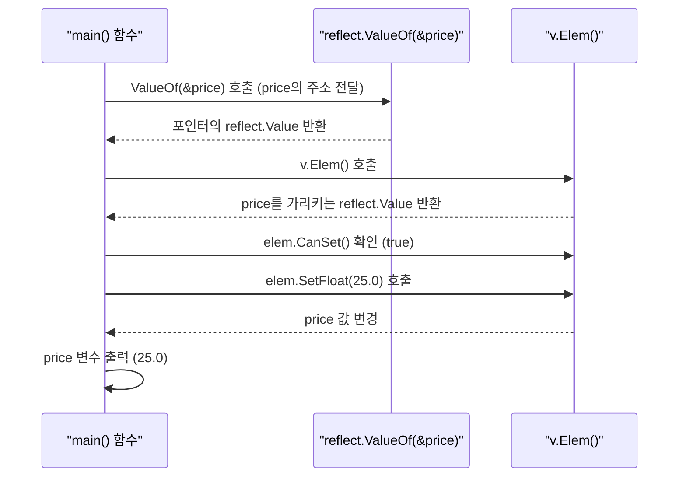
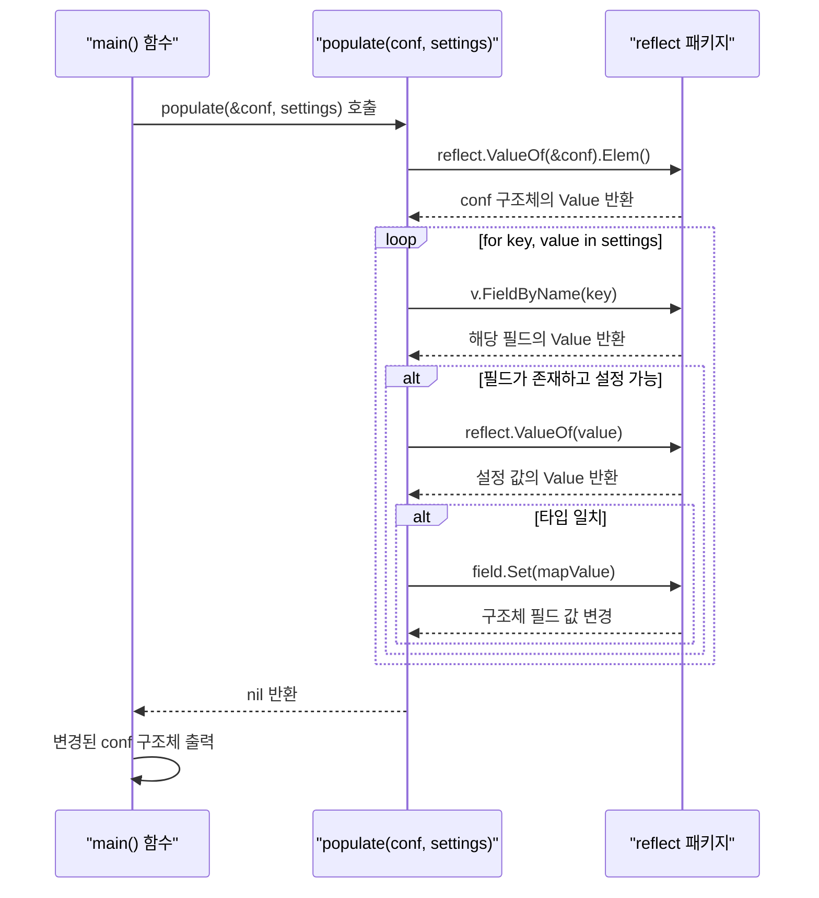

# Go 언어 리플렉션 (Reflection)

리플렉션은 프로그램이 실행 중에 자신의 구조를 검사하고 수정하는 기능임. Go 언어는 `reflect` 패키지를 통해 리플렉션을 지원하며, 이를 통해 인터페이스의 실제 타입이나 변수의 동적 정보를 확인할 수 있음.

## Java의 리플렉션 vs Go의 리플렉션

Java 개발자에게 리플렉션은 익숙한 개념임. Java에서는 `java.lang.reflect` 패키지의 `Class`, `Method`, `Field` 등의 클래스를 사용하여 객체의 정보를 런타임에 가져오고 조작함. Go의 리플렉션은 이와 유사하지만, `reflect.Type`과 `reflect.Value`라는 두 가지 핵심 개념으로 더 간결하게 접근함.

| 구분 | Go (`reflect` 패키지) | Java (`java.lang.reflect`) | 설명 |
|---|---|---|---|
| **타입 정보** | `reflect.Type` | `Class<?>` | 변수의 정적 타입 정보 (이름, 종류, 필드 등) |
| **값 정보** | `reflect.Value` | `Object`, `Field`, `Method` | 변수의 동적 값 정보 (실제 값, 수정 등) |
| **핵심 진입점**| `reflect.TypeOf()`, `reflect.ValueOf()` | `object.getClass()`, `ClassName.class` | 리플렉션을 시작하기 위한 함수/메서드 |

이번 시간에는 동적으로 Struct의 필드를 분석하여 값을 채워 넣는 **설정 로더(Config Loader)**를 만들어보는 것을 목표로 리플렉션을 학습하겠음.

---

## `reflect.TypeOf`와 `reflect.ValueOf`

리플렉션의 핵심은 `TypeOf`와 `ValueOf` 두 함수에서 시작됨.

- `reflect.TypeOf(interface{})`: 인자로 전달된 값의 `Type`을 반환함.
- `reflect.ValueOf(interface{})`: 인자로 전달된 값의 `Value`를 반환함.

### 실습 1: 기본 리플렉션

변수의 타입과 값을 런타임에 확인하는 기초적인 예제를 통해 감을 익혀보겠음.

| API | 파라미터 | 리턴값 | 설명 |
|---|---|---|---|
| `reflect.TypeOf(i interface{})` | `interface{}` | `reflect.Type` | 인자의 동적 타입을 나타내는 `Type`을 반환함. |
| `reflect.ValueOf(i interface{})` | `interface{}` | `reflect.Value` | 인자의 동적 값을 나타내는 `Value`를 반환함. |
| `(v Value).Type()` | 없음 | `reflect.Type` | `Value`가 나타내는 값의 타입을 반환함. |
| `(v Value).Kind()` | 없음 | `reflect.Kind` | `Value`가 나타내는 값의 종류(기본 타입)를 반환함. (예: `Int`, `String`, `Struct`) |
| `(v Value).Int()` | 없음 | `int64` | `Value`가 정수일 경우, 그 값을 `int64`로 반환함. |

**실행 흐름**



**실습 파일: `14-리플렉션/01-기본-리플렉션/main.go`**

```go
package main

import (
	"fmt"
	"reflect"
)

func main() {
	// 1. 정수형 변수 선언
	var x int = 42

	// 2. reflect.TypeOf()를 사용하여 변수 x의 타입 정보를 얻음
	fmt.Println("Type:", reflect.TypeOf(x))

	// 3. reflect.ValueOf()를 사용하여 변수 x의 값 정보를 얻음
	valueX := reflect.ValueOf(x)
	fmt.Println("Value:", valueX)

	// 4. Value 객체에서 실제 타입을 얻을 수도 있음
	fmt.Println("Type from Value:", valueX.Type())

	// 5. Value 객체의 종류(Kind)를 확인
	fmt.Println("Kind:", valueX.Kind())

	// 6. Kind가 Int일 경우, Int() 메서드로 실제 값을 가져옴
	if valueX.Kind() == reflect.Int {
		fmt.Println("Integer value:", valueX.Int())
	}
}
```

**코드 해설**

1.  `var x int = 42`: 리플렉션을 사용할 원본 변수를 선언함.
2.  `reflect.TypeOf(x)`: `x`의 타입인 `int`에 대한 `reflect.Type` 정보를 가져와 출력함.
3.  `reflect.ValueOf(x)`: `x`의 값인 `42`에 대한 `reflect.Value` 정보를 가져와 출력함.
4.  `valueX.Type()`: `reflect.Value` 객체를 통해서도 원래의 `reflect.Type`을 얻을 수 있음을 보여줌.
5.  `valueX.Kind()`: `Type`이 `int`와 같은 구체적인 타입을 나타낸다면, `Kind`는 `int`, `int8`, `int16` 등을 모두 포함하는 더 일반적인 종류인 `reflect.Int`를 나타냄. 타입의 종류를 확인할 때 유용함.
6.  `valueX.Int()`: `Kind`가 `Int`임을 확인한 후, `Int()` 메서드를 호출하여 `reflect.Value`를 실제 `int64` 값으로 변환하여 가져옴.

---

## 리플렉션을 이용한 값 수정

리플렉션을 사용하여 변수의 값을 변경하려면, 원본 변수를 변경할 수 있어야 함. Go는 기본적으로 '값에 의한 전달(Pass by Value)'이므로, `reflect.ValueOf()`에 변수 자체를 넘기면 복사본의 `Value`가 생성됨. 따라서 원본을 수정하려면 변수의 포인터(주소)를 전달해야 함.

- `Value.CanSet()`: `Value`가 나타내는 값을 변경할 수 있는지 여부를 반환함. 포인터를 통해 전달된 값이어야 true를 반환함.
- `Value.Elem()`: 포인터 `Value`가 가리키는 실제 값의 `Value`를 반환함.
- `Value.Set(newValue)`: `Value`가 나타내는 값을 `newValue`로 변경함.

### 실습 2: 리플렉션으로 값 변경하기

| API | 파라미터 | 리턴값 | 설명 |
|---|---|---|---|
| `reflect.ValueOf(i interface{})` | `interface{}` | `reflect.Value` | 인자의 동적 값을 나타내는 `Value`를 반환함. (여기서는 포인터를 전달) |
| `(v Value).CanSet()` | 없음 | `bool` | `Value`가 나타내는 값을 변경할 수 있는지 여부를 반환함. (주소 지정 가능해야 함) |
| `(v Value).Elem()` | 없음 | `reflect.Value` | `Value`가 포인터일 경우, 그 포인터가 가리키는 실제 요소의 `Value`를 반환함. |
| `(v Value).SetFloat(f float64)` | `float64` | 없음 | `Value`가 부동소수점 수일 경우, 그 값을 주어진 `float64` 값으로 설정함. |

**실행 흐름**



**실습 파일: `14-리플렉션/02-값-수정/main.go`**

```go
package main

import (
	"fmt"
	"reflect"
)

func main() {
	var price float64 = 10.5

	// 1. 변수의 포인터를 reflect.ValueOf()에 전달
	v := reflect.ValueOf(&price)

	// 2. Elem()으로 포인터가 가리키는 실제 값에 접근
	elem := v.Elem()

	// 3. CanSet()으로 값 변경 가능 여부 확인
	if elem.CanSet() {
		// 4. Kind가 float64일 경우, SetFloat()으로 값 변경
		if elem.Kind() == reflect.Float64 {
			elem.SetFloat(25.0)
		}
	}

	// 5. 원본 변수의 값이 변경되었는지 확인
	fmt.Println("Original price value:", price)
}
```

**코드 해설**

1.  `reflect.ValueOf(&price)`: 값을 수정하기 위해 `price` 변수의 주소(`&price`)를 `ValueOf`에 전달함. `v`는 포인터를 감싸는 `reflect.Value`가 됨.
2.  `v.Elem()`: 포인터 `Value`인 `v`에서 `Elem()`을 호출하여, 포인터가 실제로 가리키는 값(원본 `price` 변수)에 대한 `reflect.Value`를 얻음. `elem`은 이제 원본 `price`를 직접 대표함.
3.  `elem.CanSet()`: `elem`이 주소 지정 가능한(addressable) 실제 변수를 가리키므로, `CanSet()`은 `true`를 반환하여 값을 수정할 수 있음을 알림.
4.  `elem.SetFloat(25.0)`: `Kind`를 확인한 후, `SetFloat` 메서드를 사용하여 원본 변수의 값을 `25.0`으로 변경함.
5.  `fmt.Println(price)`: 리플렉션을 통해 값이 변경되었으므로, 원본 `price` 변수를 출력하면 `25.0`이 나옴.

---

## 실전 예제: 동적 설정 로더

이제 리플렉션의 최종 목표인 동적 설정 로더를 만들어보겠음. 이 로더는 `map[string]interface{}` 형태의 설정 데이터를 어떤 구조체(Struct)에든 동적으로 채워 넣는 기능을 함.

### 실습 3: 구조체 필드 분석 및 값 할당

`Config`라는 구조체를 정의하고, 맵에 담긴 데이터를 리플렉션을 사용해 `Config` 인스턴스의 필드에 자동으로 할당할 것임.

| API | 파라미터 | 리턴값 | 설명 |
|---|---|---|---|
| `(v Value).Elem()` | 없음 | `reflect.Value` | 포인터 `Value`가 가리키는 실제 요소(여기서는 구조체)의 `Value`를 반환함. |
| `(v Value).FieldByName(name string)` | `string` | `reflect.Value` | 구조체 `Value`에서 주어진 이름의 필드를 찾아 `Value`로 반환함. |
| `(v Value).IsValid()` | 없음 | `bool` | `Value`가 유효한지(존재하는지) 여부를 반환함. `FieldByName`으로 필드를 못찾으면 `false`가 됨. |
| `(v Value).CanSet()` | 없음 | `bool` | `Value`가 나타내는 값을 변경할 수 있는지 여부를 반환함. |
| `(v Value).Set(x reflect.Value)` | `reflect.Value` | 없음 | `Value`의 값을 다른 `Value`로 설정함. |

**실행 흐름**



**실습 파일: `14-리플렉션/03-구조체-분석/main.go`**

```go
package main

import (
	"fmt"
	"reflect"
)

type Config struct {
	ServerName string
	Port       int
	Enabled    bool
}

func populate(s interface{}, settings map[string]interface{}) error {
	// 1. 구조체 포인터의 Value를 얻고, Elem()으로 실제 구조체에 접근
	v := reflect.ValueOf(s).Elem()
	if v.Kind() != reflect.Struct {
		return fmt.Errorf("populate() requires a pointer to a struct")
	}

	// 2. 맵의 키와 값으로 반복
	for key, value := range settings {
		// 3. 맵의 키와 이름이 같은 구조체 필드를 찾음
		field := v.FieldByName(key)

		// 4. 필드가 존재하고 값을 변경할 수 있는지 확인
		if field.IsValid() && field.CanSet() {
			mapValue := reflect.ValueOf(value)

			// 5. 필드 타입과 맵 값의 타입이 일치하면 값을 설정
			if field.Type() == mapValue.Type() {
				field.Set(mapValue)
			}
		}
	}
	return nil
}

func main() {
	conf := &Config{}
	settings := map[string]interface{}{
		"ServerName": "Gemini Server",
		"Port":       8080,
		"Enabled":    true,
	}

	if err := populate(conf, settings); err != nil {
		panic(err)
	}

	fmt.Printf("Config: %+v\n", conf)
}
```

**코드 해설**

1.  `reflect.ValueOf(s).Elem()`: `populate` 함수는 어떤 구조체든 처리할 수 있도록 `interface{}` 타입을 받음. 값을 수정해야 하므로 반드시 구조체의 포인터를 받아야 하며, `Elem()`으로 실제 구조체 `Value`에 접근함.
2.  `for key, value := range settings`: 설정 데이터가 담긴 맵을 순회함.
3.  `v.FieldByName(key)`: 맵의 `key` (예: "ServerName")와 동일한 이름의 구조체 필드를 `reflect.Value`로 찾아냄.
4.  `field.IsValid() && field.CanSet()`: `FieldByName`이 필드를 찾았는지(`IsValid`), 그리고 그 필드가 public 필드여서 값을 쓸 수 있는지(`CanSet`) 확인.
5.  `field.Set(mapValue)`: 맵의 값과 구조체 필드의 타입이 일치하는지 확인한 후, `Set` 메서드로 구조체 필드의 값을 동적으로 설정함.

이처럼 리플렉션을 사용하면 코드 작성 시점에는 알 수 없는 동적 타입에 대응하는 유연한 코드를 작성할 수 있음. Java의 어노테이션 프로세서나 Spring 프레임워크가 리플렉션을 통해 DI(의존성 주입)를 처리하는 것과 같은 원리임. 하지만 리플렉션은 컴파일 타임의 타입 체크를 우회하고 성능에 부하를 줄 수 있으므로 꼭 필요한 경우에만 신중하게 사용해야 함.