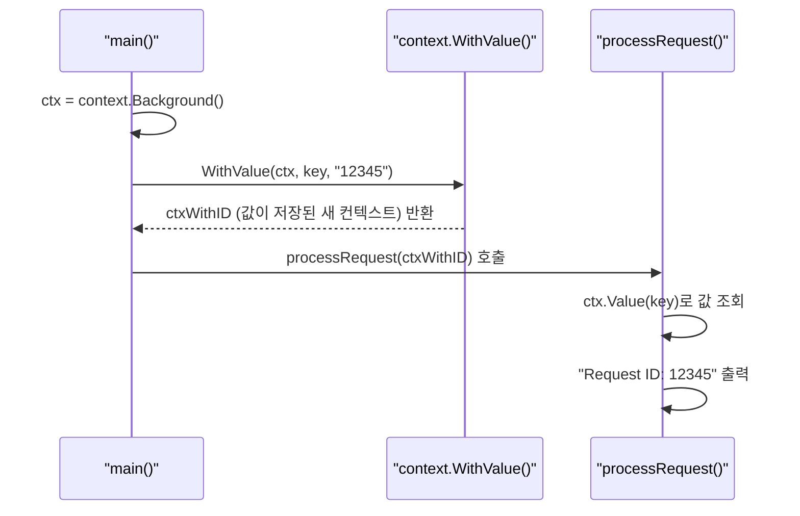

# Go 언어 컨텍스트 (Context)

Go 언어에서 `context` 패키지는 API 경계를 넘나드는 요청의 생명주기를 관리하기 위한 표준적인 방법을 제공함. 주요 기능은 **취소 신호 전파**, **타임아웃 및 데드라인 설정**, **요청 범위 값 전달**임. 특히 여러 고루틴에 걸쳐 작업이 수행되는 서버 환경에서 클라이언트의 연결 종료나 타임아웃을 모든 하위 작업에 전파하여 시스템 리소스를 효율적으로 관리할 수 있게 함.

## Java의 동시성 제어 vs Go의 Context

Java에서는 Go의 `Context`와 정확히 일치하는 단일 기능은 없음. 대신 여러 기능을 조합하여 비슷한 목적을 달성함.

| 구분 | Go (`context` 패키지) | Java | 설명 |
|---|---|---|---|
| **취소** | `context.WithCancel` | `Thread.interrupt()`, `Future.cancel()` | 작업 중단 신호를 보내지만, Go의 컨텍스트는 여러 고루틴에 걸쳐 신호를 전파하는 데 더 특화되어 있음. |
| **타임아웃** | `context.WithTimeout` | `Future.get(timeout, unit)` | 특정 시간 동안 결과를 기다리거나 작업을 제한하는 기능. |
| **값 전달** | `context.WithValue` | `ThreadLocal` | 스레드(고루틴) 범위 내에서 안전하게 값을 전달하는 메커니즘. |

Java의 `ThreadLocal`이 단일 스레드 내에서 값을 공유하는 데 초점을 맞춘다면, Go의 `context.WithValue`는 요청 처리와 같이 시작점(예: HTTP 핸들러)에서 여러 하위 고루틴으로 이어지는 작업 전체에 걸쳐 값을 전달하는 데 사용됨.

이번 시간에는 **외부 API를 호출하는 서버**를 가정하고, 클라이언트 요청이 타임아웃될 경우 모든 하위 작업을 안전하게 종료시키는 예제를 통해 컨텍스트의 활용법을 익혀보겠음.

---

## `context.WithValue`: 요청 범위 값 전달

`context.WithValue`는 부모 컨텍스트에 키-값 쌍을 저장한 새로운 컨텍스트를 반환함. 이렇게 저장된 값은 해당 컨텍스트를 전달받는 모든 함수에서 꺼내 쓸 수 있음. 주로 요청 ID, 인증 토큰 등과 같이 요청 전체에 걸쳐 필요한 데이터를 전달하는 데 사용됨.

### 실습 1: 컨텍스트로 값 전달하기

HTTP 요청이 들어왔을 때 생성된 "Request ID"를 명시적인 파라미터 전달 없이 여러 함수에 걸쳐 공유하는 예제임.

| API | 파라미터 | 리턴값 | 설명 |
|---|---|---|---|
| `context.Background()` | 없음 | `context.Context` | 비어있는 최상위 컨텍스트를 반환함. 보통 `main` 함수나 요청의 시작점에서 사용됨. |
| `context.WithValue(parent, key, val)` | `parent context.Context`, `key, val interface{}` | `context.Context` | 부모 컨텍스트에 키-값 쌍을 저장한 새로운 자식 컨텍스트를 반환함. |
| `(ctx Context).Value(key interface{})` | `interface{}` | `interface{}` | 컨텍스트 체인을 따라 올라가며 주어진 키에 해당하는 값을 찾아서 반환함. |

**실행 흐름**



**실습 파일: `15-컨텍스트/01-컨텍스트-값-전달/main.go`**

```go
package main

import (
	"context"
	"fmt"
)

// 1. 키 충돌을 방지하기 위해 사용자 정의 타입을 사용
type requestIDKey string

func processRequest(ctx context.Context) {
	// 2. 컨텍스트에서 "requestID" 키로 값을 조회
	id, ok := ctx.Value(requestIDKey("requestID")).(string)
	if !ok {
		id = "unknown"
	}
	fmt.Printf("Processing request with ID: %s\n", id)
}

func main() {
	// 3. 비어 있는 최상위 컨텍스트 생성
	ctx := context.Background()

	// 4. 컨텍스트에 "requestID"와 값 "12345"를 저장
	ctxWithID := context.WithValue(ctx, requestIDKey("requestID"), "12345")

	// 5. 값이 저장된 컨텍스트를 함수에 전달
	processRequest(ctxWithID)
}
```

**코드 해설**

1.  `type requestIDKey string`: 컨텍스트의 키는 `interface{}` 타입이지만, 다른 패키지와의 키 충돌을 피하기 위해 보통 `string`이나 `int`가 아닌 사용자 정의 타입을 선언하여 사용함.
2.  `ctx.Value(...)`: `processRequest` 함수는 `ctx`에서 `requestIDKey` 타입의 키를 사용해 값을 조회함. 리턴값이 `interface{}`이므로, 실제 타입인 `string`으로 타입 단언(`.(string)`)을 해야 함.
3.  `context.Background()`: 모든 컨텍스트 체인의 시작점이 되는, 비어있고 취소될 수 없는 기본 컨텍스트를 생성함.
4.  `context.WithValue(...)`: `Background` 컨텍스트를 부모로 하여, 키(`requestIDKey`)와 값(`