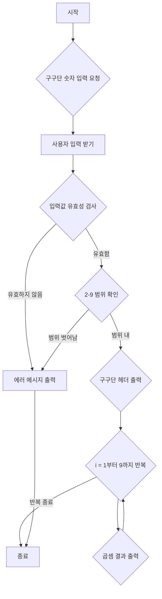
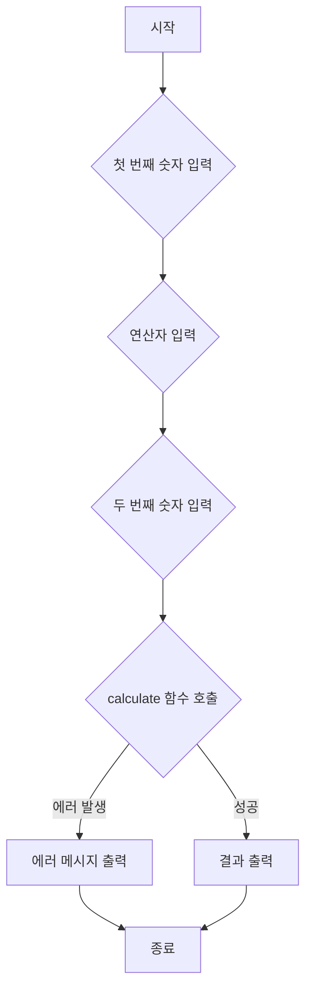
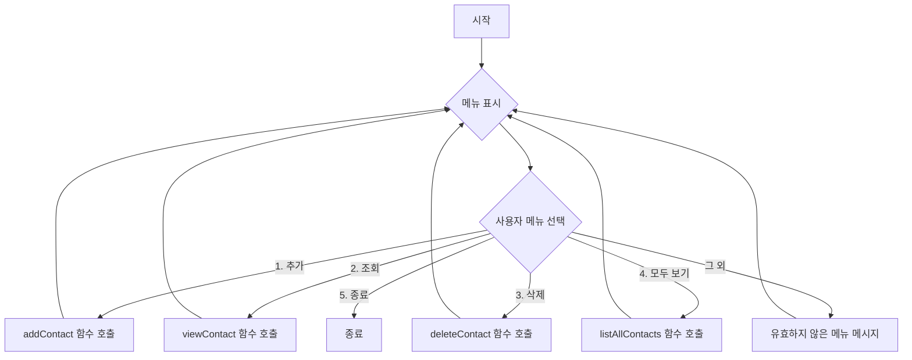

---
title: "Go 언어 간단 실습: 구구단, 계산기, 전화번호부"
description: "Go 언어의 기본 문법을 활용하여 구구단, 계산기, 전화번호부와 같은 간단한 유틸리티를 직접 만들어봅니다."
categories: [03.Coding,Golang]
date:   2025-10-18 10:00:00 +0900
author: Hossam
image: /images/indexs/golang.webp
tags: [Programming,Golang,Coding,Go-Practice,Go-CLI]
pin: true
math: true
mermaid: true
---

# Go 언어로 만드는 유틸리티: 구구단, 계산기, 전화번호부

> 모든 실습은 VSCode에서 진행하며, `Go-Learning` 워크스페이스 내 `05-간단실습` 폴더에 예제 파일을 생성하는 것을 기준으로 설명한다.

---

## 서론: Go 언어로 만드는 실용적인 도구

이전 포스팅에서 Go 언어의 기본 문법과 컬렉션 자료형, 그리고 값/참조 전달 및 메모리 개념을 학습했다. 이제 이러한 지식을 바탕으로 실제 생활에서 유용하게 활용될 수 있는 간단한 유틸리티 프로그램을 직접 만들어보자. 구구단 출력기, 간단한 계산기, 그리고 전화번호부 관리 프로그램을 구현하면서 Go 언어의 실용적인 활용법을 익히는 것이 목표다.

---

## 1. 구구단 출력기 (Multiplication Table Generator)

구구단 출력기는 반복문과 기본적인 입출력 기능을 학습하기에 좋은 예제다. 사용자로부터 숫자를 입력받아 해당 숫자의 구구단을 출력하는 프로그램을 만들어 본다.

### 1.1 Go와 Java의 반복문 및 입출력 비교

| 항목 | Go 언어 | Java |
|---|---|---|
| 반복문 | `for` (다양한 형태 지원) | `for`, `while`, `do-while`, 향상된 `for` |
| 표준 입력 | `fmt.Scanln`, `bufio.NewReader` | `java.util.Scanner` |
| 표준 출력 | `fmt.Println`, `fmt.Printf` | `System.out.println`, `System.out.printf` |

Go의 `for` 문은 Java의 `for`, `while`을 모두 대체할 수 있는 유연한 구조를 가진다. 입출력 방식은 개념적으로 유사하지만, Go는 `fmt` 패키지를 통해 간결하게 처리한다.

### 실습 1: 사용자 입력 구구단 출력

사용자로부터 2~9 사이의 숫자를 입력받아 해당 숫자의 구구단을 출력한다.

**실습 파일:** `05-간단실습/01-gugudan.go`

```go
package main

import (
	"bufio"
	"fmt"
	"os"
	"strconv"
	"strings"
)

func main() {
	fmt.Print("구구단을 출력할 숫자를 입력하세요 (2-9): ")
	reader := bufio.NewReader(os.Stdin) // 표준 입력 리더 생성
	input, _ := reader.ReadString('\n') // 한 줄 읽기
	input = strings.TrimSpace(input)    // 공백 제거

	// 문자열을 정수로 변환
	// Java의 `Integer.parseInt()`와 유사하지만, Go는 에러도 함께 반환한다.
	num, err := strconv.Atoi(input)
	if err != nil {
		fmt.Println("잘못된 입력입니다. 숫자를 입력해주세요.")
		return
	}

	if num < 2 || num > 9 {
		fmt.Println("2에서 9 사이의 숫자를 입력해주세요.")
		return
	}

	fmt.Printf("---" %d단 ---", num)
	// Go의 for 반복문 (Java의 for 루프와 유사)
	for i := 1; i <= 9; i++ {
		fmt.Printf("%d x %d = %d\n", num, i, num*i)
	}
}
```

### 실행 흐름 다이어그램: 구구단 출력기



---

## 2. 간단한 계산기 (Simple Calculator)

사용자로부터 두 개의 숫자와 하나의 연산자(+, -, *, /)를 입력받아 계산 결과를 출력하는 간단한 계산기를 만들어 본다. 조건문(`if-else` 또는 `switch`)과 함수 활용법을 익힐 수 있다.

### 2.1 Go와 Java의 조건문 및 함수 비교

| 항목 | Go 언어 | Java |
|---|---|---|
| 조건문 | `if-else`, `switch` | `if-else`, `switch` |
| 함수 정의 | `func functionName(params) returnType` | `returnType functionName(params)` |
| 다중 반환 | 지원 (`(val, err)`) | 지원 안함 (객체/배열로 묶어서 반환) |

Go의 조건문은 Java와 유사하지만, `switch` 문이 더 유연하다. 함수는 다중 반환 값을 지원하여 에러 처리 등에 유용하게 사용된다.

### 실습 2: 사칙연산 계산기

두 숫자와 연산자를 입력받아 계산 결과를 출력한다.

**실습 파일:** `05-간단실습/02-calculator.go`

```go
package main

import (
	"bufio"
	"fmt"
	"os"
	"strconv"
	"strings"
)

// 두 숫자와 연산자를 받아 계산 결과를 반환하는 함수
// Go 함수는 다중 반환 값을 지원한다. (Java는 객체나 배열로 묶어서 반환해야 함)
func calculate(num1, num2 float64, operator string) (float64, error) {
	var result float64
	var err error

	// Go의 switch 문은 Java보다 유연하다. break를 명시하지 않아도 자동으로 다음 case로 넘어가지 않는다.
	sswitch operator {
	case "+":
		result = num1 + num2
	case "-":
		result = num1 - num2
	case "*":
		result = num1 * num2
	case "/":
		if num2 == 0 {
			return 0, fmt.Errorf("0으로 나눌 수 없습니다.") // Go의 에러 반환 방식
		}
		result = num1 / num2
	default:
		err = fmt.Errorf("유효하지 않은 연산자입니다: %s", operator)
	}
	return result, err
}

func main() {
	reader := bufio.NewReader(os.Stdin)

	// 첫 번째 숫자 입력
	fmt.Print("첫 번째 숫자를 입력하세요: ")
	input1, _ := reader.ReadString('\n')
	num1, err := strconv.ParseFloat(strings.TrimSpace(input1), 64)
	if err != nil {
		fmt.Println("잘못된 입력입니다. 숫자를 입력해주세요.")
		return
	}

	// 연산자 입력
	fmt.Print("연산자를 입력하세요 (+, -, *, /): ")
	operator, _ := reader.ReadString('\n')
	operator = strings.TrimSpace(operator)

	// 두 번째 숫자 입력
	fmt.Print("두 번째 숫자를 입력하세요: ")
	input2, _ := reader.ReadString('\n')
	num2, err := strconv.ParseFloat(strings.TrimSpace(input2), 64)
	if err != nil {
		fmt.Println("잘못된 입력입니다. 숫자를 입력해주세요.")
		return
	}

	// 계산 함수 호출 및 결과 처리
	// Go의 다중 반환 값 처리 (Java는 try-catch로 예외 처리)
	result, calcErr := calculate(num1, num2, operator)
	if calcErr != nil {
		fmt.Println("에러:", calcErr)
	} else {
		fmt.Printf("결과: %.2f %s %.2f = %.2f\n", num1, operator, num2, result)
	}
}
```

### 실행 흐름 다이어그램: 간단한 계산기



---

## 3. 전화번호부 관리 (Phone Book Manager)

맵(Map)을 활용하여 간단한 전화번호부 관리 프로그램을 만들어 본다. 연락처 추가, 조회, 삭제 기능을 구현하면서 맵의 활용법과 메뉴 기반 CLI(Command Line Interface) 프로그램의 기본 구조를 익힐 수 있다.

### 3.1 Go와 Java의 맵 및 CLI 구조 비교

| 항목 | Go 언어 | Java |
|---|---|---|
| 맵 | `map[KeyType]ValueType` | `java.util.HashMap<KeyType, ValueType>` |
| CLI 메뉴 | `for` 루프, `switch` | `while` 루프, `switch` |
| 문자열 비교 | `==` 연산자 | `equals()` 메서드 |

Go의 맵은 Java의 `HashMap`과 개념적으로 유사하다. CLI 메뉴는 `for` 루프와 `switch` 문을 조합하여 구현하며, Go에서는 문자열 비교에 `==` 연산자를 직접 사용할 수 있다.

### 실습 3: 메뉴 기반 전화번호부

연락처를 추가, 조회, 삭제할 수 있는 간단한 전화번호부 프로그램.

**실습 파일:** `05-간단실습/03-phonebook.go`

```go
package main

import (
	"bufio"
	"fmt"
	"os"
	"strings"
)

// 전화번호부를 저장할 맵 (이름 -> 전화번호)
var phoneBook = make(map[string]string)

func main() {
	reader := bufio.NewReader(os.Stdin)

	// 무한 루프를 통해 메뉴를 계속 표시 (Java의 `while(true)`와 유사)
	for {
		fmt.Println("\n--- 전화번호부 ---")
		fmt.Println("1. 연락처 추가")
		fmt.Println("2. 연락처 조회")
		fmt.Println("3. 연락처 삭제")
		fmt.Println("4. 모든 연락처 보기")
		fmt.Println("5. 종료")
		fmt.Print("메뉴를 선택하세요: ")

		choice, _ := reader.ReadString('\n')
		choice = strings.TrimSpace(choice)

		// Go의 switch 문은 조건식 없이도 사용 가능하며, 여러 case를 묶을 수 있다.
		switch choice {
		case "1":
			addContact(reader)
		case "2":
			viewContact(reader)
		case "3":
			deleteContact(reader)
		case "4":
			listAllContacts()
		case "5":
			fmt.Println("전화번호부를 종료합니다.")
			return // main 함수 종료
		default:
			fmt.Println("유효하지 않은 메뉴입니다. 다시 선택해주세요.")
		}
	}
}

// 연락처 추가 함수
func addContact(reader *bufio.Reader) {
	fmt.Print("이름을 입력하세요: ")
	name, _ := reader.ReadString('\n')
	name = strings.TrimSpace(name)

	fmt.Print("전화번호를 입력하세요: ")
	phone, _ := reader.ReadString('\n')
	phone = strings.TrimSpace(phone)

	phoneBook[name] = phone // 맵에 추가 또는 업데이트
	fmt.Printf("'%s' 연락처가 추가되었습니다.\n", name)
}

// 연락처 조회 함수
func viewContact(reader *bufio.Reader) {
	fmt.Print("조회할 이름을 입력하세요: ")
	name, _ := reader.ReadString('\n')
	name = strings.TrimSpace(name)

	phone, ok := phoneBook[name] // 맵에서 값 가져오기 및 존재 여부 확인
	if ok {
		fmt.Printf("이름: %s, 전화번호: %s\n", name, phone)
	} else {
		fmt.Printf("'%s' 연락처를 찾을 수 없습니다.\n", name)
	}
}

// 연락처 삭제 함수
func deleteContact(reader *bufio.Reader) {
	fmt.Print("삭제할 이름을 입력하세요: ")
	name, _ := reader.ReadString('\n')
	name = strings.TrimSpace(name)

	_, ok := phoneBook[name] // 존재 여부 확인
	if ok {
		delete(phoneBook, name) // 맵에서 삭제
		fmt.Printf("'%s' 연락처가 삭제되었습니다.\n", name)
	} else {
		fmt.Printf("'%s' 연락처를 찾을 수 없습니다.\n", name)
	}
}

// 모든 연락처 보기 함수
func listAllContacts() {
	if len(phoneBook) == 0 {
		fmt.Println("전화번호부가 비어 있습니다.")
		return
	}
	fmt.Println("\n--- 모든 연락처 ---")
	// 맵 순회 (순서 보장 안됨)
	for name, phone := range phoneBook {
		fmt.Printf("이름: %s, 전화번호: %s\n", name, phone)
	}
}
```

### 실행 흐름 다이어그램: 전화번호부 관리 프로그램


