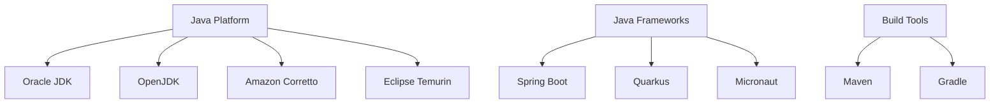

## #01. Java 프로그래밍 이해하기

### 1. 프로그램 개발 과정


#### 주요 개념 정리

| 용어 | 설명 | 예시 |
|------|------|------|
| **소스코드** | 사람이 읽을 수 있는 프로그래밍 언어 | `HelloWorld.java` |
| **컴파일** | 소스코드를 바이트코드로 변환 | `javac HelloWorld.java` |
| **바이트코드** | JVM이 실행할 수 있는 중간 코드 | `HelloWorld.class` |
| **JVM** | Java Virtual Machine | 플랫폼 독립적 실행 환경 |

### 2. Java의 특징과 장점

#### ⭐ 핵심 특징

- **플랫폼 독립성**: "Write Once, Run Anywhere" (WORA)
- **객체지향**: 모든 것이 객체로 구성
- **가비지 컬렉션**: 자동 메모리 관리
- **멀티스레딩**: 동시성 프로그래밍 지원
- **강타입**: 컴파일 시점 오류 검출

#### 2025년 기준 Java 생태계



### 3. 파일 확장자와 명명 규칙

#### Java 파일 확장자
- **소스코드**: `.java` (예: `HelloWorld.java`)
- **컴파일된 바이트코드**: `.class` (예: `HelloWorld.class`)
- **실행 가능한 JAR**: `.jar` (예: `myapp.jar`)

#### Java 명명 규칙 (2025년 모범 사례)

| 구분 | 규칙 | 예시 |
|------|------|------|
| **클래스** | PascalCase | `HelloWorld`, `UserService` |
| **메서드** | camelCase | `getName()`, `calculateTotal()` |
| **변수** | camelCase | `userName`, `totalAmount` |
| **상수** | UPPER_SNAKE_CASE | `MAX_SIZE`, `DEFAULT_PORT` |
| **패키지** | lowercase | `com.example.util` |

## #02. 개발 환경 구성 (2025년 최신)

### 1. JDK 21 LTS 설치 (권장)

2025년 기준으로 **JDK 21 LTS**가 가장 안정적이고 장기 지원되는 버전입니다.

#### 추천 JDK 배포판

| 배포판 | 특징 | 다운로드 |
|--------|------|----------|
| **Eclipse Temurin** | OpenJDK 기반, 무료, 상용 가능 | [adoptium.net](https://adoptium.net/) |
| **Amazon Corretto** | AWS 최적화, 무료 | [aws.amazon.com/corretto](https://aws.amazon.com/corretto/) |
| **Oracle JDK** | 공식, 상용 라이선스 필요 | [oracle.com/java](https://www.oracle.com/java/) |

#### 설치 방법

##### Windows (추천: SDKMAN)
```powershell
# Scoop을 통한 SDKMAN 설치
scoop install sdkman

# SDKMAN을 통한 JDK 설치
sdk install java 21.0.2-tem
sdk use java 21.0.2-tem
```

##### macOS (Homebrew)
```bash
# Homebrew를 통한 JDK 설치
brew install --cask temurin21

# 또는 SDKMAN 사용
curl -s "https://get.sdkman.io" | bash
sdk install java 21.0.2-tem
```

##### Linux (Ubuntu/Debian)
```bash
# Eclipse Temurin 저장소 추가
wget -O - https://packages.adoptium.net/artifactory/api/gpg/key/public | sudo apt-key add -
echo "deb https://packages.adoptium.net/artifactory/deb $(awk -F= '/^VERSION_CODENAME/{print$2}' /etc/os-release) main" | sudo tee /etc/apt/sources.list.d/adoptium.list

# JDK 21 설치
sudo apt update
sudo apt install temurin-21-jdk
```

### 2. 개발 환경 설정

#### JAVA_HOME 환경변수 설정

##### Windows
```cmd
# 시스템 환경변수에 추가
JAVA_HOME = C:\Program Files\Eclipse Adoptium\jdk-21.0.2.13-hotspot
PATH = %JAVA_HOME%\bin;%PATH%
```

##### macOS/Linux
```bash
# ~/.bashrc 또는 ~/.zshrc에 추가
export JAVA_HOME=/usr/lib/jvm/temurin-21-jdk-amd64
export PATH=$JAVA_HOME/bin:$PATH

# 설정 적용
source ~/.bashrc  # 또는 source ~/.zshrc
```

#### 설치 확인
```bash
# Java 버전 확인
java -version
javac -version

# 환경변수 확인
echo $JAVA_HOME
```

윈도우는 기본적으로 모든 파일의 확장자를 표시하지 않는다.

아래의 방법으로 확장자를 표시할 수 있다.


#### 파일 확장자 변경하기

`파일 확장명`에 체크가 된 상태에서 원하는 파일의 이름을 변경하면서 확장자도 함께 처리한다.

윈도우 폴더 창에서 파일을 선택한 상태로 `F2`버튼을 누르면 파일명을 변경할 수 있다.

### 4) 컴파일

텍스트 형태로 작성된 소스코드(`*.java`)를 작성중인 프로그래밍 언어를 의미하는 확장자로 저장하고 컴퓨터에서 실행할 수 있는 바이너리로 변환하는 작업.

컴파일을 수행하는 소프트웨어를 컴파일러라고 한다.

> JAVA 소스코드는 컴파일 과정을 거쳐서 `*.class` 파일로 변환된다.

## #02.컴퓨터를 사용하기 위한 환경(User Interface)의 종류

### 1) GUI

- Graphic User Interface
- 그래픽을 마우스로 클릭, 드래그 하여 사용한다.
- ex) 일반적인 바탕화면 상태.

### 2) CLI

- Command Line Interface
- 명령어를 입력하는 환경을 의미한다.
- ex) 윈도우: 명령프롬프트(Commander), 파워쉘(PowerShell)
- ex) 리눅스/맥: 터미널(Terminal)

### 3) 윈도우에서 명령 프롬프트 실행하기

#### 기본 실행 방법

1. `WinKey` + `R` —> cmd 입력 후 `Enter`
2. **관리자 권한**으로 실행해야 할 경우 `Shift`+`Enter`

## #03. JDK(Java Development Kit) 설치하기

<aside>
💡 [https://jdk.java.net/archive/](https://jdk.java.net/archive/) 에서 다운로드 받을 수 있다.
</aside>

2024년 08월 기준 `Spring3`와 호환되는 버전은 `17`이므로 호환되는 버전(`17.0.2`)을 설치하도록 한다.

### 1) 현재 컴퓨터에 JDK 설치 여부 확인

```bash
$ javac -version
```

### 2) JDK가 설치되어 있는 경우

설치된 버전이 출력됨.

```shell
Microsoft Windows [Version 10.0.18362.175]
(c) 2019 Microsoft Corporation. All rights reserved.

C:\Users\leekh>javac -version
**javac 17.0.2**
```

### 3) JDK가 설치되어 있지 않은 경우

아래와 같이 표시됨. (자바 프로그래밍을 위해서는 설치 필요함.)

```
'javac'은(는) 내부 또는 외부 명령, 실행할 수 있는 프로그램, 또는 배치 파일이 아닙니다.
```

### 4) JDK 설치하기

OpenJDK는 압축 파일 형태로 배포된다. 내려받은 파일을 적절한 위치에 압축 해제한다.

(여기서는 `C\jdk-17.0.2` )

### 5) JDK 환경 변수 등록

**환경변수**란 자주 사용되는 프로그램이나 파일들이 위치한 디렉토리(폴더)의 경로를 윈도우에 등록해 놓는 값이다.

환경변수를 설정해 놓으면 매번 그 위치에 찾아가지 않더라도 명령 프롬프트를 통해 프로그램을 즉시 실행시킬 수 있기 때문에 프로그래밍에 필요한 명령어들을 편리하게 사용할 수 있다.

#### JDK가 설치된 폴더 위치 확인

> 예) C:\jdk-17.0.2

해당 경로를 미리 복사해 놓으면 좋다.

#### 시스템 속성 열기

바탕화면 혹은 탐색기 왼쪽의 트리에서 **내 PC**를 마우스로 우클릭 하고 **속성** 항목을 선택하고 **시스템** 창이 표시되면 오른쪽 메뉴에서 **고급 시스템 설정** 클릭한다.

**시스템 속성**창이 표시되면 **고급** 탭으로 이동 후 우측 하단의 **환경 변수** 버튼을 클릭한다.

#### **JAVA_HOME** 변수 등록하기

> **주의사항!!!** : 시스템 속성창의 영역이 상/하단으로 나누어 지는데, 아래 영역만을 사용해야 한다.

화면 하단의 **새로 만들기** 버튼을 클릭한다.

다음의 항목을 입력하고 **확인**버튼을 누른다.

- 변수 이름 : JAVA_HOME
- 변수 값 : 앞에서 미리 복사해 둔 JDK 설치 폴더 경로
    > 예) `C:\jdk-17.0.2`

#### **PATH** 변수 편집하기

전 단계에서 표시된 **환경 변수**창 아래 부분에서 **path**라는 항목을 찾아 선택한 상태로 하단의 **편집**버튼을 클릭한다.

**환경 변수 편집**화면 우측의 **새로 만들기** 버튼 클릭하고 새로 생성된 입력 칸에 `C:\jdk-17.0.2\bin`이라고 입력한다.

입력이 완료되면 모든 창들에 대해 **확인**버튼을 누르고 빠져나온다.

#### 결과확인

열려 있는 명령프롬프트와 폴더 창들을 모두 닫는다.

다시 명령 프롬프트를 실행하여 `javac -version`명령어로 설치 결과 확인한다.

> 명령프롬프트를 반드시 새로 실행해야 한다.

## #04. HelloWorld

- 개인용 작업 폴더 생성
    - 자신의 이름을 활용한 폴더로 구성하는 것을 권장
    - 프로그래밍에서 사용되는 파일명, 폴더명은 한글과 공백을 사용하지 않는 것이 원칙
        > 예) `C:\Users\현재_로그인한_사용자이름\leekh-java`
- 생성한 폴더 안에서 빈 곳을 마우스 우클릭하고 `새로 만들기 > 새 텍스트 문서` 선택
- 생성된 파일의 이름을 `App.java`로 변경
- 메모장을 실행하여 생성한 파일을 메모장에 끌어 넣는다.
    > Winkey + R -> notepad (엔터)

### 1) 코드 작성하기

```java
public class App {
    public static void main(String[] args) {
        System.out.println("Hello World");
        System.out.println("안녕하세요. 자바!!");
    }
}
```

### 2) 컴파일

1. 소스파일이 있는 폴더의 주소 표시줄에서 `cmd` 입력 후 엔터
2. `javac 파일이름` 형식으로 컴파일 명령어 수행

```bash
$ javac App.java
```

- 정상적인 경우 아무런 출력이 없다.
- 코드에 문제가 있는 경우 해당 파일의 이름과 위치(라인수)가 에러 메시지와 함께 출력된다.


### 3) 실행

`java 확장자를뺀_파일이름` 형식으로 실행한다.

```bash
$ java App
```

- **출력결과**

```
Hello World
안녕하세요. 자바!!
```

### 4) 주석문

프로그램 소스코드 안에 개발자가 작성하는 설명문.

프로그램 컴파일에서 제외된다.

#### 한 줄 짜리 주석문

문장 앞에 `//`를 적용한다.

```java
// 이 부분은 주석입니다.
// 여러 줄을 작성하기 위해서는 모든 라인 앞에 "//"를 추가해야 합니다.
```

#### 두 줄 이상에 대한 주석문

`/* */` 형태로 블록을 구성한다.

이 영역안에서는 줄바꿈이 자유롭다.

```java
/*
    이 안에서는 자유롭게 여러 줄을 작성할 수 있습니다.
    상당히 긴 내용을 정리할 때 사용한다.
 */
```

### 3) 주석의 활용

#### 특정 블록의 컴파일을 방지

아래 코드에서 **"안녕하세요. 자바!!"**라는 문장은 컴파일 되지 않는다.

```java
public class HelloWorld {
    public static void main(String[] args) {
        System.out.println("Hello World");
        // System.out.println("안녕하세요. 자바!!");
    }
}
```

#### 프로그램 설명문

프로그램 소스코드의 최상단에서 해당 소스파일의 작성자와 주요 기능을 설명하는 내용을 명시하는 형식.

특별히 정해진 형식은 없다.

개발자 개인마다 혹은 회사마다 형식을 정해놓고 사용한다.

<aside>
💡 미리 정의된 소스코드 작성 규칙을 **코딩 컨벤션** 이라고 한다.
</aside>

- **App.java (개선)**

```java
/**
 * @filename    : HelloWorld.java
    * @description : 자바 소스코드의 기본 구조를 파악하기 위한 예제
    * @author      : 이 광 호 (leekh4232@gmail.com)
    */
public class HelloWorld {
    public static void main(String[] args) {
        System.out.println("Hello World");
        System.out.println("안녕하세요. 자바!!");
    }
}
```


## #05. HelloWorld 코드 분석

### 1) 기본 규칙

프로그램 소스코드는 줄바꿈이나 들여쓰기를 특별히 강조하지 않는다.

모든 줄바꿈과 들여쓰기는 개발자가 보기에 좋은 형식으로 정리하기 위한 용도이다.

대소문자를 엄격하게 구분한다.

프로그램 구문은 블록간의 중첩으로 구성된다. 블록은 **중괄호(`{}`)**로 표현한다.

서로 중첩된 블록간에는 들여쓰기로 블록의 깊이(depth)를 표현하기도 한다.

### 2) 예약어

프로그램 코드에서 특별한 기능을 갖는 키워드.

여기서 각 예약어들의 기능을 설명하기는 이르기 때문에 정해진 코드 양식정도로 여기고 외워두도록 하자.

아래는 이 예제에서 사용되었던 예약어들이다.

<aside>
💡 public, class, static, void, String[], main
</aside>

### 3) 명령어

특정 기능을 수행하기 위한 문장.

하나의 명령어는 반드시 **세미콜론(`;`)**으로 종료되어야 한다.

원래의 이름은 클래스, 객체, 메서드 등으로 불리지만 아직은 진도가 이르기 때문에
다음의 구문을 통째로 **출력을 위한 명령어**로 기억하자.

```java
System.out.println( ... 출력할 내용 ... );
```

### 4) 문자열 (String)

쌍따옴표로 감싸진 문장.

예제에서는 출력할 내용으로 사용되었다.

### 5) 클래스 (매우중요)

자바 프로그램의 최소단위이자 최상위 블록.

1. 하나의 소스파일은 하나 이상의 클래스로 구성되어야 한다.
2. public은 상황에 따라 적용여부를 결정해야 하지만 public 이 적용된 클래스는 소스파일 내에서 반드시 단 하나밖에 존재하지 못한다.
3. public이 적용된 클래스의 이름은 소스파일의 이름과 반드시 동일해야 한다.
4. 클래스 이름은 개발자가 자유롭게 정의할 수 있다.

```java
[public] class 클래스이름 {
    // ... 기능 구현 ...
}
```

<aside>
💡 당분간은 `public class`를 정규화 해서 무조건 적용하는 것으로 합니다.
</aside>

### 6) 메서드 (매우중요)

클래스 안에서 기능을 구현하기 위한 블록 단위.

하나의 클래스 안에는 여러 개의 메서드가 존재할 수 있다.

메서드 이름은 개발자가 자유롭게 정의할 수 있다.

```java
public class 클래스이름 {
    public static void 메서드1() {
        // ... 기능구현 ...
    }

    public static void 메서드2() {
        // ... 기능구현 ...
    }
}
```

1. 다른 프로그래밍 언어에서는 메서드를 **함수**라고 부르기도 합니다.
2. 메서드 이름 앞에 명시되는 예약어들은 상황에 따라 다르지만 당분간은 `public static void`를 정규화 해서 사용하도록 합니다.

### 7) main 메서드

프로그램의 시작점이 되는 사전에 미리 약속되어진 메서드

프로그램이 실행될 때 무조건 main 메서드의 블록이 실행된다.

main 메서드는 이름 오른쪽의 소괄호에 `String[] args`라는 구문을 명시하도록 약속되어 있다.

main 메서드를 포함하는 클래스를 특별히 main 클래스라고 부르기도 한다.

### 8) 결론 (자바 소스코드의 최소단위)

```java
public class 클래스이름 {
    public static void main(String[] args) {
        // ... 기능구현 ...
    }
}
```

## #06. 통합 개발 환경(IDE) 설치

명령줄에서 Java 프로그래밍을 할 수도 있지만, 실제 개발에서는 통합 개발 환경(IDE)을 사용하는 것이 효율적입니다.

### 1) IDE란?

- **I**ntegrated **D**evelopment **E**nvironment
- 코드 편집, 컴파일, 디버깅, 실행을 하나의 프로그램에서 처리할 수 있는 도구
- 자동완성, 문법 검사, 리팩토링 등의 편의 기능 제공

### 2) 주요 Java IDE

| IDE | 개발사 | 특징 | 라이선스 |
|-----|--------|------|----------|
| **IntelliJ IDEA** | JetBrains | 강력한 자동완성, 리팩토링 기능 | Community(무료) / Ultimate(유료) |
| **Eclipse** | Eclipse Foundation | 오픈소스, 플러그인 생태계 발달 | 무료 |
| **VS Code** | Microsoft | 가벼움, 확장성 좋음 | 무료 |
| **NetBeans** | Apache | Oracle에서 개발, 간단한 UI | 무료 |

### 3) IntelliJ IDEA Community Edition 설치 (권장)

#### 다운로드

https://www.jetbrains.com/idea/download/ 에서 **Community Edition** 다운로드

#### 설치 과정

1. 다운로드한 설치 파일 실행
2. 설치 옵션에서 다음 항목들 체크:
   - **Create Desktop Shortcut** (바탕화면 바로가기)
   - **Add "bin" folder to the PATH** (환경변수 추가)
   - **Associate .java files** (Java 파일 연결)

#### 초기 설정

1. **UI Theme 선택**: Darcula(다크) 또는 Light(라이트) 테마 선택
2. **플러그인 설정**: 기본 설정 유지 (나중에 필요시 추가 가능)

### 4) 첫 번째 Java 프로젝트 생성

#### 새 프로젝트 만들기

1. IntelliJ IDEA 실행
2. **New Project** 클릭
3. 프로젝트 설정:
   - **Name**: `HelloJava` (또는 원하는 이름)
   - **Location**: 프로젝트를 저장할 위치 선택
   - **Language**: `Java` 선택
   - **Build system**: `IntelliJ` 선택
   - **JDK**: 설치한 JDK 버전 선택 (17)

#### Java 클래스 생성

1. 프로젝트 왼쪽 트리에서 `src` 폴더 우클릭
2. **New** → **Java Class** 선택
3. 클래스 이름: `HelloWorld` 입력
4. **Create** 클릭

#### 코드 작성 및 실행

```java
public class HelloWorld {
    public static void main(String[] args) {
        System.out.println("Hello, IntelliJ IDEA!");
        System.out.println("Java 개발 환경이 준비되었습니다.");
    }
}
```

실행 방법:
- **방법 1**: 클래스명 옆의 초록색 실행 버튼 클릭
- **방법 2**: `Ctrl + Shift + F10` (Windows) / `Cmd + Shift + R` (Mac)
- **방법 3**: 상단 메뉴 **Run** → **Run 'HelloWorld'**

### 5) IDE 주요 기능 활용

#### 자동 완성 (IntelliSense)

```java
public class AutoComplete {
    public static void main(String[] args) {
        // 'sout' 입력 후 Tab키 → System.out.println() 자동 생성
        System.out.println("자동완성 테스트");

        // 'psvm' 입력 후 Tab키 → main 메서드 자동 생성
    }
}
```

#### 유용한 단축키

| 기능 | Windows | Mac | 설명 |
|------|---------|-----|------|
| 자동완성 | `Ctrl + Space` | `Cmd + Space` | 코드 자동완성 |
| 코드 포맷팅 | `Ctrl + Alt + L` | `Cmd + Opt + L` | 코드 정렬 |
| 주석 토글 | `Ctrl + /` | `Cmd + /` | 한줄 주석 추가/제거 |
| 블록 주석 | `Ctrl + Shift + /` | `Cmd + Shift + /` | 블록 주석 추가/제거 |
| 실행 | `Ctrl + Shift + F10` | `Cmd + Shift + R` | 현재 클래스 실행 |

#### 디버깅 기능

```java
public class DebugExample {
    public static void main(String[] args) {
        int a = 10;
        int b = 20;
        int result = a + b;  // 여기에 중단점(Breakpoint) 설정
        System.out.println("결과: " + result);
    }
}
```

중단점 설정: 코드 라인 번호 왼쪽 클릭
디버그 실행: `Shift + F9` (Windows) / `Cmd + Shift + D` (Mac)

## #07. 개발 환경 최적화

### 1) 프로젝트 구조 이해

```
HelloJava/
├── .idea/          (IntelliJ 설정 파일들)
├── src/            (소스 코드 디렉토리)
│   └── Main.java
├── out/            (컴파일된 클래스 파일들)
└── HelloJava.iml   (모듈 설정 파일)
```

### 2) 패키지 구조 만들기

실제 프로젝트에서는 패키지를 사용하여 클래스들을 체계적으로 관리합니다:

```java
// src/com/example/basic/HelloWorld.java
package com.example.basic;

public class HelloWorld {
    public static void main(String[] args) {
        System.out.println("패키지를 사용한 Java 프로그램");
    }
}
```

### 3) 유용한 플러그인

IntelliJ IDEA에서 **File** → **Settings** → **Plugins**에서 설치 가능:

- **Rainbow Brackets**: 괄호 색상 구분
- **GitToolBox**: Git 정보 표시
- **Key Promoter X**: 단축키 학습 도우미

## #08. 문제 해결 가이드

### 1) JDK를 인식하지 못하는 경우

**File** → **Project Structure** → **Project Settings** → **Project**에서:
- **Project SDK**에 설치한 JDK 선택
- **Project language level**을 적절히 설정

### 2) 한글 출력이 깨지는 경우

**File** → **Settings** → **Editor** → **File Encodings**에서:
- **Global Encoding**: UTF-8
- **Project Encoding**: UTF-8
- **Default encoding for properties files**: UTF-8

### 3) 실행 버튼이 보이지 않는 경우

- `main` 메서드의 문법이 정확한지 확인
- 클래스명과 파일명이 일치하는지 확인
- 프로젝트가 올바르게 설정되었는지 확인