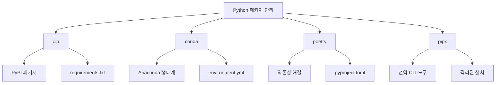

# Python 패키지 관리 전략 (2025년 완전 가이드)

## #01. 패키지 매니저별 업그레이드 방법

### 1. pip 자체 업그레이드 (최우선)

패키지 관리자 자체를 최신 상태로 유지하는 것이 중요합니다.

#### 모든 운영체제 공통 (권장)
```bash
# Python 3.4+ 표준 방법
python -m pip install --upgrade pip

# 가상환경에서도 동일하게 작동
python -m pip --version  # 버전 확인
```

#### 운영체제별 방법

| 운영체제 | 명령어 | 비고 |
|----------|--------|------|
| **Windows** | `py -m pip install --upgrade pip` | Python Launcher 사용 권장 |
| **macOS** | `python3 -m pip install --upgrade pip` | Homebrew Python 환경 |
| **Linux** | `python3 -m pip install --upgrade pip` | 배포판별 Python 버전 고려 |

### 2. 패키지 매니저 비교



## #02. 오래된 패키지 탐지 및 분석

### 1. pip를 사용한 패키지 상태 확인

#### 기본 명령어

```bash
# 업그레이드 가능한 패키지 목록
python -m pip list --outdated

# 현재 설치된 모든 패키지
python -m pip list

# 특정 패키지 정보 상세 보기
python -m pip show package_name
```

#### 고급 조회 옵션

```bash
# JSON 형식으로 출력 (스크립팅용)
python -m pip list --outdated --format=json

# 컬럼 형식으로 정렬된 출력
python -m pip list --outdated --format=columns

# 로컬 패키지만 표시 (개발 중인 패키지)
python -m pip list --local

# 편집 가능한 패키지만 표시
python -m pip list --editable
```
➜ pip3 list --outdated
Package                  Version         Latest         Type
------------------------ --------------- -------------- -----
comm                     0.2.1           0.2.2          wheel
fonttools                4.49.0          4.50.0         wheel
graphviz                 0.20.2          0.20.3         wheel
holidays                 0.44            0.45           wheel
importlib_resources      6.1.3           6.4.0          wheel
ipython                  8.22.1          8.22.2         wheel
json5                    0.9.18          0.9.24         wheel
jupyter_client           8.6.0           8.6.1          wheel
jupyter_core             5.7.1           5.7.2          wheel
jupyter-events           0.9.0           0.10.0         wheel
jupyter-lsp              2.2.3           2.2.4          wheel
jupyter_server           2.12.5          2.13.0         wheel
jupyter_server_terminals 0.5.2           0.5.3          wheel
jupyterlab               4.1.2           4.1.5          wheel
jupyterlab_server        2.25.3          2.25.4         wheel
```

# #03. 모든 패키지 업그래이드

## [1] Windows

아래의 명령을 그대로 복사하여 명령프롬프트에 붙여넣고 실행합니다.

```shell
$ powershell -command "pip freeze | %%{$_.split('==')[0]} | %%{pip install --upgrade $_}"
```

## [2] Mac, Linux

```shell
$ python3 -m pip list --outdated --format=json | jq -r '.[] | "\(.name)==\(.latest_version)"' | xargs --no-run-if-empty -n1 pip3 install -U
```

### jq가 설치되어 있지 않은 경우

jq는 JSON 데이터를 처리하는 명령줄 도구입니다. 설치되어 있지 않다면 먼저 설치해야 합니다.

#### macOS (Homebrew 사용)
```shell
$ brew install jq
```

#### Ubuntu/Debian
```shell
$ sudo apt-get update
$ sudo apt-get install jq
```

#### CentOS/RHEL
```shell
$ sudo yum install jq
```

### jq 없이 사용하는 방법

```shell
$ pip3 list --outdated --format=freeze | grep -v '^\-e' | cut -d = -f 1 | xargs -n1 pip3 install -U
```

# #04. 에러 처리 및 주의사항

## 권한 오류 해결

### Windows에서 권한 오류 발생시

```shell
$ pip install --upgrade --user 패키지명
```

또는 관리자 권한으로 명령프롬프트 실행

### Mac/Linux에서 권한 오류 발생시

```shell
$ pip3 install --upgrade --user 패키지명
```

또는

```shell
$ sudo pip3 install --upgrade 패키지명
```

## 특정 패키지 제외하고 업그레이드

일부 패키지는 업그레이드시 호환성 문제가 발생할 수 있습니다. 이런 경우 특정 패키지를 제외하고 업그레이드할 수 있습니다.

### 방법 1: 수동으로 패키지 선택

```shell
# 업그레이드할 패키지 목록을 파일로 저장
$ pip list --outdated --format=freeze | grep -v -E "패키지명1|패키지명2" > upgrade_list.txt

# 저장된 목록의 패키지들 업그레이드
$ pip install -U -r upgrade_list.txt
```

### 방법 2: 스크립트 사용 (Python)

```python
import subprocess
import sys

# 제외할 패키지 목록
EXCLUDE_PACKAGES = ['tensorflow', 'numpy', 'pandas']

def get_outdated_packages():
    """업데이트 가능한 패키지 목록 가져오기"""
    try:
        result = subprocess.run([sys.executable, '-m', 'pip', 'list', '--outdated', '--format=json'],
                              capture_output=True, text=True, check=True)
        import json
        return json.loads(result.stdout)
    except subprocess.CalledProcessError:
        print("패키지 목록을 가져오는데 실패했습니다.")
        return []

def upgrade_packages():
    """패키지 업그레이드 실행"""
    outdated = get_outdated_packages()

    for package in outdated:
        package_name = package['name']

        # 제외 목록에 있는 패키지는 건너뛰기
        if package_name.lower() in [p.lower() for p in EXCLUDE_PACKAGES]:
            print(f"건너뛰기: {package_name}")
            continue

        print(f"업그레이드 중: {package_name}")
        try:
            subprocess.run([sys.executable, '-m', 'pip', 'install', '--upgrade', package_name],
                         check=True)
            print(f"✓ {package_name} 업그레이드 완료")
        except subprocess.CalledProcessError:
            print(f"✗ {package_name} 업그레이드 실패")

if __name__ == "__main__":
    upgrade_packages()
```

# #05. 가상환경별 패키지 관리

## 가상환경 확인

현재 활성화된 가상환경 확인:

```shell
# 가상환경 이름 확인
$ echo $VIRTUAL_ENV

# 또는 which 명령어 사용
$ which python
$ which pip
```

## 가상환경별 개별 업그레이드

```shell
# conda 환경
$ conda activate 환경명
$ conda update --all

# venv 환경
$ source venv/bin/activate  # Linux/Mac
$ venv\Scripts\activate     # Windows
$ pip install --upgrade -r requirements.txt
```

## requirements.txt 활용

### 현재 패키지 목록 저장

```shell
$ pip freeze > requirements.txt
```

### 저장된 목록으로 일괄 설치

```shell
$ pip install -r requirements.txt
```

### 업그레이드된 버전으로 requirements.txt 업데이트

```shell
# 모든 패키지 업그레이드 후
$ pip freeze > requirements_updated.txt
```

# #06. 안전한 업그레이드 방법

## 백업 생성

업그레이드 전에 현재 환경을 백업해두는 것이 좋습니다:

```shell
# 현재 패키지 목록 백업
$ pip freeze > backup_$(date +%Y%m%d).txt

# conda 환경의 경우
$ conda env export > environment_backup.yml
```

## 단계별 업그레이드

중요한 프로젝트의 경우 한 번에 모든 패키지를 업그레이드하지 말고 단계별로 진행:

```shell
# 1단계: 중요하지 않은 패키지부터
$ pip install --upgrade requests beautifulsoup4 matplotlib

# 2단계: 테스트 후 문제 없으면 추가 패키지
$ pip install --upgrade pandas numpy

# 3단계: 마지막으로 핵심 패키지
$ pip install --upgrade tensorflow django flask
```

## 롤백 방법

문제 발생시 이전 버전으로 돌아가는 방법:

```shell
# 특정 버전으로 다운그레이드
$ pip install 패키지명==이전버전

# 백업 파일로 복원
$ pip install -r backup_20241201.txt --force-reinstall
```

# #07. 추가 유용한 명령어

## 캐시 정리

```shell
# pip 캐시 정리
$ pip cache purge

# conda 캐시 정리
$ conda clean --all
```

## 패키지 의존성 확인

```shell
# 특정 패키지의 의존성 확인
$ pip show 패키지명

# 의존성 트리 보기 (pipdeptree 설치 필요)
$ pip install pipdeptree
$ pipdeptree
```

## 업그레이드 가능한 패키지만 목록으로 보기

```shell
# 패키지명만 출력
$ pip list --outdated --format=columns | awk 'NR>2 {print $1}'

# 현재 버전과 최신 버전 비교
$ pip list --outdated --format=columns
```