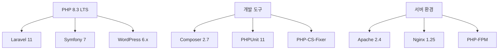

## 개요: 모던 PHP 개발 환경의 중요성

JavaScript 생태계의 복잡성에 지친 개발자들이 다시 PHP로 돌아오고 있습니다. PHP 8.3은 성능과 개발자 경험을 크게 향상시켰으며, Laravel, Symfony 같은 프레임워크와 함께 여전히 강력한 백엔드 솔루션을 제공합니다.

### 2025년 PHP 생태계



## #01. PHP 8.3 설치 및 구성

### 1. 사전 준비사항

#### Homebrew 설치 확인 및 업데이트
```bash
# Homebrew 설치 확인
brew --version

# Homebrew가 없다면 설치
/bin/bash -c "$(curl -fsSL https://raw.githubusercontent.com/Homebrew/install/HEAD/install.sh)"

# Homebrew 업데이트
brew update && brew upgrade
```

#### Xcode Command Line Tools 설치
```bash
# Xcode CLI 도구 설치 (컴파일 도구 필요)
xcode-select --install
```

### 2. PHP 8.3 설치

#### Shivam Mathur PHP 저장소 추가 (권장)

이 저장소는 다양한 PHP 버전을 제공하며 Apple Silicon 최적화가 잘 되어 있습니다.

```bash
# PHP 전용 tap 추가
brew tap shivammathur/php

# 사용 가능한 PHP 버전 확인
brew search php@

# PHP 8.3 설치 (2025년 권장 버전)
brew install php@8.3
```

#### 설치 확인 및 환경변수 설정

```bash
# 설치된 PHP 버전 확인
php --version

# PATH 환경변수 설정 (zsh 기준)
echo 'export PATH="/opt/homebrew/bin:$PATH"' >> ~/.zshrc
echo 'export PATH="/opt/homebrew/sbin:$PATH"' >> ~/.zshrc

# Apple Silicon Mac의 경우
echo 'export PATH="/opt/homebrew/bin/php@8.3:$PATH"' >> ~/.zshrc

# Intel Mac의 경우
echo 'export PATH="/usr/local/bin/php@8.3:$PATH"' >> ~/.zshrc

# 설정 적용
source ~/.zshrc

# 최종 확인
which php
php -v
```

### 3. PHP 설정 최적화

#### php.ini 파일 위치 확인

```bash
# php.ini 파일 위치 확인
php --ini

# 일반적인 위치 (Apple Silicon)
/opt/homebrew/etc/php/8.3/php.ini

# 일반적인 위치 (Intel Mac)
/usr/local/etc/php/8.3/php.ini
```

#### 개발용 php.ini 최적화 설정

```bash
# VSCode로 php.ini 편집 (권장)
code /opt/homebrew/etc/php/8.3/php.ini

# 또는 vim 사용
vim /opt/homebrew/etc/php/8.3/php.ini
```

#### 핵심 설정 항목 (php.ini)

```ini
; 개발 환경 최적화 설정

; 오류 보고 (개발용)
display_errors = On
display_startup_errors = On
log_errors = On
error_reporting = E_ALL

; 메모리 및 실행 시간
memory_limit = 512M
max_execution_time = 60
max_input_time = 60

; 파일 업로드
file_uploads = On
upload_max_filesize = 64M
max_file_uploads = 20
post_max_size = 64M

; 세션 설정
session.save_handler = files
session.gc_probability = 1
session.gc_divisor = 1000

; 날짜/시간 설정
date.timezone = "Asia/Seoul"

; OPcache 활성화 (성능 향상)
opcache.enable = 1
opcache.enable_cli = 1
opcache.memory_consumption = 256
opcache.max_accelerated_files = 10000
opcache.validate_timestamps = 1
opcache.revalidate_freq = 2

; 필요한 확장 모듈들
extension=curl
extension=gd
extension=intl
extension=mbstring
extension=pdo_mysql
extension=zip
```

| 설정항목            | 값         | 설명                                                                          |
| ------------------- | ---------- | ----------------------------------------------------------------------------- |
| short_open_tag      | On         | `<?PHP ... ?>` 대신에 `<? ... ?>`와 같은 짧은 스크립트 블록을 사용할 수 있다. |
| post_max_size       | 50M        | POST 방식의 최대 전송량이다. 넉넉히 설정한다.                                 |
| upload_max_filesize | 100M       | 전송 가능한 업로드 파일 용량이다. 넉넉히 설정한다.                            |
| max_file_uploads    | 20         | 한번에 업로드 가능한 최대 파일 수이다. 넉넉히 설정한다.                       |
| date.timezone       | Asia/Seoul | 타임존 지역을 설정한다.                                                       |


## #02. Apache 구성

### [1] Apache 설치하기

우선 Mac에 기본으로 탑제되어 있는 버전을 완전히 중지한다.

```shell
$ sudo apachectl -k stop
```

Homebrew를 이용해 새로운 httpd를 설치한다.

```shell
$ brew install httpd
```

### [2] `httpd.conf` 파일 수정

Mac에서 httpd를 설치했을 때 설정 파일의 경로는 `/opt/homebrew/etc/httpd/httpd.conf`였다.

vi 편집기로 설정파일을 연다. sudo 권한은 필요 없었다.

```shell
$ vi /opt/homebrew/etc/httpd/httpd.conf
```

마찬가지로 아래 명령을 통해 VSCode로 편집할 수 있다.

```shell
$ code /opt/homebrew/etc/httpd/httpd.conf
```

만약 이 경로에 파일이 없다면 아래 명령으로 설정 파일을 찾아야 한다.

```shell
$ find / -name "httpd.conf"
```

#### 참고

```plain
애플 실리콘 맥(M1, M2)의 경우 기존 인텔 맥과 저장되는 위치가 다르므로 주의해야한다.
m1, m2 와같은 애플 실리콘 맥인 경우 설치 경로가 「/usr/local/」 이 아니고 「/opt/homebrew/」 인 경우가 많아 주의해야한다.
```

#### (1) 포트 설정

대략 52라인 부근에 `Listen` 설정을 수정하여 80번 포트로 실행되도록 한다.

```conf
Listen 80
```

#### (2) mod_rewrite 설정

대략 181라인 부근에 아래와 같은 구문이 주석처리 되어 있다. 해당 주석을 해제한다.

```conf
LoadModule rewrite_module lib/httpd/modules/mod_rewrite.so
```

#### (3) PHP 모듈 연결

`(2)`에서 설정한 `mod_rewrite` 모듈 설정 구문 아래에 다음 구문을 추가한다.

설정 전에 `/opt/homebrew/opt/php@8.3/lib/httpd/modules/libphp.so` 파일이 존재하는지 먼저 확인해야 한다. 파일이 없다면 `libphp.so` 파일의 위치를 정확히 확인한 후 설정하도록 하자.

```conf
LoadModule php_module /opt/homebrew/opt/php@8.3/lib/httpd/modules/libphp.so
```

> 실제로 해당 경로에 libphp.so 파일이 존재하는지 미리 확인하자!!! 버전에 따라 경로가 다를 수 있다.

#### (4) DocumentRoot 설정

웹 사이트 Root 디렉토리를 설정한다.

> SSL 인증서 설정시 보통은 80번 포트를 SSL로 리다이렉트 되도록 설정하지만 Let's Encrypt를 사용할 경우 80번 포트로의 접근이 가능해야 자동 갱신이 가능하므로 80번 포트를 남겨놓기 위해 이 설정을 변경하지 않는 것이 좋다.

```conf
DocumentRoot "/Users/사용자계정명/Sites"
<Directory "/Users/사용자계정명/Sites">
    #
    ## 주석...
    #
    Options Indexes FollowSymLinks

    #
    ## 주석...
    #
    AllowOverride All

    #
    ## 주석...
    #
    Require all granted
</Directory>
```

#### (5) PHP 모듈 설정

`httpd.conf` 파일 맨 하단에 아래 구문을 추가한다.

```conf
AddType application/x-httpd-php .html .php
AddType application/x-httpd-php-source .phps
PHPIniDir /etc
```

#### (6) 인덱스 파일 설정

`dir_module` 부분에 인덱스 파일명이 index.html로만 지정되어 있다. index.php를 추가하자.

```conf
<IfModule dir_module>
    DirectoryIndex index.html index.php
</IfModule>
```

## #03. 아파치 서버 실행

아래 명령어 중에서 필요한 항목을 선택적으로 사용한다.

| 명령                          | 설명                      |
| ----------------------------- | ------------------------- |
| `brew services list`          | 서비스 중인 프로세스 확인 |
| `brew services start httpd`   | 아파치 서비스 시작        |
| `brew services stop httpd`    | 아파치 서비스 중지        |
| `brew services restart httpd` | 아파치 서비스 재시작      |

> 서비스를 시작하면 부팅시마다 자동 실행된다.

### 결과 확인하기

`httpd.conf`에서 DocumentRoot로 설정한 디렉토리에 `index.php` 파일을 생성하고 아래 코드를 작성한다.

```php
<? phpinfo(); ?>
```

웹 브라우저로 `http://localhost`으로 접속하여 결과를 확인한다.

