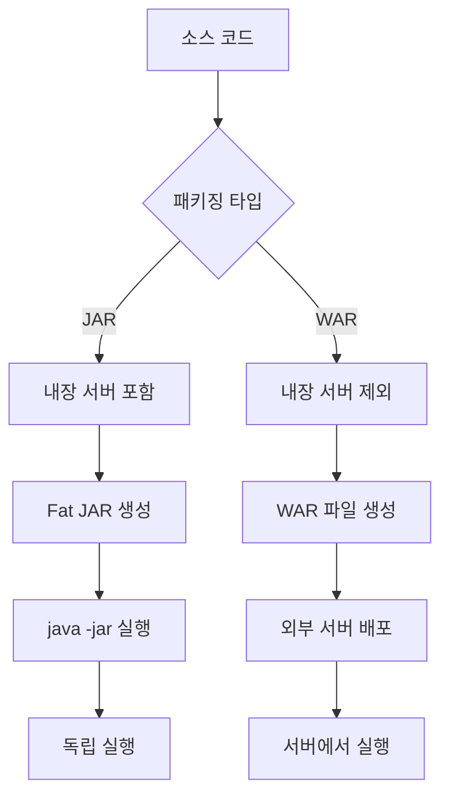

## SpringBoot 패키징 개요

SpringBoot 프로젝트는 주로 두 가지 방식으로 패키징할 수 있습니다:
- **JAR (Java Archive)**: 내장 서버를 포함한 실행 가능한 패키지
- **WAR (Web Application Archive)**: 외부 서버에 배포하기 위한 패키지

## JAR vs WAR 비교

| 특징 | JAR | WAR |
|------|-----|-----|
| 내장 서버 | 포함 (Tomcat, Jetty 등) | 미포함 |
| 실행 방법 | `java -jar` 명령어로 직접 실행 | 외부 서버에 배포 후 실행 |
| 배포 환경 | 독립 실행형 애플리케이션 | 전통적인 웹 서버 환경 |
| 설정 복잡도 | 간단 | 상대적으로 복잡 |
| 권장 사용 | 마이크로서비스, 클라우드 배포 | 레거시 환경, 기존 Tomcat 서버 활용 |

## JAR 패키징

### 1. 기본 설정 (build.gradle)

SpringBoot 프로젝트 생성시 기본 내용에서 변경 없음

```gradle
plugins {
    id 'java'
    id 'org.springframework.boot' version '3.5.4'
    id 'io.spring.dependency-management' version '1.1.7'
}

group = 'com.example'
version = '1.0.0'
java.sourceCompatibility = JavaVersion.VERSION_21

repositories {
    mavenCentral()
}

dependencies {
    implementation 'org.springframework.boot:spring-boot-starter-web'
    testImplementation 'org.springframework.boot:spring-boot-starter-test'
}

jar {
    enabled = false
}

bootJar {
    archiveFileName = "${archiveBaseName.get()}-${archiveVersion.get()}.${archiveExtension.get()}"
}
```

### 2. JAR 빌드 명령어

#### Unix/Linux/macOS
```bash
# Gradle을 사용한 JAR 빌드
$ ./gradlew clean build

# 또는 bootJar 태스크 직접 실행
$ ./gradlew clean bootJar
```

#### Windows
```shell
# Command Prompt (cmd)
> gradlew.bat clean build
> gradlew.bat clean bootJar
```

### 3. JAR 실행

#### Unix/Linux/macOS
```bash
# 기본 실행
$ java -jar build/libs/spring-boot-app-1.0.0.jar

# 프로파일 지정 실행
$ java -jar -Dspring.profiles.active=prod build/libs/spring-boot-app-1.0.0.jar

# 포트 지정 실행
$ java -jar -Dserver.port=8090 build/libs/spring-boot-app-1.0.0.jar

# JVM 옵션과 함께 실행
$ java -Xms512m -Xmx1024m -jar build/libs/spring-boot-app-1.0.0.jar

# 백그라운드 실행 (nohup 사용)
$ nohup java -jar build/libs/spring-boot-app-1.0.0.jar > app.log 2>&1 &
```

#### Windows
```shell
# Command Prompt (cmd)
> java -jar build\libs\spring-boot-app-1.0.0.jar

# 프로파일 지정 실행
> java -jar -Dspring.profiles.active=prod build\libs\spring-boot-app-1.0.0.jar

# 포트 지정 실행
> java -jar -Dserver.port=8090 build\libs\spring-boot-app-1.0.0.jar

# JVM 옵션과 함께 실행
> java -Xms512m -Xmx1024m -jar build\libs\spring-boot-app-1.0.0.jar

# PowerShell에서 백그라운드 실행
> Start-Process java -ArgumentList "-jar", "build\libs\spring-boot-app-1.0.0.jar" -WindowStyle Hidden
```

## WAR 패키징

### 1. WAR 설정 (build.gradle)

```gradle
plugins {
    id 'java'
    id 'war'
    id 'org.springframework.boot' version '3.5.4'
    id 'io.spring.dependency-management' version '1.1.7'
}

group = 'com.example'
version = '1.0.0'
java.sourceCompatibility = JavaVersion.VERSION_21

repositories {
    mavenCentral()
}

dependencies {
    implementation 'org.springframework.boot:spring-boot-starter-web'

    // WAR 배포를 위한 의존성
    providedRuntime 'org.springframework.boot:spring-boot-starter-tomcat'

    testImplementation 'org.springframework.boot:spring-boot-starter-test'
}

war {
    archiveFileName = "${archiveBaseName.get()}-${archiveVersion.get()}.${archiveExtension.get()}"
}
```

### 2. Application 클래스 수정

WAR 배포를 위해서는 `SpringBootServletInitializer`를 상속받아야 합니다.

```java
package com.example;

import org.springframework.boot.SpringApplication;
import org.springframework.boot.autoconfigure.SpringBootApplication;
import org.springframework.boot.web.servlet.support.SpringBootServletInitializer;

@SpringBootApplication
public class Application extends SpringBootServletInitializer {

    public static void main(String[] args) {
        SpringApplication.run(Application.class, args);
    }

    // WAR 배포를 위한 설정
    @Override
    protected org.springframework.boot.builder.SpringApplicationBuilder configure(
            org.springframework.boot.builder.SpringApplicationBuilder application) {
        return application.sources(Application.class);
    }
}
```

### 3. WAR 빌드 명령어

#### Unix/Linux/macOS
```bash
# Gradle을 사용한 WAR 빌드
$ ./gradlew clean build

# 또는 war 태스크 직접 실행
$ ./gradlew clean war
```

#### Windows
```shell
# Command Prompt (cmd)
> gradlew.bat clean build
> gradlew.bat clean war

# PowerShell
> .\gradlew.bat clean build
> .\gradlew.bat clean war
```

### 4. WAR 배포

#### Unix/Linux/macOS
```bash
# Tomcat 서버에 배포
# 1. WAR 파일을 Tomcat의 webapps 디렉토리에 복사
$ cp build/libs/spring-boot-web-app-1.0.0.war /opt/tomcat/webapps/

# 2. Tomcat 서버 시작
$ /opt/tomcat/bin/startup.sh

# 3. Tomcat 서버 중지
$ /opt/tomcat/bin/shutdown.sh

# 4. 애플리케이션 접근
# http://localhost:8080/spring-boot-web-app-1.0.0
```

#### Windows
```shell
# Command Prompt (cmd)
# 1. WAR 파일을 Tomcat의 webapps 디렉토리에 복사
> copy build\libs\spring-boot-web-app-1.0.0.war C:\tomcat\webapps\

# 2. Tomcat 서버 시작
> C:\tomcat\bin\startup.bat

# 3. Tomcat 서버 중지
> C:\tomcat\bin\shutdown.bat

# PowerShell
# 1. WAR 파일 복사
> Copy-Item build\libs\spring-boot-web-app-1.0.0.war C:\tomcat\webapps\

# 2. Tomcat 서비스로 관리 (Windows Service로 설치된 경우)
> Start-Service Tomcat9
> Stop-Service Tomcat9
```


## 패키징 과정 이해하기



## 실무 팁 - 프로파일별 패키징

```properties
# application-dev.properties
server.port=8080
spring.datasource.url=jdbc:h2:mem:testdb
spring.h2.console.enabled=true
logging.level.com.example=DEBUG

# application-prod.properties
server.port=80
spring.datasource.url=jdbc:mysql://prod-db:3306/myapp
spring.datasource.username=${DB_USERNAME}
spring.datasource.password=${DB_PASSWORD}
logging.level.root=WARN
```

```bash
# 개발 환경 빌드
# Unix/Linux/macOS
$ ./gradlew clean build -Pspring.profiles.active=dev

# Windows
> gradlew.bat clean build -Pspring.profiles.active=dev

# 운영 환경 빌드
# Unix/Linux/macOS
$ ./gradlew clean build -Pspring.profiles.active=prod

# Windows
> gradlew.bat clean build -Pspring.profiles.active=prod

# 또는 사용자 정의 태스크 사용
# Unix/Linux/macOS
$ ./gradlew buildDev
$ ./gradlew buildProd

# Windows
> gradlew.bat buildDev
> gradlew.bat buildProd
```

## 주의사항

> **JAR 패키징 시 주의사항**
> - 내장 서버가 포함되므로 파일 크기가 상대적으로 큽니다
> - 포트 충돌을 방지하기 위해 `server.port` 설정을 확인하세요
> - JDK 21을 사용하므로 Virtual Threads 등 새로운 기능을 활용할 수 있습니다
> - **Windows**: 파일 경로에 한글이나 공백이 있으면 문제가 될 수 있으니 주의하세요
> - **Unix/Linux/macOS**: 실행 권한 설정이 필요할 수 있습니다 (`chmod +x`)
{: .prompt-warning }

> **WAR 패키징 시 주의사항**
> - `SpringBootServletInitializer` 상속이 필요합니다
> - 내장 Tomcat 의존성을 `provided` 스코프로 설정해야 합니다
> - 외부 서버의 Java 버전이 JDK 21과 호환되는지 확인하세요
> - SpringBoot 3.5.4는 JDK 17 이상을 요구합니다
> - **Windows**: Tomcat을 Windows Service로 설치하면 관리가 편리합니다
> - **Unix/Linux**: Tomcat 프로세스 소유자와 파일 권한을 확인하세요
{: .prompt-warning }

> **환경별 추가 고려사항**
> - **Windows**: 긴 클래스패스나 파일 경로 문제가 발생할 수 있습니다
> - **macOS**: Gatekeeper 보안 정책으로 인해 서명되지 않은 JAR 실행 시 경고가 나타날 수 있습니다
> - **Linux**: 메모리 부족 시 OOM Killer가 Java 프로세스를 종료할 수 있으니 메모리 설정에 주의하세요
{: .prompt-info }


## 결론

- **JAR 패키징**: 빠른 개발과 배포, 마이크로서비스 아키텍처에 적합
- **WAR 패키징**: 기존 엔터프라이즈 환경, 레거시 시스템과의 호환성이 필요한 경우에 적합

프로젝트의 요구사항과 배포 환경을 고려하여 적절한 패키징 방식을 선택하는 것이 중요합니다.
