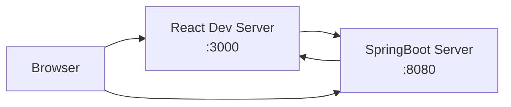
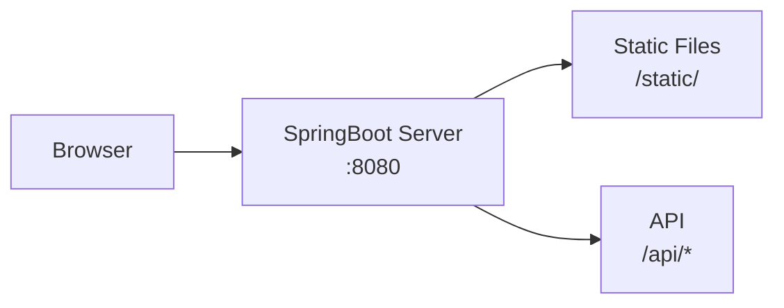

# 📘 SpringBoot 프로젝트에 React 프로젝트 넣기

## 📋 개요

이 가이드에서는 SpringBoot 프로젝트 내에 React 프로젝트를 통합하여 **하나의 프로젝트로 풀스택 애플리케이션**을 구성하는 방법을 다룹니다.

### 🎯 학습 목표
- SpringBoot와 React를 하나의 프로젝트로 통합
- Gradle을 이용한 자동 빌드 설정
- 개발/배포 환경에서의 실행 방법 이해

### 📦 완성 후 프로젝트 구조
```
my-fullstack-app/
├── src/main/java/                 # SpringBoot 백엔드
├── src/main/resources/
│   └── static/                    # React 빌드된 정적 파일들 (자동 생성)
├── frontend/                      # React 프론트엔드
│   ├── src/
│   ├── public/
│   └── package.json
├── build.gradle                   # Gradle 설정 파일
└── README.md
```

## 🛠️ 사전 준비사항

### 필수 설치 프로그램
- **Java 17 이상** (JDK)
- **Node.js 18 이상**
- **Yarn** (선택사항, npm도 가능)
- **IDE** (IntelliJ IDEA, VS Code 등)

### 버전 확인
터미널에서 다음 명령어로 설치 상태를 확인하세요:

```bash
# Java 버전 확인
java -version

# Node.js 버전 확인
node -v

# Yarn 버전 확인 (Yarn 사용 시)
yarn -v
```

## 🏗️ STEP 1: 프로젝트 생성

### 1-1. SpringBoot 프로젝트 생성

[Spring Initializr](https://start.spring.io/)에서 다음과 같이 설정하여 프로젝트를 생성합니다:

**프로젝트 설정:**
- **Project**: Gradle - Groovy
- **Language**: Java
- **Spring Boot**: 3.3.x (최신 stable 버전)
- **Group**: `com.example` (원하는 대로 변경 가능)
- **Artifact**: `fullstack-app` (원하는 대로 변경 가능)
- **Java**: 17 이상

**Dependencies 추가:**
- Spring Web
- Spring Boot DevTools
- Thymeleaf (선택사항)
- Spring Boot Actuator (선택사항)

### 1-2. React 프로젝트 생성

SpringBoot 프로젝트 **루트 디렉토리**에서 React 프로젝트를 생성합니다.

```bash
# SpringBoot 프로젝트 폴더로 이동
cd your-springboot-project

# React 프로젝트 생성 (일반 버전)
npx create-react-app frontend

# 또는 Yarn Berry 버전으로 생성
yarn create react-app frontend
cd frontend
yarn set version berry
yarn install
```

> **💡 프로젝트명 주의사항**
> - React 프로젝트명은 `frontend`로 하는 것을 권장합니다
> - 다른 이름을 사용할 경우 `build.gradle`에서 경로를 수정해야 합니다

### 1-3. 생성 완료 후 폴더 구조 확인

```
your-springboot-project/
├── src/
├── gradle/
├── frontend/          ← React 프로젝트
│   ├── src/
│   ├── public/
│   ├── package.json
│   └── ...
├── build.gradle
└── gradlew
```

## 🔧 STEP 2: build.gradle 파일 설정

SpringBoot 프로젝트의 **루트 디렉토리**에 있는 `build.gradle` 파일을 다음과 같이 수정합니다.

### 2-1. 플러그인 및 기본 설정

```gradle
plugins {
	id 'java'
	id 'org.springframework.boot' version '3.3.4'
	id 'io.spring.dependency-management' version '1.1.7'

	// ⭐ Gradle이 Node.js와 연동할 수 있는 플러그인 추가
	id 'com.github.node-gradle.node' version '7.0.2'
}

group = 'com.example'
version = '0.0.1-SNAPSHOT'

java {
	toolchain {
		languageVersion = JavaLanguageVersion.of(17)
	}
}

configurations {
	compileOnly {
		extendsFrom annotationProcessor
	}
}

repositories {
	mavenCentral()
}

dependencies {
	implementation 'org.springframework.boot:spring-boot-starter-web'
	implementation 'org.springframework.boot:spring-boot-starter-thymeleaf'
	developmentOnly 'org.springframework.boot:spring-boot-devtools'
	testImplementation 'org.springframework.boot:spring-boot-starter-test'
	testRuntimeOnly 'org.junit.platform:junit-platform-launcher'
}

tasks.named('test') {
	useJUnitPlatform()
}
```

### 2-2. Node.js 및 React 설정 추가

기존 설정 아래에 다음 내용을 추가합니다:

#### 1) Yarn Berry 버전으로 생성시

```gradle
// ⭐⭐⭐ React 프로젝트 통합 설정 ⭐⭐⭐

// React 프로젝트 경로 설정
def frontendDir = file("frontend")

// Node.js 설정
node {
	version = "20.17.0"        // Node.js 버전
	download = true            // 자동 다운로드 활성화
	yarnVersion = "1.22.22"    // Yarn 버전 (Yarn 사용 시)
	nodeProjectDir = frontendDir
}

// 🔥 개발 환경: SpringBoot 실행 시 React 개발 서버도 함께 실행
task startReactDev(type: YarnTask) {
    dependsOn yarn
    yarnCommand = ['start']
}

// 📦 Spring Boot 실행시 React도 함께 실행
bootRun {
	dependsOn startReactDev
}

// 🏗️ 빌드 환경: React 빌드 후 Spring Boot static 폴더로 복사
task buildReact(type: YarnTask) {
    dependsOn yarn
    yarnCommand = ['build']
}

task copyReactBuild(type: Copy) {
	dependsOn buildReact
	from "${frontendDir}/build"
	into "src/main/resources/static"
}

// 📦 Spring Boot jar 빌드 시 React도 함께 빌드
jar {
	dependsOn copyReactBuild
}

bootJar {
	dependsOn copyReactBuild
}
```

#### 2) 일반 버전으로 생성시

```gradle
// ⭐⭐⭐ React 프로젝트 통합 설정 ⭐⭐⭐

// React 프로젝트 경로 설정
def frontendDir = file("frontend")

// Node.js 설정
node {
	version = "20.17.0"        // Node.js 버전
	download = true            // 자동 다운로드 활성화
	yarnVersion = "1.22.22"    // Yarn 버전 (Yarn 사용 시)
	nodeProjectDir = frontendDir
}

// 🔥 개발 환경: SpringBoot 실행 시 React 개발 서버도 함께 실행
task startReactDev(type: NpmTask) {
	dependsOn npmInstall
	npmCommand = ['run', 'start']
	args = []
}

// 📦 Spring Boot 실행시 React도 함께 실행
bootRun {
	dependsOn startReactDev
}

// 🏗️ 빌드 환경: React 빌드 후 Spring Boot static 폴더로 복사
task buildReact(type: NpmTask) {
	dependsOn npmInstall
	npmCommand = ['run', 'build']
	args = []
}

task copyReactBuild(type: Copy) {
	dependsOn buildReact
	from "${frontendDir}/build"
	into "src/main/resources/static"
}

// 📦 Spring Boot jar 빌드 시 React도 함께 빌드
jar {
	dependsOn copyReactBuild
}

bootJar {
	dependsOn copyReactBuild
}
```

> **💡 설정 옵션 설명**
> - `version`: 사용할 Node.js 버전
> - `download = true`: Node.js가 없으면 자동으로 다운로드
> - `yarnVersion`: Yarn 사용 시 버전 지정 (npm 사용 시 제거 가능)
> - `nodeProjectDir`: React 프로젝트가 있는 폴더 경로

## 🚀 STEP 3: Controller 생성 (API 테스트용)

React와 SpringBoot가 제대로 통신하는지 확인하기 위한 간단한 API를 만들어보겠습니다.

### 3-1. HelloController.java 생성

`src/main/java/com/example/fullstackapp/controller/HelloController.java` 파일을 생성합니다:

```java
package com.example.fullstackapp.controller;

import org.springframework.web.bind.annotation.GetMapping;
import org.springframework.web.bind.annotation.RequestMapping;
import org.springframework.web.bind.annotation.RestController;

import java.util.HashMap;
import java.util.Map;

@RestController
@RequestMapping("/api")
public class HelloController {

    @GetMapping("/hello")
    public Map<String, String> hello() {
        Map<String, String> response = new HashMap<>();
        response.put("message", "Hello from SpringBoot!");
        response.put("status", "success");
        return response;
    }

    @GetMapping("/test")
    public Map<String, Object> test() {
        Map<String, Object> response = new HashMap<>();
        response.put("backend", "SpringBoot");
        response.put("frontend", "React");
        response.put("timestamp", System.currentTimeMillis());
        return response;
    }
}
```

## 🎨 STEP 4: React 컴포넌트 수정 (API 호출 테스트)

### 4-1. React App.js 수정

`frontend/src/App.js` 파일을 다음과 같이 수정하여 SpringBoot API와 통신하도록 합니다:

```jsx
import React, { useState, useEffect } from 'react';
import './App.css';

function App() {
  const [message, setMessage] = useState('');
  const [testData, setTestData] = useState(null);
  const [loading, setLoading] = useState(false);

  // SpringBoot API 호출 함수
  const fetchHello = async () => {
    setLoading(true);
    try {
      const response = await fetch('/api/hello');
      const data = await response.json();
      setMessage(data.message);
    } catch (error) {
      console.error('API 호출 오류:', error);
      setMessage('API 호출에 실패했습니다.');
    } finally {
      setLoading(false);
    }
  };

  const fetchTest = async () => {
    setLoading(true);
    try {
      const response = await fetch('/api/test');
      const data = await response.json();
      setTestData(data);
    } catch (error) {
      console.error('API 호출 오류:', error);
      setTestData({ error: 'API 호출에 실패했습니다.' });
    } finally {
      setLoading(false);
    }
  };

  // 컴포넌트 마운트 시 자동으로 API 호출
  useEffect(() => {
    fetchHello();
  }, []);

  return (
    <div className="App">
      <header className="App-header">
        <h1>🌟 SpringBoot + React 풀스택 앱</h1>

        <div>
          <h2>API 테스트</h2>
          {loading ? (
            <p>로딩 중...</p>
          ) : (
            <p>{message}</p>
          )}
        </div>

        <hr />

        <div>
          <button onClick={fetchHello} disabled={loading}>Hello API 호출</button>
          <button onClick={fetchTest} disabled={loading}>Test API 호출</button>
        </div>

        <hr />

        {testData && (
          <div>
            <h3>테스트 데이터:</h3>
            <pre>
              {JSON.stringify(testData, null, 2)}
            </pre>
          </div>
        )}
      </header>
    </div>
  );
}

export default App;
```

### 4-2. package.json에 proxy 설정 추가

`frontend/package.json` 파일에 다음 설정을 추가하여 개발 환경에서 API 호출이 SpringBoot 서버로 프록시되도록 합니다:

```json
{
  "name": "frontend",
  "version": "0.1.0",
  "private": true,
  "proxy": "http://localhost:8080",
  // ... 기존 설정들
}
```

## 🏃‍♂️ STEP 5: 프로젝트 실행하기

### 5-1. 개발 환경 실행

**방법 1: 각각 따로 실행 (권장)**

```bash
# 터미널 1: SpringBoot 실행
./gradlew bootRun

# 터미널 2: React 개발 서버 실행
cd frontend
npm start
# 또는 yarn start
```

**방법 2: Gradle로 한 번에 실행**

```bash
# React와 SpringBoot를 동시에 실행
./gradlew bootRun startReactDev
```

### 5-2. 접속 및 테스트

- **React 앱**: http://localhost:3000
- **SpringBoot API**: http://localhost:8080/api/hello
- **SpringBoot 정적 파일**: http://localhost:8080 (빌드 후)

### 5-3. 프로덕션 빌드

```bash
# React 빌드 + SpringBoot JAR 생성
./gradlew build

# 생성된 JAR 실행
java -jar build/libs/fullstack-app-0.0.1-SNAPSHOT.jar
```

빌드 후에는 http://localhost:8080 에서 React 앱과 API가 모두 동작합니다.

## 🔍 STEP 6: 동작 원리 이해

### 6-1. 개발 환경에서의 동작



- React는 `:3000` 포트에서 개발 서버 실행
- SpringBoot는 `:8080` 포트에서 API 서버 실행
- `proxy` 설정으로 API 호출 시 자동으로 `:8080`으로 프록시

### 6-2. 프로덕션 환경에서의 동작



- React 빌드 파일이 `src/main/resources/static/`에 복사됨
- SpringBoot 하나의 서버에서 정적 파일과 API 모두 제공
- 단일 포트(`:8080`)에서 모든 요청 처리

## 🛠️ 트러블슈팅

### 자주 발생하는 문제들

#### 1. "Cannot find module" 오류

```bash
# Node.js 모듈 재설치
cd frontend
rm -rf node_modules package-lock.json
npm install
```

#### 2. Gradle 빌드 실패

```bash
# Gradle 래퍼 실행 권한 부여 (Mac/Linux)
chmod +x gradlew

# Gradle 캐시 클리어
./gradlew clean
```

#### 3. API 호출 CORS 오류 (개발 환경)

`package.json`에 proxy 설정이 제대로 되어있는지 확인:

```json
{
  "proxy": "http://localhost:8080"
}
```

#### 4. 빌드된 React 파일이 로드되지 않는 경우

SpringBoot의 정적 리소스 경로 확인:

```java
// Application.java에 추가 (필요시)
@Configuration
public class WebConfig implements WebMvcConfigurer {
    @Override
    public void addResourceHandlers(ResourceHandlerRegistry registry) {
        registry.addResourceHandler("/**")
                .addResourceLocations("classpath:/static/");
    }
}
```
