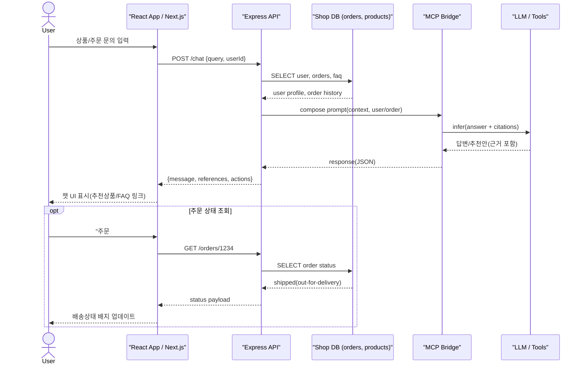
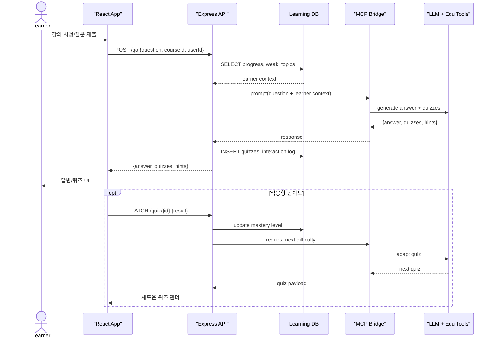
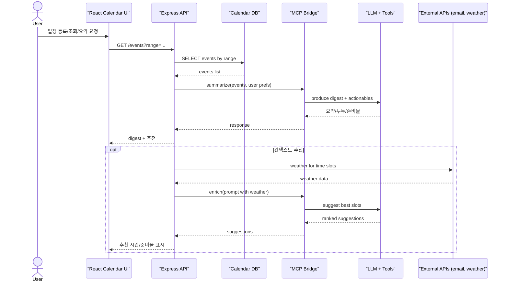
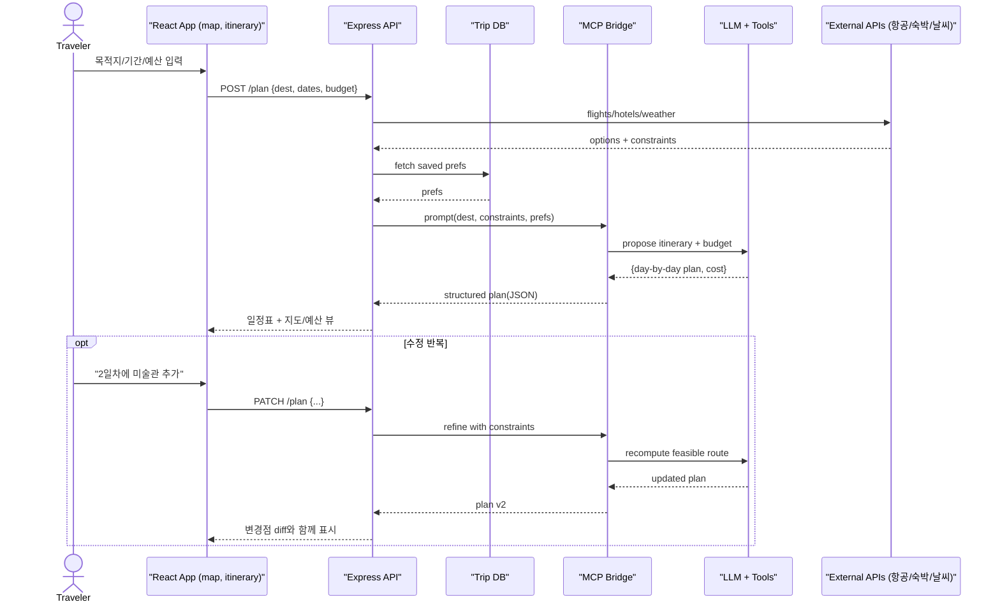

# React + Node.js(Express) + MCP 기반 프로젝트 아이디어

## 프로젝트 아이디어 요약

- React → 인터랙티브 UI
- Express → 데이터 관리 및 API
- MCP → AI 모델 연동 (추천, 요약, 생성 기능 등)

| 시나리오                     | 개요                        | 주요 기능 |
| ------------------------ | ------------------------- | ------------------------------------------------------------------------------------------------- |
| **1. AI 기반 쇼핑몰 고객지원 챗봇** | 쇼핑몰 웹사이트에 AI 상담원 배치       | - React UI로 상품검색/FAQ 채팅 인터페이스 - Express API 서버: 주문/배송 DB 연동 - MCP로 LLM 연동 → FAQ 답변·상품추천     |
| **2. 개인화 학습 플랫폼**        | 학습자가 질문하면 AI가 답변·문제 생성    | - React UI로 강의 영상/퀴즈 화면 구성 - Express 서버: 학습 데이터 저장 - MCP로 AI 튜터 연결 (퀴즈·힌트 생성)               |
| **3. 스마트 일정관리 & 추천 시스템** | 일정 등록/조회 + AI 추천          | - React 캘린더 UI - Express API: 일정 CRUD - MCP로 AI 연결 → 일정 요약·추천 &nbsp;(예: “내일 회의 전에 읽을 자료”)         |
| **4. 여행 플래너 서비스**        | 사용자가 목적지 입력 → AI가 여행코스 설계 | - React UI로 여행지 지도/일정 표시 - Express 서버: DB 저장, 외부 API(날씨/항공) 연동 - MCP: AI 여행추천 (코스·예산·날씨 고려) |

## 구현 체크리스트 (공통)

- 프롬프트 규격화: system/role, 입력 스키마, 출력 스키마 고정
- 컨텍스트 관리: DB 조회값 → MCP 프롬프트에 필드 레벨로 삽입
- 관찰가능성: 프롬프트/응답 로깅 + 버전(A/B 프롬프트 테스트)
- 안전장치: PII 마스킹, 레이트리밋, 토큰 사용량 메트릭
- 실패 복구: LLM 실패 시 규칙기반 fallback 경로 마련

## 구현 아이디어 구체화

### 1. AI 기반 쇼핑몰 고객지원 챗봇

- FAQ·주문내역을 컨텍스트 주입해서 LLM 환각 줄이기
- 응답 페이로드에 근거 링크(citations) 포함

### 2. 개인화 학습 플랫폼 (AI 튜터)

- **개인화 컨텍스트(weak_topics, mastery)**를 MCP로 전달
- 퀴즈/힌트는 버전 관리로 재학습 데이터화 가능

### 3. 스마트 일정관리 & 추천 시스템

- 외부 API(날씨/이메일) 신호를 프롬프트에 통합
- 회의 전 리딩 리스트/준비물 자동 생성

### 4. 여행 플래너 서비스 (추천·예산·날씨)

- 항공/숙박/날씨 제약 조건을 명시적으로 프롬프트화
- 응답을 Day-by-day JSON 스키마로 받아 안정적인 렌더링

