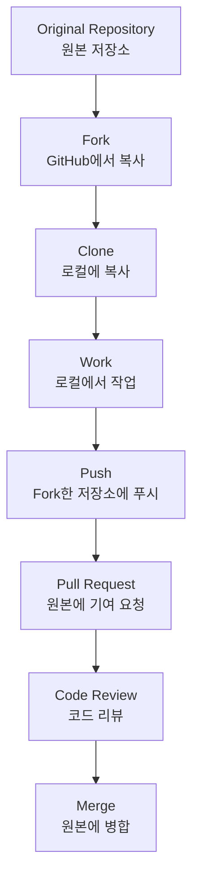

## #01. Fork와 Clone의 차이점 이해하기

### Fork vs Clone 비교

| 구분 | Fork | Clone |
|------|------|-------|
| 위치 | GitHub 서버에 복사 | 로컬 컴퓨터에 복사 |
| 목적 | 협업, 기여, 실험 | 로컬 개발 |
| 원본과의 관계 | 독립적이지만 연결 유지 | 원본 저장소와 직접 연결 |
| 권한 | 내 계정에서 모든 권한 | 원본 저장소 권한에 따라 제한 |
| Pull Request | 가능 | 권한이 있어야 가능 |

### Fork를 사용하는 경우

1. **오픈소스 프로젝트 기여**: 권한이 없는 프로젝트에 기여할 때
2. **실험적 개발**: 원본에 영향 없이 실험하고 싶을 때
3. **개인 버전 유지**: 개인적인 수정사항을 유지하고 싶을 때
4. **학습 목적**: 코드를 분석하고 수정해보고 싶을 때

### Fork 과정



## #02. Fork 저장소 생성하기

### 1. GitHub에서 Fork하기

1. 원본 저장소 페이지 접속
2. 우측 상단의 **Fork** 버튼 클릭
3. Fork할 계정 선택 (개인 계정 또는 Organization)
4. 저장소 이름 수정 (선택사항)
5. **Create fork** 클릭

### 2. Fork 후 확인사항

- Fork된 저장소의 URL: `https://github.com/내계정/저장소명`
- 원본 저장소 표시: "forked from 원본계정/저장소명"
- 브랜치 구조가 원본과 동일한지 확인

## #03. 원본 저장소에 URL을 추가하기

>### 1. Fork한 저장소 Clone하기

먼저 Fork한 저장소를 로컬에 복제합니다.

```shell
# Fork한 저장소 복제
$ git clone https://github.com/내계정/저장소명.git
$ cd 저장소명
```

### 2. 현재 저장소에 등록된 URL 확인

내 저장소(origin)의 주소가 확인됩니다.

```shell
$ git remote -v
```

#### 출력 예시

```shell
$ git remote -v
origin  https://github.com/YOUR_USERNAME/YOUR_FORK.git (fetch)
origin  https://github.com/YOUR_USERNAME/YOUR_FORK.git (push)
```

### 3. 동기화하고자 하는 원본 저장소의 URL 추가

`upstream`이라는 이름으로 원본 저장소를 추가합니다.

```shell
$ git remote add upstream 원본저장소URL
```

#### 예시

```shell
# HTTPS 사용 (권장)
$ git remote add upstream https://github.com/leekh4232/hossam-data-helper.git

# SSH 사용 (인증서 설정 필요)
$ git remote add upstream git@github.com:leekh4232/hossam-data-helper.git
```

**참고**: 공개된 오픈소스인 경우 `https` 주소 사용을 권장합니다. `ssh`는 collaborator 권한이 필요할 수 있습니다.

### 4. 결과 확인

내 저장소(origin)와 원본 저장소(upstream)의 주소가 모두 확인되어야 합니다.

```shell
$ git remote -v
```

#### 출력 예시

```shell
$ git remote -v
origin    https://github.com/YOUR_USERNAME/YOUR_FORK.git (fetch)
origin    https://github.com/YOUR_USERNAME/YOUR_FORK.git (push)
upstream  https://github.com/ORIGINAL_OWNER/ORIGINAL_REPOSITORY.git (fetch)
upstream  https://github.com/ORIGINAL_OWNER/ORIGINAL_REPOSITORY.git (push)
```

### 5. Remote 관리 명령어

```shell
# Remote 목록 확인
$ git remote

# Remote 상세 정보 확인
$ git remote show origin
$ git remote show upstream

# Remote 이름 변경
$ git remote rename old_name new_name

# Remote 삭제
$ git remote remove upstream

# Remote URL 변경
$ git remote set-url upstream 새로운URL
```


## #04. 원본 저장소의 변경사항을 동기화하기

### 1. 원본 저장소의 최신 정보 가져오기

```shell
# 원본 저장소의 모든 브랜치 정보 가져오기
$ git fetch upstream

# 특정 브랜치만 가져오기
$ git fetch upstream main
```

#### 출력 예시

```shell
$ git fetch upstream
remote: Counting objects: 75, done.
remote: Compressing objects: 100% (53/53), done.
remote: Total 62 (delta 27), reused 44 (delta 9)
Unpacking objects: 100% (62/62), done.
From https://github.com/ORIGINAL_OWNER/ORIGINAL_REPOSITORY
 * [new branch]      main     -> upstream/main
 * [new branch]      develop  -> upstream/develop
```

### 2. 현재 상태 확인

```shell
# 현재 브랜치 확인
$ git branch

# 로컬과 원본의 차이 확인
$ git log --oneline --graph --all

# 간단한 차이 확인
$ git log HEAD..upstream/main --oneline
```

### 3. 메인 브랜치로 전환

```shell
$ git checkout main
```

#### 출력 예시

```shell
$ git checkout main
Switched to branch 'main'
Your branch is up to date with 'origin/main'.
```

### 4. 원본 저장소의 변경사항 병합

#### 방법 1: Merge 사용 (일반적)

```shell
$ git merge upstream/main
```

#### 방법 2: Rebase 사용 (깔끔한 히스토리)

```shell
$ git rebase upstream/main
```

#### 방법 3: Fast-forward 병합

```shell
$ git merge --ff-only upstream/main
```

#### 병합 결과 예시

```shell
$ git merge upstream/main
Updating a422352..5fdff0f
Fast-forward
 README                    |    9 -------
 README.md                 |    7 ++++++
 package.json              |    2 +-
 src/main.js              |   15 ++++++++++++
 4 files changed, 23 insertions(+), 9 deletions(-)
 delete mode 100644 README
 create mode 100644 README.md
```

### 5. 충돌 해결

만약 병합 중 충돌이 발생한다면:

```shell
# 충돌 파일 확인
$ git status

# 충돌 내용 확인
$ git diff

# 충돌 해결 후
$ git add 해결된파일명
$ git commit

# 또는 병합 취소
$ git merge --abort
```

### 6. 병합된 내용을 내 저장소에 푸시

```shell
$ git push origin main
```

## #05. 브랜치별 동기화 관리

### 1. 여러 브랜치 동기화

```shell
# develop 브랜치 동기화
$ git checkout develop
$ git fetch upstream
$ git merge upstream/develop
$ git push origin develop

# 한 번에 여러 브랜치 업데이트
$ git fetch upstream
$ git checkout main && git merge upstream/main
$ git checkout develop && git merge upstream/develop
$ git push --all origin
```

### 2. 새로운 브랜치 추적

```shell
# 원본에 새로운 브랜치가 생성된 경우
$ git fetch upstream

# 새 브랜치 확인
$ git branch -r

# 새 브랜치를 로컬에 생성하고 추적
$ git checkout -b feature-branch upstream/feature-branch

# 내 저장소에도 푸시
$ git push -u origin feature-branch
```

### 3. 정기적인 동기화 스크립트

**Windows (sync.bat):**
```batch
@echo off
echo "Syncing with upstream..."
git fetch upstream
git checkout main
git merge upstream/main
git push origin main
echo "Sync completed!"
pause
```

**macOS/Linux (sync.sh):**
```bash
#!/bin/bash
echo "Syncing with upstream..."
git fetch upstream
git checkout main
git merge upstream/main
git push origin main
echo "Sync completed!"
```

## #06. Pull Request 워크플로우

### 1. 기여를 위한 브랜치 생성

```shell
# 최신 상태로 동기화
$ git fetch upstream
$ git checkout main
$ git merge upstream/main

# 새로운 기능 브랜치 생성
$ git checkout -b feature/new-feature

# 작업 후 커밋
$ git add .
$ git commit -m "feat: 새로운 기능 추가"

# 내 저장소에 푸시
$ git push origin feature/new-feature
```

### 2. Pull Request 생성

1. GitHub에서 내 Fork 저장소 접속
2. "Compare & pull request" 버튼 클릭
3. 제목과 설명 작성
4. 리뷰어 지정 (선택사항)
5. "Create pull request" 클릭

### 3. Pull Request 템플릿

```markdown
## 변경사항 요약
- 새로운 기능 추가
- 버그 수정
- 문서 업데이트

## 테스트
- [ ] 단위 테스트 통과
- [ ] 통합 테스트 통과
- [ ] 수동 테스트 완료

## 스크린샷 (UI 변경사항이 있는 경우)

## 관련 이슈
Closes #123
```

### 4. Pull Request 후 동기화

PR이 병합된 후:

```shell
# 원본 저장소 동기화
$ git fetch upstream
$ git checkout main
$ git merge upstream/main
$ git push origin main

# 사용한 브랜치 정리
$ git branch -d feature/new-feature
$ git push origin --delete feature/new-feature
```

## #07. Fork 관리 고급 기법

### 1. 선택적 커밋 가져오기 (Cherry-pick)

```shell
# 원본의 특정 커밋만 가져오기
$ git fetch upstream
$ git cherry-pick <commit-hash>
$ git push origin main
```

### 2. Squash and Merge

여러 커밋을 하나로 합치기:

```shell
# 대화형 리베이스로 커밋 합치기
$ git rebase -i HEAD~3

# 또는 마지막 3개 커밋을 하나로 합치기
$ git reset --soft HEAD~3
$ git commit -m "feat: 기능 구현 완료"
```

### 3. Fork 브랜치 정리

```shell
# 병합된 브랜치 확인
$ git branch --merged main

# 안전하게 삭제
$ git branch -d old-branch

# 원격 브랜치도 삭제
$ git push origin --delete old-branch

# 모든 원격 추적 브랜치 정리
$ git remote prune origin
```

## #08. Fork 저장소의 원본 저장소가 삭제되는 경우

내가 fork한 저장소는 별도의 복사본이므로 GitHub에서 fork한 저장소는 원본 저장소가 삭제되더라도 삭제되지 않고 계속 유지된다.

### 원본 삭제 시의 영향:

- "This repository is a fork of..." 표기 사라짐
    - GitHub UI에서 원본 저장소로의 연결이 끊어진다.
- Pull Request 불가
    - 원본 저장소가 삭제되었기 때문에 더 이상 PR(Pull Request)을 보낼 수 없다.
- 추적 정보 단절
    - 원본 저장소로부터의 업데이트(fetch, rebase 등)가 더 이상 불가능해진다.
- 내 저장소는 완전한 독립체가 됨
    - 이제는 더 이상 fork가 아닌 일반 저장소처럼 동작한다.