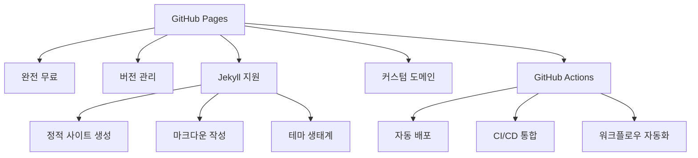

## 개요: 왜 GitHub Pages를 선택해야 할까?

개발자에게 블로그는 단순한 일기가 아닙니다. 기술 학습 과정의 기록이자, 문제 해결 능력을 보여주는 포트폴리오이며, 개발 커뮤니티와의 소통 창구입니다.

### 2025년 블로그 플랫폼 비교

| 플랫폼 | 자유도 | 개발자 친화성 | 비용 | 포트폴리오 가치 |
|--------|--------|---------------|------|----------------|
| **GitHub Pages** | ⭐⭐⭐⭐⭐ | ⭐⭐⭐⭐⭐ | 무료 | ⭐⭐⭐⭐⭐ |
| Velog | ⭐⭐ | ⭐⭐⭐⭐ | 무료 | ⭐⭐⭐ |
| Tistory | ⭐⭐⭐ | ⭐⭐ | 무료 | ⭐⭐ |
| Medium | ⭐ | ⭐⭐⭐ | 유료 | ⭐⭐⭐ |
| 개인 서버 | ⭐⭐⭐⭐⭐ | ⭐⭐⭐⭐⭐ | 유료 | ⭐⭐⭐⭐ |

### GitHub Pages의 장점



## #01. GitHub Pages 저장소 설정

### 1. 저장소 생성 및 네이밍 규칙

#### 개인 사이트 저장소 (권장)
```
저장소명: username.github.io
URL: https://username.github.io
제한사항: 계정당 1개, Public 필수 (무료 계정)
```

#### 프로젝트 사이트 저장소
```
저장소명: 임의의 이름 (예: my-blog)
URL: https://username.github.io/my-blog
제한사항: 무제한, Private 가능 (Pro 계정)
```

### 2. 저장소 초기 설정

#### 기본 파일 구조
```
username.github.io/
├── _config.yml          # Jekyll 설정
├── _posts/              # 블로그 포스트
├── _layouts/            # 페이지 레이아웃
├── _includes/           # 재사용 컴포넌트
├── _sass/               # SCSS 스타일
├── assets/              # 이미지, CSS, JS
├── Gemfile              # Ruby 의존성
├── .gitignore           # Git 무시 파일
└── index.md             # 메인 페이지
```

#### 권장 .gitignore 설정
```gitignore
# Jekyll
_site/
.sass-cache/
.jekyll-cache/
.jekyll-metadata

# Ruby
.bundle/
vendor/

# OS
.DS_Store
Thumbs.db

# IDE
.vscode/
.idea/

# 로그 및 임시 파일
*.log
*.tmp
```

### 3. GitHub Pages 활성화

#### 자동 설정 (username.github.io)
- 저장소명이 `username.github.io`인 경우 자동으로 Pages 활성화
- main 브랜치의 루트 디렉토리가 기본 소스

#### 수동 설정 (프로젝트 사이트)

1. **Settings > Pages 이동**
2. **Source 설정**
   - `Deploy from a branch` 선택 (기본)
   - 또는 `GitHub Actions` 선택 (고급, 권장)
3. **Branch 선택**
   - `main` 브랜치 선택
   - `/root` 디렉토리 선택
4. **Save 클릭**

#### GitHub Actions를 사용한 고급 배포 (2025년 권장)

`.github/workflows/pages.yml` 파일 생성:

```yaml
name: Deploy Jekyll site to Pages

on:
  push:
    branches: ["main"]
  workflow_dispatch:

permissions:
  contents: read
  pages: write
  id-token: write

concurrency:
  group: "pages"
  cancel-in-progress: false

jobs:
  build:
    runs-on: ubuntu-latest
    steps:
      - name: Checkout
        uses: actions/checkout@v4

      - name: Setup Ruby
        uses: ruby/setup-ruby@v1
        with:
          ruby-version: '3.2'
          bundler-cache: true

      - name: Setup Pages
        id: pages
        uses: actions/configure-pages@v4

      - name: Build with Jekyll
        run: bundle exec jekyll build --baseurl "${{ steps.pages.outputs.base_path }}"
        env:
          JEKYLL_ENV: production

      - name: Upload artifact
        uses: actions/upload-pages-artifact@v2

  deploy:
    environment:
      name: github-pages
      url: ${{ steps.deployment.outputs.page_url }}
    runs-on: ubuntu-latest
    needs: build
    steps:
      - name: Deploy to GitHub Pages
        id: deployment
        uses: actions/deploy-pages@v3
```

## #02. Jekyll 테마 선택 및 설정

### 1. 인기 Jekyll 테마 (2025년 추천)

| 테마 | 특징 | 적합한 용도 | GitHub Stars |
|------|------|-------------|--------------|
| **Chirpy** | 다크모드, 검색, 카테고리 | 기술 블로그 | 7k+ |
| **Minimal Mistakes** | 반응형, 다양한 레이아웃 | 포트폴리오 | 12k+ |
| **Beautiful Jekyll** | 깔끔한 디자인, 쉬운 설정 | 개인 블로그 | 5k+ |
| **Hyde** | 미니멀, 사이드바 | 문서 사이트 | 3k+ |
| **Jasper2** | Medium 스타일 | 매거진형 | 1k+ |

### 2. Chirpy 테마 설치 (권장)

#### Fork 방식 설치
```bash
# 1. Chirpy Starter 저장소 fork
https://github.com/cotes2020/chirpy-starter

# 2. 저장소명을 username.github.io로 변경

# 3. 로컬 클론
git clone https://github.com/username/username.github.io.git
cd username.github.io

# 4. 의존성 설치
bundle install
```

#### RubyGems 방식 설치
```bash
# 1. 새 Jekyll 사이트 생성
jekyll new my-blog
cd my-blog

# 2. Gemfile에 Chirpy 테마 추가
echo 'gem "jekyll-theme-chirpy"' >> Gemfile

# 3. 테마 설치
bundle install

# 4. 테마 파일 복사
bundle exec jekyll new . --force --skip-bundle
```

아래는 cafe24에서 서비스를 받고 있는 제 개인 도메인에 대한 github page 설정 내용 입니다.


### [3] 중간 결과 확인

여기까지 설정이 완료되었다면 `https://자신의github아이디.github.io` 주소로 접속하여 결과를 확인해 봅니다.

`README.md`파일이나 `index.html`파일이 존재한다면 해당 파일이 대문으로 표시될 겁니다.

여기서는 저장소 생성시에 설정해 둔 기본 README.md 파일이 노출되는 것을 확인했습니다.


## #02. Jekyll Theme 적용하기

복잡한 내용는 생략하고 간단히 요약하면 github-page에 push된 markdown 파일을 미리 정의해둔 웹 사이트 레이아웃과 결합하여 웹 페이지로 변환해주는 환경입니다.

### [1] github-page 저장소 clone 받기

생성해 둔 저장소를 자신의 컴퓨터에 클론 받습니다.

> 여기서는 기본적인 github 명령은 사용할 수 있다고 전제하고 포스팅합니다.

```shell
$ git clone git@github.com:자신의github아이디/자신의github아이디.github.io
```

### [2] Jekyll Theme 적용

#### (1) 원하는 테마 찾기

`http://jekyllthemes.org/` 사이트에서 무료 테마를 내려받을 수 있습니다.

그 외에 `https://jekyllthemes.io/`에서도 테마를 내려받을 수 있는데, 이 곳은 무료 테마와 유료 테마가 함께 있으므로 잘 살펴보고 원하는 테마를 선택하면 됩니다.

#### (2) 테마 적용하기

내려받은 테마를 클론 받은 저장소 폴더 안에 덮어 씌웁니다.


#### (3) 테마 기본 설정

사이트에 노출될 제목이라던가 설명글, 대표 주소 등의 값은 `_config.yml` 파일에 명시되어 있습니다. 이 파일을 잘 확인하고 자신의 환경에 맞게 수정해야 합니다.

수정 항목은 테마마다 다를 수 있으니 잘 읽어본 후에 설정해야 합니다.

```yml
## Site settings
title: 호쎔 블로그
description: 안녕하세요. 테스트 블로그 입니다.
baseurl: "" ## the subpath of your site, e.g. /blog
url: "https://leekh4232.github.io/"

## Banner Section
hero: 112.jpg
hero-title: Welcome to Lokmont

... 생략 ...
```

## #03. 컨텐츠 작성하기

### (1) 포스팅 작성하기

`_posts` 폴더에 보면 샘플 글들이 몇 개 포함되어 있습니다.

파일이름 형식을 잘 확인하여 자신의 글을 마크다운으로 작성합니다.

마크다운 상단에는 아래와 같이 게시글의 기본 제목, 작성일, 대표 이미지 등을 설정하는 부분이 있습니다.

타이틀 이미지의 위치는 대부분의 테마가 `/images` 폴더 안에 위치합니다.

다만 테마마다 정확한 위치는 다를 수 있으니 어느 폴더에 타이틀 이미지들이 포함되어 있는지 각자 확인이 필요합니다.

해당 폴더 안에 원하는 이미지를 넣고 파일이름을 지정하면 됩니다.

```markdown
---
layout: post
title: About the benefits of water
date: 2017-10-09 17:33:28 +0300
img: 19.jpg
tags: Rest
---
```

포스팅에 이미지를 포함할 경우 아래와 같이 마크다운 형식으로 포함할 수 있습니다.

```markdown

```

이미지 경로의 경우 `/`부터 시작하는 절대경로 형식입니다.

예를 들어 폴더 안에 `images/posts/123.png` 이미지라면 아래와 같이 지정할 수 있습니다.

```markdown

```

### (2) 정적 페이지 작성하기

블로그 테마마다 자기소개, 연락처 안내 등 몇몇 정적 페이지들을 포함하는 경우가 있습니다.

정적 컨텐츠는 `_pages` 폴더 안에 위치하는 경우가 대부분 입니다.

이 폴더 안에 markdown 파일이 있다면 자신에게 맞게 내용을 수정합니다.

### (3) UI 설정하기

`_layouts` 폴더 안에는 블로그의 메인 UI를 구성하는 HTML 파일들이 있으며, `_includes` 폴더 안에는 레이아웃 안에서 각 영역을 담당하는 컴포넌트들에 대한 HTML 파일이 포함되어 있습니다.

또한 이 파일들에 대한 디자인은 `css`폴더에 포함되어 있지만 대부분의 경우 `_sass`폴더에서 작성된 스타일 코드가 전처리기에 의해 css로 변환되는 형태 입니다.

이 항목들을 수정하기 위해서는 HTML, CSS, Javascript에 대한 배경지식이 필요하므로 해당 내용이 익숙하지 않은 경우 이 내용은 넘어가시길 바랍니다.

## #04. github에 push하기

글을 작성하거나 그 밖의 컨텐츠를 수정했다면 github에 저장소를 push합니다.

Github 사이트에서 저장소의 `Actions` 페이지로 접근하면 아래와 같이 방금 push한 항목에 대한 전처리가 진행되는 것을 확인할 수 있습니다.


발행이 완료되면 초록색 체크 항목으로 아이콘이 변경됩니다.

그 후에 브라우저로 결과를 확인하면 됩니다.


## #05. 다음 단계는?

포스팅을 작성하고 github에 push하고 결과를 확인하는 과정을 반복하면 github에서 변환되는 시간이 매우 길게 느껴져서 불편합니다.

그래서 자신의 컴퓨터에서 Jekyll이 직접적으로 작동할 수 있도록 로컬 환경을 구성하고 글을 작성하는 동안은 내 컴퓨터에서 바로 확인한 후 최종적으로 완료되었을 경우에만 github에 push하는 것이 여러모로 편리합니다.

다음 포스팅에서 이 내용을 다루어 보겠습니다.
