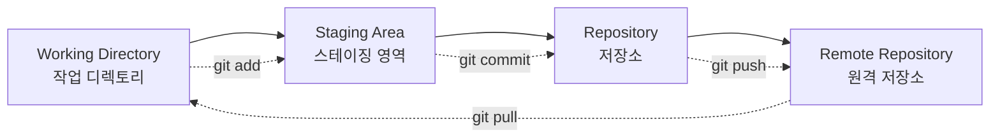
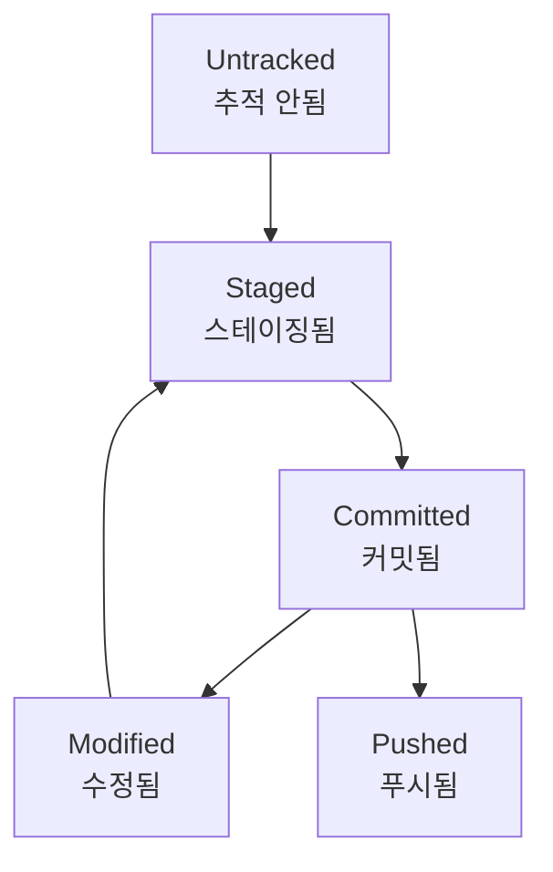
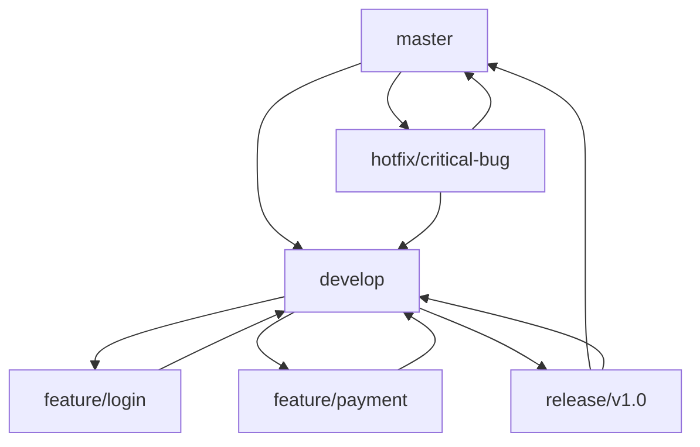
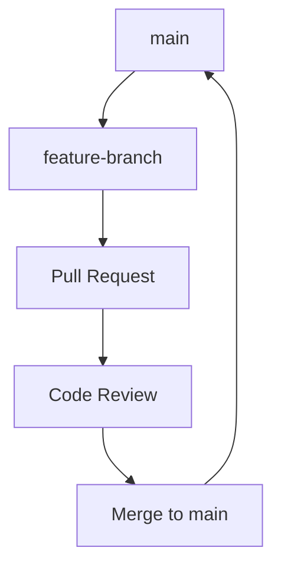

## #01. Git과 GitHub 이해하기

### Git이란?

Git은 분산 버전 관리 시스템으로, 소스 코드의 변경 이력을 추적하고 관리하는 도구입니다.

### GitHub란?

GitHub는 Git 저장소를 호스팅하는 웹 기반 플랫폼으로, 협업 도구와 프로젝트 관리 기능을 제공합니다.

### 주요 개념

| 용어 | 설명 |
|------|------|
| Repository (저장소) | 프로젝트 파일들과 변경 이력을 저장하는 공간 |
| Commit | 변경사항을 저장소에 기록하는 행위 |
| Branch | 독립적인 개발 라인 |
| Merge | 다른 브랜치의 변경사항을 현재 브랜치에 병합 |
| Push | 로컬 변경사항을 원격 저장소에 업로드 |
| Pull | 원격 저장소의 변경사항을 로컬로 다운로드 |
| Clone | 원격 저장소를 로컬로 복사 |
| Fork | 다른 사람의 저장소를 내 계정으로 복사 |

## #02. Git 클라이언트 설치

## #02. Git 클라이언트 설치

### Windows

1. https://git-scm.com/ 접속
2. Download 버튼 클릭하여 설치 파일 다운로드
3. 설치 과정에서 기본 설정 유지
4. Git Bash, Git CMD 선택 가능

### macOS

#### 방법 1: Xcode Command Line Tools
```bash
$ xcode-select --install
```

#### 방법 2: Homebrew 사용
```bash
$ brew install git
```

### Linux (Ubuntu/Debian)

```bash
$ sudo apt update
$ sudo apt install git
```

### 설치 확인

```bash
$ git --version
```

## #03. Git 전역 설정

명령프롬프트 혹은 터미널에서 사용자 정보를 입력한다.

특별한 문제가 없다면 명령어 입력후 아무런 내용도 표시되지 않는다.

```shell
$ git config --global user.name "leekh"
$ git config --global user.email "leekh4232@gmail.com"
$ git config --global core.autocrlf true
```

### 추가 유용한 설정

```shell
# 기본 브랜치명을 main으로 설정
$ git config --global init.defaultBranch main

# 편집기 설정 (VS Code 사용 시)
$ git config --global core.editor "code --wait"

# 한글 파일명 깨짐 방지
$ git config --global core.quotepath false

# 대소문자 구분 설정
$ git config --global core.ignorecase false

# Push 기본 동작 설정
$ git config --global push.default simple
```

### 설정 확인

```shell
# 전체 설정 확인
$ git config --list

# 특정 설정 확인
$ git config user.name
$ git config user.email
```

## #04. 인증서 설정

### 1. SSH vs HTTPS 인증

| 방식 | 장점 | 단점 |
|------|------|------|
| SSH | 안전, 비밀번호 입력 불필요 | 초기 설정 복잡 |
| HTTPS | 설정 간단 | 매번 인증 필요 |

### 2. SSH 인증서 생성하기

명령프롬프트에서 인증서 생성을 위한 명령어를 실행

이 명령은 컴퓨터마다 최초 1회만 수행하면 된다.

```shell
$ ssh-keygen -t ed25519 -C "leekh4232@gmail.com"
```

명령어 입력후 진행되는 과정에서는 엔터키만 입력한다.

```
Generating public/private ed25519 key pair.
Enter file in which to save the key (/Users/username/.ssh/id_ed25519): [엔터]
Enter passphrase (empty for no passphrase): [엔터]
Enter same passphrase again: [엔터]
```

정상적으로 완료된다면 사용자 홈디렉토리 안에 `.ssh`라는 이름의 폴더가 생성되고
그 안에 `id_ed25519`, `id_ed25519.pub` 인 두 개의 파일이 생성된다.

- `id_ed25519`: 개인키 (절대 공유하면 안됨)
- `id_ed25519.pub`: 공개키 (GitHub에 등록할 키)

이 폴더나 파일들이 삭제될 경우 인증서를 새로 생성해야 한다.

### 3. 공개키 확인

**Windows:**
```shell
$ type %USERPROFILE%\.ssh\id_ed25519.pub
```

**macOS/Linux:**
```shell
$ cat ~/.ssh/id_ed25519.pub
```

### 4. SSH Agent에 키 추가

**Windows (Git Bash):**
```shell
$ eval "$(ssh-agent -s)"
$ ssh-add ~/.ssh/id_ed25519
```

**macOS:**
```shell
$ eval "$(ssh-agent -s)"
$ ssh-add --apple-use-keychain ~/.ssh/id_ed25519
```

**Linux:**
```shell
$ eval "$(ssh-agent -s)"
$ ssh-add ~/.ssh/id_ed25519
```

### 5. 인증서를 GitHub에 등록

1. GitHub에 로그인 한 후 화면 우측상단의 계정 아이콘을 클릭하여 `Settings` 메뉴를 선택한다.

2. 페이지 이동 후 왼쪽메뉴에서 `SSH and GPG keys` 메뉴 선택

3. 화면 오른쪽의 `New SSH Key` 버튼을 클릭하여 페이지를 이동한다.

4. 페이지 이동 후 내용 입력
   - **Title**: 컴퓨터를 구분할 수 있는 이름 (예: "My Laptop", "Office Computer")
   - **Key type**: `Authentication Key` (기본값)
   - **Key**: `id_ed25519.pub` 파일의 내용을 복사 후 붙여 넣는다.

5. `Add SSH key` 버튼 클릭

### 6. SSH 연결 테스트

```shell
$ ssh -T git@github.com
```

성공 시 다음과 같은 메시지가 출력됩니다:
```
Hi username! You've successfully authenticated, but GitHub does not provide shell access.
```

### 7. Personal Access Token (대안 방법)

HTTPS 방식을 사용하는 경우 Personal Access Token을 생성해야 합니다.

1. GitHub → Settings → Developer settings → Personal access tokens → Tokens (classic)
2. `Generate new token` 클릭
3. 권한 선택 (repo, workflow 등)
4. 생성된 토큰을 안전한 곳에 보관

HTTPS clone 시 비밀번호 대신 이 토큰을 사용합니다.

## #05. 새로운 작업 시작하기

### 1. GitHub에 새로운 저장소 생성

`https://github.com/new` 또는 GitHub 메인 페이지에서 `New` 버튼 클릭

| 입력항목 | 설명 | 권장사항 |
| --- | --- | --- |
| Repository name | 저장소 이름 | 영문, 숫자, 하이픈(-) 조합 |
| Description | 간략한 설명 (선택사항) | 프로젝트 목적을 명확히 |
| Public/Private | 공개/비공개 설정 | 학습용: Public, 회사: Private |
| Add a README file | README.md 파일 생성 | 체크 권장 |
| Add .gitignore | gitignore 파일 생성 | 언어에 맞게 선택 |
| Choose a license | 라이선스 선택 | 오픈소스: MIT 권장 |

저장소가 생성되면 주소는 아래의 형식임

**SSH:**
```
git@github.com:사용자아이디/저장소이름.git
```

**HTTPS:**
```
https://github.com/사용자아이디/저장소이름.git
```

### 2. .gitignore 파일 이해하기

`.gitignore` 파일은 Git이 추적하지 않을 파일들을 지정합니다.

#### 일반적인 .gitignore 패턴

```gitignore
# 운영체제 파일
.DS_Store
Thumbs.db

# 에디터 파일
.vscode/
.idea/
*.swp
*.swo

# 로그 파일
*.log
logs/

# 종속성 폴더
node_modules/
vendor/

# 환경 변수 파일
.env
.env.local

# 빌드 출력
dist/
build/
*.exe
*.dll

# 임시 파일
*.tmp
*.bak
```

#### 언어별 .gitignore

**Python:**
```gitignore
__pycache__/
*.pyc
*.pyo
venv/
.pytest_cache/
```

**Node.js:**
```gitignore
node_modules/
npm-debug.log*
yarn-debug.log*
yarn-error.log*
```

**Java:**
```gitignore
*.class
*.jar
target/
.mvn/
```

### 3. 내 컴퓨터에서 진행중인 작업물을 저장소와 연결하기

작업 폴더 위치에서 명령프롬프트를 연다.

이 작업은 최초 1회만 수행한다.

```shell
# Git 저장소 초기화
$ git init

# 기본 브랜치를 main으로 설정
$ git branch -M main

# 모든 파일을 스테이징 영역에 추가
$ git add -A

# 첫 번째 커밋
$ git commit -m "Initial commit"

# 원격 저장소 연결
$ git remote add origin 저장소주소

# 원격 저장소에 푸시
$ git push -u origin main
```

#### 명령어 설명

| 명령어 | 설명 |
|--------|------|
| `git init` | 현재 폴더를 Git 저장소로 초기화 |
| `git branch -M main` | 기본 브랜치명을 main으로 변경 |
| `git add -A` | 모든 변경사항을 스테이징 |
| `git commit -m "메시지"` | 변경사항을 커밋 |
| `git remote add origin URL` | 원격 저장소 URL 등록 |
| `git push -u origin main` | main 브랜치를 원격에 푸시하고 추적 설정 |

이 과정을 수행하면 내 컴퓨터의 현재 작업 파일들이 GitHub에 업로드 된다.

이후 컴퓨터의 파일들이 삭제되어도 언제든지 GitHub으로부터 다시 복제할 수 있다.


## #06. 다른 PC에서 GitHub에 등록된 작업을 가져오기

`#02 ~ #04`까지 선행되어야 한다.

작업할 소스가 위치할 폴더에서 명령프롬프트를 연다

기존에 작업을 진행하던 PC에서도 GitHub과 연결된 폴더가 삭제된 경우 이 과정을 수행

```shell
# 저장소를 현재 폴더에 복제
$ git clone 저장소주소

# 특정 폴더명으로 복제
$ git clone 저장소주소 폴더명

# 특정 브랜치만 복제
$ git clone -b 브랜치명 저장소주소
```

#### 예시
- 학원 컴퓨터에 GitHub으로부터 clone
- 집 컴퓨터에 GitHub으로부터 clone
- 새로운 팀원이 프로젝트 참여 시

#### clone 후 확인사항

```shell
# 현재 브랜치 확인
$ git branch

# 원격 저장소 확인
$ git remote -v

# 최신 상태 확인
$ git status
```

## #07. Git 워크플로우 이해하기

### 1. Git의 세 가지 영역



### 2. 파일 상태 lifecycle



## #08. 현재 사용중인 컴퓨터에서 작업한 내역을 GitHub에 전송하기

### 1. 변경사항 확인

```shell
# 현재 상태 확인
$ git status

# 변경된 내용 확인
$ git diff

# 스테이징된 변경사항 확인
$ git diff --staged
```

### 2. 작업 내역을 업로드 대기상태로 등록

```shell
# 모든 변경사항 추가
$ git add -A

# 특정 파일만 추가
$ git add 파일명

# 특정 폴더만 추가
$ git add 폴더명/

# 대화형으로 추가
$ git add -i
```

### 3. 커밋 메시지 작성 규칙

#### 좋은 커밋 메시지 예시

```shell
# 기능 추가
$ git commit -m "feat: 사용자 로그인 기능 추가"

# 버그 수정
$ git commit -m "fix: 로그인 시 비밀번호 검증 오류 수정"

# 문서 업데이트
$ git commit -m "docs: README.md 설치 가이드 추가"

# 코드 리팩토링
$ git commit -m "refactor: 사용자 인증 로직 개선"

# 스타일 변경
$ git commit -m "style: 코드 포맷팅 적용"
```

#### 커밋 메시지 컨벤션

| 타입 | 설명 |
|------|------|
| feat | 새로운 기능 추가 |
| fix | 버그 수정 |
| docs | 문서 변경 |
| style | 코드 포맷팅, 세미콜론 누락 등 |
| refactor | 코드 리팩토링 |
| test | 테스트 코드 추가/수정 |
| chore | 빌드 과정 또는 보조 도구 변경 |

### 4. 커밋하기

```shell
# 간단한 메시지로 커밋
$ git commit -m "간단한 메시지"

# 상세한 메시지로 커밋
$ git commit -m "제목" -m "상세 설명"

# 에디터를 열어 상세한 커밋 메시지 작성
$ git commit
```

이 명령은 실제로 파일이 전송되는 것은 아님

업로드 대기상태로 등록하는 처리이므로 몇 번을 수행하더라도 이후 일괄 업로드하게 된다.

### 5. 업로드 대기상태의 내용들을 GitHub에 전송

```shell
# 현재 브랜치를 원격 저장소에 푸시
$ git push origin main

# 첫 푸시 시 (추적 브랜치 설정)
$ git push -u origin main

# 모든 브랜치 푸시
$ git push --all origin

# 태그도 함께 푸시
$ git push origin main --tags
```

#### Push 전 확인사항

```shell
# 커밋 히스토리 확인
$ git log --oneline

# 원격 저장소와 차이 확인
$ git log origin/main..main

# 푸시할 커밋 수 확인
$ git rev-list --count origin/main..main
```

## #09. 다른 컴퓨터에서 push한 내용을 내려받기

### 1. 원격 저장소 상태 확인

```shell
# 원격 저장소 정보 가져오기
$ git fetch origin

# 원격 브랜치 목록 확인
$ git branch -r

# 로컬과 원격의 차이 확인
$ git log HEAD..origin/main --oneline
```

### 2. 변경사항 가져오기

```shell
# 원격 변경사항을 가져와서 병합
$ git pull origin main

# fetch + merge를 별도로 수행
$ git fetch origin
$ git merge origin/main

# 리베이스를 사용한 pull
$ git pull --rebase origin main
```

### 3. 충돌 해결

#### 병합 충돌 발생 시

```shell
# 충돌 파일 확인
$ git status

# 충돌 내용 확인
$ git diff

# 충돌 해결 후 커밋
$ git add 해결된파일
$ git commit -m "충돌 해결"
```

#### 충돌 표시 예시

```
<<<<<<< HEAD
내가 수정한 내용
=======
다른 사람이 수정한 내용
>>>>>>> origin/main
```

## #10. 브랜치 활용하기

### 1. 브랜치 기본 명령어

```shell
# 브랜치 목록 확인
$ git branch

# 새 브랜치 생성
$ git branch feature-login

# 브랜치 전환
$ git checkout feature-login

# 브랜치 생성과 동시에 전환
$ git checkout -b feature-login

# 브랜치 삭제
$ git branch -d feature-login

# 원격 브랜치 삭제
$ git push origin --delete feature-login
```

### 2. 브랜치 전략

#### Git Flow



#### GitHub Flow (단순한 워크플로우)



## #11. 유용한 Git 명령어

### 1. 히스토리 관리

```shell
# 커밋 히스토리 확인
$ git log --oneline --graph --all

# 특정 파일의 변경 이력
$ git log --follow -- 파일명

# 특정 작성자의 커밋만 보기
$ git log --author="작성자명"

# 특정 기간의 커밋만 보기
$ git log --since="2024-01-01" --until="2024-12-31"
```

### 2. 되돌리기

```shell
# 최근 커밋 취소 (커밋은 유지, 변경사항만 스테이징)
$ git reset --soft HEAD~1

# 최근 커밋 취소 (변경사항을 작업 디렉토리로)
$ git reset --mixed HEAD~1

# 최근 커밋 완전 취소 (변경사항 삭제)
$ git reset --hard HEAD~1

# 특정 파일만 되돌리기
$ git checkout HEAD -- 파일명

# 커밋 수정 (메시지 또는 파일 추가)
$ git commit --amend
```

### 3. 임시 저장

```shell
# 현재 작업 임시 저장
$ git stash

# 메시지와 함께 임시 저장
$ git stash save "작업 중인 로그인 기능"

# 임시 저장 목록 확인
$ git stash list

# 임시 저장 복원
$ git stash pop

# 특정 stash 복원
$ git stash apply stash@{0}

# 임시 저장 삭제
$ git stash drop stash@{0}
```

## #12. GitHub 협업 기능

### 1. Pull Request

1. **Fork**: 다른 사람의 저장소를 내 계정으로 복사
2. **Clone**: Fork한 저장소를 로컬에 복제
3. **Branch**: 새로운 기능을 위한 브랜치 생성
4. **Commit & Push**: 변경사항 커밋 및 푸시
5. **Pull Request**: 원본 저장소에 변경사항 요청

### 2. Issues

- 버그 리포트
- 기능 요청
- 작업 추적
- 프로젝트 관리

### 3. GitHub Pages

```shell
# gh-pages 브랜치 생성
$ git checkout -b gh-pages

# 정적 파일 추가 후 푸시
$ git add .
$ git commit -m "Deploy to GitHub Pages"
$ git push origin gh-pages
```

## #13. 문제 해결

### 1. 자주 발생하는 오류

#### "fatal: remote origin already exists"

```shell
$ git remote remove origin
$ git remote add origin 새로운주소
```

#### "Updates were rejected because the remote contains work"

```shell
# 강제 푸시 (주의: 협업 시 사용 금지)
$ git push --force origin main

# 안전한 방법: 먼저 pull 후 push
$ git pull origin main
$ git push origin main
```

#### "Please tell me who you are"

```shell
$ git config --global user.email "you@example.com"
$ git config --global user.name "Your Name"
```

### 2. Git 명령어 도움말

```shell
# 특정 명령어 도움말
$ git help add
$ git help commit
$ git help push

# 간단한 도움말
$ git add --help
```

## #14. 마무리

Git과 GitHub는 현대 소프트웨어 개발에서 필수적인 도구입니다. 이 가이드를 통해 기본적인 사용법을 익혔다면, 다음과 같은 순서로 실력을 향상시킬 수 있습니다:

### 학습 로드맵

1. **기초 단계**: add, commit, push, pull 익히기
2. **중급 단계**: 브랜치, 병합, 충돌 해결
3. **고급 단계**: 리베이스, 체리픽, 서브모듈
4. **협업 단계**: Pull Request, Code Review, Issue 관리

### 실습 권장사항

- 개인 프로젝트로 매일 커밋하기
- 의미 있는 커밋 메시지 작성하기
- 브랜치를 활용한 기능 개발
- 오픈소스 프로젝트에 기여하기

Git과 GitHub를 능숙하게 다루게 되면 더욱 효율적이고 안전한 코드 관리가 가능해집니다.